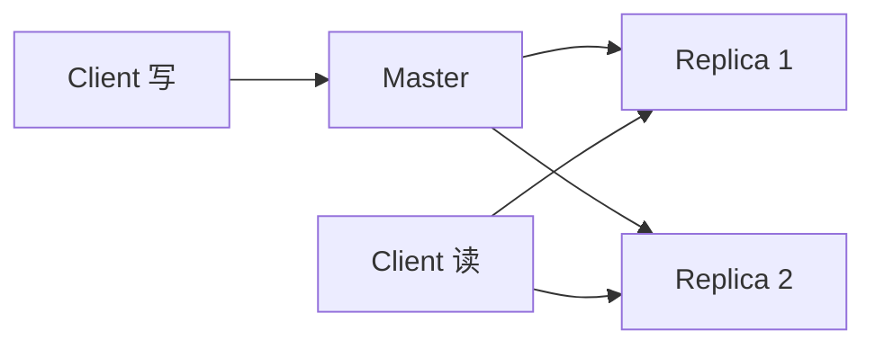

# Redis - 第 6 课：高可用，主从复制、Sentinel 与故障转移

## 本篇定位

主线入门层兼生产排障层。重点理解 Redis 主从复制和 Sentinel 如何缩短故障窗口，以及切换后为什么仍要核验数据。

## 学习目标（本节结束后你能做到什么）

- 理解主从复制、哨兵、故障转移各自在解决什么问题。
- 说清主从复制的基本流程，以及全量同步和增量同步的差别。
- 理解 Sentinel 为什么存在，它和 Redis Cluster 的职责边界是什么。
- 建立 Redis 故障切换的整体心智模型，而不是只记几个组件名。
- 能分析“主节点挂了怎么办”“为什么会有数据延迟”“为什么切换后还可能丢数据”。

## 内容讲解（核心概念，用类比、例子、图示说清楚）

### 1. 为什么 Redis 需要高可用

如果你的 Redis 只有一台机器，那么它会有两个明显问题：

- 一旦机器挂了，服务就不可用了
- 机器性能和内存都有上限

高可用首先解决的是第一个问题：  

**主节点故障后，系统能不能继续提供服务。**

所以 Redis 的高可用演进通常先从主从复制开始，再进入哨兵。

### 2. 主从复制在解决什么问题

主从复制的基本结构是：

主节点负责接收写请求，从节点复制主节点的数据状态。

它带来两个最直接的好处：

- 做数据副本，提高可用性
- 做读扩展，把一部分读流量分摊到从节点

但它也有天然边界：

- 从节点通常有复制延迟
- 真正写入仍集中在主节点
- 主节点挂了，仅有副本还不够，还需要有人负责选新主

### 3. 主从复制是怎么同步的

Redis 复制通常大方向是：

1. 从节点和主节点建立连接
2. 尝试做同步
3. 如果条件允许，走增量同步
4. 不行就走全量同步

#### 全量同步

全量同步的意思是：

- 主节点生成当前数据快照
- 发给从节点
- 从节点清空旧状态后加载
- 再接上后续增量命令

这相当于“先把当前全量状态拷过去，再补最近写入”。

#### 增量同步

如果从节点之前同步过，只是短暂断开，那么更理想的方式是：

- 不要整库重来
- 只把断线期间缺的那部分命令补给它

这就是增量同步，通常依赖复制偏移量和 backlog 缓冲区。

所以 PSYNC 的核心意义就是：

**尽量避免动不动就全量复制，降低恢复成本。**

### 4. 主从复制并不等于高可用闭环

很多人以为有从节点就高可用了，其实不够。

因为主节点挂了之后，系统还面临几个问题：

- 谁来判断主节点真的挂了
- 谁来决定哪个从节点升为新主
- 谁来通知客户端改连新主

如果没有这些能力，主从复制只是“多了一份副本”，还不是完整高可用系统。

### 5. Sentinel 为什么出现

Sentinel 的职责，不是存业务数据，而是做 Redis 集群的“监控者和选举者”。

它主要解决三件事：

- 监控主从实例是否健康
- 当主节点故障时，协调选举新主
- 把新的主节点信息告诉客户端

所以主从和哨兵的关系可以这样理解：

- 主从复制负责“数据有副本”
- Sentinel 负责“故障时谁接班”

### 6. Sentinel 怎么判断主节点挂了

Sentinel 会周期性地和 Redis 实例通信。

但“我自己觉得它挂了”和“集群公认它挂了”不是一回事，所以通常有两层判断：

- **主观下线**：某个 Sentinel 自己认为主节点失联了
- **客观下线**：足够多的 Sentinel 都同意这个节点失联了

为什么要这么设计？因为网络抖动很常见。

如果某个 Sentinel 自己一时没连上，就立刻发起切换，系统会非常不稳定。  
所以必须通过多个 Sentinel 共同确认，降低误判概率。

### 7. 故障转移在做什么

当主节点被判定真的挂了，Sentinel 会大致完成这些事：

1. 从多个从节点里选一个新的主节点
2. 让其他从节点转去复制新主
3. 更新配置和通知客户端

这里最关键的是“选谁当新主”。

通常会考虑：

- 与旧主数据偏移差距
- 复制优先级
- 网络连通性
- 运行状态

这说明故障转移不是随便抓一个从节点就上位，而是要尽量挑一个数据更新、更稳定的候选者。

### 8. 为什么切换后仍可能丢数据

这是很多人容易忽略的现实。

因为主从复制通常不是强同步。  
也就是说：

- 主节点返回写成功
- 不代表所有从节点已经同步到这次写

如果主节点刚写入一批数据，还没来得及同步给从节点就挂了，那么新主上位后，这部分数据可能就丢了。

所以 Redis 主从复制和 Sentinel 的目标更偏向：

- 提升可用性
- 减少故障窗口

而不是像强一致分布式数据库那样承诺“零数据丢失”。

### 9. Sentinel 和 Cluster 的边界

这也是面试常考点。

Sentinel 解决的是：

- 单主多从架构下的高可用和自动故障转移

它不解决：

- 数据分片
- 横向扩容

如果你只有一套数据，担心主节点挂了，那 Sentinel 很合适。  
如果你单机内存撑不住，想把数据分到多台机器上，那就要看 Redis Cluster。

## 实战落地：高可用不是搭完主从就结束

生产 Redis 主从 + Sentinel 至少要落这些工程动作：

- 应用使用 Sentinel 感知主节点变化，而不是把 master IP 写死。
- 读写分离要谨慎：从库读可能有复制延迟，不能承接强一致读。
- 配置合理的复制积压缓冲区，降低网络抖动后全量同步概率。
- 配置 `min-replicas-to-write` 和 `min-replicas-max-lag`，降低脑裂时旧主继续写入的风险。
- 定期做故障切换演练，记录切换耗时、客户端重连耗时和丢写窗口。

很多团队的 Redis “高可用”只停留在有从库、有 Sentinel，但应用端没有重连策略，连接池没有自动刷新主节点，真正切换时反而需要人工改配置。这不算闭环。

## 生产问题处理：主从切换后的排查重点

发生故障转移后，不要只看新 master 是否可写，还要检查：

- 客户端是否全部切到新 master，是否仍有旧连接写旧主。
- 新旧 master 数据差异范围，尤其是订单、库存、锁、队列等敏感 key。
- 从节点是否重新挂到新 master，复制延迟是否收敛。
- 业务是否出现短时间写失败、锁误释放、缓存击穿。
- Sentinel 日志中是否存在频繁主观下线、网络抖动或重复 failover。

如果怀疑数据丢失，先冻结相关业务写入或开启保护开关，再从业务日志、DB、MQ、Redis key 维度做对账。Redis 高可用的目标是缩短不可用时间，但切换后的数据核验同样重要。

## 小结

- 主从复制解决的是副本和读扩展问题，但单靠它还不构成完整高可用方案。
- 全量同步成本高，增量同步的意义是尽量避免整库重传。
- Sentinel 的核心职责是监控、判故障、选新主和通知客户端。
- 主观下线和客观下线的区分，是为了降低网络抖动带来的误判。
- Redis 高可用更偏向提升可用性和缩短故障恢复时间，不等于强一致零丢失。

## 问题（检测你对当前章节内容是否了解）

1. 主从复制和 Sentinel 分别在解决什么问题？
2. 为什么有了从节点，Redis 仍然需要 Sentinel？
3. 全量同步和增量同步的差别是什么，为什么增量同步更理想？
4. 为什么 Redis 故障切换后仍然可能发生少量数据丢失？
