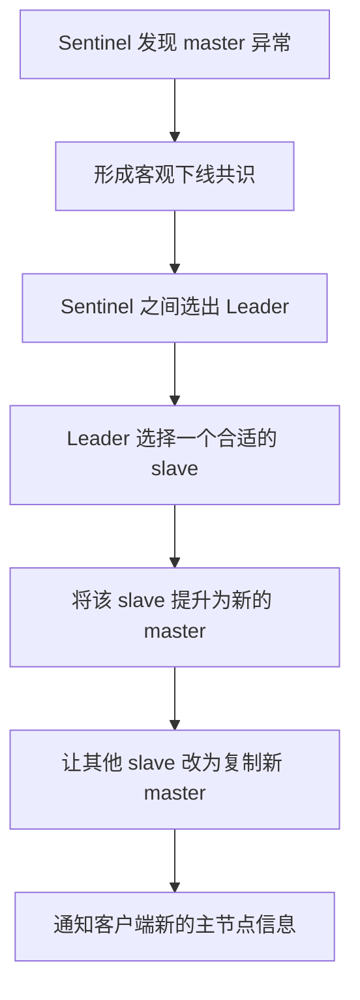

# Redis - Sentinel 高频追问：下线判定、选主、故障转移与脑裂

## 学习目标

- 把 Sentinel 从“会背概念”提升到“能讲故障链路”。
- 分清主观下线和客观下线。
- 理解哨兵选 Leader、新 master 选举、故障转移的大致过程。
- 明白 Sentinel 不能神奇消灭脑裂，只是在降低风险。

## 内容讲解

### 1. Sentinel 到底在解决什么问题

主从复制解决了“有备份”，但没解决“主挂了之后谁来接班”。

Sentinel 解决的是：

- 监控 master / slave 是否健康
- master 真挂了之后，协调一次故障转移
- 通知客户端新的 master 在哪

所以 Sentinel 的关键词不是“分片”，而是：

**监控 + 故障发现 + 自动切主。**

### 2. 主观下线和客观下线有什么区别

这是面试高频题。

#### 主观下线（SDOWN）

某个 Sentinel 自己觉得：

“我联系不上这个节点了。”

这只是它自己的判断。

#### 客观下线（ODOWN）

多个 Sentinel 达成共识：

“这个 master 大概率真挂了。”

只有到了客观下线，才会进入真正的故障转移流程。

所以可以理解为：

- 主观下线：单哨兵视角
- 客观下线：哨兵集群共识

### 3. 为什么要多个 Sentinel

因为单哨兵很容易误判。

网络抖一下、某个 Sentinel 自己卡一下，它就可能以为 master 挂了。

多个 Sentinel 的意义就是：

**把“我觉得它挂了”升级成“多数人都觉得它挂了”。**

这也是为什么 Sentinel 部署通常建议奇数个。

### 4. 故障转移的大致过程

可以粗略理解成下面几步：

这条链路里最容易被追问的就是两次“选举”。

### 5. Leader Sentinel 怎么选出来

不是所有 Sentinel 一起乱操作，而是要先选一个 Leader，统一主导故障转移。

这个过程可以粗略理解成：

- 谁先发起、谁先拿到足够投票，谁更可能成为 Leader
- 每个 Sentinel 在一个纪元里只投一次票

你不必死背源码级细节，但要知道：

**不是所有 Sentinel 同时干活，而是先选一个领导者出来。**

### 6. 新 master 怎么选

Sentinel 不会随便挑一个 slave。

一般会考虑：

- 和旧 master 的复制偏移量更接近谁
- 谁更健康
- 谁优先级更高
- 谁断线时间更短

所以选新 master 的本质，是在挑一个：

**数据更接近原 master、状态也更靠谱的从节点。**

### 7. Sentinel 能防脑裂吗

不能彻底防。

脑裂的典型情况是：

- 老 master 没完全死，只是和 Sentinel / 部分节点网络隔离
- Sentinel 以为它挂了，选了一个新 master
- 结果短时间内出现两个都认为自己是主的节点

Sentinel 能做的是：

- 通过 quorum 和多数派机制降低误判概率
- 配合 `min-replicas-to-write` 之类配置减少脑裂写入风险

但它并不能像分布式一致性系统那样，从根上消灭脑裂。

所以更准确的说法是：

**Sentinel 能降低脑裂风险，但不能彻底杜绝。**

### 8. Sentinel 的边界

Sentinel 很适合：

- 单主多从
- 自动故障切换
- 不需要分片

Sentinel 不解决：

- 数据分片
- 大规模横向扩容
- 单节点容量瓶颈

所以 Sentinel 和 Cluster 不是谁替代谁，而是在解决不同问题。

## 小结

- Sentinel 解决的是 Redis 主从架构下的自动故障发现和切主。
- 主观下线是单个哨兵的判断，客观下线是哨兵集群形成共识后的判断。
- 故障转移前会先选出 Leader Sentinel，再由它推进新 master 选举。
- Sentinel 能降低脑裂风险，但不能从根本上消灭脑裂。
- Sentinel 适合高可用，不适合解决分片扩容问题。

## 问题

1. 主观下线和客观下线的区别是什么？
2. 为什么 Sentinel 一般建议部署多个、而且最好是奇数个？
3. 新 master 选择时，Sentinel 会重点关注哪些因素？
4. 为什么说 Sentinel 不能彻底防止脑裂？
