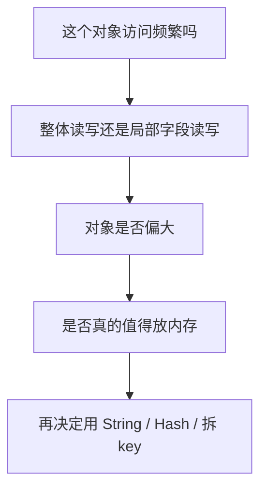

# Redis - 第 9 课：对象存储怎么选：String、Hash、SDS 与购物车场景

## 学习目标

- 不再把“Redis 存对象”理解成一句空话，而是知道到底该选 `String` 还是 `Hash`。
- 理解 Redis `String` 底层为什么不是 C 字符串，而是 `SDS`。
- 说清楚对象整体缓存、字段级读写、内存占用、网络开销之间的取舍。
- 能把购物车、用户信息、会话信息这类常见业务场景落到 Redis 建模上。

## 内容讲解

### 1. Redis 里“存对象”到底是什么意思

很多人说“Redis 里直接存对象就行”，这句话其实不完整。

因为 Redis 本质上不是 Java 那种“对象数据库”，它只认识：

- key
- value
- value 对应的数据结构

所以所谓“存对象”，本质上是你要把一个业务对象映射成 Redis 能理解的结构。

最常见的两种方式是：

1. 整个对象序列化后塞进 `String`
2. 把对象拆成多个字段存进 `Hash`

例如一个用户对象：

```json
{
  "id": 1,
  "name": "xinqi",
  "age": 18,
  "city": "Shanghai"
}
```

你可以这样存：

```text
user:1 -> "{\"id\":1,\"name\":\"xinqi\",\"age\":18,\"city\":\"Shanghai\"}"
```

也可以这样存：

```text
key = user:1
field = id    value = 1
field = name  value = xinqi
field = age   value = 18
field = city  value = Shanghai
```

这两种方式都能工作，但它们的工程含义完全不同。

### 2. `String` 适合什么场景

如果你选择 `String`，通常代表：

- 这个对象经常整体读取
- 很少只改其中一个字段
- 应用侧本来就有序列化 / 反序列化能力
- 你更看重“模型简单”

典型场景：

- 登录态 Session
- Token 对应的用户快照
- 商品详情 JSON
- 配置快照

优点：

- 模型最简单，写入和读取都直接
- 一次 `GET` / `SET` 就够了
- 客户端处理方便，尤其适合缓存整个对象

缺点：

- 只改一个字段，也要整段读出来、改完再整段写回去
- 对象越大，网络传输越浪费
- 部分字段查询不方便

一句话记忆：

**`String` 更像“整包缓存”。**

### 3. `Hash` 适合什么场景

如果你选择 `Hash`，通常代表：

- 这个对象字段很多
- 你经常只读 / 只改其中几个字段
- 你希望减少无意义的网络传输
- 你希望做字段级更新

典型场景：

- 用户资料
- 购物车
- 用户画像标签
- 某些状态机对象

例如更新年龄：

```text
HSET user:1 age 19
```

不需要把整个对象重新写回去。

优点：

- 可以按字段读写
- 部分更新非常方便
- 某些场景下比整体 `String` 更省空间

缺点：

- 客户端代码复杂一些
- 字段特别多、层级特别深时，建模会变丑
- 如果你本来就是整体取、整体改，那 `Hash` 反而不如 `String` 直接

一句话记忆：

**`Hash` 更像“字段级对象存储”。**

### 4. 那到底怎么选：别背结论，要看访问模式

很多文章喜欢直接说“存对象优先用 String”或者“Hash 更省内存”，这些都只对一半。

真正应该先问的是：

1. 这个对象是整体读多，还是局部字段读多？
2. 这个对象是整体改多，还是局部字段改多？
3. 这个对象有多大？
4. 这个对象会不会经常演化字段结构？

可以用下面这个判断方法：

| 场景 | 更适合 |
| --- | --- |
| 整体缓存、整体读写 | `String` |
| 局部字段频繁修改 | `Hash` |
| 对象结构简单且应用直接序列化 | `String` |
| 希望避免每次传整包 JSON | `Hash` |

所以不要问“哪个更好”，要问：

**哪个更符合这个对象的访问模式。**

### 5. 为什么 Redis 的 `String` 底层不是 C 字符串，而是 SDS

这一点是 Redis 面试里非常爱追问的。

Redis 是 C 写的，但它没有直接拿 C 字符串当自己的字符串结构，而是自己设计了 `SDS`，也就是 `Simple Dynamic String`。

核心原因有四个：

#### 5.1 获取长度快

C 字符串靠 `\0` 结尾，求长度要从头扫一遍，复杂度是 `O(n)`。

SDS 直接维护 `len` 字段，取长度就是 `O(1)`。

#### 5.2 避免缓冲区溢出

C 字符串拼接时，如果忘了预留空间，很容易越界。

SDS 在修改前会先检查容量，不够就扩容，这样安全很多。

#### 5.3 减少频繁扩容

SDS 会做预分配，不是每次加一点内容就重新申请一次内存。

这让 Redis 在频繁拼接、追加时更高效。

#### 5.4 二进制安全

C 字符串以 `\0` 结尾，但图片、音频、压缩数据里完全可能包含 `\0`。

SDS 不依赖 `\0` 判断结束，而是依赖 `len`，所以可以安全存二进制内容。

一句话总结：

**SDS 不是为了“花哨”，而是为了让 Redis 的字符串同时兼顾性能、安全和二进制能力。**

### 6. 购物车为什么常用 `Hash`

购物车是一个特别适合讲 `Hash` 的场景。

最简单的建模方式：

```text
key = cart:{userId}
field = 商品ID
value = 商品数量
```

例如：

```text
HSET cart:1001 20001 2
HSET cart:1001 20008 1
HINCRBY cart:1001 20001 1
HDEL cart:1001 20008
```

它的好处特别明显：

- 加商品：新增 field
- 改数量：直接 `HINCRBY`
- 删商品：直接 `HDEL`
- 查购物车：`HGETALL`

这比把整个购物车序列化成 JSON 再回写自然得多。

### 7. 但购物车也不是“只靠一个 Hash 就万事大吉”

这里要特别提醒一个容易被简化的问题：

刚才那个模型，只适合“轻量购物车”。

真实电商里的购物车往往还包含：

- 商品标题
- 价格快照
- SKU
- 促销信息
- 选中状态
- 店铺维度
- 失效状态

如果你把这些都硬塞进一个大 `Hash`，很快就会变得难维护。

所以真实场景里常见做法是：

- Redis 里只保留高频、轻量、需要快速改的部分
- 复杂详情回源商品服务或数据库
- 或者拆成多个 key，而不是一个巨型 key

也就是说：

**Redis 建模不是“把数据库对象原样搬进来”，而是“只放高频、轻量、值得放内存的那部分”。**

### 8. 一个很实用的思考框架

以后遇到“某个对象要不要放 Redis、怎么放”的问题，你可以按这 4 步想：



很多人一上来就讨论“Hash 更省内存还是 String 更快”，其实顺序反了。

应该先问：

- 它是不是热点数据
- 值不值得进缓存
- 访问模式是什么

然后才轮到结构设计。

## 小结

- Redis 里“存对象”本质上是把业务对象映射成合适的数据结构。
- `String` 适合整体缓存，简单直接；`Hash` 适合字段级读写。
- 没有绝对更好的结构，关键看访问模式。
- Redis `String` 底层采用 `SDS`，是为了获得 `O(1)` 长度读取、避免溢出、减少扩容和支持二进制安全。
- 购物车是 `Hash` 的典型场景，但真实业务里往往要做字段裁剪、拆 key 或和数据库配合。

## 问题

1. 为什么说“Redis 存对象”这句话本身太笼统？
2. 一个对象如果经常整体读取、很少改字段，你更倾向 `String` 还是 `Hash`？为什么？
3. SDS 相比 C 字符串解决了哪几个关键问题？
4. 购物车为什么适合用 `Hash`，又为什么不能机械地把所有购物车信息都塞进一个 `Hash`？
