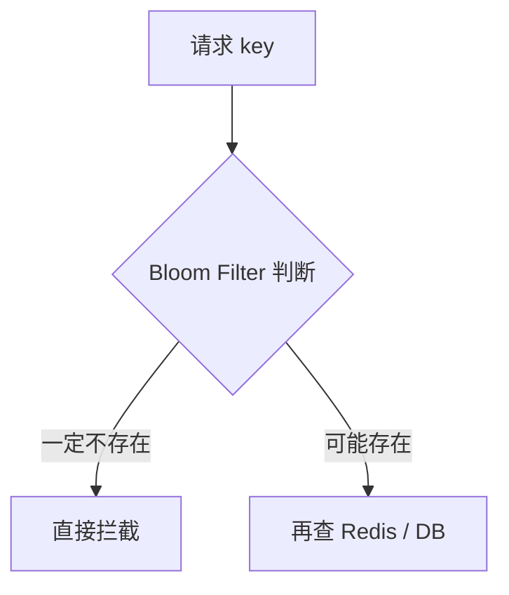

# Redis - 第 11 课：特殊类型与扩展结构：Bitmap、HyperLogLog、Bloom Filter、GEO、Stream

## 本篇定位

场景实战层。它补齐五大基础类型之外的特殊结构，重点训练“接受误差、控制边界、用低成本解决特定问题”的工程判断。

## 学习目标

- 不再把 Bitmap、HyperLogLog、Bloom Filter 都混成“省内存结构”。
- 能说清它们分别解决什么问题、牺牲了什么、边界在哪。
- 知道 GEO、Stream 在 Redis 里分别适合什么，不适合什么。
- 面试时不仅能答“命令是什么”，还能答“为什么选它、不选别的”。

## 内容讲解

### 1. 先建立一条主线：这些特殊结构到底在补什么空位

Redis 五大基础类型已经很强了，但业务里总会遇到一些更特殊的问题：

- 我只想记录某个状态是不是 0/1
- 我只想估算去重数量，不要求绝对准确
- 我想在请求进缓存前做一次“存在性预判”
- 我想存地理坐标并按距离查
- 我想让 Redis 承担轻量消息流

于是就有了这些结构。

它们不是“更高级的 Set / Hash”，而是针对某类问题做了非常明确的取舍。

### 2. Bitmap：用 bit 换空间

Bitmap 最适合解决的是：

**海量对象的 0/1 状态记录。**

例如“某用户今天是否活跃”。

你可以把日期当 key，把用户 id 当 offset：

```text
SETBIT active:20260412 10001 1
SETBIT active:20260412 10002 1
BITCOUNT active:20260412
```

它非常省空间，因为一个用户只占 1 bit。

适合场景：

- DAU、签到、在线状态
- 某天是否登录
- 某个功能是否点过

不适合场景：

- 用户 id 特别稀疏，offset 特别大
- 需要存的不止 0/1 状态

所以 Bitmap 的关键不是“能省”，而是：

**你的业务是不是天然就是海量布尔状态。**

### 3. HyperLogLog：不要精确值，只要数量级

HyperLogLog 解决的是：

**海量去重计数。**

比如：

- 首页今天来了多少不同用户
- 某活动有多少独立访客
- 某个页面 UV 是多少

命令很简单：

```text
PFADD uv:home user1 user2 user3
PFCOUNT uv:home
```

它最关键的特点是：

- 内存极省
- 结果有误差

所以 HLL 的本质不是“更高级的 Set”，而是：

**接受一点误差，换几乎夸张的空间收益。**

如果你要的是金融账单、准确人数、不能错一条，那就别碰 HLL。

### 4. Bloom Filter：做存在性预判，不做精确存储

布隆过滤器最适合讲缓存穿透。

它能告诉你两件事：

- 不存在：那就一定不存在
- 可能存在：有小概率误判

这意味着它非常适合做第一道过滤：



它的价值不是“查数据”，而是：

**拦掉明显无效的请求。**

注意边界：

- 有误判，但不会漏判
- 删除不方便
- 通常要么借助 Redis Module，要么借助 Redisson / 应用侧实现

所以 Bloom Filter 更多是“Redis 生态题”，不完全等于 Redis 原生五大类型。

### 5. GEO：不是 GIS 系统，而是“够用的附近查询”

Redis 的 GEO 本质上是：

- 存经纬度
- 查附近
- 算距离

适合：

- 附近门店
- 附近骑手
- 附近用户

不适合：

- 复杂地理围栏
- 高精度 GIS 分析
- 专业地图空间计算

也就是说，GEO 更像“业务层够用的地理能力”，不是专业地图引擎。

### 6. Stream：Redis 对消息队列的认真升级

以前 Redis 常被拿 `List` 做队列，但 `List` 很快会遇到问题：

- 没有消费组
- 消息确认能力弱
- 重试能力弱

Redis 5.0 加了 `Stream`，就是想把这件事补完整一点。

它支持：

- 追加消息
- 消费组
- ACK
- 未确认消息查看

这就让它比 `List` 更像一个真正的 MQ。

但是边界也很清楚：

- 轻量业务、量不大、能接受 Redis 方案的边界时很好用
- 金融级、海量消息、长链路消息治理，还是 Kafka / RabbitMQ 更靠谱

一句话：

**Stream 是 Redis 里“能认真拿来做消息流”的结构，但它不是要取代专业 MQ。**

### 7. 这些结构最容易混淆的点

#### Bitmap vs Bloom Filter

- Bitmap：记录状态
- Bloom Filter：判断成员是否可能存在

#### Set vs HyperLogLog

- Set：精确去重
- HLL：近似计数

#### List vs Stream

- List：简单队列
- Stream：带消费组和 ACK 的消息流

### 8. 一个非常实用的选型口诀

如果你只想记一句：

- 状态位：`Bitmap`
- UV 估算：`HyperLogLog`
- 防穿透预判：`Bloom Filter`
- 附近的人 / 店：`GEO`
- 轻量消息流：`Stream`

但面试里别只报名字，最好再补一句：

- 为什么它合适
- 为什么别的结构不合适
- 它牺牲了什么

## 实战落地：特殊结构要接受“不完美但够用”

这些结构的工程价值在于用较低成本解决特定问题：

- `Bitmap` 适合签到、活跃状态、布尔标记，但用户 ID 稀疏时要注意空间浪费。
- `HyperLogLog` 适合 UV 估算，不适合需要精确名单或精确计费的场景。
- `Bloom Filter` 适合拦截不存在数据，不适合删除频繁或必须零误判的场景。
- `GEO` 适合附近的人、附近门店，不适合复杂 GIS 分析。
- `Stream` 适合 Redis 内部轻量消息流，不适合替代所有专业 MQ 场景。

选这些结构时，最重要的是把误差、边界和补偿讲清楚。比如 HLL 的 UV 可以接受误差，但财务结算人数不能接受；Bloom Filter 能防穿透，但误判后还要让请求继续查缓存或 DB，而不是直接返回存在。

## 生产问题处理：特殊结构的排障入口

特殊结构的问题往往不是命令错，而是语义被误用：

- Bitmap 过大：检查最大 offset 是否被异常 ID 拉高，必要时按用户段分桶。
- HLL 数字异常：检查是否重复使用同一个 key、周期 key 是否切换正确。
- Bloom Filter 误判率上升：检查容量是否超过设计值，必要时重建过滤器。
- GEO 查询慢：检查半径是否过大，是否需要先按城市或区域拆 key。
- Stream 积压：看 `XPENDING`、消费组滞后、消费者宕机和消息重试策略。

这些结构上线前都要有容量上限和重建方案。尤其 Bloom Filter 和 Stream，一旦容量假设被打穿，不能只靠加机器解决。

## 小结

- Bitmap 适合海量 0/1 状态。
- HyperLogLog 适合海量去重计数，但不是精确计数。
- Bloom Filter 适合做存在性预判，典型是缓存穿透防护。
- GEO 适合“附近”类业务，但不是专业 GIS。
- Stream 是 Redis 在消息流方向的升级，适合轻量消息场景，不是专业 MQ 的完全替代。

## 问题

1. 活跃用户统计为什么适合 Bitmap，而不是 Set？
2. UV 统计为什么 HyperLogLog 比 Set 更省内存？代价是什么？
3. 布隆过滤器为什么能防缓存穿透，但不能保证“元素一定存在”？
4. Redis Stream 和 Kafka 的定位有什么根本差别？
