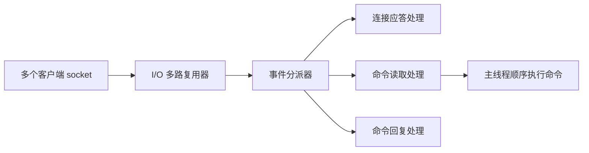

# Redis - 第 12 课：线程模型与后台任务：Reactor、I/O 多路复用、Redis 6 多线程与 bio 线程

## 学习目标

- 不再机械地背“Redis 是单线程”，而是能说清楚这句话到底对到什么程度。
- 理解 Redis 的事件循环、I/O 多路复用和 Reactor 风格处理模型。
- 分清 Redis 4.0、6.0 引入的多线程分别是干什么的。
- 理解后台线程 `bio` 的职责，以及为什么 Redis 既是“单线程核心”又不是“只有一个线程”。

## 内容讲解

### 1. “Redis 是单线程”这句话为什么容易把人带沟里

很多人一被问到 Redis 线程模型，第一句就是：

“Redis 是单线程，所以很快。”

这句话问题很大。

Redis 快，不是因为“单线程本身有魔法”，而是因为：

- 数据主要在内存
- 网络模型高效
- 内部结构针对场景做了优化
- 核心命令执行线程避免了锁竞争和上下文切换

所以更准确的说法应该是：

**Redis 的命令执行主路径长期以单线程为核心，但整个 Redis 进程并不只有一个线程。**

### 2. Redis 的主线程到底在干什么

可以把 Redis 主线程理解成一个高效值班员：

1. 监听很多客户端连接
2. 看哪个连接可读、可写
3. 把事件分发给对应处理逻辑
4. 顺序执行命令
5. 把结果返回

大致可以画成这样：

所以 Redis 的重点是：

**一个线程顺序执行命令，但它前面挂着一套可以同时管理很多连接的事件系统。**

### 3. I/O 多路复用到底在解决什么问题

如果没有 I/O 多路复用，一个线程要同时盯很多连接，就很麻烦：

- 每个连接配一个线程，线程太多
- 不停轮询每个连接，浪费 CPU

Redis 用的是另一种思路：

- 把很多 socket 注册给内核
- 内核告诉 Redis：哪些连接现在可读、可写
- Redis 再去处理真正有事件的连接

这样就避免了：

- 为每个连接都创建线程
- 大量无效轮询

所以 Redis 能用一个主线程处理很多连接，并不是“神奇”，而是因为它站在了操作系统的 I/O 多路复用能力上。

### 4. Reactor 模型可以怎么理解

你不一定要背 Reactor 教科书定义，但最好有个直觉：

- Reactor 不是一个线程名
- 它是一种“事件来了再处理”的模型

Redis 大概就是这种味道：

- 连接来了，处理 accept
- 数据来了，处理 read
- 可以回了，处理 write

也就是说，Redis 不是“一个线程死干所有连接”，而是：

**一个事件循环把很多连接的 I/O 事件统一收拢，再逐个调度。**

### 5. 那为什么 Redis 早期不愿意把命令执行做成多线程

因为收益未必大，复杂度却会明显上升。

核心原因通常有三个：

#### 5.1 大部分收益已经来自内存和 I/O

Redis 很多命令本来就很轻，瓶颈常常不在 CPU 计算，而在：

- 网络往返
- 内存访问
- 大 key 带来的阻塞

#### 5.2 单线程让实现简单很多

单线程意味着：

- 不需要大量锁
- 不容易死锁
- 命令天然串行
- 代码和维护成本更低

#### 5.3 多线程不一定更快

如果你的工作本来就不重，引入多线程后反而会带来：

- 线程切换
- 同步成本
- 更复杂的 bug

所以 Redis 长期坚持“命令执行核心单线程”，背后不是保守，而是务实。

### 6. Redis 4.0 的多线程：先从异步删除开始

Redis 4.0 之后，并不是一下子把核心命令执行改成多线程了，而是先在一些“脏活累活”上动刀。

典型就是：

- `UNLINK`
- `FLUSHDB ASYNC`
- `FLUSHALL ASYNC`

这些命令的重点不是“删一个 key”，而是：

**把内存释放这件可能很慢的事，尽量挪到后台。**

因为如果是 bigkey，真正耗时的往往不是把 key 从主字典摘掉，而是后续释放大块内存。

### 7. Redis 6.0 的多线程：主要加在网络 I/O

Redis 6.0 的多线程也特别容易被说错。

不是“Redis 6 以后变多线程数据库了”，而是：

**Redis 6 主要把网络读写这类 I/O 开销拿去并行化，命令执行本身仍然是单线程顺序执行。**

这点非常关键。

所以开启 `io-threads` 后：

- 读取请求、发送响应，可以用多个线程帮忙
- 真正执行命令，仍然由主线程负责

这也是为什么你通常不用太担心传统意义上的线程安全乱战。

### 8. 后台线程 `bio` 在做什么

很多人学 Redis 时只记住主线程，却忽略后台线程。

Redis 里有几类典型后台任务：

- 延迟关闭文件
- AOF fsync
- lazy free

这些任务如果都在主线程里干，会很容易把主线程卡住。

所以 Redis 用 `bio` 线程池去接这些耗时但不需要主线程实时完成的工作。

常见理解方式：

- 主线程负责“接单 + 真正执行业务命令”
- 后台线程负责“善后、收尾、慢释放、慢刷盘”

### 9. 为什么 Redis 线程模型在面试里老被追问

因为这题能一下子区分两类人：

- 只会背结论的人：Redis 单线程，所以快
- 真懂的人：知道主线程、I/O 多路复用、Redis 4/6 的多线程边界、后台线程职责

如果你回答时能讲到下面这句，基本就比较稳：

**Redis 的核心命令执行路径以单线程串行为主，但它通过 I/O 多路复用、后台线程和 Redis 6 的 I/O 线程，把“连接管理、网络读写、慢释放、慢刷盘”这些非核心步骤做了分担。**

## 小结

- “Redis 是单线程”只能描述其核心命令执行模型，不能理解成进程里只有一个线程。
- Redis 依赖 I/O 多路复用来同时监听大量连接。
- 主线程的核心价值是顺序执行命令，避免锁竞争与并发复杂度。
- Redis 4.0 开始把大对象删除等耗时操作异步化。
- Redis 6.0 引入的多线程主要用于网络 I/O，不是把命令执行改成全面并发。
- `bio` 后台线程承担了 fsync、lazy free 等慢操作，目的是保护主线程响应能力。

## 问题

1. 为什么说“Redis 是单线程，所以快”这个回答不够好？
2. I/O 多路复用帮 Redis 解决了什么核心问题？
3. Redis 6.0 的多线程为什么不等于“Redis 命令执行多线程化”？
4. `UNLINK` 和 `DEL` 的差别，背后和 Redis 线程模型有什么关系？
