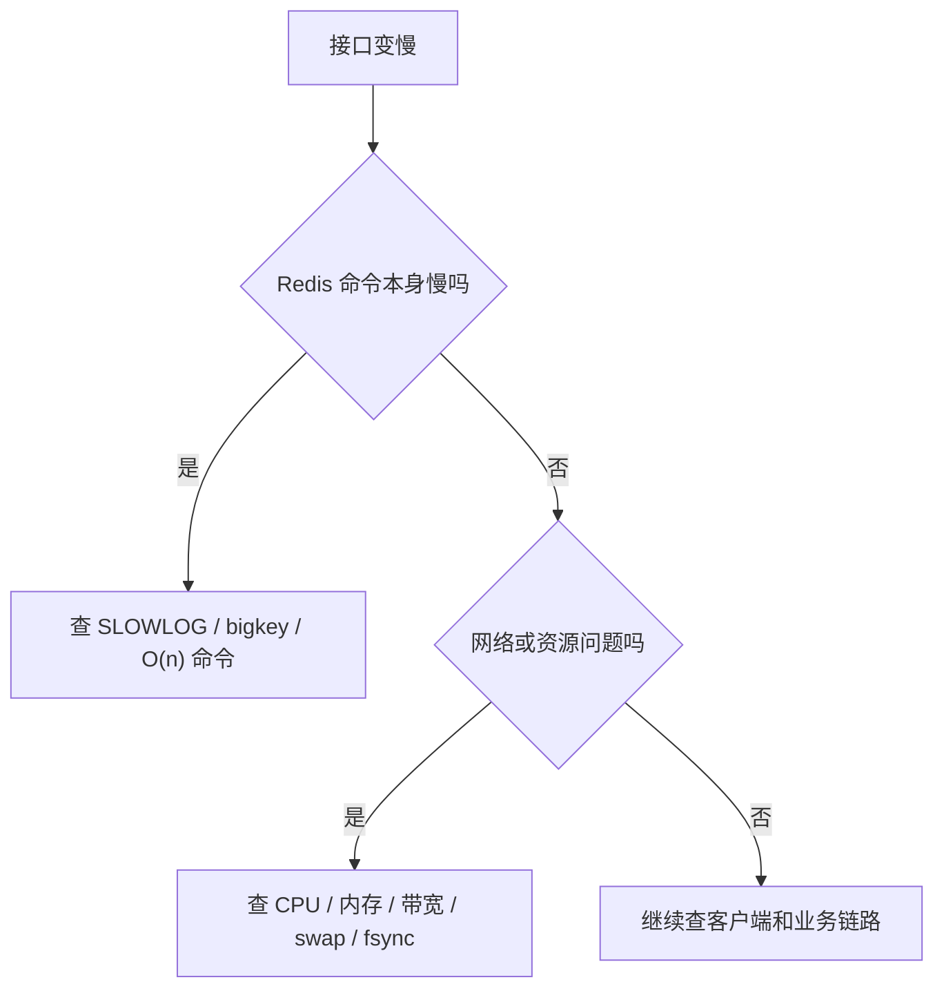

# Redis - 第 15 课：线上排障专题：bigkey、hotkey、慢查询、阻塞与排查思路

## 本篇定位

生产排障层核心篇。遇到 Redis 变慢、超时、阻塞、热点倾斜时，优先回到这一篇建立排查路径。

## 学习目标

- 不只会背 `bigkey`、`hotkey` 这些名词，而是知道它们为什么危险。
- 掌握 Redis 常见线上问题的排查思路，而不是出问题只会重启。
- 能把 `SLOWLOG`、`MONITOR`、`--bigkeys`、`--hotkeys` 这些工具放到正确场景里使用。
- 建立一个 Redis 线上故障的简化 SOP。

## 内容讲解

### 1. Redis 线上问题，最怕的不是报错，而是“变慢”

Redis 很多故障不会像 Java 应用那样直接抛异常。

它更常见的表现是：

- 延迟突然升高
- QPS 掉下来
- 某些请求超时
- 从库同步变慢
- 集群迁移卡住

这时候如果只盯着“Redis 挂没挂”，很容易方向跑偏。

更好的思路是先问：

1. 是单个 key 出问题，还是整体变慢？
2. 是命令执行变慢，还是网络 / IO / 内存出了问题？
3. 是数据结构设计问题，还是实例资源问题？

### 2. bigkey：大，不只是占内存，更会拖垮主线程

`bigkey` 最容易被讲浅。

它不是简单地指“key 很长”，而是指：

- `String` 的 value 特别大
- 或者复合类型中元素特别多

常见经验值：

- `String` 超过 1MB 可以高度警惕
- `Hash` / `Set` / `ZSet` / `List` 元素超过几千，也值得重点检查

但更重要的不是背阈值，而是理解它为什么危险。

#### bigkey 带来的问题

1. **命令执行慢**
   - 例如 `HGETALL`、`SMEMBERS`、`LRANGE 0 -1`
2. **网络传输大**
   - 一次取一个 1MB key，QPS 一高网卡就先顶不住
3. **删除会卡**
   - `DEL` 一个大 key，主线程可能被内存释放拖住
4. **主从复制和迁移受影响**
   - 大 key 复制、重分片都更慢

所以 bigkey 的本质问题，不是“浪费一点内存”，而是：

**它会把 Redis 这种单线程执行模型的短板放大。**

### 3. bigkey 怎么找

#### 方案一：`redis-cli --bigkeys`

优点：

- 直接
- 自带工具

缺点：

- 会扫全量 key
- 只能帮助你快速发现“可疑大 key”，不是完整精确诊断

线上跑时要记得配 `-i` 控制节奏。

#### 方案二：`SCAN` + 长度命令

例如：

- `STRLEN`
- `HLEN`
- `LLEN`
- `SCARD`
- `ZCARD`
- `MEMORY USAGE`

这个方案更灵活，也更适合自己做治理脚本。

#### 方案三：分析 RDB / 云厂商控制台

如果是云 Redis，一般会直接给 Key 分析能力。这个很适合线上做低侵入排查。

### 4. bigkey 怎么治

核心思路就四类：

1. **拆**
   - 一个大 hash 拆成多个小 hash
2. **删**
   - 过期垃圾及时清理
3. **换结构**
   - 该用 Bitmap / HLL 的别硬用 Set
4. **异步释放**
   - 大 key 删除尽量优先 `UNLINK`

很多时候，bigkey 的根因并不是 Redis，而是业务建模太偷懒。

### 5. hotkey：重点不是大，而是访问太集中

`hotkey` 和 `bigkey` 不一样。

一个 key 很小，也可以非常热。

比如某秒杀商品库存、某热门帖子详情、某热点配置。

它的危险在于：

- CPU 被某一个 key 的请求吃掉
- 网络带宽被打爆
- 单点 Redis 实例热点倾斜
- 一旦 Redis 抗不住，请求直接打穿到数据库

所以 hotkey 的本质是：

**流量分布极不均衡。**

### 6. hotkey 怎么找

#### `--hotkeys`

这个命令很好，但前提是 Redis 的淘汰策略得是 LFU 相关，因为它依赖访问频率统计。

#### `MONITOR`

适合短时间紧急抓现场，不适合长期挂着。

它很重，线上慎用。

#### 云厂商热点分析 / 京东 hotkey 之类的工具

这是更贴近生产的办法，尤其是高并发系统。

#### 业务预估

很多热点，其实业务提前就能猜到：

- 秒杀商品
- 大促首页
- 热搜词

工程上不要把所有发现都寄希望于工具。

### 7. hotkey 怎么治

常见思路：

1. **本地二级缓存**
   - Redis 前再加 JVM 本地缓存
2. **读写分离**
   - 读扩散到从节点
3. **集群分散**
   - 让热点不要集中压单节点
4. **热点保护**
   - 限流、熔断、预热
5. **云代理缓存**
   - 像 Proxy Query Cache 这种能力

### 8. 慢查询：Redis 也有“慢 SQL”时刻

Redis 虽然快，但不是每条命令都恒定飞快。

最容易慢的命令通常有两类：

#### 8.1 真正复杂度高

- `KEYS *`
- `HGETALL`
- `SMEMBERS`
- `LRANGE 0 -1`
- `SINTER` / `SUNION` / `SDIFF`

#### 8.2 数据量太大导致“本来不慢的命令也变慢”

比如：

- `ZRANGE` 返回的数据太多
- 一个 hash 太大导致 `HGETALL` 把网络打满

所以面试里最好别直接说“Redis 命令都是 O(1)”。

更准确是：

**大部分核心命令很快，但也有不少 O(n) 或 O(logn + m) 命令，一旦数据量上来就会慢。**

### 9. `SLOWLOG` 怎么看

Redis 的慢日志只统计：

**命令执行时间**

不包含：

- 网络往返
- 客户端序列化 / 反序列化

所以如果接口慢而 `SLOWLOG` 没问题，不代表 Redis 一定没问题，只能说明：

“命令在 Redis 主线程里执行本身未必慢。”

这时要继续查：

- 网络
- 大 value 传输
- 客户端连接池
- 下游阻塞

### 10. Redis 阻塞怎么理解

很多问题最后会汇聚成一句话：

**主线程被卡住了。**

常见来源包括：

- O(n) 命令
- bigkey 删除
- 大量过期 key 集中清理
- AOF fsync 压力
- fork 带来的抖动
- swap
- 网络异常

所以 Redis 排障的核心，不只是看命令，而是看：

### 11. 一个实用的 Redis 排障 SOP

1. 先看现象：是超时、抖动、吞吐下降还是主从延迟
2. 再看 Redis 指标：CPU、内存、带宽、命中率、连接数
3. 再看命令层：`SLOWLOG`、热点命令、危险命令
4. 再查 key 维度：是否存在 `bigkey`、`hotkey`
5. 再查后台动作：过期删除、AOF、RDB、迁移、同步
6. 最后回到业务设计：是不是模型天然不适合放 Redis

## 实战落地：给 Redis 排障准备固定证据包

真正线上排障时，临场想命令很容易漏信息。建议提前准备一个 Redis 证据包模板：

- 实例维度：CPU、内存、网卡、连接数、QPS、命中率、evicted keys、expired keys。
- 命令维度：`SLOWLOG`、`INFO commandstats`、危险命令审计。
- key 维度：bigkey、hotkey、TTL 分布、key 数量变化。
- 后台任务：RDB、AOF rewrite、fork、主从同步、Cluster 槽迁移。
- 客户端维度：连接池等待、超时率、重试次数、异常堆栈。
- 业务维度：最近发布、流量活动、批处理任务、热点商品或热点用户。

有了这个模板，排障就不会陷入“感觉 Redis 慢”这种模糊状态，而是能快速判断是命令慢、资源慢、网络慢，还是业务访问模型错了。

## 生产问题处理：止血动作要按风险排序

Redis 事故常见止血动作有优先级：

1. 保护下游：限流、降级、暂停非核心回源。
2. 保护 Redis 主线程：停掉危险批处理、禁止大范围扫描和大 key 删除。
3. 缓解热点：本地缓存、临时复制热点 key、手动预热、拆分热点。
4. 释放资源：清理过期无用 key、扩容、迁移部分流量。
5. 事后治理：拆 bigkey、改命令、补监控、加发布前扫描。

不要一上来就重启 Redis。重启可能丢失现场，也可能造成缓存大面积失效，让数据库承受更大冲击。

## 小结

- `bigkey` 的风险不只是占内存，更在于阻塞主线程、拖慢复制和迁移。
- `hotkey` 的本质是热点倾斜，会集中消耗 CPU 和带宽。
- `SLOWLOG` 只统计命令执行时间，不统计网络往返。
- Redis 变慢不等于 Redis “挂了”，很多时候是主线程被某类操作卡住。
- 排障要从现象、指标、命令、key、后台任务、业务设计六层一起看。

## 问题

1. `bigkey` 和 `hotkey` 的核心区别是什么？
2. 为什么删除一个大 key 可能会让 Redis 卡住？
3. `SLOWLOG` 没看到慢命令，接口依然很慢，你下一步查什么？
4. 如果线上发现热点 key，你会优先考虑哪几种缓解手段？
