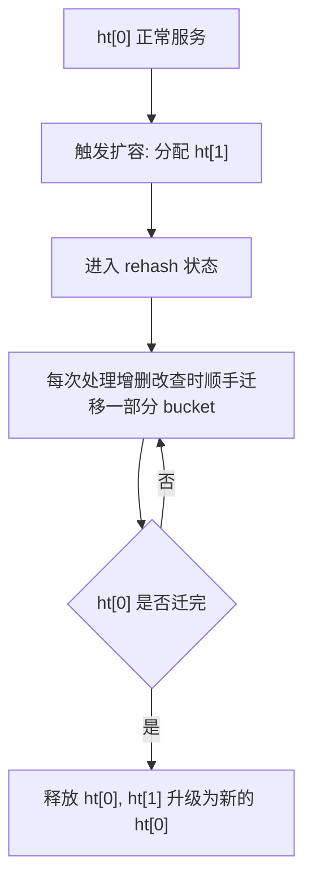

# Redis - 第 19 课：底层结构追问：SDS、ziplist、listpack 与渐进式 rehash

## 学习目标

- 把 Redis 底层结构从“知道名字”提升到“能解释设计动机”。
- 说清 SDS 为什么替代 C 字符串，ziplist 为什么会有连锁更新，listpack 怎么修补这个问题。
- 理解 Redis 全局字典和 Hash 类型背后的哈希表扩容过程。
- 能在面试里把“渐进式 rehash”讲成一次主线程友好的迁移过程，而不是只背三句话。

## 这一篇为什么要单独补

前面的 `02_五大数据类型与底层数据结构` 和 `09_对象存储怎么选` 已经讲了类型和场景，但面试官经常会继续追问更底层的问题：

- String 为什么不用 C 字符串？
- ziplist 为什么节省内存，又为什么会有连锁更新？
- Redis 7 之后为什么越来越多地方改用 listpack？
- Redis 哈希表扩容时，如果一次性搬迁数据，会不会卡住主线程？
- rehash 期间读写请求到底查哪张表？

这些问题背后的共同主题是：**Redis 为了快，不只是把数据放进内存，还把每个结构的内存布局、扩容方式和主线程阻塞风险都精细设计过。**

## SDS：Redis String 为什么不是 C 字符串

C 字符串是以 `\0` 作为结尾标记的一段字符数组。它简单，但对 Redis 不够好。

Redis 的 String 底层使用 SDS（Simple Dynamic String）。可以粗略理解成：

```text
┌─────┬───────┬───────┬──────────────┐
│ len │ alloc │ flags │ buf[]        │
└─────┴───────┴───────┴──────────────┘
```

几个字段的含义：

- `len`：当前实际使用长度。
- `alloc`：分配的可用空间长度。
- `flags`：SDS 头部类型，Redis 会根据字符串大小选择不同头部，减少元数据浪费。
- `buf[]`：真实字节数组。

### SDS 解决的第一个问题：长度获取

C 字符串要算长度，需要从头遍历直到 `\0`，复杂度是 `O(n)`。  
SDS 直接读 `len`，复杂度是 `O(1)`。

这对 Redis 很重要，因为 Redis 经常需要判断字符串长度、追加内容、返回网络响应。如果每次都扫一遍，成本会被放大。

### SDS 解决的第二个问题：缓冲区溢出

C 字符串拼接时，如果调用方没准备足够空间，就可能写越界。

SDS 有 `alloc`，追加前可以检查：

```text
剩余空间 = alloc - len
```

不够就先扩容，再写入。这样 Redis 的字符串操作不需要把空间安全完全交给调用方。

### SDS 解决的第三个问题：二进制安全

C 字符串把 `\0` 当结束符。  
但 Redis String 不只存文本，还可能存序列化对象、图片片段、压缩数据、Bitmap 底层字节。

SDS 依靠 `len` 判断数据长度，所以 `buf[]` 里即使出现 `\0`，也不会被误认为结束。这就是二进制安全。

一句话总结：**SDS 让 Redis String 同时拥有 O(1) 长度、自动扩容、二进制安全和更可控的内存管理。**

## ziplist：为什么它省内存

ziplist（压缩列表）是一块连续内存。它不像链表那样每个节点都单独 malloc，也不像普通链表节点那样要存前后指针。

它大致长这样：

```text
┌─────────┬────────┬──────┬────────┬────────┬─────┬────────┬───────┐
│ zlbytes │ zltail │ zllen│ entry1 │ entry2 │ ... │ entryN │ zlend │
└─────────┴────────┴──────┴────────┴────────┴─────┴────────┴───────┘
```

表头里常见字段：

- `zlbytes`：整个 ziplist 占用多少字节。
- `zltail`：尾节点距离起始地址的偏移量，方便快速定位尾部。
- `zllen`：节点数量。
- `zlend`：结束标识。

每个 entry 通常包含：

```text
┌─────────┬──────────┬──────┐
│ prevlen │ encoding │ data │
└─────────┴──────────┴──────┘
```

- `prevlen`：前一个节点长度，用来支持从后往前遍历。
- `encoding`：当前节点编码和长度。
- `data`：真实数据。

ziplist 省内存的原因是：

- 连续内存，减少大量指针开销。
- 小整数、小字符串可以用更紧凑编码。
- 不为每个节点分配独立对象，内存碎片少。

这很适合“小而紧凑”的对象，比如早期小 Hash、小 ZSet、小 List 的内部编码。

## ziplist 的问题：连锁更新

ziplist 最大的问题来自 `prevlen`。

`prevlen` 要记录前一个 entry 的长度。为了省空间，当前一个 entry 较短时，`prevlen` 可以用较少字节；当前一个 entry 变长到某个阈值后，后一个 entry 的 `prevlen` 也要变大。

于是可能出现这样的连锁：

```text
entry1 变长
  -> entry2 的 prevlen 需要扩容
    -> entry2 总长度变长
      -> entry3 的 prevlen 也需要扩容
        -> ...
```

这就是连锁更新。

它的问题不只是多改几个字段，而是 ziplist 是连续内存，一旦 entry 长度变化，就可能触发内存重新分配和后续数据搬迁。Redis 是单线程处理命令的，如果一个操作触发很长的连锁更新，就可能造成明显卡顿。

所以 ziplist 的适用前提一直是：**元素数量少、元素体积小。**

## quicklist：用“分段压缩列表”降低风险

Redis 3.2 引入 quicklist，用来替代传统链表 + ziplist 的一些场景。

可以把 quicklist 理解成：

```text
quicklistNode -> quicklistNode -> quicklistNode
       │                │                │
       ▼                ▼                ▼
   ziplist/listpack  ziplist/listpack  ziplist/listpack
```

它不是一个节点存一个元素，而是一个节点里存一小段连续压缩结构。

好处：

- 比纯链表更省内存，因为每个元素不用都有前后指针。
- 比一个巨大 ziplist 更稳，因为每段大小受控，局部更新影响范围更小。
- 两端 push / pop 仍然比较自然。

quicklist 的思路不是彻底消灭 ziplist 的所有缺点，而是把风险控制在一个较小分片里。

## listpack：真正移除连锁更新源头

Redis 5.0 引入 listpack，目标之一就是替代 ziplist。

listpack 仍然是连续内存，整体结构可以粗略看成：

```text
┌───────────────┬──────────────┬────────┬────────┬─────┬────────┬──────┐
│ total bytes   │ element nums │ entry1 │ entry2 │ ... │ entryN │ end  │
└───────────────┴──────────────┴────────┴────────┴─────┴────────┴──────┘
```

每个 entry 大致是：

```text
┌──────────┬──────┬─────┐
│ encoding │ data │ len │
└──────────┴──────┴─────┘
```

关键变化是：**listpack entry 不再保存前一个节点长度，而是保存当前节点自身长度。**

这就切断了 ziplist 连锁更新的根：

- 当前节点变长，只影响当前节点自己。
- 后一个节点不需要因为“前一个节点长度变化”而修改自己的元数据。

listpack 仍然保留了 ziplist 的优点：

- 连续内存。
- 紧凑编码。
- 对小对象友好。

但它避免了 ziplist 最危险的连锁更新。

## 哈希表：Redis 最核心的底层结构之一

Redis 的很多地方都离不开哈希表：

- 全局 keyspace：key -> value。
- Hash 类型大对象编码。
- ZSet 里的 member -> score 字典。

可以粗略理解为：

```text
dict
 ├── ht[0] -> dictht -> table[] -> dictEntry -> dictEntry
 └── ht[1] -> dictht -> table[] -> dictEntry
```

为什么有 `ht[0]` 和 `ht[1]` 两张表？  
答案就在 rehash。

## rehash：为什么要扩容

哈希表里元素越来越多，冲突链就可能变长，查找效率下降。

扩容的基本思路是：

1. 创建一张更大的新表。
2. 把旧表里的元素按新表大小重新计算位置。
3. 迁移完成后释放旧表。

如果数据量很小，这没问题。  
但如果 Redis 里有上千万 key，一次性把整张表搬过去，就会长时间占用主线程，正常请求都得等。

这和 Redis 的设计目标冲突：**单线程主路径必须尽量避免大块阻塞。**

## 渐进式 rehash：把一次大搬家拆成很多小搬家

Redis 的做法是渐进式 rehash。

可以把它想成搬家：

- 不在一天内把全屋东西搬完。
- 每次出门顺手搬一点。
- 搬到最后旧屋自然清空。

过程大致是：



这样一次大阻塞被摊到很多次请求里，单次请求只多做一点点迁移工作。

## rehash 期间读写请求怎么处理

这是面试里很容易追问的点。

### 查找

先查 `ht[0]`，没找到再查 `ht[1]`。  
因为旧数据可能还没迁完，新数据也可能已经进入新表。

### 更新

同样需要在两张表中定位 key。找到在哪张表，就更新哪张表。

### 删除

两张表都可能存在目标 key，按实际查找结果删除。

### 新增

新增 key 只写 `ht[1]`。  
这样能保证 `ht[0]` 只减不增，最终一定会被迁空。

这一点很关键：**渐进式 rehash 能结束，是因为旧表不再接收新数据。**

## 为什么这些结构体现了 Redis 的工程性格

把 SDS、ziplist、listpack、rehash 放在一起看，你会发现 Redis 有一条很清晰的设计主线：

- 小数据尽量紧凑，少浪费内存。
- 大数据避免一次性重操作，减少主线程阻塞。
- 结构选择不追求教科书最复杂，而追求实现简单、足够快、可维护。
- 能摊薄的成本尽量摊薄，比如渐进式 rehash。
- 能丢给后台的重活尽量丢给后台，比如 lazy-free 和 AOF fsync。

这就是 Redis 面试里“底层结构”真正想考的东西：不是结构体字段本身，而是字段背后的取舍。

## 小结

- SDS 用 `len`、`alloc`、`flags`、`buf[]` 解决 C 字符串长度获取慢、扩容危险、二进制不安全等问题。
- ziplist 靠连续内存和紧凑编码节省空间，但 `prevlen` 会带来连锁更新风险。
- quicklist 把大连续结构拆成多个小块，降低单次更新影响范围。
- listpack 去掉“保存前一个节点长度”的设计，用当前节点长度避免连锁更新。
- Redis 哈希表扩容使用渐进式 rehash，把一次性大迁移拆成多次小迁移。
- rehash 期间查找看两张表，新增只进新表，保证旧表最终清空。

## 问题

1. SDS 相比 C 字符串，最关键的三个优势是什么？
2. ziplist 为什么会发生连锁更新，listpack 是怎么避免的？
3. Redis 为什么不能在哈希表扩容时一次性迁移所有 key？
4. 渐进式 rehash 期间，新增 key 为什么只写入新表？

