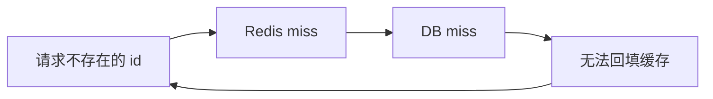
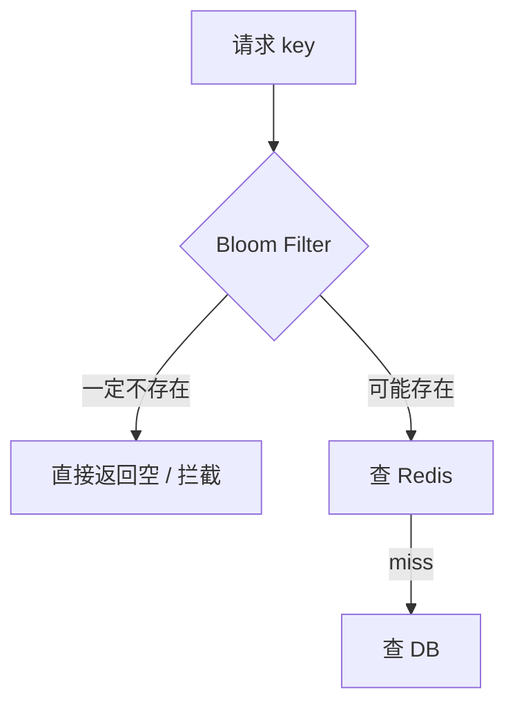
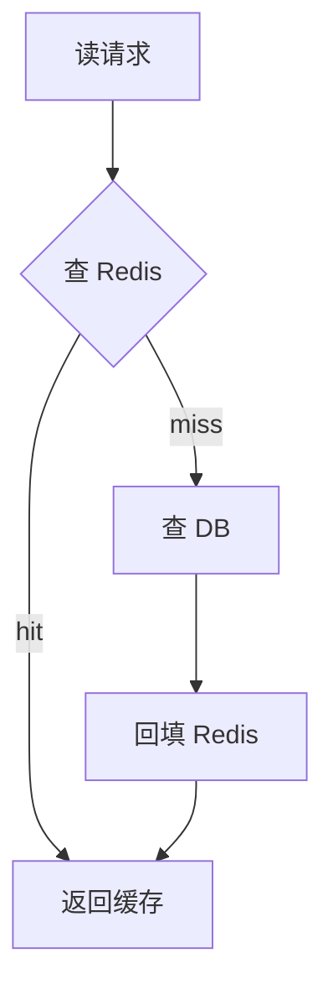
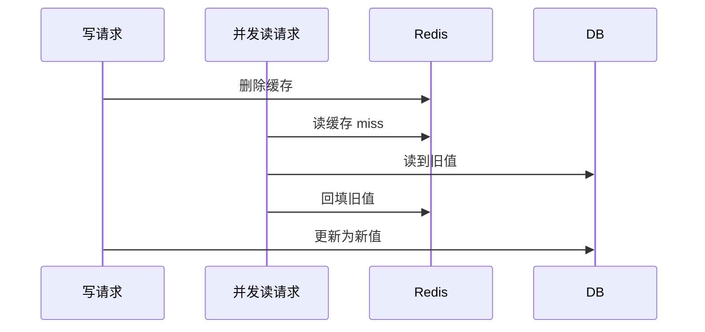
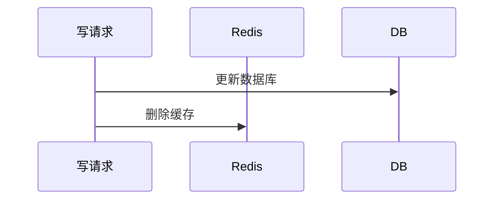
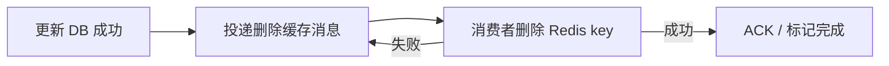
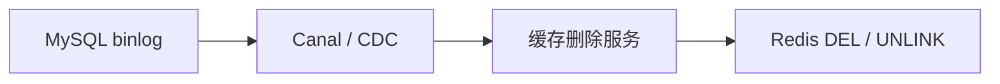
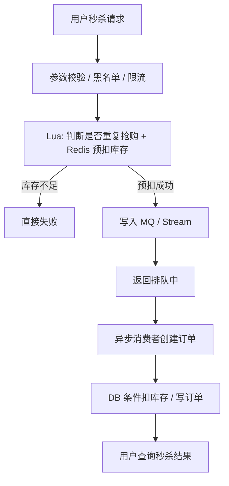

# Redis - 第 20 课：缓存与秒杀实战：布隆过滤器、一致性补偿与库存预扣

## 学习目标

- 把缓存穿透、击穿、雪崩从概念题落到真实链路。
- 说清布隆过滤器为什么“判不存在一定准，判存在不一定准”。
- 理解 Cache Aside 中“先更新数据库，再删除缓存”的补偿方案。
- 能设计一个基于 Redis 预扣库存 + 异步落库的秒杀方案，并讲清它的边界。

## 为什么这篇是补充，不是重复

`16_缓存故障专题` 已经讲了穿透、击穿、雪崩和旁路缓存的主线。  
这一篇继续补两个面试里更容易追问的落地点：

1. 布隆过滤器到底怎么工作，它为什么能防穿透。
2. 秒杀库存怎么用 Redis 抗住流量，又怎么避免超卖和重复下单。

这两个问题都不是单个 Redis 命令能解决的，而是 Redis、数据库、消息队列、业务幂等一起配合。

## 布隆过滤器：先把“不可能存在”的请求拦掉

缓存穿透的典型链路是：



如果攻击者不停换不存在的 id，请求会持续打到数据库。  
布隆过滤器的作用，是在查缓存和数据库之前先做一次存在性预判。



## 布隆过滤器怎么标记一个元素

布隆过滤器由两部分组成：

- 一个 bit 数组。
- 多个哈希函数。

假设 bit 数组长度是 8，有 3 个哈希函数。写入元素 `x` 时：

```text
hash1(x) % 8 = 1
hash2(x) % 8 = 4
hash3(x) % 8 = 6
```

那就把位置 1、4、6 置为 1。

查询 `x` 时，也用同样的 3 个哈希函数算位置：

- 如果任意一个位置是 0，说明 `x` 一定没被加入过。
- 如果所有位置都是 1，说明 `x` 可能被加入过。

为什么是“可能”？  
因为别的元素也可能通过哈希函数把这些位置置成了 1，这就是误判。

## 布隆过滤器的工程边界

布隆过滤器有两个非常关键的性质：

1. **不会漏判**：它说不存在，就一定不存在。
2. **可能误判**：它说存在，只能说明可能存在。

所以它适合挡穿透，因为挡的是“不存在”的请求。  
但它不适合做权限判断、支付判断、库存判断这类不能误判的业务。

还有几个工程点：

- 数据新增时，要同步写入布隆过滤器。
- 数据删除时，普通布隆过滤器不擅长删除，除非用 Counting Bloom Filter 或重建。
- 容量和误判率要提前规划，bit 数组太小会导致误判率升高。
- 过滤器不是数据库，最终仍然要以 DB 查询结果为准。

## Cache Aside 的写路径：为什么常见答案是“先更新 DB，再删缓存”

读路径很简单：



写路径最常见是：

```text
先更新数据库，再删除缓存
```

为什么不是“先删缓存，再更新数据库”？

因为并发读可能把旧值重新写回缓存：



最终 DB 是新值，缓存却是旧值。

所以更稳的顺序是：



这样即使并发读发生，旧值被回填的窗口会小很多。

## 删除缓存失败怎么办

“先更新 DB，再删缓存”仍然不是强一致。  
如果 DB 更新成功，删除缓存失败，就会留下旧缓存。

常见补偿有两种。

### 方案一：删除缓存重试

业务更新 DB 成功后，把“需要删除的缓存 key”写入消息队列或重试表。后台消费者负责删除。



优点：

- 直观。
- 可以记录失败次数和告警。

缺点：

- 对业务代码有侵入。
- 消息也要保证可靠，消费者要幂等。

### 方案二：订阅 binlog 删除缓存

数据库更新一定会写 binlog。  
可以用 Canal 这类组件订阅 binlog，再由下游缓存服务删除对应 key。



优点：

- 对业务代码侵入小。
- 统一处理缓存失效。

缺点：

- 链路更长。
- binlog 解析、消息投递、删除服务都要监控。
- 删除延迟仍然存在。

一句话：**缓存一致性很少追求强一致，更常见是通过 TTL + 删除重试 + CDC 补偿实现最终一致。**

## 秒杀库存：先区分几种方案

秒杀题的核心矛盾是：

- 请求瞬间非常多。
- 库存非常少。
- 不能超卖。
- 数据库不能被打爆。
- 用户还要尽快得到反馈。

### 方案一：数据库加锁

比如 `select ... for update` 或条件更新：

```sql
update goods
set stock = stock - 1
where goods_id = ?
  and stock > 0;
```

条件更新是底线，至少能防止库存被扣成负数。  
但如果所有请求都打到数据库，数据库会成为瓶颈。

### 方案二：分布式锁

对商品加一把 Redis 锁：

```text
SET lock:sku:1001 uuid NX PX 3000
```

拿到锁才能扣库存。

这个方案能保证互斥，但问题也明显：同一个热门商品的所有请求被串行化，吞吐上不去。它更适合低并发互斥，不适合极高并发秒杀主链路。

### 方案三：分段库存

把 100 个库存拆成多个桶：

```text
stock:sku:1001:0
stock:sku:1001:1
stock:sku:1001:2
stock:sku:1001:3
stock:sku:1001:4
```

按用户 ID 或随机策略路由到某个桶，降低单点锁竞争。

优点：

- 并发能力比单锁强。

难点：

- 某个桶没库存时，要不要换桶重试。
- 各桶库存怎么初始化和回收。
- 防重和最终落库仍然要做。

### 方案四：Redis 预扣库存 + 异步队列

这是更常见的高并发秒杀思路：



Redis 负责挡住瞬时洪峰，数据库只处理已经通过预扣的少量请求。

## 秒杀 Lua 脚本里通常要做什么

不能只做 `DECR stock`。至少要做三件事：

1. 判断用户是否已经参与过，防重复下单。
2. 判断库存是否大于 0。
3. 扣减库存并记录用户参与标记。

这些必须原子执行，所以适合 Lua：

```text
if sismember(seckill:sku:1001:users, userId) then
    return DUPLICATE
end

if get(seckill:sku:1001:stock) <= 0 then
    return SOLD_OUT
end

decr(seckill:sku:1001:stock)
sadd(seckill:sku:1001:users, userId)
return OK
```

真实代码还要处理 key 不存在、库存初始化、过期时间、活动状态等。

## Redis 预扣以后，数据库还要不要校验

一定要。

Redis 预扣是流量闸门，不是最终事实。  
数据库仍然要用条件更新兜底：

```sql
update goods
set stock = stock - 1
where goods_id = ?
  and stock > 0;
```

原因很简单：

- Redis 可能和 DB 不一致。
- MQ 可能重复投递。
- 消费者可能重试。
- 人工补偿或系统恢复可能重新执行。

数据库是最终事实源，不能因为前面有 Redis 就放弃自身约束。

## 秒杀方案的几个关键边界

### 1. 返回“排队中”不是“购买成功”

Redis 预扣成功，只能说明请求进入了后续处理链路。  
真正成功要看订单是否创建、数据库库存是否扣减成功。

### 2. 需要结果查询

用户请求秒杀后，前端通常轮询或长轮询查询结果：

- 成功：展示订单。
- 失败：库存不足或重复请求。
- 处理中：继续等待。

### 3. 要能处理 MQ 失败

如果 Redis 预扣成功，但写 MQ 失败，就会出现“库存扣了，请求没进入订单链路”。  
这时要么把“预扣 + 入队”放进更可靠的本地事务 / outbox，要么失败时回滚 Redis 库存和用户标记，且回滚也要小心并发。

### 4. 要有对账

秒杀链路天然是最终一致。活动结束后要对账：

- Redis 预扣数量。
- MQ 消息数量。
- DB 订单数量。
- DB 库存扣减数量。

发现不一致要有补偿策略。

## 这一篇要带走的结论

- 布隆过滤器适合防缓存穿透，因为它能可靠判断“不存在”，但存在误判。
- Cache Aside 写路径常用“先更新 DB，再删除缓存”，删除失败要靠重试或 CDC 补偿。
- 秒杀不能把请求全部打到数据库，Redis 的价值是做预扣库存、去重、限流和削峰。
- Redis 预扣不等于最终成功，数据库条件扣减和唯一订单约束仍然必须保留。
- 高并发秒杀方案的核心不是某条命令，而是 Redis、MQ、DB、幂等、对账一起形成闭环。

## 问题

1. 布隆过滤器为什么能说“不存在一定不存在”，却不能说“存在一定存在”？
2. “先更新数据库，再删除缓存”在哪些情况下仍然会不一致？怎么补偿？
3. 秒杀场景里，为什么单纯 Redis 分布式锁不是最优方案？
4. Redis 预扣库存成功后，为什么数据库仍然要做 `stock > 0` 的条件更新？

