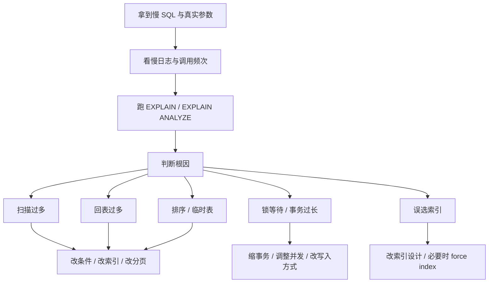

# SQL - 第 5 课：线上怎么排查慢 SQL：EXPLAIN、慢日志、Rows、临时表与文件排序

## 学习目标（本节结束后你能做到什么）

- 能用一套靠谱的顺序去排查线上慢 SQL，而不是想到什么改什么。
- 读懂 `EXPLAIN` 里最关键的几个字段。
- 知道 `Using temporary`、`Using filesort`、扫描行数大、误选索引这些信号意味着什么。
- 知道除了改 SQL 和加索引，线上还有哪些更实际的优化手段。

## 内容讲解（核心概念，用类比、例子、图示说清楚）

这一课我们尽量贴近真实工作。

线上慢 SQL 最怕两种排查方式：

- 第一种：不看执行计划，纯靠感觉改
- 第二种：一上来就加索引，结果索引越来越多，SQL 还是慢

一个更稳的排查方式应该是：

**先拿现场，再看计划，再定位瓶颈，最后选最小成本的优化动作。**

### 1. 线上排查慢 SQL 的基本 SOP

先给你一条很实用的顺序：

1. 拿到完整 SQL 和实际参数
2. 确认慢的是偶发还是稳定复现
3. 看慢日志和调用频次
4. 跑 `EXPLAIN`，必要时跑 `EXPLAIN ANALYZE`
5. 判断慢在扫描、回表、排序、临时表、锁等待还是误选索引
6. 再决定是改 SQL、改索引、改分页方式、改表结构，还是改业务方案

你会发现，真正靠谱的优化，顺序感非常重要。

### 2. 慢日志为什么必须开

很多团队天天说慢 SQL，但连慢日志都没开全，这会让排查非常被动。

慢日志至少解决两个问题：

#### 2.1 它帮你知道“到底哪条 SQL 慢”

不是模糊地说：

- “数据库最近有点慢”

而是具体到：

- 哪条 SQL
- 花了多久
- 扫描了多少行
- 调用了多少次

#### 2.2 它帮你区分“单次极慢”和“整体高频”

有的 SQL 单次 3 秒，很危险；  
有的 SQL 单次 20ms，但一分钟调了 10 万次，整体也很伤。

所以优化时不只看单条耗时，还要看：

- QPS
- 总体资源消耗
- 峰值影响

### 3. `EXPLAIN` 先看哪几个字段

`EXPLAIN` 信息很多，但你一开始先盯住这几个就够用了：

#### 3.1 `type`

这是访问方式的大概等级。  
你先不用死记所有枚举，但要有直觉：

- 越接近精准定位越好
- 越接近全表扫描越危险

看到 `ALL`，通常就要提高警惕。

#### 3.2 `key`

它表示这条 SQL 实际用了哪个索引。

要注意两件事：

- `possible_keys` 只是“可能可用”
- `key` 才是“实际选了哪个”

很多慢 SQL 的问题不是没索引，而是：

- 有多个索引
- 但优化器选错了

#### 3.3 `rows`

这个特别重要。  
它代表优化器预估要扫描多少行。

如果你只返回 20 行，但 `rows` 预估几万、几十万，那就已经说明方向不太对。

#### 3.4 `filtered`

你可以粗略把它理解成：

- 扫完这些行之后，真正能通过条件的比例有多大

如果扫描很多、过滤比例又低，说明很多工作都是白干的。

#### 3.5 `Extra`

这里常见的几个信号最有用：

- `Using index`：常常说明有覆盖索引的机会
- `Using where`：说明还要做条件过滤
- `Using temporary`：说明可能用了临时表
- `Using filesort`：说明可能做了额外排序

其中后两个在大数据量场景里尤其要警惕。

### 4. `Using temporary` 和 `Using filesort` 到底意味着什么

这两个词经常把人吓到，但你不用把它神化。

#### 4.1 `Using temporary`

通常表示数据库为了完成查询，中间构造了临时结果。

常见来源：

- `GROUP BY`
- `DISTINCT`
- 某些复杂子查询

它不一定一定坏，但如果数据量大，通常是值得重点关注的信号。

#### 4.2 `Using filesort`

名字里有 `file`，但不代表一定写磁盘。  
它更重要的含义是：

- 这次排序没能直接利用索引顺序
- 需要额外做排序动作

所以你看到它，第一反应不是慌，而是问：

- 这个排序能不能通过索引避免？
- 排序前能不能先减少数据量？

### 5. `EXPLAIN` 只是预估，必要时看真实执行

经验再补一层：

- `EXPLAIN` 是预估
- `EXPLAIN ANALYZE` 更接近真实执行

如果你在 MySQL 8 上，有条件的话非常建议对关键 SQL 看一下真实耗时分布。  
因为有时候优化器估得不准，尤其在：

- 数据分布不均匀
- 统计信息过旧
- 条件很复杂

这时你只盯预估值，可能会被带偏。

### 6. 线上不是所有慢 SQL 都该靠“改 SQL”解决

这是很多后端同学最容易忽略的一点。

有些问题，本质上已经不是 SQL 语句层面能优雅解决的了。

下面这些手段，很多时候比继续死磕 SQL 更有效：

#### 6.1 冷热数据归档

如果一张订单表已经几亿行，而接口只查最近三个月数据，那你应该考虑：

- 热数据表
- 历史归档表

而不是让所有在线查询都在超级大表上跑。

#### 6.2 用缓存扛热点

如果某个榜单、配置、热门商品列表被反复查，而且变化不频繁，缓存通常比你把 SQL 抠到极限更有收益。

#### 6.3 搜索需求别全塞给 MySQL

模糊检索、多字段全文搜索、复杂相关性排序，很多时候更适合：

- Elasticsearch
- OpenSearch

而不是让 MySQL 用 `%keyword%` 硬扛。

#### 6.4 批量写入和批量更新

如果你一条一条插、一条一条更，日志刷盘、网络往返、事务开销都会放大。

很多后台任务性能差，根因不是 SQL 写错，而是：

- 调用方式太碎

#### 6.5 缩短事务

有些 SQL 慢，是因为前面的事务太长，把锁拖太久。

所以排查时别只盯查询，还要看：

- 事务边界是不是太大
- 一个请求里是不是混了太多 DB 操作

### 7. `force index` 能用，但别把它当常规武器

有时候优化器确实会误选索引，这时 `force index` 可能立竿见影。

但它的问题是：

- 它把执行路径写死了
- 以后数据分布一变，可能反而变成新问题

所以更稳的顺序一般是：

1. 先确认是否真是误选索引
2. 看能不能通过改 SQL、改联合索引、更新统计信息解决
3. 实在不行再考虑 `force index`

### 8. 一张图看懂慢 SQL 排查流程

### 9. 最后给你一组很实用的线上建议

- 优化前先固定样本 SQL 和参数，不要拿“不同参数”的结果对比。
- 先确认业务需要的结果集到底多大，别为了接口只展示 20 条却查 10 万条。
- 看慢 SQL 时不要只看“单次耗时”，还要看调用次数和总体影响。
- 每次只改一个变量，比如先只改索引或先只改分页写法。
- 用接近真实数据量的环境验证，别拿几千行测试结果推几亿行线上表现。
- 对超大表，提前规划归档和冷热分离，不要等查不动了再救火。

## 小结（3-5 条关键点）

- 线上排查慢 SQL 的关键，不是拍脑袋改，而是“拿现场、看计划、找根因、选最小代价方案”。
- `EXPLAIN` 先重点看 `type`、`key`、`rows`、`filtered` 和 `Extra`。
- `Using temporary` 和 `Using filesort` 往往是值得重点关注的信号。
- `force index` 是应急工具，不该成为默认做法。
- 很多 SQL 问题最终要靠归档、缓存、搜索分流、批量写入和事务治理一起解决。

## 问题 （检测用户对当前章节内容是否了解）

1. 线上拿到一条慢 SQL，你建议先按什么顺序排查？
2. `EXPLAIN` 里哪几个字段最值得优先看？各自大概表示什么？
3. `Using temporary` 和 `Using filesort` 为什么需要重点关注？
4. 为什么说不是所有慢 SQL 都应该只靠改 SQL 或加索引来解决？
5. `force index` 什么时候能用，为什么不能把它当常规优化手段？
