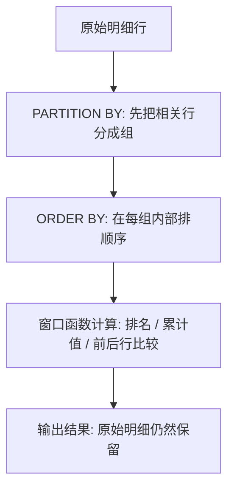

# SQL - 第 8 课：窗口函数：OVER、PARTITION BY、排名、累计值与前后行对比

## 学习目标（本节结束后你能做到什么）

- 理解窗口函数到底在解决什么问题，而不是只会背 `OVER()` 语法。
- 能说清 `PARTITION BY` 和 `GROUP BY` 的根本区别。
- 会写最常见的窗口函数场景：排名、组内 TopN、累计求和、前后行比较、环比/差值分析。
- 知道窗口函数常见的两个坑：为什么它常常需要套子查询，以及它为什么不一定比普通 SQL 更快。

## 内容讲解（核心概念，用类比、例子、图示说清楚）

很多人第一次学窗口函数时，最大的痛点不是语法，而是：

- 看得懂每个关键字
- 但脑子里没有画面

比如：

```sql
SUM(amount) OVER (PARTITION BY user_id ORDER BY create_time)
```

乍一看每个单词都认识，但合在一起就很抽象。

所以这节课我们先不急着记语法，先建立一个最重要的直觉：

**窗口函数的核心价值，不是把多行“压缩成一行”，而是在“保留每一行明细”的同时，再给每一行补上一些额外计算结果。**

这是它和 `GROUP BY` 最大的区别。

### 1. 先用一句话理解窗口函数

你可以先把窗口函数理解成：

**在一组相关的行上做计算，但不把原来的明细行折叠掉。**

举个很直观的例子。

假设有一张订单表：

| user_id | order_id | amount |
| --- | --- | --- |
| 1 | 101 | 100 |
| 1 | 102 | 200 |
| 1 | 103 | 50 |
| 2 | 201 | 80 |
| 2 | 202 | 120 |

如果你写：

```sql
SELECT user_id, SUM(amount)
FROM orders
GROUP BY user_id;
```

结果会变成：

| user_id | sum_amount |
| --- | --- |
| 1 | 350 |
| 2 | 200 |

原来的每笔订单明细没了。

但如果你写窗口函数：

```sql
SELECT
  user_id,
  order_id,
  amount,
  SUM(amount) OVER (PARTITION BY user_id) AS user_total
FROM orders;
```

结果更像这样：

| user_id | order_id | amount | user_total |
| --- | --- | --- | --- |
| 1 | 101 | 100 | 350 |
| 1 | 102 | 200 | 350 |
| 1 | 103 | 50 | 350 |
| 2 | 201 | 80 | 200 |
| 2 | 202 | 120 | 200 |

这就是窗口函数最核心的味道：

- 明细行还在
- 但每一行都带上了一些“针对这一组数据算出来的额外信息”

### 2. `OVER()` 到底是什么意思

窗口函数最标志性的部分，就是：

```sql
OVER (...)
```

你可以把它理解成：

- “在什么范围内看这批数据”
- “按什么规则把相关行放在一起算”

`OVER()` 里面最常见的两个关键字是：

- `PARTITION BY`
- `ORDER BY`

先记一个最稳的理解：

- `PARTITION BY`：先分组，但不是把结果压扁
- `ORDER BY`：在这组里再排顺序

### 3. `PARTITION BY` 和 `GROUP BY` 的区别

这是窗口函数里最容易混的点。

很多人会问：

- “`PARTITION BY` 不就是分组吗？”

它们确实都在“按某个字段把数据分块”，但目的完全不同。

#### 3.1 `GROUP BY` 的目标

把多行聚合成更少的行。

也就是说：

- 原始明细被折叠掉了

#### 3.2 `PARTITION BY` 的目标

只是告诉窗口函数：

- “这些行算一组”

但原始明细仍然保留。

你可以这样记：

- `GROUP BY`：分组后“收起来”
- `PARTITION BY`：分组后“还摊着”

这个区别一旦想清楚，窗口函数就顺很多了。

### 4. 最常见的第一类用法：排名

窗口函数最经典的用途，就是做排名。

#### 4.1 `ROW_NUMBER()`

给每一行分配一个唯一序号。

比如按用户的订单金额从高到低排名：

```sql
SELECT
  user_id,
  order_id,
  amount,
  ROW_NUMBER() OVER (
    PARTITION BY user_id
    ORDER BY amount DESC
  ) AS rn
FROM orders;
```

它的意思是：

- 每个 `user_id` 各自一组
- 组内按 `amount` 从大到小排
- 每行给一个唯一编号

如果金额相同，`ROW_NUMBER()` 也会继续分出不同名次。

#### 4.2 `RANK()`

并列时名次相同，但后面的名次会跳号。

例如分数是：

- 100
- 90
- 90
- 80

`RANK()` 会给出：

- 1
- 2
- 2
- 4

#### 4.3 `DENSE_RANK()`

并列时名次相同，但后面不跳号。

同样这组分数：

- 100
- 90
- 90
- 80

`DENSE_RANK()` 会给出：

- 1
- 2
- 2
- 3

所以它们的区别非常值得你记住：

- `ROW_NUMBER()`：一定不并列
- `RANK()`：并列且跳号
- `DENSE_RANK()`：并列但不跳号

### 5. 组内 TopN：窗口函数最常见的实战场景

后端最常见的一个需求是：

- 每个用户最近 3 条订单
- 每个班级成绩前 5 的学生
- 每个商品最近一条价格记录

这种“每组取前 N 条”的需求，用窗口函数特别顺手。

例如：

```sql
SELECT *
FROM (
  SELECT
    user_id,
    order_id,
    create_time,
    ROW_NUMBER() OVER (
      PARTITION BY user_id
      ORDER BY create_time DESC
    ) AS rn
  FROM orders
) t
WHERE t.rn <= 3;
```

这个写法你以后会见得非常多。

要注意一件事：

**窗口函数算出来的列，往往不能直接在同一层 `WHERE` 里过滤，所以常常需要套一层子查询。**

这也是为什么窗口函数总看起来像：

- 先在内层算排名
- 再在外层筛 `rn <= 3`

### 6. 第二类高频用法：累计值

窗口函数特别适合做“到当前行为止”的累计计算。

比如每个用户的累计消费额：

```sql
SELECT
  user_id,
  order_id,
  create_time,
  amount,
  SUM(amount) OVER (
    PARTITION BY user_id
    ORDER BY create_time
  ) AS running_total
FROM orders;
```

如果某个用户的订单金额依次是：

- 100
- 200
- 50

那累计值就是：

- 100
- 300
- 350

这类需求如果不用窗口函数，传统写法通常会非常绕，甚至需要自连接或相关子查询。

### 7. 第三类高频用法：前后行对比

窗口函数里还有两个很实用的函数：

- `LAG()`
- `LEAD()`

它们特别适合做：

- 和上一条记录比较
- 和下一条记录比较
- 计算环比、差值、连续变化

#### 7.1 `LAG()`

看上一行。

例如：

```sql
SELECT
  user_id,
  order_id,
  amount,
  LAG(amount) OVER (
    PARTITION BY user_id
    ORDER BY create_time
  ) AS prev_amount
FROM orders;
```

这相当于给每行补了一个“上一笔订单金额”。

#### 7.2 `LEAD()`

看下一行。

比如：

```sql
SELECT
  user_id,
  order_id,
  amount,
  LEAD(amount) OVER (
    PARTITION BY user_id
    ORDER BY create_time
  ) AS next_amount
FROM orders;
```

这会给每行补上“下一笔订单金额”。

这种场景在数据分析、账单变化、价格变更、状态流转里都特别常见。

### 8. 一张图理解窗口函数的心智模型



最关键的是最后一步：

**输出结果时，原始明细还在。**

这和 `GROUP BY` 完全不是一回事。

### 9. 窗口函数为什么常常比 `GROUP BY` 更适合业务查询

很多业务报表和接口，其实都不是单纯想要“按组聚合后的结果”，而是想要：

- 明细 + 排名
- 明细 + 组内总计
- 明细 + 前一条 / 后一条
- 明细 + 组内 TopN

这就是窗口函数最擅长的地方。

如果你硬用 `GROUP BY` 去做这些事，往往会出现两个问题：

- 明细没了
- SQL 变得很绕

### 10. 窗口函数不是性能银弹

这点一定要补清楚。

很多人学完窗口函数后，会下意识觉得：

- 这玩意儿更高级，所以也更快

不是这样的。

窗口函数的核心价值首先是：

- 表达能力更强

但性能上它依然可能要付出代价，尤其是：

- 需要 `PARTITION BY`
- 需要 `ORDER BY`
- 数据量很大

这些操作经常意味着：

- 排序
- 分区计算
- 临时结果

所以窗口函数更像是：

- 把以前很绕的 SQL 用更自然的方式写出来

而不是：

- 自动帮你优化一切

### 11. 两个非常常见的坑

#### 11.1 误把 `PARTITION BY` 当成 `GROUP BY`

这是第一大坑。

只要你记住这句就不容易混：

- `GROUP BY` 折叠明细
- `PARTITION BY` 保留明细

#### 11.2 想在 `WHERE` 里直接用窗口函数结果

很多数据库不允许你在同一层 `WHERE` 里直接写：

```sql
WHERE ROW_NUMBER() OVER (...) <= 3
```

更常见的写法是：

```sql
SELECT *
FROM (
  SELECT ..., ROW_NUMBER() OVER (...) AS rn
  FROM ...
) t
WHERE t.rn <= 3;
```

这个模式你以后可以直接记住。

### 12. 后端开发里最值得优先掌握的窗口函数

如果你不想一次学太多，先掌握这 6 个就很够用了：

1. `ROW_NUMBER()`
2. `RANK()`
3. `DENSE_RANK()`
4. `SUM() OVER (...)`
5. `LAG()`
6. `LEAD()`

基本已经能覆盖大部分：

- 排名
- TopN
- 累计值
- 环比
- 相邻记录比较

## 小结（3-5 条关键点）

- 窗口函数的核心，不是把多行压成一行，而是在保留明细行的前提下做额外计算。
- `PARTITION BY` 和 `GROUP BY` 最大的区别在于：前者保留明细，后者折叠明细。
- `ROW_NUMBER`、`RANK`、`DENSE_RANK` 最适合做组内排名和 TopN。
- `SUM() OVER`、`LAG()`、`LEAD()` 很适合做累计值、环比和前后行对比。
- 窗口函数表达力很强，但它不是性能银弹，排序和分区计算的成本仍然要关注。

## 问题 （检测用户对当前章节内容是否了解）

1. 为什么说窗口函数和 `GROUP BY` 最大的区别，不在“有没有分组”，而在“会不会保留明细行”？
2. `ROW_NUMBER()`、`RANK()`、`DENSE_RANK()` 三者最核心的区别是什么？
3. “每个用户最近 3 条订单”为什么特别适合用窗口函数来写？
4. `LAG()` 和 `LEAD()` 分别适合解决什么问题？
5. 为什么窗口函数经常需要套一层子查询，而不是直接在 `WHERE` 里过滤？
