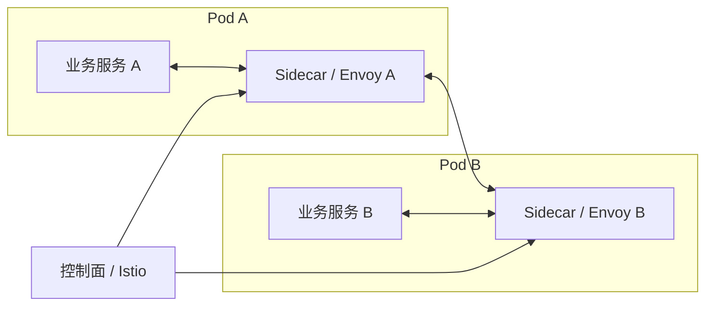

# Service Mesh - 第 2 课：核心架构：数据面、控制面、Sidecar 与 Istio

## 学习目标（本节结束后你能做到什么）

- 理解 Service Mesh 为什么要拆成数据面和控制面两层。
- 理解 Sidecar 在请求链路中的真实位置，而不是只知道“旁边有个代理”。
- 说清 Envoy、Istio、xDS 在架构里分别扮演什么角色。
- 理解控制平面“下发策略”和数据平面“执行策略”的分工。
- 建立一张 Mesh 核心架构图，为后续流量治理和安全学习打基础。

## 内容讲解（核心概念，用类比、例子、图示说清楚）

### 1. 为什么 Mesh 不能只是“一堆 Sidecar”

如果系统里有 500 个服务、1000 个 Pod，也就意味着可能有 1000 个 Sidecar。

这时立刻会有一个问题：

- 这些 Sidecar 的路由规则从哪来
- 超时和重试配置谁统一定义
- 哪些服务之间允许通信、哪些不允许，由谁决策
- 证书、身份、安全策略怎么统一管理

如果每个 Sidecar 都手工配，那比 SDK 模式还痛苦。

所以 Mesh 必须再有一个集中管理和下发配置的层，这就是控制面。

### 2. 数据面和控制面的基本分工

#### 数据面

数据面就是那些实际拦截和转发流量的代理，通常就是 Sidecar 代理本身。

它负责：

- 接收流量
- 负载均衡
- 路由转发
- 超时、重试、熔断执行
- 指标、日志、Trace 采集
- mTLS 加解密

它处理的是真实请求流量，所以叫数据面。

#### 控制面

控制面不直接处理业务流量，它负责的是：

- 感知服务拓扑
- 计算路由和策略
- 下发配置给各个代理
- 管理证书和身份
- 提供统一治理入口

所以控制面更像“大脑”，数据面更像“执行这些规则的肌肉”。

### 3. 一张核心架构图

从这张图你要抓住两件事：

- 真实服务间流量是在 Sidecar 之间走的
- Sidecar 的行为不是自己瞎猜，而是由控制面统一下发

### 4. 请求到底怎么流过 Sidecar

假设服务 A 调用服务 B。

在 Mesh 中，更接近这样的路径：

1. 业务服务 A 发起请求
2. 请求先被本地 Sidecar A 截获
3. Sidecar A 按当前配置决定路由、重试、超时、安全策略
4. 请求发送到服务 B 所在的 Sidecar B
5. Sidecar B 再把流量交给业务服务 B
6. 响应原路返回

所以 Sidecar 不是“站在旁边看着”，而是真正位于流量必经之路上。

### 5. Envoy 为什么经常和 Service Mesh 绑定出现

因为很多 Mesh 方案并不是自己从头写一个代理，而是选择一个高性能代理作为数据面执行器。

Envoy 就是最常见的选择之一。

它的优势在于：

- 高性能
- 面向云原生设计
- 对 HTTP、gRPC、mTLS、观测生态支持强
- 配置模型丰富

所以很多时候你会看到：

- Sidecar 的具体代理实现 = Envoy
- Mesh 的控制面 = Istio 或其他控制系统

### 6. Istio 到底是什么

Istio 可以理解为一套 Service Mesh 控制平面和治理体系。

它本身不是“那个拦流量的代理”，更像是：

- 负责理解你的流量治理、安全、策略配置
- 再把这些配置翻译并下发给 Envoy 这类数据面代理

所以：

- Envoy 更偏执行层
- Istio 更偏管理层

这也是为什么你会同时听到 Istio 和 Envoy，但它们不是同一个角色。

### 7. xDS 在里面做什么

当控制面要把配置下发给很多代理时，需要一套标准化的配置发现和更新机制。

xDS 就是在扮演这类“动态发现配置”的协议族角色。

你可以先把它抽象理解成：

- 控制面和数据面之间的一套配置同步语言

它让控制面可以持续告诉代理：

- 现在有哪些上游实例
- 路由规则怎么变了
- 证书和安全策略怎么更新

这说明 Mesh 架构不仅要解决“流量怎么走”，还要解决“策略怎么动态变”。

### 8. 为什么要把执行和管理分开

如果把控制逻辑和数据路径混在一起，会出现几个问题：

- 每次策略变更都要动代理执行逻辑
- 配置无法集中收敛
- 大规模更新会很困难

拆成控制面和数据面之后，好处是：

- 数据面可以专注高性能转发
- 控制面可以专注策略管理
- 策略修改不需要改业务代码
- 治理能力可以平台化下发

这和我们之前讲的“把治理逻辑从业务代码里拆出来”是一脉相承的，只是这里进一步把“执行代理”和“统一治理”也分层了。

### 9. 数据面和控制面各自的风险也要知道

理解架构不能只看优点，还要看代价。

#### 数据面风险

- 每个 Pod 多一个 Sidecar，资源消耗上升
- 请求路径更长，延迟会有额外开销
- 调试时要同时看业务服务和代理日志

#### 控制面风险

- 控制面太复杂会增加运维难度
- 如果控制面出问题，虽然通常不会立刻让已有数据面停摆，但新配置下发和治理变更会受影响

所以 Mesh 的复杂度不是免费能力，而是需要团队真正能驾驭。

### 10. 用一句话概括 Mesh 架构

如果面试官问你“Service Mesh 的核心架构是什么”，一个很好用的回答是：

“Service Mesh 通常采用数据面和控制面分层设计。数据面由部署在各个服务旁边的 Sidecar 代理组成，负责真实流量的转发、负载均衡、重试、熔断、观测和安全执行；控制面负责统一感知服务拓扑和策略配置，再通过像 xDS 这样的机制把路由、安全和治理规则动态下发给数据面。Istio 更偏控制面体系，Envoy 则常作为数据面代理执行这些策略。” 

这段话的好处是把几个常见名词的位置一次讲清楚了。

## 小结（3-5 条关键点）

- Service Mesh 不能只有 Sidecar，还需要控制面来统一管理策略和配置。
- 数据面处理真实业务流量，控制面负责治理策略的生成和下发。
- Sidecar 位于服务间调用的必经路径上，不是旁观者，而是执行者。
- Envoy 常作为数据面代理，Istio 常作为控制面体系，xDS 负责配置发现和同步。
- Mesh 架构很强，但也会带来资源、链路和运维复杂度的额外成本。

## 问题（检测你对当前章节内容是否了解）

1. 为什么说 Service Mesh 不能只是“一堆 Sidecar”？如果没有控制面，会出现什么管理问题？
2. 请你用自己的话区分数据面和控制面分别负责什么，并各举一个具体职责。
3. 当别人把 Istio、Envoy、xDS 混在一起说时，你会怎么用几句话把它们的角色拆开？
4. 站在请求链路上描述一次 `服务 A -> 服务 B` 的调用过程，说明 Sidecar 在哪里拦截、哪里执行策略。
