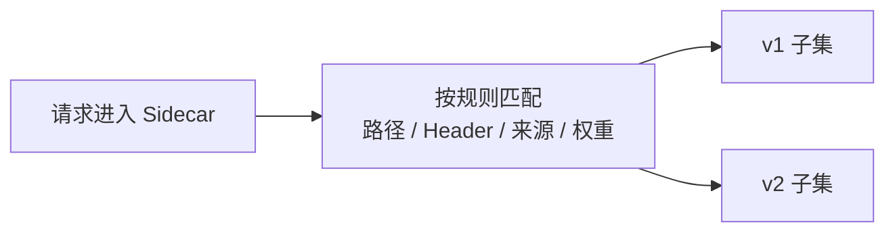
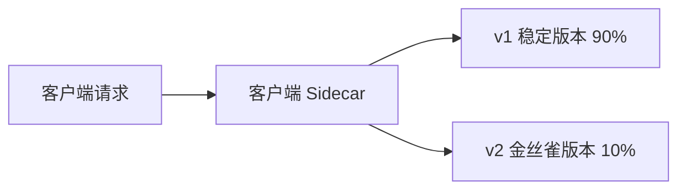
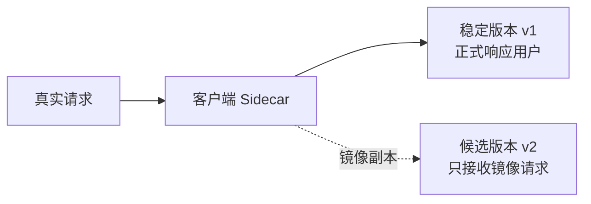

# Service Mesh - 第 3 课：流量治理：路由、金丝雀与故障注入

## 学习目标（本节结束后你能做到什么）

- 理解为什么“流量治理”是 Service Mesh 最直接、最常被感知到的能力。
- 区分 Kubernetes 基本转发能力和 Mesh 细粒度路由能力的边界。
- 说清按请求头、路径、来源、权重做路由分别意味着什么。
- 理解金丝雀发布、镜像流量、超时、重试、熔断、故障注入在 Mesh 里的位置。
- 面试时能用一个完整场景解释 Mesh 是如何做灰度和验证发布风险的。

## 内容讲解（核心概念，用类比、例子、图示说清楚）

### 1. 为什么大家一提 Mesh，最先想到的是流量治理

第 1 课我们讲过，Mesh 的核心思想是把治理能力从业务进程里抽出来；第 2 课我们讲了这些能力是如何通过控制面和数据面协作落地的。

那第 3 课就要开始回答一个最现实的问题：

**这些治理能力，真正落到请求链路上，到底能做什么？**

最典型的答案就是流量治理。

因为在真实生产环境里，团队最常遇到的不是“服务能不能互相访问”，而是：

- 新版本能不能只放 5% 流量试一下
- 某一类用户能不能先走新版本
- 某个接口出问题时能不能快速降级
- 发布前能不能先用真实流量验证，但不影响正式请求
- 我能不能主动制造超时和错误，验证系统是否真的有韧性

这些问题，本质上都不是“业务逻辑”问题，而是“请求应该怎么走、出了问题怎么处理”的通信治理问题。

这就是 Mesh 最能体现平台价值的地方。

### 2. Kubernetes 能转发流量，但它不擅长精细治理

很多人会问：

“Kubernetes 不是已经有 `Service` 了吗？为什么还要 Mesh 做流量治理？”

因为 K8s 原生更像是在解决：

- 这个服务后面有哪些 Pod
- 请求应该打到哪一组后端实例

但它默认做的是比较粗粒度的四层或基础七层转发，不擅长表达下面这些更细的规则：

- 只有带了某个请求头的流量才去新版本
- 只有 `/checkout` 路径走 v2，其余请求仍走 v1
- 按 95% / 5% 的比例把流量分给两个版本
- 请求失败后自动重试 2 次，但总超时不能超过 3 秒
- 人为注入 2 秒延迟，验证上游会不会雪崩

所以可以这样理解：

- Kubernetes 解决“能连上谁”
- Service Mesh 解决“应该按什么策略连、失败时怎么处理、如何安全地变更流量”

### 3. 路由不是“随机分发”，而是“按规则决定请求去向”

先看一个例子。

订单服务 `order-service` 现在有两个版本：

- `v1`：线上稳定版本
- `v2`：新发布版本

如果没有 Mesh，最朴素的做法往往是：

- 把两个版本都挂在同一个 `Service` 后面
- 由默认负载均衡随机分发

这会有一个明显问题：

你无法控制“什么请求该去哪里”。

而在 Mesh 里，路由可以根据很多维度来判断：

- 请求路径：比如 `/api/pay/*`
- Header：比如 `x-user-group: beta`
- 来源服务：比如只有 `web-frontend` 来的流量走新版本
- Cookie / Host / Method
- 流量权重：比如 90% 去 v1，10% 去 v2

于是“流量转发”就从一个简单的随机负载均衡，变成了一个可编排的治理系统。

这里你会看到两个关键词：

- 路由规则：决定“怎么匹配请求”
- 目标子集：决定“匹配后把请求送到哪个版本”

在 Istio 的语境里，这通常会落到 `VirtualService` 和 `DestinationRule` 这类对象上，但你现在先抓住思想就够了：

**先识别请求，再决定目的地。**

### 4. 金丝雀发布：为什么 Mesh 特别适合做灰度

金丝雀发布本质上是在问：

**新版本不要一次性全量上线，能不能先让一小部分真实流量试运行？**

这正是 Mesh 的强项。

假设支付服务要从 `v1` 升级到 `v2`，一个很典型的放量过程可能是：

1. `v2` 先上线，但只接 1% 流量
2. 观察错误率、延迟、CPU、下游依赖情况
3. 没问题后提高到 10%
4. 再逐步提高到 30%、50%、100%
5. 最后下线 `v1`

在 Mesh 出现前，这种灰度常常要写很多业务侧逻辑：

- 按用户 ID 分流
- 按环境变量开关
- 按请求参数切换

这些方案不是不能做，但会让业务代码里混进很多发布逻辑。

Mesh 的好处是：这些流量策略不需要写进业务代码，只要改治理配置就行。

你会发现，这里的关键价值不是“能按比例分流”本身，而是：

- 改路由不需要改业务代码
- 放量过程可以平台化
- 回滚非常快，只需要把权重切回去

### 5. Header 路由比权重路由更适合“定向灰度”

权重路由适合回答一个问题：

- “我想让一部分随机用户先体验新版本”

但很多时候，业务真正想做的是“定向灰度”，比如：

- 只有内部员工走新版本
- 只有压测流量走新版本
- 只有特定租户先试用新功能

这时更适合用 Header、Cookie、来源服务等条件路由。

例如：

- `x-env: canary` 的请求走 `v2`
- 普通请求继续走 `v1`

这样做的好处是可控性更强。你知道哪些请求会命中新规则，而不是把真实用户随机分过去。

所以可以把两类灰度简单记成：

- 权重路由：适合逐步放量
- 条件路由：适合定向验证

### 6. 镜像流量：先看新版本怎么表现，但不让它真正影响用户

有时团队还会觉得：

“即使只放 1% 流量，我还是担心真实用户受到影响。能不能先让新版本看见真实请求，但不真正承担结果？”

这就是镜像流量（Traffic Mirroring）。

它的基本思路是：

- 正式请求仍然走稳定版本
- 同时把一份副本复制给新版本
- 新版本处理这份请求，但它的响应不会返回给用户

这特别适合：

- 发布前做真实流量回放
- 验证新版本逻辑是否会报错
- 比较新旧版本的日志、指标、Trace

但你也要知道镜像流量的边界：

- 如果请求会产生副作用，比如扣款、下单、发短信，就不能随便镜像
- 镜像适合读请求、幂等请求，或者新版本做了严格隔离处理

所以镜像流量不是“绝对安全”，而是“更温和的验证方式”。

### 7. 超时、重试、熔断：它们也是流量治理的一部分

很多人一提流量治理，只想到“流量往哪走”，但实际上：

**请求失败后怎么处理，也是流量治理。**

比如调用链路里最经典的几个策略：

#### 7.1 超时

如果下游服务 10 秒都没响应，上游不能无限等待。

超时策略决定的是：

- 多久还没结果就判定失败

它是在帮系统避免请求长时间挂死、线程池被拖垮。

#### 7.2 重试

有些失败是瞬时性的，比如：

- 某个 Pod 刚好抖了一下
- 某次网络连接临时异常

这时自动重试 1 到 2 次，可能就恢复了。

但重试也不是越多越好。因为如果下游本来就已经很慢或很忙，盲目重试只会把压力进一步放大。

#### 7.3 熔断

当系统发现某个下游已经持续异常时，就不应该继续把大量请求打过去。

熔断的目标是：

- 尽快失败
- 保护下游
- 避免故障扩散

所以你可以把这三个动作理解成：

- 超时：别等太久
- 重试：偶发失败再试一下
- 熔断：持续异常就先别打了

Mesh 的价值在于，这些策略也能被统一地下沉到代理层，而不是散落在每个语言 SDK 里各自实现。

### 8. 故障注入：不是“把系统搞坏”，而是验证系统真的扛得住

如果说前面的路由、金丝雀、镜像是在“控制流量怎么走”，那么故障注入是在主动问：

**当流量遇到坏情况时，我的系统会不会按预期降级？**

常见的故障注入方式有：

- 延迟注入：人为给请求加 500ms、2s、5s 延迟
- 错误注入：人为返回 500、503 等错误
- 中断注入：让一部分请求直接失败

一个真实使用场景是：

你给 `payment-service` 注入 2 秒延迟，然后观察：

- `order-service` 的超时配置是否生效
- 重试是否过度放大流量
- 熔断是否及时打开
- 前端是否看到友好的降级结果

所以故障注入不是为了“炫技”，而是为了验证：

- 你的容错策略是不是真的配置正确
- 你的系统是否具备韧性

这也是为什么很多团队会把 Mesh 的故障注入和混沌工程一起使用。

### 9. 这些策略到底是在哪里生效的

学到这里，你要把前两课的架构知识串起来。

流量治理不是控制面自己处理请求，而是：

1. 你在控制面定义规则
2. 控制面把规则下发给各个 Sidecar
3. Sidecar 在真实请求经过时执行这些规则

所以：

- “按 Header 分流”是在 Sidecar 执行
- “90% 去 v1、10% 去 v2”是在 Sidecar 执行
- “超时 2 秒、失败重试 1 次”也是在 Sidecar 执行

这正是 Mesh 的统一性来源：

无论你的业务服务是 Java、Go、Python 还是 Node，流量规则都可以在代理层统一执行。

### 10. 流量治理很强，但配置错了也会很危险

流量治理的能力越强，错误配置的风险也越高。

常见坑包括：

- 重试次数过大，导致故障放大
- 超时时间设置不合理，导致链路排队
- 金丝雀权重已经切到 50%，但监控还没跟上
- 镜像流量打到了有副作用的接口，产生重复写入
- 路由规则太复杂，团队已经没人能快速判断请求到底会去哪

所以你不能把 Mesh 看成“万能流量开关”，而要把它看成：

**一套很强的基础设施能力，但必须配合监控、发布流程和工程规范一起使用。**

### 11. 用一句话概括 Mesh 的流量治理

如果面试官问你“Service Mesh 在流量治理上最核心的价值是什么”，一个很好用的回答是：

“Service Mesh 把服务间流量的路由和容错策略从业务代码中抽离出来，下沉到 Sidecar 代理统一执行。这样平台就能基于路径、请求头、来源服务和流量权重做精细路由，实现灰度发布、金丝雀、镜像流量、超时重试、熔断和故障注入等治理能力，并且这些策略可以通过控制面动态下发，不需要业务服务重新发版。” 

这段话的重点在于把三个层次连起来了：

- 路由怎么做
- 容错怎么做
- 为什么 Mesh 特别适合做这件事

## 小结（3-5 条关键点）

- Kubernetes 能提供基础转发，但 Service Mesh 更擅长按路径、Header、来源、权重做细粒度治理。
- 金丝雀发布和定向灰度的核心，是把“新版本接多少、接哪些请求”从业务代码中抽离出来。
- 镜像流量适合做真实流量验证，但要警惕有副作用的请求被重复执行。
- 超时、重试、熔断并不只是 SDK 层能力，它们也可以在 Mesh 数据面统一执行。
- 故障注入的价值不在于制造问题，而在于验证系统在异常场景下是否真的能降级和恢复。

## 问题（检测你对当前章节内容是否了解）

1. Kubernetes 的 `Service` 和 Service Mesh 的流量治理能力，边界分别在哪里？
2. 如果你要让新版本只接 10% 流量，你会怎么解释金丝雀发布在 Mesh 中是如何实现的？
3. 权重路由和 Header 路由分别更适合什么场景？请各举一个例子。
4. 镜像流量为什么适合验证新版本，但又不能对所有接口都直接使用？
5. 如果下游服务持续变慢，超时、重试、熔断分别应该解决什么问题？它们之间可能产生什么副作用？
