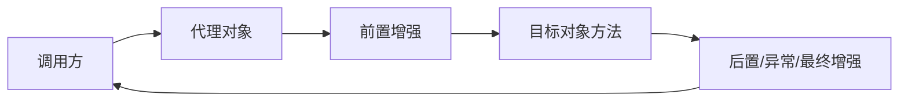

# Spring 整体认知：核心模块、IoC、DI、AOP 与企业分层

## 核心结论

Spring 是一个围绕 IoC 容器构建的企业级应用框架。它的底座负责对象创建、依赖装配、配置解析、生命周期管理和扩展点开放；在这个底座上，AOP、事务、Web、数据访问、消息、测试等模块把企业应用里的通用问题沉淀成可复用能力。

面试时不要只说“Spring 是轻量级框架”。更好的回答是：Spring 通过容器管理对象，通过依赖注入降低对象耦合，通过 AOP 统一处理日志、事务、权限、监控等横切逻辑，通过大量模板和抽象屏蔽底层 API 的复杂度。

## Spring 模块地图

Spring Framework 常见模块可以按职责理解：

- Core Container：`spring-core`、`spring-beans`、`spring-context`、`spring-expression`。负责 IoC 容器、Bean 管理、资源加载、事件、国际化和 SpEL。
- AOP / Aspects：提供面向切面编程能力，常用于事务、缓存、权限、日志、监控。
- Data Access / Integration：包括 JDBC、ORM、OXM、JMS、事务抽象。核心价值是统一资源管理、异常体系和事务模型。
- Web：包括 Servlet Web、Spring MVC、WebSocket 等，负责 Web 请求处理和 Web 应用集成。
- Messaging：为消息应用提供抽象和注解驱动支持。
- Instrumentation：提供类加载器和字节码增强相关能力，使用场景相对少。
- Test：提供单元测试和集成测试支持，例如 Spring TestContext、MockMvc。

这张地图的重点是：Spring 不是一个只会创建对象的容器，而是一个“容器加生态抽象”的平台。

## IoC 与 DI

传统写法里，对象自己负责创建依赖：

```java
Score score = new Score();
Student student = new Student();
student.setScore(score);
```

这种方式的问题是：对象创建和依赖关系散落在业务代码里，替换实现、测试隔离、生命周期管理都会变麻烦。

IoC 的做法是把控制权交给容器：对象不再主动 new 依赖，而是由容器根据配置、注解或工厂方法创建对象，再把依赖注入进来。DI 是 IoC 最常见的落地方式，常见注入方式包括构造器注入、Setter 注入、字段注入。

三种注入方式的取舍：

- 构造器注入：依赖不可缺失，适合必需依赖，也更利于不可变对象和测试。
- Setter 注入：适合可选依赖，或历史代码中需要后置修改的场景。
- 字段注入：写起来短，但隐藏依赖，测试和重构不够友好，生产代码里不建议作为首选。

## AOP 解决什么问题

很多业务都需要类似逻辑：

- 方法前记录参数。
- 方法后统计耗时。
- 异常时记录错误。
- 方法调用前开启事务，结束时提交或回滚。
- 权限校验、限流、审计、缓存。

这些逻辑如果写在每个业务方法里，会污染业务代码。AOP 的作用是把这种“横切关注点”抽出去，通过代理在方法调用前后织入增强逻辑。

一个简洁的心智模型：



所以 AOP 的关键不是“多了几个注解”，而是“调用必须经过代理对象”。事务失效、自调用失效、`final` 方法失效，都可以从这个模型推出来。

## Spring 在企业分层中的位置

典型后端工程会分层：

- 表现层：Controller、页面、开放接口，负责接收请求和返回响应。
- 应用层或请求处理层：编排一次用例，处理 DTO、鉴权、参数校验、幂等等。
- 业务层：Service，承载领域逻辑和事务边界。
- 通用逻辑层：Manager、Domain Service、Assembler 等，复用跨业务逻辑。
- 数据访问层：DAO、Mapper、Repository，负责访问数据库、缓存、搜索等存储。
- 外部服务层：第三方 API、消息队列、文件、对象存储等。

Spring 的意义是让这些层以 Bean 的形式被组织起来，再用事务、AOP、配置、事件、消息等能力把它们连接成一个可维护的应用。

## 常见追问

### Spring 为什么能降低耦合？

不是因为用了注解就自动降低耦合，而是因为对象依赖的是抽象，实例创建和装配交给容器。业务代码不关心具体实现从哪里来，只关心自己需要什么能力。配合接口、配置和条件装配，可以在不同环境替换不同实现。

### Spring 和 Spring Boot 的关系是什么？

Spring Boot 不是替代 Spring，而是对 Spring 应用的工程化增强。Spring 负责容器和框架能力，Boot 负责自动配置、Starter 依赖管理、内嵌 Web 容器、外部化配置、Actuator 等，让创建和运行 Spring 应用更简单。

### Spring 的核心思想有哪些？

最常被考的是 IoC、DI、AOP、声明式事务、模板方法和统一抽象。再往深处说，Spring 的大量能力都围绕扩展点设计：`BeanFactoryPostProcessor`、`BeanPostProcessor`、`ApplicationListener`、`FactoryBean`、`ImportSelector`、`Condition` 等。

