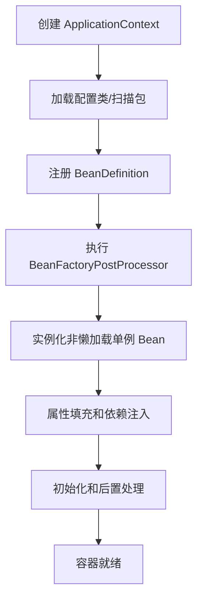

# IoC 容器：BeanFactory、ApplicationContext 与依赖注入

## 核心结论

IoC 容器的核心工作可以概括为五步：读取配置，解析成 `BeanDefinition`，创建 Bean，装配依赖，管理生命周期。`BeanFactory` 是最基础的容器接口，提供 Bean 获取和管理能力；`ApplicationContext` 在它之上增强了国际化、事件、资源加载、环境抽象、自动注册后置处理器等企业应用能力。

面试回答时，可以先说 IoC 是思想，再说 Spring 通过 `BeanDefinition` 和 `BeanFactory` 落地，最后展开 Bean 创建链路。

## BeanDefinition 是什么

`BeanDefinition` 可以理解为 Bean 的“配方”。它不是 Bean 实例，而是描述如何创建 Bean 的元数据，例如：

- Bean 的类型。
- 作用域：单例、原型等。
- 构造器参数。
- 属性依赖。
- 初始化方法和销毁方法。
- 是否懒加载。
- 是否候选自动装配。
- 工厂方法或工厂 Bean。

容器先收集这些定义，再根据定义创建对象。注解、XML、Java Config 最终都会转成 Bean 定义或注册逻辑。

## BeanFactory 与 ApplicationContext

`BeanFactory` 是基础容器，关注 Bean 的创建、获取、依赖装配和生命周期。`ApplicationContext` 是常用容器，它在 BeanFactory 基础上增加：

- 资源加载：统一读取 classpath、文件、URL 等资源。
- 事件发布：`ApplicationEventPublisher`。
- 国际化：`MessageSource`。
- 环境抽象：`Environment`、Profile、PropertySource。
- 自动注册常用后置处理器。
- 更完整的应用上下文生命周期。

一个常见区别是：`ApplicationContext` 默认会在启动时实例化非懒加载单例 Bean，而基础 `BeanFactory` 更偏按需创建。不过这不是唯一差异，企业应用里通常直接使用 `ApplicationContext`。

## 容器启动主流程

以注解应用为例，可以把容器启动理解为：



其中 `BeanFactoryPostProcessor` 作用在 Bean 定义阶段，可以修改 `BeanDefinition`；`BeanPostProcessor` 作用在 Bean 实例阶段，可以在初始化前后加工 Bean，也是 AOP 代理创建的重要入口。

## 依赖注入方式

### 构造器注入

构造器注入适合强依赖：

```java
@Service
class OrderService {
    private final OrderRepository orderRepository;

    OrderService(OrderRepository orderRepository) {
        this.orderRepository = orderRepository;
    }
}
```

优点是依赖明确、对象创建后不可变、测试方便。缺点是依赖过多时构造器会膨胀，但这通常也说明类职责可能过重。

### Setter 注入

Setter 注入适合可选依赖，或者需要后置替换的场景：

```java
@Autowired
public void setNotifier(Notifier notifier) {
    this.notifier = notifier;
}
```

它能配合单例循环依赖解决机制，因为对象可以先实例化，再填充属性。

### 字段注入

字段注入写法短：

```java
@Autowired
private UserService userService;
```

但问题是依赖隐藏，单元测试需要反射或容器，无法天然表达依赖是否必需。除非是测试代码或非常简单的样例，业务代码更推荐构造器注入。

## 自动装配规则

Spring 常见装配来源：

- `@Component`、`@Service`、`@Repository`、`@Controller` 扫描注册。
- `@Bean` 方法显式注册。
- `@Import` 导入配置类或注册器。
- 自动配置类根据条件注册。
- XML 或编程方式注册。

装配时常见匹配规则：

- 默认按类型查找。
- 如果同类型有多个 Bean，可以用 `@Primary`、`@Qualifier`、Bean 名称解决歧义。
- 集合、Map、数组可以注入多个候选 Bean。
- `@Lazy` 可以延迟依赖解析，也常用于缓解循环依赖，但不应成为架构设计的常规手段。

## Bean 名称与类型

Bean 在容器里通常有名称和类型。通过类型获取时，如果候选唯一，直接返回；如果候选不唯一，需要进一步按名称、`@Primary` 或 `@Qualifier` 判断。通过名称获取时，需要名称能定位到唯一 Bean。

常见面试点：接口有多个实现时，自动注入会报错，解决方式包括：

- 指定 `@Qualifier("beanName")`。
- 给默认实现加 `@Primary`。
- 注入 `Map<String, InterfaceType>` 后由业务策略选择。
- 用条件装配在不同环境只注册一个实现。

## FactoryBean 与普通 Bean

`FactoryBean<T>` 是一种特殊 Bean，它本身是工厂。容器中注册的是这个工厂，但普通 `getBean("name")` 返回的是工厂生产出来的对象；如果要获取工厂本身，需要使用特殊前缀。

常见使用场景：

- 框架需要用复杂逻辑创建对象。
- Mapper、代理对象、客户端对象等不是简单构造器能表达。

很多集成框架都会利用这个机制，把第三方对象包装成 Spring Bean。

## 常见追问

### IoC 容器是不是只保存单例 Map？

不是。单例池只是容器运行时的一部分。完整容器还包括 Bean 定义注册表、类型转换器、属性解析、依赖解析器、后置处理器、事件机制、资源加载、生命周期管理等。

### 为什么推荐面向接口注入？

面向接口注入能让业务依赖稳定抽象，而不是依赖具体实现。这样测试时可以替换实现，生产环境可以用条件装配切换实现，也更适合配合 AOP 代理和策略模式。

### `@Resource` 和 `@Autowired` 有什么区别？

常见理解：`@Autowired` 是 Spring 提供，默认按类型装配，可以配合 `@Qualifier`；`@Resource` 是 Jakarta/Java 规范注解，通常先按名称再按类型。实际行为还受 Spring 版本和处理器影响，答题时强调默认语义即可。

