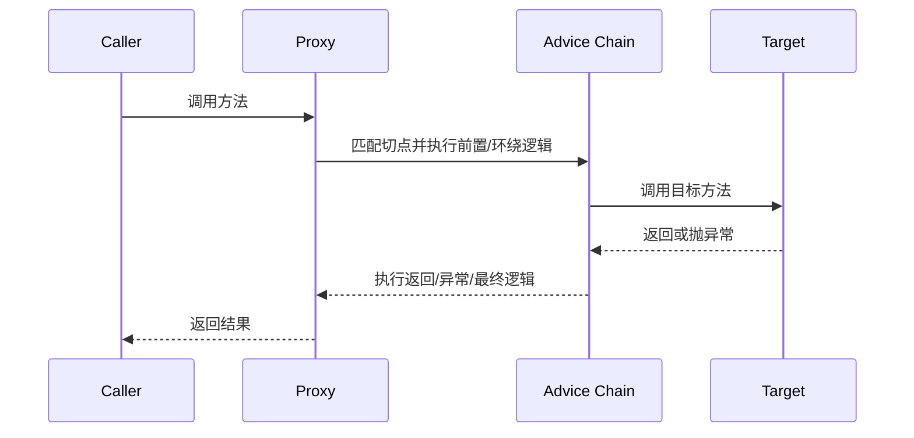

# AOP 与动态代理：切点、通知、JDK 代理、CGLIB 与失效边界

## 核心结论

Spring AOP 的本质是代理。调用方拿到的不是目标对象本身，而是代理对象；代理对象在调用目标方法前后执行增强逻辑。事务、缓存、权限、日志、指标、审计等能力都可以基于这套机制实现。

所以回答 AOP 时一定要落到两个点：第一，增强逻辑是怎么定位到目标方法的；第二，方法调用是否真的经过了代理对象。

## AOP 术语

- Join Point：连接点，程序执行过程中的某个点。在 Spring AOP 中通常指方法调用。
- Pointcut：切点，用表达式筛选哪些连接点需要增强。
- Advice：通知，也就是增强逻辑，包括前置、后置、返回、异常、环绕。
- Aspect：切面，切点和通知的组合。
- Target Object：目标对象，被代理的业务对象。
- Proxy：代理对象，调用方实际拿到的对象。
- Weaving：织入，把增强逻辑应用到目标对象的过程。Spring AOP 多数是在运行期通过代理织入。

## 通知类型

常见通知：

- `@Before`：目标方法执行前执行。
- `@AfterReturning`：目标方法正常返回后执行。
- `@AfterThrowing`：目标方法抛异常后执行。
- `@After`：目标方法结束后执行，不关心成功或异常。
- `@Around`：环绕通知，可以控制是否调用目标方法，也可以修改入参、返回值和异常处理。

环绕通知能力最强，也最容易写错。必须显式调用 `ProceedingJoinPoint.proceed()`，否则目标方法不会执行。

## JDK 动态代理与 CGLIB

### JDK 动态代理

JDK 动态代理基于接口生成代理类，代理对象实现目标接口，调用被转发到 `InvocationHandler`。

适合场景：

- 目标类有接口。
- 调用方依赖接口。
- 不需要代理类本身的方法。

特点：

- 标准 JDK 能力，不需要额外字节码库。
- 只能基于接口代理。
- 最终代理对象类型不是目标实现类，而是接口的代理实现。

### CGLIB 代理

CGLIB 基于继承生成目标类的子类，在子类中重写方法插入增强逻辑。

适合场景：

- 目标类没有接口。
- 希望基于类代理。

限制：

- `final` 类不能被继承，无法代理。
- `final` 方法不能被重写，无法增强。
- `private` 方法不会被子类重写，无法增强。

Spring 默认代理策略和具体版本、配置有关。传统 Spring AOP 通常是有接口时优先 JDK 动态代理，没有接口时使用 CGLIB；在 Spring Boot 项目中，是否强制使用类代理会受 `spring.aop.proxy-target-class` 等配置影响。面试里答“有接口 JDK、无接口 CGLIB”是基础答案，再补充“可通过配置强制 CGLIB”更稳。

## AOP 调用链



事务注解、缓存注解、方法级权限注解，底层都可以放进这个模型里理解。

## 切点表达式

常见切点写法：

```java
@Pointcut("execution(* com.example.order..*(..))")
public void orderMethods() {}

@Around("orderMethods()")
public Object around(ProceedingJoinPoint pjp) throws Throwable {
    long start = System.nanoTime();
    try {
        return pjp.proceed();
    } finally {
        long cost = System.nanoTime() - start;
        // 记录耗时
    }
}
```

`execution` 常用于按包、类、方法匹配；也可以按注解匹配，例如只增强标记了某个注解的方法。

## 常见失效边界

### 自调用失效

同一个类内部方法互相调用，默认不会经过代理：

```java
@Service
class OrderService {
    public void create() {
        this.save(); // 直接调用目标对象方法，不经过代理
    }

    @Transactional
    public void save() {
        // 事务可能不生效
    }
}
```

原因是 `this` 指向目标对象本身，不是代理对象。解决思路：

- 把被增强的方法拆到另一个 Bean。
- 从容器获取代理对象调用。
- 使用 AspectJ 编译期或加载期织入。
- 重新设计事务边界，避免内部方法依赖代理。

### 非 Spring Bean 调用失效

对象如果不是 Spring 管理的 Bean，容器没有机会创建代理，AOP 自然不会生效。常见于自己 `new` 对象、工具类静态方法、第三方回调对象等。

### 方法不可代理

基于代理的 AOP 需要方法能被代理拦截。以下情况常有问题：

- `private` 方法。
- `final` 方法。
- 静态方法。
- CGLIB 代理下目标类或方法不可继承/重写。
- JDK 代理下调用方绕过接口直接依赖实现类。

### 切点没匹配

表达式写错、包路径不覆盖、注解放在接口或实现类的位置与代理策略不匹配，都可能导致通知不执行。

## AOP 与设计模式

Spring AOP 里最明显的是代理模式。除此之外：

- 责任链模式：多个 Advisor/Interceptor 形成调用链。
- 模板方法：框架定义调用流程，扩展点插入用户逻辑。
- 装饰器思想：在不改目标业务方法的情况下增强行为。

## 常见追问

### Spring AOP 和 AspectJ 有什么区别？

Spring AOP 主要基于运行期代理，能力聚焦在 Spring Bean 的方法级增强，简单、够用、与容器集成好。AspectJ 是更完整的 AOP 方案，可以在编译期或加载期织入，支持字段访问、构造器、非 Spring 对象等更广泛的连接点，但复杂度更高。

### 为什么事务本质也是 AOP？

声明式事务需要在目标方法前开启事务，在方法成功后提交，在异常时回滚。这正是典型的环绕增强。`@Transactional` 被事务拦截器解析后，会通过代理把事务边界包裹在业务方法外层。

### AOP 能不能拦截 Controller？

可以，只要 Controller 是 Spring Bean 且调用经过代理。但 Web 层更常用 Interceptor、Filter、`ControllerAdvice` 等扩展点。AOP 适合方法级业务切面，不适合处理所有底层 HTTP 细节。

