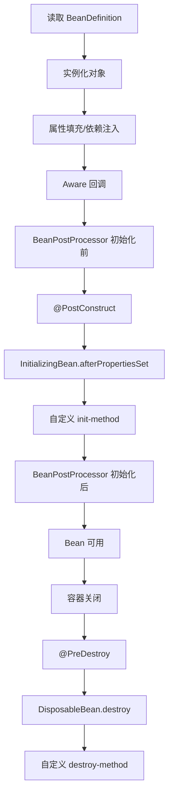

# Bean 生命周期：作用域、后置处理器与扩展点

## 核心结论

Spring 创建 Bean 不是简单 `new` 一个对象，而是一条带扩展点的流水线：实例化、属性填充、Aware 回调、初始化前后处理器、初始化方法、可用、销毁。理解生命周期的价值在于：知道框架在哪些阶段可以修改 Bean 定义、替换 Bean 实例、生成代理、注入资源、执行初始化和释放资源。

## 生命周期主线

单例 Bean 的典型生命周期：



真实源码链路会更复杂，但面试时抓住这条主线即可。

## 实例化与属性填充

实例化是创建对象本身，可能通过：

- 构造器。
- 静态工厂方法。
- 实例工厂方法。
- `Supplier`。
- 特殊的 `FactoryBean`。

属性填充发生在对象已经创建之后，Spring 根据依赖描述注入其他 Bean、普通属性、集合、配置值等。Setter 注入和字段注入都依赖这一阶段。

循环依赖能被解决，正是因为单例对象可以先实例化，再属性填充。构造器循环依赖则不行，因为对象还没创建出来。

## Aware 回调

Aware 接口用于让 Bean 感知容器中的某些基础设施，例如：

- `BeanNameAware`：拿到当前 Bean 名称。
- `BeanFactoryAware`：拿到 BeanFactory。
- `ApplicationContextAware`：拿到 ApplicationContext。
- `EnvironmentAware`：拿到环境对象。
- `ResourceLoaderAware`：拿到资源加载器。

这些接口不建议在业务代码里滥用，因为它会让业务对象直接依赖 Spring 容器。它更适合框架型组件、基础设施组件。

## BeanPostProcessor

`BeanPostProcessor` 作用在 Bean 实例阶段，提供初始化前和初始化后的扩展点：

```java
Object postProcessBeforeInitialization(Object bean, String beanName)
Object postProcessAfterInitialization(Object bean, String beanName)
```

它非常重要，很多框架能力都依赖它：

- 处理 `@Autowired`、`@Value` 等注解。
- 处理 `@PostConstruct`。
- 创建 AOP 代理。
- 给 Bean 增强、包装或替换。

面试容易追问：AOP 代理通常在哪个阶段创建？简化回答是：多数情况下在初始化后的 BeanPostProcessor 中创建代理并返回代理对象；循环依赖场景下，为了保证早期引用一致，可能会提前暴露代理。

## BeanFactoryPostProcessor

`BeanFactoryPostProcessor` 作用在 BeanDefinition 阶段，也就是 Bean 实例创建之前。它可以修改 Bean 定义，而不是直接修改 Bean 实例。

常见子接口：

- `BeanDefinitionRegistryPostProcessor`：可以注册新的 BeanDefinition。
- `ConfigurationClassPostProcessor`：处理配置类、扫描、`@Bean`、`@Import` 等。

如果说 `BeanPostProcessor` 是加工对象，那么 `BeanFactoryPostProcessor` 是修改配方。

## 常见作用域

- singleton：默认作用域，一个容器中一个 Bean 实例。
- prototype：每次获取都创建新实例，Spring 只负责创建和装配，不完整管理销毁。
- request：每个 HTTP 请求一个实例。
- session：每个 HTTP Session 一个实例。
- application：每个 ServletContext 一个实例。
- websocket：每个 WebSocket 会话一个实例。

注意：单例不是 JVM 全局单例，而是 Spring 容器级别的单例。多个容器可以有多个同名或同类型 Bean。

## 单例 Bean 的线程安全

Spring 默认 Bean 是单例，但 Spring 不保证业务 Bean 的线程安全。线程安全取决于 Bean 内部是否有可变共享状态。

安全写法：

- 无状态 Service。
- 局部变量保存请求上下文。
- 可变状态放到数据库、缓存或请求作用域对象中。
- 必要时使用线程安全结构或锁。

危险写法：

```java
@Service
class UserService {
    private String currentUserId; // 多请求共享，容易串数据
}
```

## 初始化与销毁

初始化常见方式：

- `@PostConstruct`
- `InitializingBean.afterPropertiesSet`
- `@Bean(initMethod = "...")`

销毁常见方式：

- `@PreDestroy`
- `DisposableBean.destroy`
- `@Bean(destroyMethod = "...")`

优先建议使用注解或配置方法，减少业务类对 Spring 接口的侵入。

## 重要扩展点清单

- `BeanFactoryPostProcessor`：修改 Bean 定义。
- `BeanDefinitionRegistryPostProcessor`：注册 Bean 定义。
- `BeanPostProcessor`：加工 Bean 实例。
- `FactoryBean`：自定义复杂对象创建。
- `ImportSelector`：根据条件导入配置类。
- `ImportBeanDefinitionRegistrar`：编程式注册 BeanDefinition。
- `ApplicationListener`：监听容器事件。
- `ApplicationRunner` / `CommandLineRunner`：容器启动完成后执行逻辑。
- `InitializingBean` / `DisposableBean`：初始化和销毁回调。

## 常见追问

### `@PostConstruct` 和 `afterPropertiesSet` 谁先执行？

通常 `@PostConstruct` 先执行，然后执行 `InitializingBean.afterPropertiesSet`，再执行自定义 init 方法。它们都发生在 BeanPostProcessor 初始化前后处理流程中间。

### prototype Bean 会执行销毁方法吗？

Spring 会创建和初始化 prototype Bean，但不会像单例那样完整托管其销毁生命周期。获取方需要自己负责清理资源。

### BeanPostProcessor 能不能影响所有 Bean？

可以影响容器中后续创建的 Bean。但它本身也作为 Bean 存在，创建时机比较早；如果注册太晚，已经创建的 Bean 不会再被它处理。

