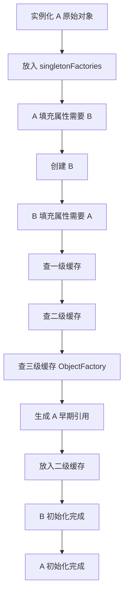

# 循环依赖与三级缓存：早期引用、ObjectFactory 与 AOP 代理

## 核心结论

Spring 能解决的是“单例 Bean 的 Setter 或字段注入循环依赖”，不能解决构造器循环依赖，也不能自然解决 prototype 循环依赖。三级缓存的核心价值不是单纯缓存三份对象，而是通过 `ObjectFactory` 延迟暴露早期引用，并在 AOP 场景下确保最终注入的是同一个代理对象。

从 Spring Boot 2.6 开始，默认通常不鼓励循环依赖，相关配置默认倾向于禁止。即使可以通过配置放开，也不建议把循环依赖当成正常设计。

## 什么是循环依赖

典型例子：

```java
@Service
class A {
    @Autowired
    private B b;
}

@Service
class B {
    @Autowired
    private A a;
}
```

创建 A 时需要 B，创建 B 时又需要 A。如果没有特殊处理，就会陷入无限递归。

## 哪些循环依赖能解决

能解决：

- 单例 Bean。
- Setter 注入或字段注入。
- 没有被配置禁止循环依赖。

不能解决：

- 构造器注入循环依赖。
- prototype Bean 循环依赖。
- 被框架配置禁止循环依赖的场景。
- 复杂代理或后置处理导致早期引用不一致的场景。

构造器循环依赖无法解决的原因很直接：A 构造器需要 B，B 构造器需要 A，二者都没法先实例化出一个半成品。

## 三级缓存分别是什么

Spring 单例创建中常见的三级缓存：

- 一级缓存 `singletonObjects`：保存完全初始化完成的单例 Bean。
- 二级缓存 `earlySingletonObjects`：保存已经提前暴露的早期 Bean 引用。
- 三级缓存 `singletonFactories`：保存 `ObjectFactory`，用于按需生成早期引用。

简化结构：

```text
singletonObjects        完整 Bean
earlySingletonObjects   已提前暴露的早期引用
singletonFactories      能生成早期引用的工厂
```

## 创建过程示例

以 A 依赖 B、B 依赖 A 为例：

1. 创建 A，先实例化出原始对象 A。
2. A 还没填充属性，但 Spring 会把能生成 A 早期引用的工厂放入三级缓存。
3. A 填充属性时发现需要 B，于是创建 B。
4. B 实例化后填充属性，发现需要 A。
5. Spring 先查一级缓存，没有完整 A。
6. 再查二级缓存，没有早期 A。
7. 再查三级缓存，找到 A 的 `ObjectFactory`，调用它得到 A 的早期引用。
8. 这个早期引用放入二级缓存，并从三级缓存移除。
9. B 注入 A 后完成初始化，放入一级缓存。
10. A 注入 B 后完成初始化，放入一级缓存。

最终 A 和 B 都能创建完成。

## 为什么需要三级缓存

如果没有 AOP，二级缓存似乎也能解决：实例化后直接把原始对象放进二级缓存，让别人先用。

但有 AOP 时，问题变复杂了：最终 Bean 可能不是原始对象，而是代理对象。如果 B 注入的是 A 的原始对象，而容器最终暴露的是 A 的代理对象，就会出现同一个 Bean 有两个不同引用，事务、缓存等代理增强可能失效。

三级缓存里的 `ObjectFactory` 可以推迟决定“早期引用到底是什么”。当真的有人需要早期引用时，Spring 可以通过后置处理器提前生成代理对象，并保证后续最终暴露的也是同一个代理。

所以三级缓存的关键是：

- 原始对象先创建出来。
- 早期引用不是立刻固定死。
- 需要时通过工厂获取，允许 AOP 介入。
- 早期暴露的引用和最终引用保持一致。

## 三级缓存流程



## 为什么不推荐循环依赖

循环依赖能被解决，不代表设计合理。它通常暗示：

- 两个类职责边界不清。
- 业务流程互相调用，难以测试。
- 初始化顺序变得复杂。
- AOP、事务、异步、事件等机制叠加时更容易出现意外。

常见重构方式：

- 抽出第三个协调服务。
- 使用事件解耦。
- 拆分接口，单向依赖抽象。
- 把共享逻辑下沉到独立组件。
- 重新定义聚合边界和事务边界。

## 常见追问

### 为什么构造器注入不能解决循环依赖？

构造器注入要求依赖在对象创建时就准备好。A 构造器需要 B，B 构造器需要 A，两个对象都无法先完成实例化，自然没有可提前暴露的半成品对象。

### 二级缓存和三级缓存的区别是什么？

二级缓存保存已经生成出来的早期引用；三级缓存保存能生成早期引用的工厂。三级缓存让 Spring 有机会在真正需要早期引用时决定返回原始对象还是代理对象。

### 开启循环依赖是不是就没问题？

不是。开启只是让容器尝试解决某些循环依赖。真正好的设计应该减少双向依赖，否则后续加事务、异步、缓存、事件时更难推理。

