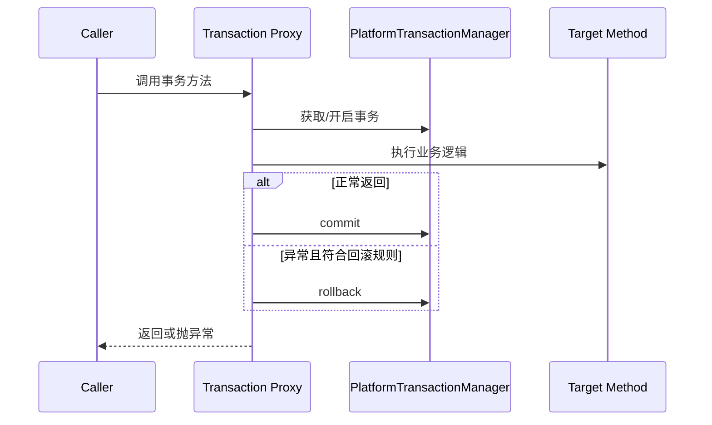

# Spring 事务：传播机制、隔离级别、回滚规则与失效场景

## 核心结论

Spring 声明式事务本质是 AOP 代理。`@Transactional` 被事务拦截器识别后，在目标方法调用前开启或加入事务，方法正常结束时提交，出现满足规则的异常时回滚。事务是否生效，首先取决于调用是否经过代理；事务边界是否正确，还取决于传播行为、隔离级别、异常类型、事务管理器和数据库能力。

## 事务工作流程



核心组件：

- `PlatformTransactionManager`：事务管理器抽象。
- `TransactionDefinition`：事务定义，包括传播行为、隔离级别、超时、只读等。
- `TransactionStatus`：事务运行状态。
- `TransactionInterceptor`：事务拦截器，负责围绕方法调用处理事务。

## 传播行为

传播行为描述“当前方法被调用时，如果已经存在事务，该如何处理”。

### REQUIRED

默认值。当前有事务就加入，没有事务就新建。大多数业务方法使用它。

### REQUIRES_NEW

总是开启新事务。如果外层有事务，会挂起外层事务。适合审计日志、消息记录等希望独立提交的场景。

注意：内层 `REQUIRES_NEW` 提交后，外层事务回滚不会影响它。

### NESTED

如果当前存在事务，则在嵌套事务中执行，通常依赖数据库保存点；如果没有事务，则类似 REQUIRED。内层回滚可以回到保存点，不一定导致外层整个事务回滚。

它是否可用取决于事务管理器和数据库能力。

### SUPPORTS

有事务就加入，没有事务就非事务执行。适合可事务可非事务的读取场景。

### NOT_SUPPORTED

以非事务方式执行，如果当前有事务则挂起。

### MANDATORY

必须在已有事务中执行，没有事务就报错。

### NEVER

必须非事务执行，如果当前有事务就报错。

## 隔离级别

隔离级别解决并发事务之间的可见性问题。

- DEFAULT：使用数据库默认隔离级别。
- READ_UNCOMMITTED：可能读到未提交数据，脏读风险高。
- READ_COMMITTED：只能读到已提交数据，避免脏读，但可能不可重复读。
- REPEATABLE_READ：同一事务多次读取同一数据结果一致，常见数据库默认级别之一。
- SERIALIZABLE：最高隔离级别，串行化执行，并发性能最差。

实际效果取决于数据库实现。例如 MVCC 数据库里，可重复读和幻读表现需要结合具体数据库讨论。

## 回滚规则

Spring 默认对 `RuntimeException` 和 `Error` 回滚，对受检异常不回滚。要让受检异常回滚，需要指定：

```java
@Transactional(rollbackFor = Exception.class)
public void importData() throws Exception {
    // ...
}
```

常见误区：

- 业务异常继承 `Exception`，但没有配置 `rollbackFor`。
- 异常被 catch 后没有继续抛出。
- 手动设置 rollback-only 但后续逻辑没有意识到最终会回滚。

## 事务失效场景

### 自调用

同一个类内部 `this.method()` 调用事务方法，不经过代理，事务不生效。

解决方式：

- 拆分到另一个 Spring Bean。
- 从容器获取代理对象调用。
- 重新设计事务入口。

### 方法不是 public

基于代理的声明式事务通常要求事务方法是可被代理调用的公开方法。非 public 方法可能不会被事务拦截。

### 类或方法不可代理

`final` 类、`final` 方法、`private` 方法、静态方法等无法被常规代理增强。

### 对象不是 Spring Bean

自己 `new` 出来的对象没有被容器创建代理，注解不会生效。

### 异常被吞掉

```java
@Transactional
public void save() {
    try {
        mapper.insert(...);
    } catch (Exception e) {
        log.error("failed", e);
    }
}
```

方法正常返回，事务拦截器认为可以提交。

### 异常类型不匹配

抛出受检异常，但没有设置 `rollbackFor`，默认不会回滚。

### 多线程或异步

事务上下文通常绑定在线程上。方法内启动新线程或异步任务，新线程不会自动继承原事务。

### 多数据源事务管理器不匹配

多个数据源时，`@Transactional` 使用的事务管理器可能不是当前 DAO 对应的数据源，导致事务边界不覆盖实际操作。

### 数据库或存储引擎不支持事务

例如某些表引擎、外部系统、消息发送、文件写入不是数据库事务的一部分，不能指望数据库事务自动回滚它们。

## 编程式事务

声明式事务适合大多数业务。复杂场景可以用 `TransactionTemplate`：

```java
transactionTemplate.execute(status -> {
    orderMapper.insert(order);
    stockMapper.decrease(stockId);
    return null;
});
```

优点是边界明确、可在方法内部精细控制。缺点是业务代码会直接依赖事务 API。

## 事务和消息一致性

本地事务不能天然保证数据库和消息队列一致。常见方案：

- 本地消息表：业务数据和消息记录放在同一个本地事务里，再异步投递。
- 事务消息：依赖消息中间件的半消息和事务回查。
- Outbox 模式：业务库里保存待发布事件，由后台任务可靠投递。
- 最终一致性：通过幂等、重试、补偿保证最终收敛。

Spring 事务只能覆盖同一个事务管理器管理的资源。跨数据库、跨消息、跨服务，要引入分布式事务或最终一致性设计。

## 常见追问

### `REQUIRES_NEW` 和 `NESTED` 的区别？

`REQUIRES_NEW` 是挂起外层事务，开启一个独立新事务，内外事务提交回滚互不直接绑定。`NESTED` 是在外层事务中创建保存点，内层回滚通常回到保存点，外层仍可继续。`NESTED` 依赖保存点能力。

### 只读事务有什么用？

只读事务是一种优化和语义声明。它可能让数据库或 ORM 做优化，也能帮助团队表达“这个方法不应该写数据”。但它不是强安全边界，具体是否禁止写入取决于数据库和驱动实现。

### 事务注解加在接口上好还是实现类上好？

更推荐加在实现类或具体 public 方法上，语义更明确。接口注解在某些代理策略和版本下也可能生效，但可读性和一致性不如实现类清晰。

