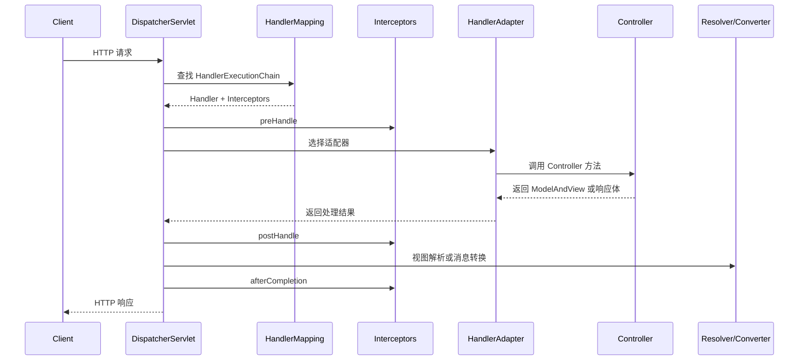

# Spring MVC：DispatcherServlet、执行链、视图解析与 REST

## 核心结论

Spring MVC 的核心是 `DispatcherServlet`。它作为前端控制器接收所有匹配请求，再通过 HandlerMapping 找处理器，通过 HandlerAdapter 执行处理器，通过 HandlerExceptionResolver 处理异常，通过 ViewResolver 或 HttpMessageConverter 生成响应。

面试回答时不要只背“请求到 Controller”。更完整的说法是：请求进入 `DispatcherServlet` 后，会先找到 HandlerExecutionChain，其中包含目标 Handler 和拦截器链；然后由合适的 HandlerAdapter 调用目标方法；最后根据返回值类型走视图渲染或消息转换。

## Spring MVC 请求流程



## 关键组件

### DispatcherServlet

前端控制器，统一入口。它不直接写业务逻辑，而是协调各类策略组件完成请求处理。

### HandlerMapping

根据请求路径、HTTP 方法、请求参数、请求头等条件找到对应 Handler。常见 Handler 是 Controller 方法。

返回的不是单个 Handler，而是 `HandlerExecutionChain`，里面包含 Handler 和匹配到的拦截器。

### HandlerAdapter

适配不同类型的 Handler。Controller 方法、传统 Controller 接口、HttpRequestHandler 等都可能有不同调用方式，HandlerAdapter 负责统一调用。

在注解驱动 MVC 中，常见的是处理 `@RequestMapping` 方法的适配器。

### HandlerExceptionResolver

处理 Controller 执行过程中抛出的异常。常见来源：

- `@ExceptionHandler`
- `@ControllerAdvice`
- 默认异常解析器
- 自定义异常解析器

### ViewResolver

当返回值需要渲染页面时，ViewResolver 把逻辑视图名解析成具体视图，例如 JSP、Thymeleaf、FreeMarker 等。

### HttpMessageConverter

当使用 `@ResponseBody` 或 `@RestController` 返回响应体时，Spring MVC 通常不走传统页面视图，而是通过消息转换器把 Java 对象写成 JSON、XML、文本或二进制。

## MVC 与三层架构

MVC 关注 Web 请求如何组织：

- Model：数据模型或页面数据。
- View：视图，负责展示。
- Controller：接收请求、调用业务、选择响应。

企业后端分层通常是：

- Controller：参数校验、协议转换、调用 Service。
- Service：业务逻辑和事务边界。
- DAO/Mapper/Repository：数据访问。

注意 MVC 的 Model 不等于数据库 Entity。接口场景下更常用 DTO、VO、Command、Query 等对象隔离外部协议和内部模型。

## `@Controller` 与 `@RestController`

`@Controller` 通常用于页面应用，方法返回字符串时可能被当作视图名。

`@RestController` 等价于 `@Controller` 加 `@ResponseBody`，方法返回值默认写入响应体，常用于 REST API。

```java
@RestController
@RequestMapping("/orders")
class OrderController {
    @GetMapping("/{id}")
    public OrderVO detail(@PathVariable Long id) {
        return orderService.detail(id);
    }
}
```

## 参数绑定

常见参数注解：

- `@PathVariable`：绑定路径变量。
- `@RequestParam`：绑定查询参数或表单参数。
- `@RequestBody`：读取请求体并反序列化。
- `@RequestHeader`：读取请求头。
- `@CookieValue`：读取 Cookie。
- `@ModelAttribute`：绑定表单对象或模型属性。

常见问题：

- GET 请求通常不建议使用请求体。
- JSON 请求体需要正确的 `Content-Type`。
- `@RequestBody` 默认读取请求体一次，重复读取需要包装请求。
- 参数校验需要配合 `@Valid` 或 `@Validated`。

## 返回值处理

常见返回值：

- `String`：可能是视图名，也可能是响应体，取决于注解。
- `ModelAndView`：模型和视图。
- 普通对象：通过消息转换器序列化。
- `ResponseEntity<T>`：同时控制状态码、响应头和响应体。
- `void`：由方法自行写响应或框架根据约定处理。

REST API 更推荐统一响应结构和明确状态码，但不要把 HTTP 状态码全部压成 200 后只看业务码，否则会损失 HTTP 语义。

## 视图渲染与前后端分离

传统 MVC 页面渲染：

1. Controller 返回逻辑视图名和 Model。
2. ViewResolver 解析视图。
3. View 使用 Model 渲染页面。
4. 响应 HTML。

前后端分离：

1. Controller 返回对象。
2. HttpMessageConverter 序列化为 JSON。
3. 前端页面或 App 自己渲染。

两者核心差异是响应内容不同，但请求分发主流程仍然由 `DispatcherServlet` 协调。

## 常见追问

### HandlerMapping 和 HandlerAdapter 为什么都需要？

HandlerMapping 负责“找谁处理”，HandlerAdapter 负责“怎么调用”。查找和调用是两个职责。这样 Spring MVC 可以支持多种 Handler 类型，并通过不同适配器扩展调用方式。

### Interceptor 和 Filter 哪个先执行？

Filter 属于 Servlet 规范，包在 `DispatcherServlet` 外层，通常先执行。Interceptor 属于 Spring MVC，发生在 DispatcherServlet 找到 Handler 之后、Controller 调用前后。

### REST 接口为什么不需要 ViewResolver？

REST 接口通常返回响应体，使用 HttpMessageConverter 把对象转换为 JSON 等格式。只有返回页面视图时才需要 ViewResolver。

