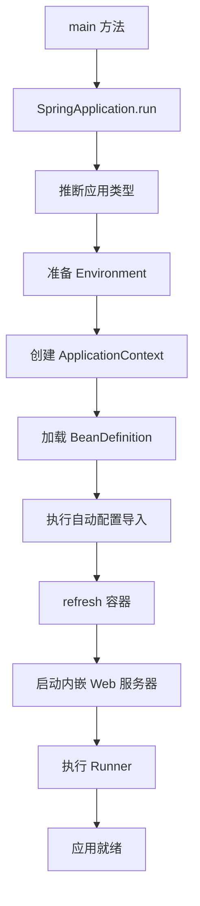

# Spring Boot：启动流程、自动配置、条件装配与 Starter

## 核心结论

Spring Boot 的核心是用自动配置和 Starter 降低 Spring 应用的装配成本。它没有替代 Spring，而是在 Spring 容器之上增加了启动引导、外部化配置、内嵌服务器、自动配置、Actuator、Starter 依赖管理等工程能力。

面试里说清楚三件事就很稳：`SpringApplication.run` 做了什么，`@SpringBootApplication` 包含什么，自动配置类是如何被导入和筛选的。

## `@SpringBootApplication`

它是组合注解，核心包含：

- `@SpringBootConfiguration`：本质是配置类。
- `@EnableAutoConfiguration`：开启自动配置。
- `@ComponentScan`：扫描启动类所在包及其子包下的组件。

启动类放在根包下，是为了让默认扫描路径覆盖业务包。如果启动类位置太深，可能导致 Controller、Service、Mapper 等没有被扫描到。

## 启动主流程

简化版启动链路：



真实流程里还包括监听器、初始化器、Banner、事件发布、异常报告、配置绑定等，但面试时这条主线足够。

## 自动配置怎么生效

自动配置的大致过程：

1. `@EnableAutoConfiguration` 导入自动配置选择器。
2. 选择器从约定位置读取候选自动配置类。
3. 根据条件注解筛选是否生效。
4. 生效的自动配置类注册 Bean。

在新版本中，自动配置类主要通过 `META-INF/spring/org.springframework.boot.autoconfigure.AutoConfiguration.imports` 声明。Spring Boot 2.7 开始引入该方式，Spring Boot 3 中自动配置导入不再依赖旧的 `spring.factories` 作为主路径。旧版本项目和第三方库仍可能看到历史写法，回答时要注意版本差异。

## 条件装配

自动配置不是无脑注册 Bean，它依赖大量条件注解：

- `@ConditionalOnClass`：类路径存在某个类时生效。
- `@ConditionalOnMissingClass`：类路径不存在某个类时生效。
- `@ConditionalOnBean`：容器中存在某个 Bean 时生效。
- `@ConditionalOnMissingBean`：容器中不存在某个 Bean 时生效。
- `@ConditionalOnProperty`：配置属性满足条件时生效。
- `@ConditionalOnWebApplication`：Web 应用场景生效。
- `@ConditionalOnExpression`：表达式满足时生效。

最常见的是 `@ConditionalOnMissingBean`：框架提供默认 Bean，如果用户自己定义了同类型 Bean，就让用户配置优先。

## Starter 是什么

Starter 是一组依赖和自动配置的组合包。使用者引入一个 Starter，就能获得相关库、默认配置和自动装配能力。

例如 Web Starter 通常会带来：

- Spring MVC 相关依赖。
- 内嵌 Servlet 容器。
- JSON 转换。
- Web 自动配置。
- 默认错误处理。

Starter 的价值不是“多一个 jar”，而是把依赖组合和默认装配沉淀下来。

## 自定义 Starter 思路

一个简单 Starter 通常包括：

1. 定义配置属性类，例如 `@ConfigurationProperties`。
2. 定义自动配置类，根据条件注册核心 Bean。
3. 在约定位置声明自动配置类。
4. 提供 Starter 包，聚合依赖和自动配置模块。
5. 编写测试，验证有配置和无配置时的装配结果。

示例骨架：

```java
@AutoConfiguration
@EnableConfigurationProperties(MyClientProperties.class)
@ConditionalOnClass(MyClient.class)
public class MyClientAutoConfiguration {
    @Bean
    @ConditionalOnMissingBean
    MyClient myClient(MyClientProperties properties) {
        return new MyClient(properties.getEndpoint());
    }
}
```

## 外部化配置

Spring Boot 支持多来源配置：

- `application.yml`
- `application.properties`
- Profile 配置
- 环境变量
- 命令行参数
- 配置中心
- 自定义 PropertySource

常见绑定方式：

- `@Value`：适合少量简单值。
- `@ConfigurationProperties`：适合结构化配置，便于校验、补全和复用。

复杂组件更推荐 `@ConfigurationProperties`，因为它能表达一组配置对象，而不是散落的字符串占位符。

## Boot 与约定优于配置

Boot 的“约定优于配置”不是不允许配置，而是先提供合理默认值：

- 默认扫描启动类所在包。
- 默认内嵌 Web 容器。
- 默认日志配置。
- 默认 JSON 转换。
- 默认静态资源路径。
- 默认错误处理。

当默认值不满足需求时，再通过配置或自定义 Bean 覆盖。

## 常见追问

### 为什么引入 Starter 后功能就可用了？

因为 Starter 带来了依赖，而自动配置根据类路径、属性和容器状态判断条件是否满足；满足时注册默认 Bean。依赖让条件成立，自动配置让 Bean 进入容器。

### 自动配置和组件扫描有什么区别？

组件扫描扫描的是业务包下的组件，通常由 `@ComponentScan` 完成。自动配置导入的是框架或第三方提供的配置类，通常不在业务扫描路径下，而是通过自动配置导入机制加载。

### 如何排除某个自动配置？

可以使用 `@SpringBootApplication(exclude = XxxAutoConfiguration.class)`，也可以通过配置项排除。更好的方式是先理解为什么该自动配置生效，再决定排除还是通过自定义 Bean 覆盖。

