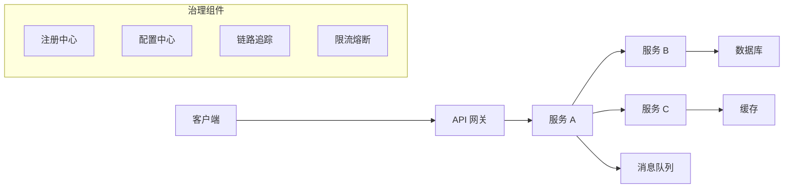

# Spring Cloud 与微服务：注册、配置、网关、熔断、链路追踪

## 核心结论

Spring Cloud 是一组微服务治理能力的集合，不是单个框架。它把分布式系统常见问题抽象成组件：服务注册发现、配置中心、网关、负载均衡、声明式调用、熔断限流、链路追踪、消息驱动、分布式事务等。Spring Cloud Alibaba 则把 Nacos、Sentinel、Seata、RocketMQ 等生态组件整合进 Spring Cloud 编程模型。

面试回答微服务时，要先讲问题，再讲组件。否则只背组件名，会显得像清单而不是体系。

## 微服务为什么需要治理组件

单体应用里，一个进程内的方法调用就能完成大部分协作。拆成微服务后，问题变成：

- 服务实例会动态上下线，调用方怎么找到目标服务？
- 配置需要多环境、多实例统一管理，怎么动态更新？
- 请求入口需要统一鉴权、路由、限流，谁来做？
- 服务之间调用失败、超时、慢响应，如何避免级联故障？
- 一次请求跨多个服务，如何定位瓶颈和错误？
- 跨服务数据一致性如何处理？
- 版本灰度、流量切分、服务降级如何落地？

这些就是注册中心、配置中心、网关、熔断限流、链路追踪、分布式事务等组件存在的原因。

## 常见组件职责

### 注册中心

注册中心维护服务名和实例地址的映射。服务启动时注册，停止或异常时下线，调用方通过服务名发现可用实例。

常见能力：

- 服务注册。
- 服务发现。
- 健康检查。
- 实例上下线通知。
- 元数据管理。

Nacos、Eureka、Consul、Zookeeper 都可以承担注册中心角色。

### 配置中心

配置中心集中管理配置，解决多环境、多实例配置分散的问题。

常见能力：

- 配置集中存储。
- 动态刷新。
- 环境隔离。
- 灰度配置。
- 配置变更审计。

Nacos Config、Spring Cloud Config 都是常见选择。

### 网关

网关是系统入口，负责把外部请求路由到内部服务。

常见能力：

- 路由转发。
- 统一鉴权。
- 限流。
- 跨域。
- 请求改写。
- 灰度路由。
- 统一日志和指标。

Spring Cloud Gateway 是当前常见的响应式网关实现。

### 负载均衡

服务发现返回多个实例时，客户端需要选择一个实例调用。常见策略：

- 轮询。
- 随机。
- 权重。
- 最少连接。
- 一致性哈希。
- 基于响应时间或健康状态的策略。

一致性哈希适合希望同类请求尽量落到同一实例的场景，例如本地缓存命中优化，但要注意节点变更、热点 key 和负载不均。

### 声明式调用

OpenFeign 让 HTTP 调用像接口调用一样写：

```java
@FeignClient("user-service")
interface UserClient {
    @GetMapping("/users/{id}")
    UserDTO getById(@PathVariable Long id);
}
```

它通常配合服务发现、负载均衡、超时、重试、熔断降级使用。面试时要强调：Feign 只是调用声明和客户端封装，真正稳定性还依赖超时、重试、隔离、熔断等治理策略。

### 熔断、限流、降级

熔断：下游持续失败或慢响应时，短时间内不再调用下游，快速失败或走降级逻辑，防止线程和连接耗尽。

限流：限制入口或资源访问速率，保护系统容量。

降级：在异常、限流、熔断或非核心场景下返回兜底结果。

Sentinel 常见能力包括流量控制、熔断降级、系统自适应保护、热点参数限流等。

### 链路追踪

一次请求跨多个服务时，需要统一 TraceId，把调用链串起来。

常见链路信息：

- TraceId：一次完整请求。
- SpanId：一次服务内或远程调用片段。
- 父子 Span：调用关系。
- Tags：接口、状态码、异常、耗时等标签。

历史项目里常见 Sleuth + Zipkin；较新的 Spring 生态更多转向 Micrometer Tracing，并可以对接 Zipkin、OpenTelemetry 等后端。

### 分布式事务

分布式事务解决跨服务、跨数据库的一致性问题。常见路线：

- 强一致事务：例如 XA、二阶段提交，成本高，性能和可用性受影响。
- Seata AT/TCC/Saga 等模式：在不同一致性和侵入性之间取舍。
- 最终一致性：本地消息表、事务消息、Outbox、补偿任务、幂等重试。

微服务里更常见的是最终一致性设计，而不是无脑上强一致事务。

## Spring Cloud Alibaba 常见组件

- Nacos：服务注册发现和配置管理。
- Sentinel：流量控制、熔断降级、系统保护。
- Seata：分布式事务。
- RocketMQ：消息通信，常用于异步解耦和最终一致性。
- Dubbo：高性能 RPC 通信。
- SchedulerX：分布式任务调度。

选型时不要只看组件是否流行，要看团队运维能力、业务一致性要求、流量特征、故障隔离策略和云厂商环境。

## 微服务调用链示例



## 常见故障与治理

### 下游慢导致线程池耗尽

处理方式：

- 设置合理超时。
- 按下游隔离线程池或连接池。
- 熔断降级。
- 限制重试次数，避免重试风暴。

### 注册中心短暂异常

处理方式：

- 客户端本地缓存服务列表。
- 健康检查和心跳容错。
- 注册中心集群高可用。
- 调用侧降级。

### 配置误发布

处理方式：

- 配置灰度。
- 权限审批。
- 版本回滚。
- 关键配置校验。
- 配置变更告警。

### 链路追踪缺失

处理方式：

- 在网关或入口 Filter 初始化 TraceId。
- HTTP、RPC、消息都传递上下文。
- 异步线程池包装上下文。
- 日志输出 TraceId。

## 常见追问

### 服务注册发现和负载均衡的关系？

注册中心负责告诉调用方“有哪些实例”，负载均衡负责从这些实例中选一个。注册发现解决可达性，负载均衡解决分配策略。

### 熔断和降级有什么区别？

熔断是保护机制，当错误率或慢调用达到阈值时暂停调用下游。降级是兜底策略，告诉系统在不能正常调用时返回什么或做什么。熔断后通常会触发降级。

### 微服务一定比单体好吗？

不一定。微服务提升团队并行、独立部署和弹性扩展能力，但会引入网络、事务、运维、观测、治理复杂度。业务边界不清、团队规模不大、基础设施不足时，模块化单体可能更合适。

