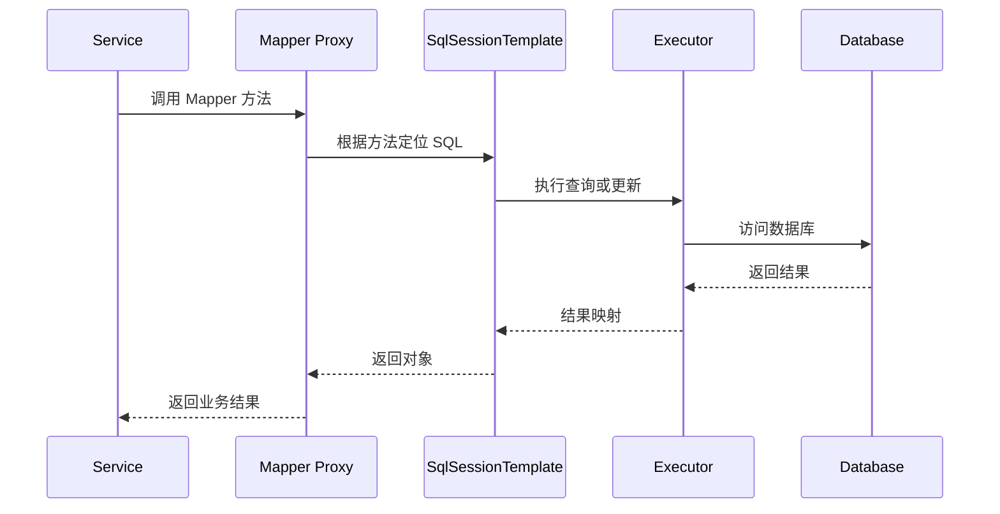

# Spring 与 MyBatis 集成：JDBC 模板、Mapper 代理与参数绑定

## 核心结论

Spring 的数据访问生态核心是统一资源管理、异常体系和事务抽象。MyBatis 集成到 Spring 后，Mapper 接口通常会被注册成 Spring Bean，调用 Mapper 方法时实际走的是代理对象，代理对象再通过 `SqlSessionTemplate` 执行 SQL，并参与 Spring 事务管理。

这篇只从 Spring 集成视角整理 MyBatis，不展开 MyBatis 独立专题。

## JDBC 到 Spring JDBC

原生 JDBC 常见步骤：

1. 获取连接。
2. 创建 Statement 或 PreparedStatement。
3. 设置参数。
4. 执行 SQL。
5. 遍历结果集。
6. 关闭结果集、语句和连接。
7. 处理异常。

大量样板代码容易出错。Spring JDBC 的 `JdbcTemplate` 把资源获取、释放、异常转换封装起来，用户只关注 SQL、参数和结果映射。

```java
List<User> users = jdbcTemplate.query(
    "select id, name from user where status = ?",
    (rs, rowNum) -> new User(rs.getLong("id"), rs.getString("name")),
    "ACTIVE"
);
```

它体现了模板方法思想：固定流程由框架掌控，可变部分由回调提供。

## MyBatis 与 Spring 如何整合

典型集成组件：

- `DataSource`：数据源。
- `SqlSessionFactory`：创建 SqlSession 的工厂。
- `SqlSessionTemplate`：线程安全的 SqlSession 代理，负责和 Spring 事务同步。
- Mapper 接口代理：把接口方法调用转换为 MyBatis 的 mapped statement 执行。
- `@MapperScan`：扫描 Mapper 接口并注册为 Bean。

简化链路：



## Mapper 为什么能注入

Mapper 接口本身没有实现类，但 MyBatis-Spring 会为接口创建代理对象，并把代理对象注册进 Spring 容器。Service 注入 Mapper 时，拿到的是代理。

这背后常见机制包括：

- 扫描 Mapper 接口。
- 为每个接口构造 BeanDefinition。
- 使用工厂或代理创建 Mapper Bean。
- 方法调用时由代理根据接口方法找到对应 SQL。

所以 Mapper 注入不是 Spring 自己凭空实现接口，而是 MyBatis-Spring 提供了代理工厂。

## `#{} `与 `${}` 的区别

`#{}` 使用预编译参数，占位符形式传参，能避免 SQL 注入，适合绝大多数值参数。

`${}` 是字符串替换，会直接拼接到 SQL 中，存在 SQL 注入风险。只应在白名单控制的场景使用，例如动态表名、字段名、排序字段。

示例：

```sql
where name = #{name}
order by ${safeColumn}
```

`safeColumn` 必须来自服务端白名单映射，而不是用户原始输入。

## 参数绑定

单个简单参数时，MyBatis 可以直接绑定。多个参数建议使用：

- `@Param` 明确命名。
- DTO 或 Query 对象承载参数。
- Map，但可读性较弱。

推荐写法：

```java
List<Order> query(@Param("userId") Long userId,
                  @Param("status") Integer status);
```

XML 中：

```xml
where user_id = #{userId}
  and status = #{status}
```

## 事务与 MyBatis

MyBatis 参与 Spring 事务的关键是它使用 Spring 管理的数据源连接。事务方法里多次 Mapper 调用会绑定到同一个事务上下文。

常见问题：

- Service 没有走 Spring 事务代理。
- Mapper 使用的数据源和事务管理器不一致。
- 手动创建 SqlSession 绕过 Spring 管理。
- 异步线程中执行 Mapper，事务上下文没有传过去。

事务边界建议放在 Service 层，而不是 DAO/Mapper 层。因为一个业务用例往往需要多个 Mapper 操作共同提交或回滚。

## MyBatis 一级缓存和 Spring 集成

MyBatis 一级缓存是 SqlSession 级别。集成 Spring 后，SqlSession 的生命周期和事务绑定有关。不要把一级缓存当成跨请求缓存，也不要依赖它解决业务缓存问题。

业务缓存应明确使用 Redis、本地缓存或 Spring Cache，并设计失效策略。

## MyBatis-Plus 简述

MyBatis-Plus 在 MyBatis 之上提供通用 CRUD、条件构造器、分页、代码生成等能力，能减少简单表操作代码。它不替代建模和 SQL 设计，复杂查询、性能优化、事务边界仍然需要自己把控。

## 常见追问

### Mapper 接口没有实现类，为什么能运行？

因为运行期创建了代理对象。代理根据接口方法定位 mapped statement，最终调用 MyBatis 执行器执行 SQL 并映射结果。

### Spring 事务为什么能管住 MyBatis？

因为 MyBatis-Spring 使用 Spring 管理的数据源和事务同步机制。事务开启后，当前线程绑定数据库连接，Mapper 执行时复用该连接，方法结束由事务管理器统一提交或回滚。

### `JdbcTemplate` 和 MyBatis 怎么选？

`JdbcTemplate` 更轻量，适合简单 SQL 和框架基础设施；MyBatis 更适合 SQL 可控、映射复杂、需要 XML 或注解组织 SQL 的业务系统。两者都可以参与 Spring 事务。

