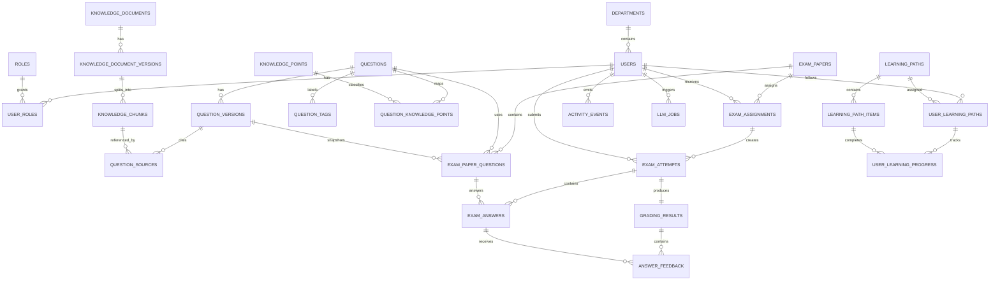

# ER 关系与核心约束

本文档在数据库草案的基础上，进一步明确主要实体关系、跨表约束和当前版本的关键技术假设。

## 1. 当前技术假设

第一版数据库实现基于以下前提：

- 数据库使用 `PostgreSQL`
- 向量检索使用 `Qdrant`
- 当前向量维度固定为 `1024`
- 如果后续切换 embedding 模型且维度变化，必须通过配置和 Qdrant collection 显式调整

这里不做维度兼容型 fallback。模型变更导致的维度不匹配应直接失败。

## 2. 主体关系图

## 3. 关键一致性约束

### 3.1 题目版本约束

- `questions` 表示题目聚合根
- `question_versions` 表示题目的不可变版本快照
- 同一个 `question_id` 下的 `version_no` 必须唯一
- 已发布试卷引用的题目版本不可被覆盖，只能新增更高版本

### 3.2 试卷快照约束

- `exam_paper_questions` 同时保存 `question_id` 和 `question_version_id`
- 试卷发布后，历史考试必须继续引用当时的题目版本
- 这类历史一致性不依赖“后来补救”，而在设计层面直接锁定

### 3.3 文档版本约束

- `knowledge_documents` 表示逻辑文档
- `knowledge_document_versions` 表示具体版本
- 切片必须从具体文档版本生成，而不是直接从文档主表生成
- AI 生成题目时引用的来源必须能追溯到具体 chunk

### 3.4 题目标记约束

- `question_tags` 表示题目的显式标签集合
- 同一题目下，同名标签只能出现一次
- 标签用于筛题和按标签组卷，不能依赖题干模糊匹配代替
- 标签是题库查询热路径的一部分，因此需要单独设计索引，而不是塞进 `jsonb`

### 3.5 考试一致性约束

- `exam_paper_questions` 中的 `question_id` 和 `question_version_id` 必须匹配同一题目
- `exam_attempts` 中的 `assignment_id`、`exam_paper_id`、`user_id` 必须匹配同一分配记录
- 这类一致性直接由外键保证，而不是依赖应用层事后修复

### 3.6 作答唯一性约束

- 每个 `exam_answers` 必须唯一对应一次考试中的一道题
- 因此 `(attempt_id, exam_paper_question_id)` 必须唯一

### 3.7 指标快照唯一性约束

- 平台级指标允许 `scope_id` 为空
- 为了避免 `NULL` 导致唯一约束失效，唯一性由表达式索引控制

### 3.8 学习路径唯一性约束

- 同一用户与同一路径之间只能有一条主进度记录
- 同一路径中的节点顺序必须唯一

## 4. 状态设计原则

项目中的状态字段遵守以下规则：

- 状态必须是有限集合
- 状态迁移必须显式定义
- 非法状态迁移直接失败
- 不通过临时字段或魔法值隐藏中间状态

推荐重点关注的状态对象：

- 文档处理状态
- 题目审核状态
- 试卷状态
- 考试作答状态
- 学习路径状态
- LLM 任务状态

## 5. 不在数据库层解决的问题

以下问题不依赖数据库兜底，而应通过应用服务和领域规则完成：

- 考试次数上限控制
- 组卷规则校验
- AI 输出结构校验
- 判卷策略选择
- 学习路径解锁判断

数据库负责的是明确约束，不负责猜测业务意图。
