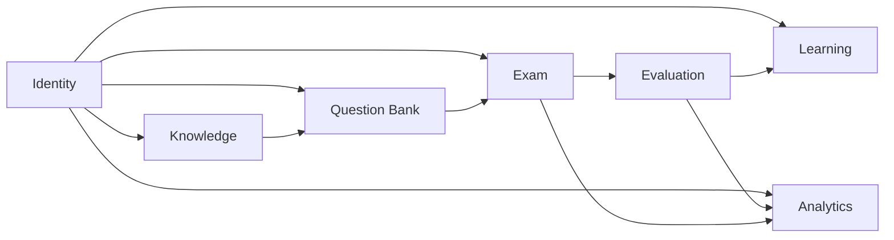

# 模块划分与依赖方向

本文档定义 TalentHub 的模块边界和依赖方向，防止项目在实现过程中演化成互相调用、彼此污染的结构。

## 1. 模块清单

### 1.1 Identity

负责：

- 用户
- 部门
- 角色
- 权限

### 1.2 Knowledge

负责：

- 文档
- 文档版本
- 文档切片
- 向量检索

### 1.3 Question Bank

负责：

- 题目
- 题目版本
- 题目来源
- 知识点映射

### 1.4 Exam

负责：

- 试卷
- 试卷题目快照
- 考试分配
- 考试作答

### 1.5 Evaluation

负责：

- 判卷
- 评分规则
- 逐题反馈
- 总结反馈

### 1.6 Learning

负责：

- 学习路径
- 路径节点
- 用户进度
- 个性化建议入口

### 1.7 Analytics

负责：

- 行为事件
- 聚合指标
- 报表快照

## 2. 模块内分层

每个模块固定四层：

- `interfaces`
- `application`
- `domain`
- `infrastructure`

## 3. 依赖方向

依赖只能向内，不能向外扩散。

```text
interfaces -> application -> domain
infrastructure -> domain
infrastructure -> application
```

规则如下：

- `domain` 不能依赖 `application`
- `domain` 不能依赖 `interfaces`
- `application` 不直接依赖其他模块的基础设施实现
- 跨模块调用优先经过应用服务接口或领域事件

## 4. 模块间允许的协作方式

### 4.1 允许

- `Question Bank` 调用 `Knowledge` 提供的检索能力来生成题目
- `Exam` 在提交后触发 `Evaluation`
- `Evaluation` 完成后触发 `Learning` 和 `Analytics`
- `Identity` 为其他模块提供用户和权限上下文

### 4.2 不允许

- `Knowledge` 直接依赖 `Exam`
- `Analytics` 反向修改核心业务数据
- 一个模块直接写另一个模块的内部表
- 在 API 层直接拼接多个模块的底层数据库对象

## 5. 依赖图



## 6. 为什么采用模块化单体

- 当前项目从 0 开始，优先控制复杂度
- 我们需要先把领域边界做清楚
- 模块化单体更利于重构、调试和学习
- 后续如果某个模块需要拆服务，模块边界已经提前建立

## 7. 当前强制约束

- 不做跨模块随意 import
- 不做共享“大工具类”污染领域模型
- 不做接口层绕过应用层直接访问数据库
- 不做“先写通再整理”的临时耦合
