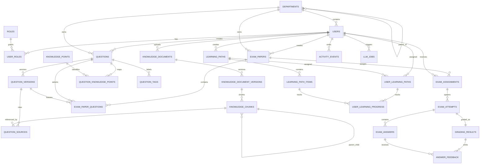

# TalentHub 数据库 ER 总览与主干关系

## 目标

本文档面向当前真实 schema，解释 TalentHub 各组数据库表的总体关系。重点不是逐字段罗列，而是先建立以下认知：

- 数据库按哪些领域分组
- 哪些表是聚合根，哪些表是版本表、桥表、中间表
- 知识库、题库、考试、判卷、学习这几条主线如何串起来

如果你希望继续看每张表的细节，建议按顺序继续阅读：

1. [62-身份-知识库-题库表关系详解](./62-身份-知识库-题库表关系详解.md)
2. [63-考试-判卷-学习-分析表关系详解](./63-考试-判卷-学习-分析表关系详解.md)
3. [64-数据库约束-取舍与潜在升级点](./64-数据库约束-取舍与潜在升级点.md)

## 表分组

当前数据库大致分为 6 组：

### 1. 身份与组织

- `departments`
- `roles`
- `users`
- `user_roles`

### 2. 知识库与 RAG

- `knowledge_documents`
- `knowledge_document_versions`
- `knowledge_chunks`
- `knowledge_points`
- `tags`

### 3. 题库

- `questions`
- `question_versions`
- `question_sources`
- `question_knowledge_points`
- `question_tags`

### 4. 考试与判卷

- `exam_papers`
- `exam_paper_tags`
- `exam_paper_questions`
- `exam_assignments`
- `exam_attempts`
- `exam_answers`
- `evaluation_rubrics`
- `grading_results`
- `answer_feedback`

### 5. 学习路径

- `learning_paths`
- `learning_path_items`
- `user_learning_paths`
- `user_learning_progress`

### 6. 分析与平台横切能力

- `activity_events`
- `metric_snapshots`
- `llm_jobs`
- `idempotency_records`

## 全局 ER 主图

## 三条核心业务主线

### 1. 知识主线

知识相关的最小闭环是：

`knowledge_documents -> knowledge_document_versions -> knowledge_chunks`

这里的设计含义是：

- 文档主表只表示“逻辑文档”
- 版本表表示“某一时刻的具体内容”
- chunk 表表示“检索和引用的最小知识片段”

因此，TalentHub 的 RAG 不是直接引用整篇文档，而是最终引用 `knowledge_chunks`。

### 2. 出题主线

出题相关的主干是：

`questions -> question_versions -> question_sources -> knowledge_chunks`

其中：

- `questions` 是题目聚合根
- `question_versions` 是题目内容快照
- `question_sources` 把题目版本和知识 chunk 连起来

这条链路保证：

- 题目可编辑，但历史版本仍可追溯
- 题目出处可回溯到具体知识片段
- 后续考试反馈和学习建议可以复用同一来源链路

### 3. 考试主线

考试相关的主干是：

`exam_papers -> exam_paper_questions -> exam_assignments -> exam_attempts -> exam_answers -> grading_results -> answer_feedback`

这里的设计重点是：

- 试卷冻结选题版本
- 分配记录决定谁可以考
- 作答记录和分配记录强绑定
- 总评和逐题反馈分层存储

## 聚合根、版本表、桥表

为了读懂 schema，最好先分清几类表：

### 聚合根主表

- `departments`
- `roles`
- `users`
- `knowledge_documents`
- `questions`
- `exam_papers`
- `learning_paths`

这些表通常代表一个可以被直接创建、查询、删除、授权的业务对象。

### 版本表

- `knowledge_document_versions`
- `question_versions`

它们的意义是保留历史快照，而不是覆盖旧内容。

### 桥表 / 中间表

- `user_roles`
- `question_sources`
- `question_knowledge_points`
- `question_tags`
- `exam_paper_tags`
- `exam_paper_questions`
- `user_learning_paths`
- `user_learning_progress`

这些表负责：

- 多对多关系
- 版本冻结
- 来源追踪
- 标签挂载
- 进度分层

## 哪些关系是强外键，哪些不是

TalentHub 当前 schema 的一个重要特点是：

- 核心业务链路尽量使用强外键
- 横切能力和多态引用尽量交给应用层保证

### 强外键为主的部分

- 用户与部门
- 文档与版本
- 版本与 chunk
- 题目与题目版本
- 题目版本与知识 chunk
- 试卷与试卷题目
- 分配与作答
- 作答与答题项
- 作答与总判卷结果

### 应用层约束为主的部分

- `learning_path_items.ref_id`
- `activity_events.entity_type + entity_id`
- `metric_snapshots.scope_type + scope_id`
- `llm_jobs.input_ref_type + input_ref_id`

这些地方之所以不是强外键，是因为它们要跨多个上下文复用，不适合在数据库层强绑定到某一张表。

## 当前 schema 最值得记住的几个设计点

### 1. 文档、题目都走版本化

TalentHub 不是“编辑直接覆盖”，而是：

- 文档通过 `knowledge_document_versions` 留历史
- 题目通过 `question_versions` 留历史

### 2. 考试冻结题目版本

`exam_paper_questions` 同时保存：

- `question_id`
- `question_version_id`

这意味着题目后续继续编辑，不会破坏老试卷和老作答记录。

### 3. 题目出处精确到 chunk

`question_sources` 并不直接引用文档，而是引用 `knowledge_chunks`。这对以下能力都很重要：

- 题目来源展示
- 判卷后学习建议
- 检索预演
- RAG 质量分析

### 4. 学习域和分析域是“后挂”的

学习路径、活动事件、指标快照没有反向侵入核心题库/考试表，而是通过 ID 和引用关系挂接。这让数据库结构更稳，也更便于演进。

## 推荐阅读方式

如果你是为了快速理解表关系，建议按这个顺序继续：

1. [62-身份-知识库-题库表关系详解](./62-身份-知识库-题库表关系详解.md)
2. [63-考试-判卷-学习-分析表关系详解](./63-考试-判卷-学习-分析表关系详解.md)
3. [64-数据库约束-取舍与潜在升级点](./64-数据库约束-取舍与潜在升级点.md)
