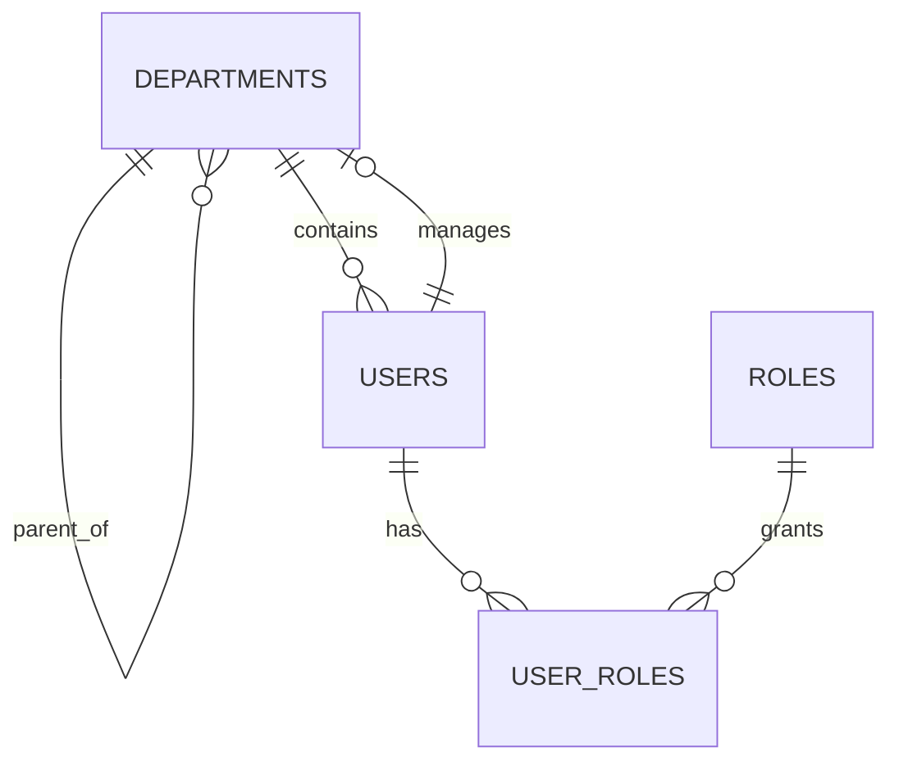
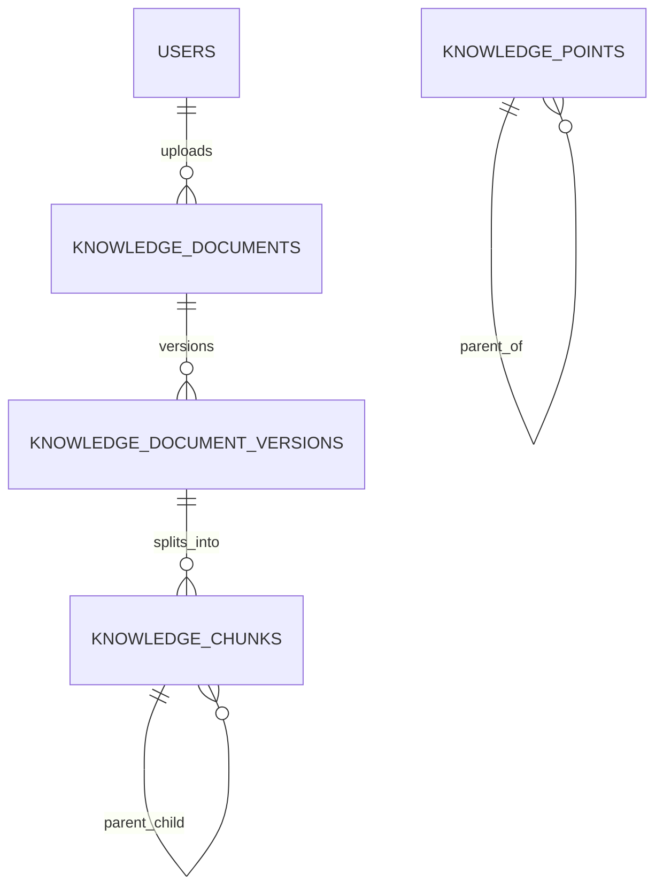
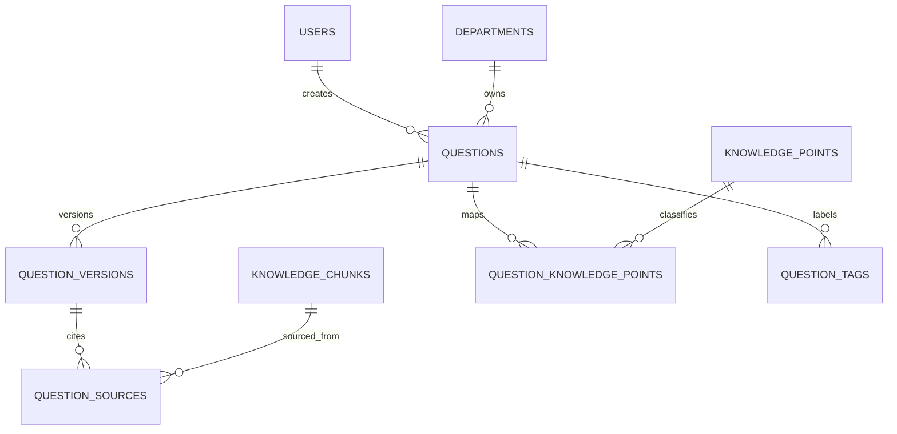

# 身份、知识库与题库表关系详解

## 目标

本文档详细解释以下三组表：

- 身份与组织
- 知识库与 RAG
- 题库

重点是说明：

- 每张表解决什么问题
- 它和上下游表如何关联
- 为什么要这样拆，而不是全部塞进一张大表

## 一、身份与组织域

### 1. `departments`

作用：

- 表示组织结构中的部门节点
- 支持树形层级
- 支持部门负责人

关键关系：

- `parent_id -> departments.id`
  - 表示部门树
- `manager_user_id -> users.id`
  - 表示该部门的管理者

设计含义：

- `departments` 同时是组织树和权限隔离边界
- 后续很多数据都通过 `department_id` 与部门绑定，例如题目和试卷

### 2. `roles`

作用：

- 定义系统角色
- 承载权限语义的“名称层”

常见角色会包括：

- system admin
- department admin
- member

### 3. `users`

作用：

- 表示系统账号和身份主体

关键关系：

- `department_id -> departments.id`

重要业务含义：

- 用户一定属于某个部门
- 部门是题目、试卷、私有考试访问控制的核心边界

### 4. `user_roles`

作用：

- 用户与角色的多对多关系表

关键关系：

- `user_id -> users.id`
- `role_id -> roles.id`

设计含义：

- 不在 `users` 表直接塞单个 `role` 字段，而是保留更灵活的多角色能力

### 5. 身份与组织域小图

## 二、知识库与 RAG 域

### 1. `knowledge_documents`

作用：

- 表示“逻辑文档”
- 记录文档标题、来源类型、上传人、处理状态

关键字段：

- `title`
- `source_type`
- `source_url`
- `status`
- `uploaded_by`

关键关系：

- `uploaded_by -> users.id`

设计含义：

- 这张表不直接存全文，只存“文档身份信息”
- 具体内容在版本表里

### 2. `knowledge_document_versions`

作用：

- 表示某份知识文档的具体版本内容

关键关系：

- `document_id -> knowledge_documents.id`

主要字段：

- `version_no`
- `file_name`
- `storage_path`
- `checksum`
- `parsed_text`

设计含义：

- 同一逻辑文档可以反复更新
- 每次更新都会形成新的内容快照
- RAG 建索引永远基于“某个具体版本”，而不是基于文档主表

### 3. `knowledge_chunks`

作用：

- 表示可检索、可引用的最小知识片段

关键关系：

- `document_version_id -> knowledge_document_versions.id`
- `parent_chunk_id -> knowledge_chunks.id`

主要字段：

- `chunk_index`
- `chunk_role`
- `content`
- `token_count`
- `metadata_json`

当前设计特点：

- 支持父子 chunk
- `parent` 用来承载较完整上下文
- `child` 用来做更细粒度检索命中

设计含义：

- 文档版本是“可阅读的整体”
- chunk 是“可检索、可引用的最小单位”

### 4. `knowledge_points`

作用：

- 表示知识点树

关键关系：

- `parent_id -> knowledge_points.id`

设计含义：

- 它不是 RAG 切片表
- 它更偏教学和知识分类层，用来帮助题目和学习路径归类

### 5. `tags`

作用：

- 作为标签主表
- 用于记录标准化后的标签定义

关键字段：

- `name`
- `normalized_name`

设计含义：

- 题目标签和试卷标签的实际挂载并不直接引用 `tags.id`
- 但 `tags` 作为主标签注册表，便于后续做推荐、标准化、搜索

### 6. 知识库域小图

## 三、题库域

### 1. `questions`

作用：

- 题目聚合根
- 表示“这是一道题”，但不承载完整题目快照内容

关键字段：

- `type`
- `status`
- `source_type`
- `created_by`
- `department_id`

关键关系：

- `created_by -> users.id`
- `department_id -> departments.id`

设计含义：

- 一道题的身份和归属放在主表
- 可编辑内容放在版本表

### 2. `question_versions`

作用：

- 题目的具体版本内容

关键关系：

- `question_id -> questions.id`
- `created_by -> users.id`

主要字段：

- `stem`
- `options_json`
- `standard_answer_json`
- `explanation`
- `difficulty`
- `rubric_json`
- `generation_metadata_json`

设计含义：

- 题目编辑不是覆盖，而是新增版本
- AI 生成元信息、来源类型、推荐分值等内容都适合放版本层

### 3. `question_sources`

作用：

- 连接题目版本和知识 chunk

关键关系：

- `question_version_id -> question_versions.id`
- `chunk_id -> knowledge_chunks.id`

主要字段：

- `relevance_score`

这是 TalentHub 数据库里最关键的 RAG 桥表之一。

它解决的问题是：

- 题目来源不丢
- 可以展示出处
- 可以在考后反馈里推荐对应资料
- 可以做检索评测和题目可解释性分析

### 4. `question_knowledge_points`

作用：

- 把题目映射到知识点

关键关系：

- `question_id -> questions.id`
- `knowledge_point_id -> knowledge_points.id`

主要字段：

- `weight`

设计含义：

- 一道题可以覆盖多个知识点
- 一个知识点也可以对应多道题

### 5. `question_tags`

作用：

- 记录题目的显式标签集合

关键关系：

- `question_id -> questions.id`

主要字段：

- `tag_name`

这里要注意：

- 它不是 `tag_id`
- 它和 `tags` 主表的关系是逻辑同步，不是数据库强外键

这么做的优点是写入简单、查询直接，代价是标签一致性更多依赖应用层。

### 6. 题库域小图

## 四、这三组表如何串起来

TalentHub 的出题链路，本质上是下面这条关系：

`users / departments -> knowledge_documents -> versions -> chunks -> questions -> question_versions -> question_sources`

其中：

- `users` 决定谁上传文档、谁创建题目
- `departments` 决定题目归属和权限边界
- `knowledge_documents` 决定知识来源
- `knowledge_chunks` 决定可检索和可引用的最小单位
- `question_versions` 决定最终题目内容
- `question_sources` 决定题目出处和可解释性

## 五、最值得记住的设计点

### 1. 文档和题目都版本化

- 文档版本化保证知识内容历史可追溯
- 题目版本化保证试卷冻结和编辑并存

### 2. RAG 关系落在 `question_sources`

如果只记一张桥表，最值得记住的是：

- `question_sources`

它让“知识库 -> 出题 -> 考后反馈”真正形成同一条血缘链。

### 3. 标签和知识点不是一回事

- 标签：偏检索、筛选、组卷和 UI 使用
- 知识点：偏教学结构、学习路径、能力分析

两者都可以挂在题目上，但职责不同。
