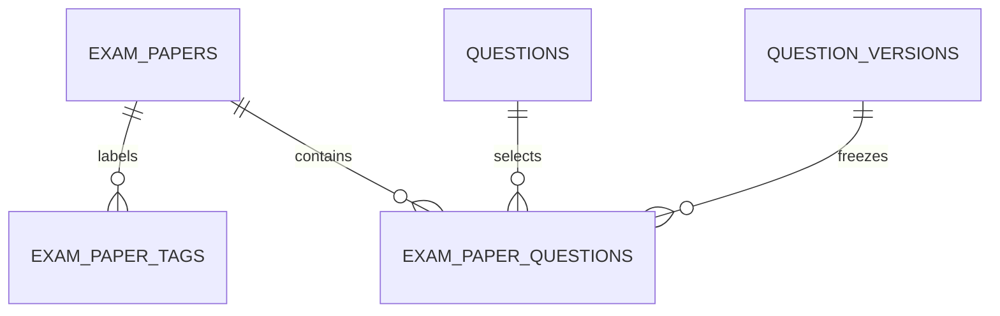
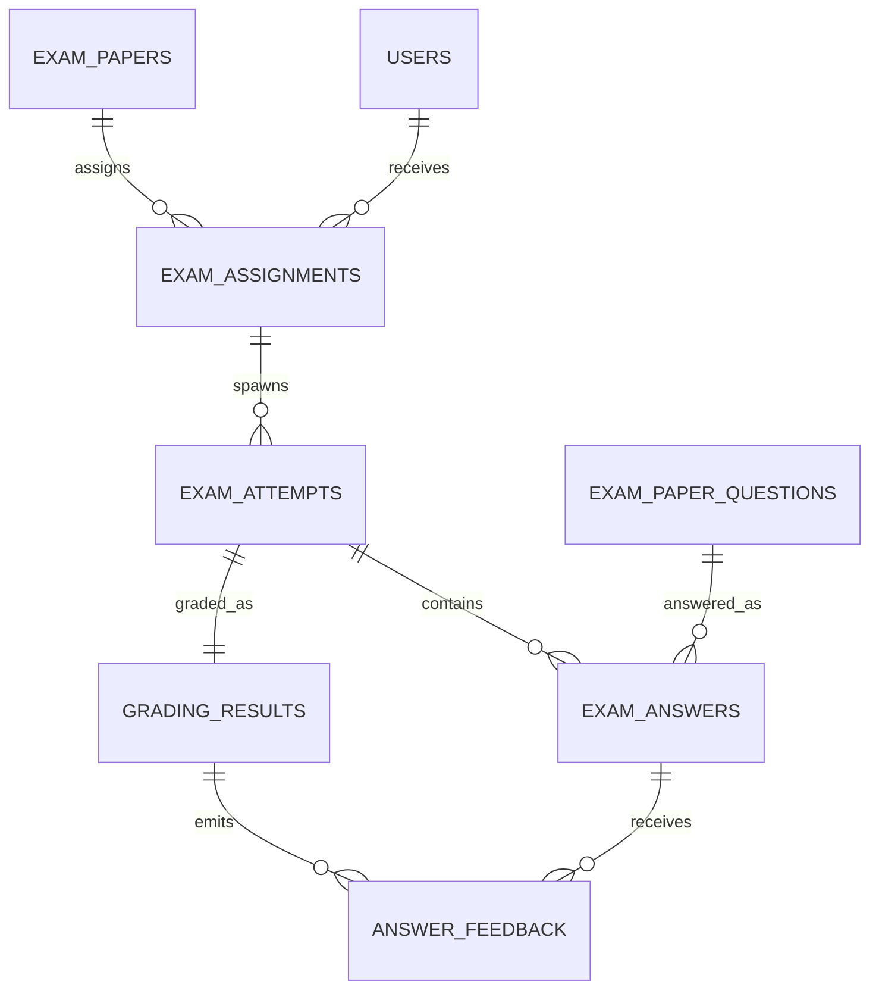
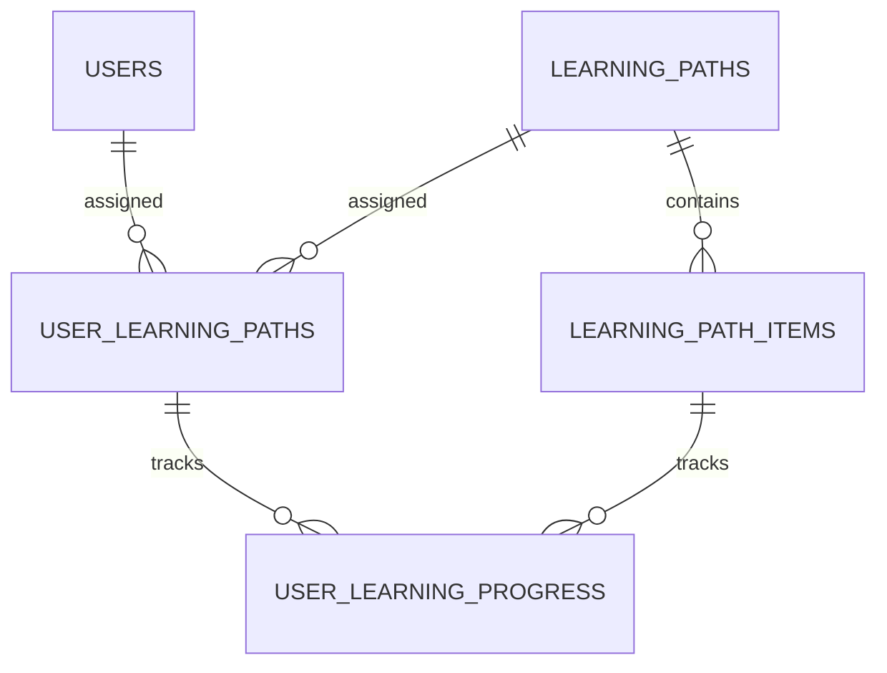

# 考试、判卷、学习与分析表关系详解

## 目标

本文档解释 TalentHub 后半段主线相关的表：

- 试卷与组卷
- 分配、作答、判卷
- 学习路径与学习进度
- 分析与平台横切能力

如果你更关心文档、chunk、题目来源，请先看 [62-身份-知识库-题库表关系详解](./62-身份-知识库-题库表关系详解.md)。

## 一、考试域

### 1. `exam_papers`

作用：

- 试卷聚合根

关键字段：

- `title`
- `description`
- `status`
- `visibility`
- `time_limit_min`
- `total_score`
- `pass_score`
- `created_by`
- `department_id`

关键关系：

- `created_by -> users.id`
- `department_id -> departments.id`

设计含义：

- 试卷既有创建人，也有所属部门
- `visibility` 决定公共考试和部门私有考试

### 2. `exam_paper_tags`

作用：

- 记录试卷自己的标签集合

关键关系：

- `exam_paper_id -> exam_papers.id`

设计含义：

- 它不是题目标签的拷贝
- 更像“这套试卷的编纂上下文和主题”

### 3. `exam_paper_questions`

作用：

- 记录试卷里具体有哪些题

关键关系：

- `exam_paper_id -> exam_papers.id`
- `question_id -> questions.id`
- `question_version_id -> question_versions.id`

额外关键约束：

- `(question_version_id, question_id) -> question_versions(id, question_id)`

这条复合外键非常重要，它保证：

- 试卷里选用的题目版本，必须真的属于那道题

设计含义：

- 试卷不是只引用题目 ID
- 而是同时冻结题目版本
- 这样题目后面继续编辑，不会影响已经发布过的试卷

### 4. 考试域小图

## 二、分配、作答与判卷域

### 1. `exam_assignments`

作用：

- 把某套试卷分配给某个用户

关键关系：

- `exam_paper_id -> exam_papers.id`
- `user_id -> users.id`
- `assigned_by -> users.id`

主要字段：

- `available_from`
- `due_at`
- `attempt_limit`
- `status`

设计含义：

- 试卷只是模板
- 分配记录才表示“某人什么时候可考、最多考几次”

### 2. `exam_attempts`

作用：

- 某次真实作答记录

关键关系：

- `exam_paper_id -> exam_papers.id`
- `user_id -> users.id`
- `assignment_id -> exam_assignments.id`

关键复合约束：

- `(assignment_id, exam_paper_id, user_id) -> exam_assignments(...)`

这条约束的意义是：

- 一次作答必须严格属于某个已有分配
- 而且试卷和用户都必须对应得上

主要字段：

- `started_at`
- `submitted_at`
- `status`
- `objective_score`
- `ai_score`
- `final_score`
- `pass_flag`

### 3. `exam_answers`

作用：

- 一次考试中的逐题答案

关键关系：

- `attempt_id -> exam_attempts.id`
- `exam_paper_question_id -> exam_paper_questions.id`

主要字段：

- `answer_json`
- `objective_score`
- `ai_score`
- `final_score`
- `is_correct`
- `graded_at`

唯一约束：

- `(attempt_id, exam_paper_question_id)` 唯一

也就是说：

- 一次作答中的一道题，只有一条最终答案记录

### 4. `evaluation_rubrics`

作用：

- 存放题型级别或任务级别的评分 rubric 模板

关键关系：

- `created_by -> users.id`

主要字段：

- `name`
- `question_type`
- `criteria_json`

设计含义：

- 它不直接对应某次考试
- 更像评分类能力的配置资产

### 5. `grading_results`

作用：

- 一次作答的总判卷结果

关键关系：

- `attempt_id -> exam_attempts.id`

重要特点：

- `attempt_id` 唯一，所以基本是 `exam_attempts 1:1 grading_results`

主要字段：

- `status`
- `model_name`
- `total_score`
- `summary_feedback`

### 6. `answer_feedback`

作用：

- 每道答题项的逐题反馈

关键关系：

- `grading_result_id -> grading_results.id`
- `answer_id -> exam_answers.id`

主要字段：

- `feedback`
- `strengths`
- `weaknesses`
- `suggestion`

设计含义：

- 总评放在 `grading_results`
- 逐题反馈放在 `answer_feedback`
- 这样可以分别展示总体表现和逐题建议

### 7. 作答与判卷主图

## 三、学习路径域

### 1. `learning_paths`

作用：

- 学习路径聚合根

关键关系：

- `created_by -> users.id`

主要字段：

- `title`
- `description`
- `status`

### 2. `learning_path_items`

作用：

- 路径中的节点项

关键关系：

- `path_id -> learning_paths.id`

主要字段：

- `item_type`
- `ref_id`
- `order_no`
- `required_score`
- `unlock_rule_json`

注意：

- `ref_id` 不是强外键
- 这是一个多态引用，可能指向题目、考试、知识资源等

设计含义：

- 学习路径想成为“统一编排器”
- 就不能强绑定到某一种实体表

### 3. `user_learning_paths`

作用：

- 某个用户与某条学习路径的绑定关系

关键关系：

- `user_id -> users.id`
- `path_id -> learning_paths.id`

主要字段：

- `status`
- `progress_pct`
- `started_at`
- `completed_at`

### 4. `user_learning_progress`

作用：

- 用户在路径具体节点上的进度

关键关系：

- `user_learning_path_id -> user_learning_paths.id`
- `path_item_id -> learning_path_items.id`

主要字段：

- `status`
- `score`
- `completed_at`
- `last_accessed_at`

### 5. 学习域主图

## 四、分析与平台横切能力

### 1. `activity_events`

作用：

- 记录用户行为事件

关键关系：

- `user_id -> users.id`

主要字段：

- `event_type`
- `entity_type`
- `entity_id`
- `occurred_at`
- `metadata_json`

注意：

- `entity_type + entity_id` 是多态引用
- 不对某张表做硬外键

### 2. `metric_snapshots`

作用：

- 存放按天沉淀的指标快照

主要字段：

- `snapshot_date`
- `scope_type`
- `scope_id`
- `metric_code`
- `metric_value`

设计含义：

- 指标不是实时去扫全库算，而是可以沉淀成快照
- `scope_type + scope_id` 让它支持平台级、部门级、个人级等多种范围

### 3. `llm_jobs`

作用：

- 记录 AI 任务审计信息

关键关系：

- `user_id -> users.id`，但可为空

主要字段：

- `job_type`
- `model_name`
- `prompt_template_version`
- `input_ref_type`
- `input_ref_id`
- `status`
- `tokens_in`
- `tokens_out`
- `latency_ms`
- `result_json`

设计含义：

- 它不属于某个单一领域
- 而是作为全局 AI 作业跟踪表存在

### 4. `idempotency_records`

作用：

- 记录幂等请求

主要字段：

- `scope`
- `idempotency_key`
- `request_hash`
- `status`
- `resource_type`
- `resource_id`
- `response_json`
- `expires_at`

设计含义：

- 它是 API 层和应用层的保护表
- 防止重复请求造成重复创建、重复写入或竞态问题

## 五、这几组表如何串起来

如果从考试闭环看，主线是：

`exam_papers -> exam_paper_questions -> exam_assignments -> exam_attempts -> exam_answers -> grading_results -> answer_feedback`

如果从学习闭环看，主线是：

`questions / exams / knowledge resources -> learning_paths -> learning_path_items -> user_learning_paths -> user_learning_progress`

如果从平台治理看，主线是：

`业务动作 -> activity_events / llm_jobs / idempotency_records -> metric_snapshots`

## 六、最值得记住的设计点

### 1. 试卷是模板，分配才是“给谁考”

- `exam_papers` 只是试卷
- `exam_assignments` 才是“某人某时段可以考”

### 2. 作答强绑定分配关系

`exam_attempts` 不只是连 assignment，而是连：

- `assignment_id`
- `exam_paper_id`
- `user_id`

这是数据库层面强校验“人、卷、分配必须一致”。

### 3. 总评与逐题反馈分层

- `grading_results` 管总分和总评
- `answer_feedback` 管逐题反馈

这使前端可以同时展示总体评价和逐题建议。

### 4. 学习路径是多态编排器

`learning_path_items.ref_id` 没有强外键，是刻意设计。  
这代表学习路径可以引用不同类型的学习对象，而不是只支持题目或只支持考试。
