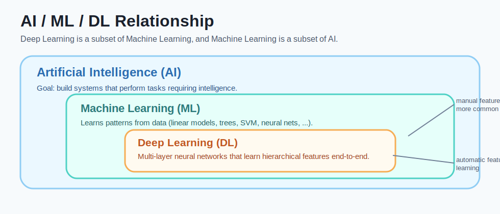
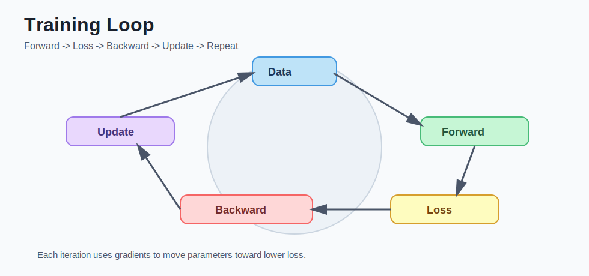

# deep learning - 第 1 课：深度学习是什么与为什么有效

## 学习目标（本节结束后你能做到什么）

- 说清楚“机器学习”和“深度学习”的关系与核心差异。
- 理解“特征工程”和“特征学习”的区别，并能举例。
- 看懂训练闭环：前向传播 -> 损失 -> 反向传播 -> 参数更新。
- 能解释为什么深度学习在图像、语音、文本任务上表现强。
- 能识别过拟合的典型信号，并提出第一步排查方案。

## 内容讲解（核心概念，用类比、例子、图示说清楚）

### 1. 机器学习与深度学习：关系先摆正

深度学习是机器学习的一个子集。  
你可以这样理解：

- 机器学习：一大类“让模型从数据中学规律”的方法集合（线性回归、逻辑回归、决策树、SVM、聚类、神经网络等都属于它）。
- 深度学习：主要指“多层神经网络”这一条路线，强调端到端特征学习。

一句话对比：

- 传统机器学习常常是“人先提特征，模型再学习”。
- 深度学习更多是“模型自己学特征，再完成任务”。

### 图示：AI、机器学习、深度学习关系

### 2. 什么是“特征工程”与“特征学习”

#### 2.1 特征工程（传统路线）

“人工先设计特征”不是一句口号，而是一套完整流程。  
还是用“垃圾邮件识别”举例，你可以把流程拆成 4 步：

1. 读原始数据：原始输入是整封邮件文本。
2. 选信息：由人决定模型该看哪些维度。
3. 量化：把文本转成数字向量。
4. 建模：把数字向量喂给逻辑回归、SVM、树模型等。

假设原始邮件是：

`“恭喜中奖！点击链接立刻领取免费礼品 http://xxx.com”`

人工设计的特征可以是：

| 特征名 | 取值方式 | 该邮件示例值 |
| --- | --- | --- |
| 是否包含“中奖/免费”等词 | 有=1，无=0 | 1 |
| 链接数量 | 统计 URL 个数 | 1 |
| 是否来自通讯录联系人 | 是=1，否=0 | 0 |
| 大写字母比例 | 大写字符数/总字符数 | 0.00 |
| 感叹号个数 | 统计 `!` 数量 | 2 |

最后这封邮件会变成一个向量，比如：`[1, 1, 0, 0.00, 2]`。  
模型真正“看到”的不是邮件原文，而是这串你手工挑出来的数字。

这就是“人工先设计特征”的准确含义：  
**先由人定义信息表达，再让模型学习映射关系。**

#### 2.2 特征学习（深度学习路线）

深度学习的做法是“把特征表达也交给模型”。  
同样是垃圾邮件识别，模型会直接读取 token 序列，在训练过程中自动学到：

- 哪些词或词组重要（例如“立刻领取”“免费礼品”）
- 哪些上下文关系关键（例如“中奖 + 链接 + 强诱导语气”）
- 哪些风格模式危险（例如高营销词密度、异常格式）

你不需要手工规定“只看 5 个特征”，模型会在高维空间里自己组织表达。  
这也是深度学习在语音、图像、文本上表现强的核心原因。

#### 2.3 两条路线的取舍（什么时候选哪条）

特征工程不是过时技术，它在很多场景仍然非常实用：

- 数据量小：手工特征 + 传统模型，往往更稳。
- 可解释要求高：业务方需要知道“为什么判定为风险”。
- 算力有限：无法承受大模型训练成本。

而深度学习更适合：

- 数据量较大且模式复杂（图像、语音、长文本）
- 人工特征难覆盖全部规律
- 可以投入训练资源并接受更高工程复杂度

一句话记忆：  
**特征工程强调“人来定义表示”，特征学习强调“模型学习表示”。**

### 3. 为什么“深度”会有效：表达能力与层级抽象

“深度”不是单纯层数多，而是多个“线性变换 + 非线性激活”的组合。  
这种组合让模型具备更强的函数表达能力。

以图像分类为例，常见层级抽象是：

- 浅层：边缘、角点、纹理
- 中层：眼睛、轮胎、门把手等局部部件
- 深层：猫脸、汽车、行人等语义对象

这叫层级表示学习。它与人类感知有点像：先识别局部，再组合成整体概念。

### 4. 训练闭环拆解（不是黑箱）

训练过程可以写成一个循环：

1. 前向传播  
输入 `x`，模型给出预测 `y_hat`。
2. 计算损失  
用损失函数度量 `y_hat` 与真实标签 `y` 的差异。
3. 反向传播  
利用链式法则计算每个参数对损失的影响（梯度）。
4. 参数更新  
例如使用 SGD/Adam 让参数沿“损失下降方向”更新。

重复很多轮（epoch）后，模型逐步把训练误差压低。

### 图示：训练闭环

### 4.1 用“老师批改作业”理解前向与反向

你可以把训练想成一次次小测验：

1. 前向传播：学生先交答案（模型给预测）。
2. 损失函数：老师给出总扣分（错了多少）。
3. 反向传播：老师指出每一步该扣多少分（每个参数的梯度）。
4. 参数更新：学生按扣分反馈修改解题习惯（参数调整）。

关键点在第 3 步：  
如果只有“总分 60 分”，却不知道哪一步错，学生无法系统进步。  
反向传播就是把“总错误”拆到“每个参数责任”上的机制。

### 5. 一个最小数值例子（先有直觉）

假设只有一个神经元：`y_hat = w*x + b`

- 输入 `x = 2`
- 真实值 `y = 5`
- 初始参数 `w = 1, b = 0`

那么：

- 预测 `y_hat = 1*2 + 0 = 2`
- 误差很大（离 5 还差 3）

如果损失函数是均方误差，梯度会告诉我们：

- `w` 应该增大（因为输入是正数，增大 `w` 会拉高预测）
- `b` 也通常应该增大

多次更新后，`w`、`b` 会向更合适的值靠近，预测逐步接近真实值。

### 6. 深度学习为什么近年特别强

它不是突然“理论革命”，而是三件事同时成熟：

- 数据：互联网时代可用数据规模大幅增长
- 算法：ReLU、BatchNorm、注意力机制、残差连接等提升训练可行性
- 算力：GPU/TPU 让大规模并行训练可落地

很多“效果飞跃”其实来自系统工程协同，而不只是一条新公式。

### 7. 常见误区（这几条最容易踩）

1. 误区：深度学习就是层数越多越好。  
事实：层数、宽度、正则化、数据质量、优化策略都要匹配。

2. 误区：训练集准确率高说明模型好。  
事实：如果验证/测试差，通常是过拟合或数据分布偏移。

3. 误区：机器学习就是“找个代价函数”。  
事实：代价函数只是训练目标的一部分，模型结构、数据表达、优化方式同样关键。

### 8. 你现在就能用的排查框架（过拟合版）

如果出现“训练好、测试差”，先按这四步查：

1. 数据划分是否泄漏（同一主体样本是否进了训练和测试）
2. 训练/测试分布是否一致（采样偏差）
3. 模型是否过大（参数太多、训练轮次过长）
4. 正则化是否太弱（无 Dropout、无权重衰减、无早停）

## 小结（3-5 条关键点）

- 深度学习是机器学习子集，核心是多层神经网络的端到端特征学习。
- 深度网络通过层级抽象把原始数据逐步映射成更高语义表示。
- 训练不是黑箱，本质是“前向算误差，反向调参数”的迭代优化。
- 深度学习成功依赖数据、算法、算力协同，而非单点突破。
- 判断模型好坏必须看泛化能力，不是只看训练集表现。

---

## 检查站：请回答以下问题

1. 用你自己的话区分：特征工程 vs 特征学习。请各举一个例子。
2. “深度学习是机器学习子集”这句话具体是什么意思？请列出两个不属于深度学习但属于机器学习的方法。
3. 若你发现训练集准确率 99%、测试集准确率 72%，请按优先级给出你的前三个排查动作，并说明原因。
4. 可选思考：在“小数据、可解释性强要求高”的场景下，你会优先深度学习还是传统机器学习？为什么？

请把你的答案直接告诉我，我会根据你的回答决定下一步。
