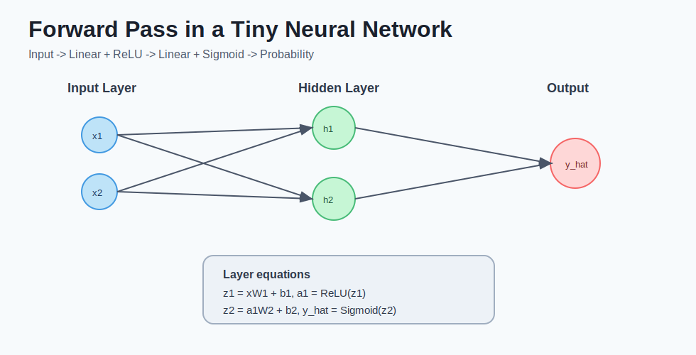
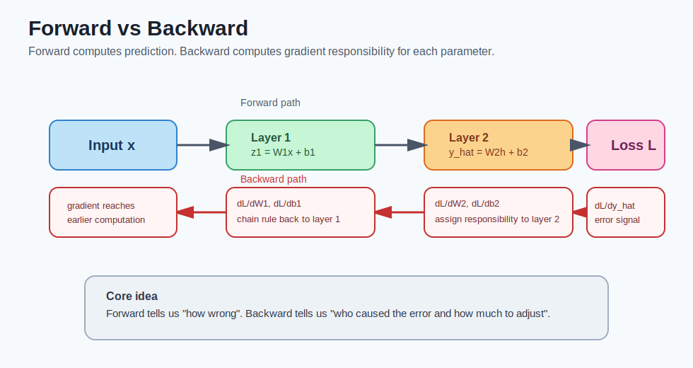

# deep learning - 第 2 课：神经网络与前向传播

## 学习目标（本节结束后你能做到什么）

- 准确理解“层、神经元、权重、偏置、激活函数”之间的关系。
- 手算一个两层网络的前向传播结果。
- 解释为什么多层线性变换仍是线性、为什么必须引入非线性激活。
- 知道不同任务的常见输出层与激活函数搭配。
- 能初步判断前向传播中常见的维度错误与数值问题。
- 能说明前向传播与反向传播的分工，并看懂单神经元梯度方向。

## 内容讲解（核心概念，用类比、例子、图示说清楚）

### 1. 从一个神经元开始：它到底在算什么

一个神经元的计算分两步：

1. 线性部分：`z = W*x + b`
2. 激活部分：`a = f(z)`

如果输入是向量，公式更常写作：

`z = w1*x1 + w2*x2 + ... + wn*xn + b`

你可以把它理解成：

- `W`：每个输入特征的重要性系数（放大或缩小某个信号）
- `b`：整体平移项（帮助模型调整“触发阈值”）
- `f`：把线性结果变成非线性响应（决定模型表达上限）

### 2. “层”是怎么组织的：不是单点，而是一组神经元

在全连接层（Linear/Dense）中，一层通常包含多个神经元，向量化写法：

- 输入：`x`，形状通常是 `(batch_size, in_dim)`
- 参数：`W`，形状 `(in_dim, out_dim)`；`b`，形状 `(out_dim,)`
- 输出：`z = xW + b`，形状 `(batch_size, out_dim)`

然后再过激活：`a = f(z)`，形状不变。

这意味着“一层”本质上是在做“特征空间重编码”：

- 从 `in_dim` 维空间映射到 `out_dim` 维空间
- 再通过激活引入非线性结构

### 图示：两层网络前向传播



### 3. 手算一个最小前向传播例子

假设一个两层网络（忽略 batch）：

- 输入：`x = [1, 2]`
- 第一层：`W1 = [[1, -1], [2, 0]]`, `b1 = [0, 1]`
- 激活：ReLU，`ReLU(t)=max(0,t)`
- 第二层：`W2 = [[1], [3]]`, `b2 = [0]`
- 输出层激活：Sigmoid

#### 第一步：第一层线性

`z1 = xW1 + b1`

- `xW1 = [1,2] * [[1,-1],[2,0]] = [1+4, -1+0] = [5,-1]`
- `z1 = [5,-1] + [0,1] = [5,0]`

#### 第二步：第一层激活

`a1 = ReLU(z1) = [5,0]`

#### 第三步：第二层线性

`z2 = a1W2 + b2 = [5,0] * [[1],[3]] + 0 = [5]`

#### 第四步：输出激活

`y_hat = sigmoid(5) ≈ 0.993`

解释：模型对“正类”的置信度非常高。

### 4. 为什么没有激活函数会“塌缩”为线性模型

这是一个非常关键的数学点。

设两层都没有激活：

- `h = W1*x + b1`
- `y = W2*h + b2`

代入得：

`y = W2*(W1*x + b1) + b2 = (W2*W1)*x + (W2*b1 + b2)`

可以看出它仍是“线性变换 + 偏置”。  
也就是说，不管堆多少层纯线性层，最终都等价于一层线性层，表达能力不会质变。

所以激活函数不是装饰，而是深度网络成立的必要条件之一。

### 5. 常见激活函数与使用场景

1. ReLU：`max(0,x)`  
优点：计算快，缓解梯度消失，工程上最常用。  
风险：可能出现“神经元死亡”（长期输出 0）。

2. Sigmoid：输出在 `(0,1)`  
常用在二分类输出层。  
风险：饱和区梯度小，深层隐藏层较少单独使用。

3. Tanh：输出在 `(-1,1)`  
以 0 为中心，历史上常见。  
风险：仍有梯度饱和问题。

4. GELU：Transformer 常见  
在大模型中常见，效果往往优于纯 ReLU。

### 6. 输出层怎么选（非常实用）

1. 二分类（是否为猫）  
- 常用：1 个神经元 + Sigmoid  
- 损失常配：Binary Cross Entropy

2. 多分类（10 类手写数字）  
- 常用：`K` 个神经元 + Softmax  
- 损失常配：Cross Entropy

3. 回归（预测房价）  
- 常用：线性输出（不加激活）  
- 损失常配：MSE 或 MAE

### 7. 前向传播中的高频错误（新手必看）

1. 维度不对  
`xW` 时输入维和权重维不匹配，直接报错或隐式广播错误。

2. 输出层激活与任务不匹配  
例如回归任务错误使用 Sigmoid，导致输出范围被压缩。

3. 数值不稳定  
logits 过大导致 softmax 溢出；工程上用稳定版实现避免 NaN。

4. 训练和推理模式混淆  
如 Dropout 在推理阶段忘记关闭，预测波动异常。

### 8. 一个最小 PyTorch 心智模型

```python
import torch
import torch.nn as nn

class TinyNet(nn.Module):
    def __init__(self):
        super().__init__()
        self.fc1 = nn.Linear(2, 2)
        self.act = nn.ReLU()
        self.fc2 = nn.Linear(2, 1)

    def forward(self, x):
        z1 = self.fc1(x)
        a1 = self.act(z1)
        z2 = self.fc2(a1)
        y_hat = torch.sigmoid(z2)
        return y_hat
```

这个 `forward` 就是前向传播的代码化表达。

### 9. 前向传播之后，模型怎么“变聪明”：反向传播预告

到这里你已经知道“前向传播能算出预测”，但还有一个关键问题：  
**模型怎么知道该改哪些参数、各改多少？**

答案是反向传播。它做的事可以概括为：

- 前向传播负责“算答案”
- 反向传播负责“算责任”

更具体地说，反向传播会把最终误差按计算链条从后往前传，得到每个参数的梯度。

### 图示：前向与反向的职责分工



#### 9.1 单神经元最小推导（你可以手算）

设模型与损失为：

- `y_hat = w*x + b`
- `L = (y_hat - y)^2`

我们要知道 `w`、`b` 怎么更新，就要算：

- `dL/dw`
- `dL/db`

按链式法则：

- `dL/dy_hat = 2(y_hat - y)`
- `dy_hat/dw = x`
- `dy_hat/db = 1`

所以：

- `dL/dw = 2(y_hat - y)*x`
- `dL/db = 2(y_hat - y)`

这两个梯度的含义是：

- `dL/dw`：`w` 增大一点会让损失怎么变
- `dL/db`：`b` 增大一点会让损失怎么变

然后优化器做更新：

- `w = w - lr * dL/dw`
- `b = b - lr * dL/db`

#### 9.2 代入数字看一次

给定：

- `x = 2`
- `y = 5`
- 初始 `w = 1, b = 0`
- 学习率 `lr = 0.1`

前向传播：

- `y_hat = 1*2 + 0 = 2`
- `L = (2 - 5)^2 = 9`

反向传播：

- `dL/dy_hat = 2*(2 - 5) = -6`
- `dL/dw = -6*2 = -12`
- `dL/db = -6`

更新参数：

- `w_new = 1 - 0.1*(-12) = 2.2`
- `b_new = 0 - 0.1*(-6) = 0.6`

再前向一次：

- `y_hat_new = 2.2*2 + 0.6 = 5.0`

你会看到，模型已经明显朝正确方向移动。  
这就是反向传播在训练中的价值：**把“错了”变成“怎么改”。**

#### 9.3 在代码里它长什么样

```python
loss = criterion(model(x), y)  # 前向 + 损失
loss.backward()                # 反向传播：计算梯度
optimizer.step()               # 按梯度更新参数
optimizer.zero_grad()          # 清空梯度
```

注意：`backward()` 只负责算梯度，不负责更新参数。  
真正更新参数的是 `optimizer.step()`。

## 小结（3-5 条关键点）

- 一层的本质是“线性映射 + 非线性激活”，不是单纯叠加计算步骤。
- 神经网络前向传播就是输入在参数化函数中的逐层映射。
- 没有激活函数，多层线性层可合并为单层线性层，表达能力不会显著提升。
- 输出层设计要和任务类型匹配，否则即使能训练也会效果差。
- 维度检查和数值稳定性是前向传播调试的第一优先级。
- 训练要想真正收敛，必须用反向传播把误差转成每个参数的更新方向。

---

## 检查站：请回答以下问题

1. 请用代数推导解释：为什么两层线性网络可以合并为一层线性网络？
2. 在 `z = xW + b` 中，若 `x` 形状为 `(32, 128)`，你会把 `W` 和 `b` 设成什么形状，才能得到 `(32, 64)` 的输出？
3. 二分类任务中，`1 个输出 + Sigmoid` 和 `2 个输出 + Softmax` 都能工作。你更推荐哪种？请从参数量、实现复杂度、可读性三个角度回答。
4. 给定 `x=2, y=5, w=1, b=0, L=(wx+b-y)^2`，不要求精确计算，先判断 `dL/dw` 与 `dL/db` 的正负号，并解释你的判断依据。

请把你的答案直接告诉我，我会根据你的回答决定下一步。
