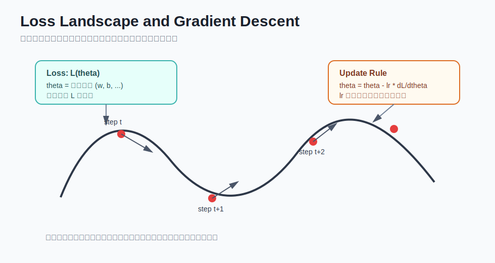
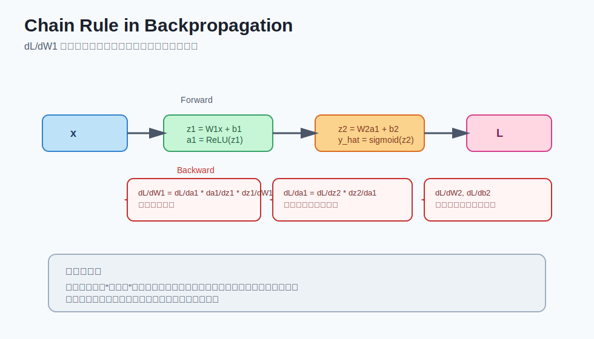

# deep learning - 第 3 课：损失函数与反向传播

## 学习目标（本节结束后你能做到什么）

- 理解损失函数在训练中的角色：它不是“附属品”，而是学习目标本身。
- 区分常见任务应使用的损失函数（BCE、CE、MSE、MAE）及其直觉含义。
- 解释反向传播为什么必须依赖链式法则，并能读懂梯度符号的意义。
- 手算单神经元的一次梯度更新，判断参数更新方向是否合理。
- 识别训练中的高频错误：损失函数用错、logits/probability 混用、梯度异常等。

## 内容讲解（核心概念，用类比、例子、图示说清楚）

### 1. 损失函数到底是什么

你可以把损失函数理解为“训练过程的评分标准”。  
模型每做一次预测，损失函数就回答一个问题：**这次错了多少？**

如果没有损失函数，训练就会失去方向，因为优化器不知道“什么叫更好”。

一个直观类比：

- 前向传播：学生交卷（产出预测）
- 损失函数：老师打分（量化错误）
- 反向传播：指出每一步该扣多少分（梯度）
- 参数更新：下次答题改进策略

所以，损失函数不是最后才看的指标，而是贯穿训练全程的目标信号。

### 图示：损失地形与梯度下降



### 2. 常见损失函数怎么选（按任务类型）

#### 2.1 二分类：Binary Cross Entropy（BCE）

任务例子：垃圾邮件判断、是否欺诈、是否患病。  
输出通常是 `y_hat in (0,1)`，代表正类概率。

BCE 的直觉：  
如果真实标签是 1，你却给出很小概率，会被重罚；  
如果真实标签是 0，你却给出很大概率，也会被重罚。

它鼓励模型“对正确类别给高置信度”。

#### 2.2 多分类：Cross Entropy（CE）

任务例子：手写数字 0-9 分类、图片 1000 类识别。  
输出通常是 `K` 个类别得分，经过 Softmax 得到概率分布。

CE 的直觉：  
真实类别那一项概率越高，损失越小；  
把概率分给错误类别，损失会增加。

#### 2.3 回归：MSE / MAE

任务例子：预测房价、预测温度、销量估计。

- MSE（均方误差）：对大误差更敏感，惩罚更重。
- MAE（绝对误差）：对异常值更稳，不会过度放大离群点。

经验直觉：

- 你希望“大错必须重罚”时，MSE 常更合适。
- 你担心数据里有脏点/离群点时，MAE 常更稳健。

### 3. 同一个模型，损失函数选错会怎样

很多训练问题不是模型结构太差，而是“目标定义错了”。  
下面是典型错误：

1. 二分类却用 MSE，可能收敛慢、概率校准差。
2. 多分类输出是 logits，却先手动 Softmax 再喂 `CrossEntropyLoss`，造成重复处理。
3. 回归任务用 Sigmoid 输出，把预测范围硬限制在 `(0,1)`，导致模型学不动。

一条非常实用的对照规则：

- 二分类：`1输出 + Sigmoid + BCE`（或 `BCEWithLogitsLoss` 直接吃 logits）
- 多分类：`K输出 logits + CrossEntropyLoss`（不要手动再 softmax）
- 回归：线性输出 + `MSELoss/MAELoss`

### 4. 反向传播在做什么（从“总错”到“分责”）

你之前已经学了前向传播会算出预测。  
但训练能否进步，关键在：**怎么把最终误差分配到每个参数。**

反向传播的核心动作是：

1. 先得到最终损失 `L`
2. 从输出层开始，逐层计算局部导数
3. 用链式法则把局部导数连乘，得到每个参数的梯度
4. 把梯度交给优化器执行更新

“从后往前”不是形式要求，而是因果关系决定的：  
前面层的参数影响后面所有计算，必须通过后续链条才能知道其责任。

### 图示：链式法则的梯度流向



### 5. 单神经元手算：你真正理解梯度方向了吗

设模型：

- `y_hat = w*x + b`
- `L = (y_hat - y)^2`

设样本：

- `x = 2`
- `y = 5`
- 初始参数：`w = 1, b = 0`
- 学习率：`lr = 0.1`

#### 5.1 前向传播

- `y_hat = 1*2 + 0 = 2`
- `L = (2 - 5)^2 = 9`

#### 5.2 反向传播

- `dL/dy_hat = 2(y_hat - y) = 2(2-5) = -6`
- `dy_hat/dw = x = 2`
- `dy_hat/db = 1`
- `dL/dw = dL/dy_hat * dy_hat/dw = -6 * 2 = -12`
- `dL/db = dL/dy_hat * dy_hat/db = -6`

#### 5.3 参数更新

- `w_new = w - lr*dL/dw = 1 - 0.1*(-12) = 2.2`
- `b_new = b - lr*dL/db = 0 - 0.1*(-6) = 0.6`

你会发现两个参数都变大，因为当前预测 2 明显低于真实值 5。  
方向上完全合理：要想把预测抬高，就需要增大 `w` 或 `b`。

这段手算非常关键，它让你从“背公式”切换到“看方向是否合理”。

### 6. 梯度下降不等于每一步都变好

初学者常见误解：只要用了反向传播，损失就应每一步下降。  
实际上，小批量训练里会有波动，常见原因有：

- batch 噪声（每一批样本分布不同）
- 学习率过大（震荡）
- 数据本身复杂（局部极小值、鞍点）

我们更看重趋势，而不是每一步绝对单调下降。

### 7. 训练中最常见的“学不动”排查清单

1. 检查损失与输出层是否匹配  
例如 CE 要吃 logits，不要先 softmax 再 CE。

2. 检查学习率  
过大震荡，过小几乎不动。可以先试 `1e-3`、`3e-4` 等量级。

3. 检查梯度是否为 0 或 NaN  
若出现 NaN，先看数值稳定与数据异常。

4. 检查标签编码  
二分类标签是否是 0/1；多分类标签是否是类别索引。

5. 检查数据与标签是否错位  
输入和标签错配会让损失长期高位。

### 8. 从数学到代码：训练四行心智模型

```python
logits = model(x)            # 前向传播
loss = criterion(logits, y)  # 计算损失
loss.backward()              # 反向传播，计算梯度
optimizer.step()             # 参数更新
optimizer.zero_grad()        # 清空梯度
```

把这四行和数学对应起来，你就抓住了深度学习训练的主干。

## 小结（3-5 条关键点）

- 损失函数定义了“什么叫学得好”，它决定训练方向。
- 不同任务应匹配不同损失：二分类 BCE、多分类 CE、回归 MSE/MAE。
- 反向传播用链式法则把最终误差分配到每个参数，得到可更新梯度。
- 梯度的正负号和大小分别决定“往哪改”和“改多少”。
- 训练失败时，先排查损失函数匹配、学习率、梯度与标签编码。

---

## 检查站：请回答以下问题

1. 你如何用一句话解释“损失函数”和“评估指标”的区别？请各举一个例子。
2. 对于“是否欺诈”的二分类任务，你会选什么输出层与损失函数组合？为什么？
3. 在 `x=2, y=5, w=1, b=0, L=(wx+b-y)^2` 下，不做完整计算也可以，请判断 `dL/dw`、`dL/db` 是正还是负，并解释你的理由。
4. 如果训练时 loss 一直不下降，你的前三个排查动作是什么？请按优先级写出。

请把你的答案直接告诉我，我会根据你的回答决定下一步。
