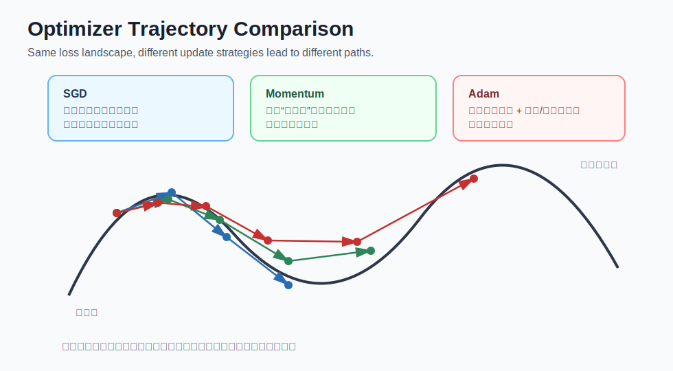
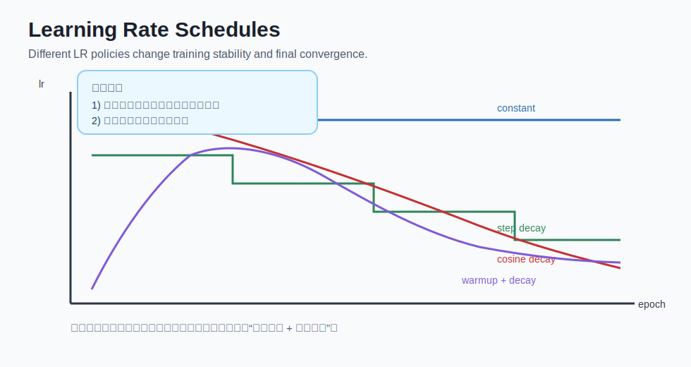

# deep learning - 第 4 课：优化算法与训练稳定性

## 学习目标（本节结束后你能做到什么）

- 说清楚优化算法在训练中的作用：它负责把梯度变成可执行的参数更新。
- 区分 SGD、Momentum、RMSProp、Adam 的核心思想与适用场景。
- 理解学习率为什么是“第一超参数”，以及常见学习率调度策略。
- 掌握训练稳定性的核心手段：梯度裁剪、权重衰减、归一化、早停等。
- 遇到“loss 震荡、不收敛、突然 NaN”时，能按优先级做排查。

## 内容讲解（核心概念，用类比、例子、图示说清楚）

### 1. 为什么需要优化算法

你在上一章已经学了反向传播会给出梯度。  
但“有梯度”不等于“会训练”，因为梯度只是方向信息，真正更新参数还需要优化算法。

最基础的更新规则是：

`theta = theta - lr * grad`

其中：

- `theta`：参数集合（所有 `w` 和 `b`）
- `grad`：反向传播得到的梯度
- `lr`：学习率（每一步走多大）

你可以把它理解成“下山问题”：

- 梯度告诉你哪里更陡；
- 优化算法决定你每一步怎么走、走多快、是否保留惯性。

如果更新策略不合理，就会出现：

- 在谷底两侧来回震荡
- 下降太慢，训练很久没进展
- 一步跨太大直接发散（loss 爆炸）

### 2. 四种常见优化器：核心差异在哪里

### 图示：优化器路径对比

#### 2.1 SGD（随机梯度下降）

更新最直接：

`theta = theta - lr * grad`

优点：

- 简单、可解释、内存占用小
- 在很多任务上泛化表现不错

缺点：

- 在狭长谷地里容易左右抖动
- 对学习率敏感，不好调时会很慢

#### 2.2 Momentum（动量）

核心思想是引入“速度项”，让更新有惯性：

- 在一致方向上加速
- 在来回震荡方向上抑制抖动

直觉类比：推球下坡。  
SGD 像每步都从零开始推；Momentum 像球本身有速度，连续下坡更顺。

#### 2.3 RMSProp

核心是对每个参数使用自适应步长。  
如果某个方向梯度长期很大，就自动缩小该方向步长；  
梯度较小的方向则相对放大步长。

这对梯度尺度差异很大的任务很有帮助。

#### 2.4 Adam

Adam 结合了 Momentum（看一阶矩）和 RMSProp（看二阶矩）的思路。  
工程上通常是默认起点，因为：

- 收敛普遍较快
- 对初始学习率容忍度较高
- 在很多任务上调参成本较低

但要注意：  
“收敛快”不一定“最终泛化最好”，某些任务上 SGD + 合理调度也可能更优。

### 3. 学习率：训练成败的第一超参数

如果只允许你优先调一个超参数，通常就是学习率。

常见现象：

1. 学习率过大  
loss 震荡、上下乱跳，严重时直接 NaN。

2. 学习率过小  
loss 缓慢下降甚至几乎不动，训练像“原地踏步”。

3. 学习率合适  
前期下降较快，后期稳步逼近低损失区。

### 图示：学习率调度策略

#### 3.1 常见调度方式

1. Constant LR（固定学习率）  
实现简单，但中后期常不够细致。

2. Step Decay（阶梯衰减）  
每隔若干 epoch 把学习率乘一个系数（如 0.1）。

3. Cosine Decay（余弦衰减）  
平滑下降，常用于较长训练流程。

4. Warmup + Decay  
先小步热身，再进入主学习率，最后衰减。  
在大模型训练中非常常见。

### 4. 什么叫“训练稳定性”

训练稳定性不是一个口号，而是指：

- 损失是否按预期下降
- 梯度是否健康（非 0、非 NaN、量级合理）
- 参数更新是否平稳
- 验证集表现是否与训练集趋势一致

不稳定训练的典型症状：

1. loss 曲线锯齿状大幅跳动
2. 某个时刻突然爆炸
3. 梯度全为 0（学习停滞）
4. 训练很好但验证长期不提升（过拟合）

### 5. 提升稳定性的实用工具箱

#### 5.1 梯度裁剪（Gradient Clipping）

当梯度过大时，把梯度范数限制在阈值内（如 1.0）。  
常用于序列模型、长链路反向传播场景。

#### 5.2 权重衰减（Weight Decay / L2）

通过惩罚过大参数抑制过拟合，让模型更平滑。  
实务上常与 AdamW 一起使用。

#### 5.3 归一化（BatchNorm / LayerNorm）

缓解内部表示分布变化，帮助更稳定地训练更深网络。

#### 5.4 早停（Early Stopping）

验证集在若干轮不再提升时停止训练，防止无效训练和过拟合。

#### 5.5 合理初始化

如 Xavier/He 初始化。  
初始化太差会导致前期梯度异常，模型难以起步。

### 6. 一个最小实战流程（你可以照抄）

假设你训练一个二分类网络，可以按这个顺序起步：

1. 优化器先用 AdamW，学习率 `1e-3`。
2. 损失函数用 `BCEWithLogitsLoss`（输出层直接 logits）。
3. 加入 `weight_decay=1e-4`。
4. 使用 `cosine` 或 `step` 学习率调度。
5. 开启 early stopping（如 patience=5）。
6. 每轮记录：训练 loss、验证 loss、验证 AUC/F1。

如果不稳定，再按顺序调：

1. 学习率先降 2-10 倍；
2. 再加梯度裁剪；
3. 再检查数据标准化、标签质量和 batch 大小。

### 7. 高频错误与优先排查顺序

当你遇到“就是不收敛”，建议用这份优先级：

1. 先查输出层与损失函数是否匹配  
这是最常见硬错误。

2. 再查学习率  
过大/过小都会让你误判模型结构。

3. 再看数据与标签质量  
错标、错位、分布漂移会让一切调参失效。

4. 最后再大改模型结构  
很多时候结构不是第一责任人。

### 8. 一句话总结本章方法论

反向传播告诉你“该往哪走”，  
优化算法决定你“怎么走得稳、走得快、走得远”。

## 小结（3-5 条关键点）

- 优化器把梯度转成参数更新，是训练能否收敛的执行层。
- SGD、Momentum、Adam 的差异本质在于“是否使用历史信息与自适应步长”。
- 学习率是最重要超参数，调度策略常直接影响最终效果。
- 训练稳定性要靠系统手段：裁剪、正则化、归一化、早停和监控。
- 训练异常优先查“损失匹配 + 学习率 + 数据质量”，再考虑大改模型。

---

## 检查站：请回答以下问题

1. 用你自己的话解释：为什么说“学习率是第一超参数”？请给一个“过大”和“过小”的现象例子。
2. 在 SGD、Momentum、Adam 中，如果你是新任务冷启动，会先选哪个？为什么？
3. 你发现训练 loss 降得很快，但验证集指标长期不升，最可能发生了什么？你会立刻采取哪两条措施？
4. 当 loss 出现剧烈震荡时，你的前三个排查动作是什么？请按优先级写出。

请把你的答案直接告诉我，我会根据你的回答决定下一步。
