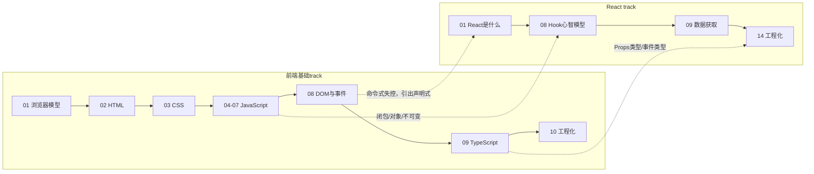

# 前端基础学习路径与知识图谱

## 这个 track 为什么存在

React 那一套笔记，默认你已经会 JavaScript、懂闭包、知道 DOM 是什么、看得懂 HTML 和 CSS。但你现在的真实情况是：后端经验扎实，前端几乎零基础。

这会带来一个隐蔽的问题：你照着 React 笔记敲，能跑起来，但很多地方你其实是“模仿”，不是“理解”。比如：

- React 第 8 课讲闭包，可你根本没系统学过 JavaScript 的闭包，于是只能死记。
- React 里到处是 `{user.name}`、`onClick={...}`、`<button disabled={...}>`，这些是 JSX，但 JSX 的底子是 HTML 标签 + JavaScript 表达式，你两样都没打牢。
- React 说“它帮你把状态变化提交到真实 DOM”，可你没搞清楚 DOM 到底是什么、浏览器怎么把它画出来，这句话就只是一句口号。

所以这个 track 的定位是：**把 React 默认你已经会、但你其实没学过的那层前端地基补上。** 学完之后再回头看 React，很多“为什么这么写”会突然变得顺理成章。

## 学习定位（针对后端工程师）

你有后端背景，所以我们不会把你当成完全的编程新手。我们会大量用后端类比：

- HTML 像数据结构 / Schema：它描述“页面里有什么、怎么嵌套”，但不描述长什么样、怎么动。
- CSS 像渲染配置 / 样式规则表：它只管“长什么样”，不管逻辑。
- JavaScript 像业务逻辑层：它让页面“活起来”，能响应用户、改数据、发请求。
- 浏览器像一个一直在运行的客户端运行时（runtime）：它不是“收到请求返回响应就结束”，而是持续运行、持续响应事件、持续重绘。
- DOM 像运行时里的一棵内存对象树：它是 HTML 在内存里的表示，也是 JavaScript 操作页面的唯一入口。

我们的目标不是把 MDN 抄一遍，而是让你建立这几层之间的**关系直觉**，这样你看任何前端代码（包括 React）都能定位：这行代码是在改结构、改样式、还是改行为？是在浏览器主线程同步执行，还是异步排队？

## 知识图谱

1. 浏览器到底在做什么
   - 后端的请求-响应模型 vs 浏览器的长期运行时模型
   - 从输入网址到页面出现，中间发生了什么
   - HTML / CSS / JavaScript 的分工
   - 渲染管线：DOM 树、CSSOM、渲染树、布局、绘制、合成
   - 页面为什么是“活的”：JS 改 DOM，浏览器重绘
2. HTML：网页的结构与语义
   - 元素、标签、属性、文本节点
   - 文档是一棵树（这棵树就是 DOM 的来源）
   - 常用元素：容器、文本、链接、图片、列表、表格、表单
   - 语义化：为什么不是所有东西都用 `div`
   - 表单元素：input、button、select，它们是 React 受控组件的底子
3. CSS：盒模型、布局与样式
   - 选择器：怎么选中元素
   - 盒模型：margin / border / padding / content
   - 文档流、块级与行内、display
   - 现代布局：Flexbox 与 Grid
   - 定位 position、层叠 z-index
   - 响应式与单位（px / rem / % / vw）
4. JavaScript 语言核心（上）
   - 变量：let / const / var 与作用域
   - 数据类型：原始类型 vs 引用类型
   - 运算、类型转换、相等性（== 与 ===）
   - 控制流、真值与假值
   - 函数：声明、表达式、箭头函数、参数与返回值
5. JavaScript 语言核心（中）
   - 对象：属性、方法、引用语义
   - 数组与常用方法（map / filter / reduce / find）
   - 解构、展开运算符、可选链
   - JSON 与序列化
   - 不可变更新思维（这是 React setState 的基础）
6. JavaScript 语言核心（下）
   - this 到底指向谁
   - 闭包：函数记住它出生时的环境
   - 原型与类
   - 模块：import / export
   - 错误处理：try/catch、throw
7. 异步 JavaScript
   - 单线程与事件循环
   - 回调与回调地狱
   - Promise
   - async / await
   - 宏任务、微任务与执行顺序直觉
8. DOM 与事件（命令式前端）
   - 选中元素、读写内容与属性
   - 创建、插入、删除节点
   - 事件监听、事件对象、事件冒泡与委托
   - 为什么手动操作 DOM 在复杂页面会失控（这正是 React 要解决的问题）
9. TypeScript
   - 为什么要给 JavaScript 加类型
   - 基础类型、接口、类型别名、联合类型
   - 函数类型、泛型入门
   - 类型推断与类型收窄
   - TypeScript 在 React 里怎么用（Props 类型、事件类型）
10. 现代前端工程化基础
    - ES Modules 与浏览器原生模块
    - npm 与 package.json
    - 打包工具在做什么（Vite / 构建产物）
    - 开发服务器、热更新、环境变量
    - 这一层如何把前面所有东西组织成一个真实项目

## 建议学习顺序

1. `00_学习路径.md`
2. `01_浏览器到底在做什么：从一个网址到页面出现.md`
3. `02_HTML：网页的结构，也是DOM树的来源.md`
4. `03_CSS：盒模型、布局与样式怎么作用到元素上.md`
5. `04_JavaScript语言核心（上）：变量、类型、函数.md`
6. `05_JavaScript语言核心（中）：对象、数组与不可变更新.md`
7. `06_JavaScript语言核心（下）：this、闭包、原型与模块.md`
8. `07_异步JavaScript：事件循环、Promise与async/await.md`
9. `08_DOM与事件：命令式前端，以及它为什么会失控.md`
10. `09_TypeScript：给JavaScript加上类型护栏.md`
11. `10_现代前端工程化基础：模块、npm、打包与开发服务器.md`

## 为什么这样排序

很多前端教程一上来就教你写 `
` 和加样式，看起来快，但你会一直缺一个“整体模型”：这些东西最后是怎么被浏览器变成你看到的页面的？

所以第 1 课不教任何具体语法，先讲**浏览器这台机器在做什么**。建立了这个全局模型，后面学 HTML 你就知道它在喂渲染管线的第一步，学 CSS 你就知道它在影响布局和绘制，学 JS 你就知道它是在运行时里改那棵树。

然后按“结构 → 样式 → 行为”的顺序：

- 先 HTML（第 2 课）：因为它是地基，DOM 树就是从 HTML 来的。
- 再 CSS（第 3 课）：让结构有样子。
- 再 JavaScript（第 4-7 课）：这是分量最重的部分，因为 React 本质是一个 JavaScript 库，你 JS 不过关，React 学到的都是表面。JS 拆成四节：基础语法、对象数组、this/闭包/模块、异步。
- 然后 DOM 与事件（第 8 课）：把 JS 和页面连起来，用“命令式”的方式亲手操作页面。这一课很关键，因为你会亲身体会到“手动同步 DOM 有多痛”，这正是 React 声明式模型要解决的问题。学完这课，你再看 React 第 1 课讲的命令式 vs 声明式，会有完全不同的体感。
- 最后 TypeScript（第 9 课）和工程化（第 10 课）：在你已经会原生 JS 之后，再给它加类型护栏、再讲项目怎么组织。

## 这个 track 和 React track 的关系

具体的衔接点：

- **前端基础 08（DOM 与事件）↔ React 01**：你先用原生 DOM 手动改页面，体会命令式的痛，再去看 React 为什么要 `UI = f(state)`。
- **前端基础 04-06（JavaScript）↔ React 08（Hook 心智模型）**：闭包、对象引用、不可变更新这些，是看懂 Hook、useRef、依赖数组的前提。
- **前端基础 09（TypeScript）↔ React 14（工程化）**：React 项目几乎都用 TS 写，Props 和事件都要标类型。

## 学习方法建议

- 每学一个概念，先问它属于哪一层：是结构（HTML）、样式（CSS）、行为（JS）、还是工程组织？
- 不要只记语法，要能说清“浏览器拿到这段代码后做了什么”。
- JavaScript 部分一定要动手敲，光看不练，闭包和 this 永远学不会。打开浏览器按 F12，在 Console 里就能直接跑 JS。
- 遇到“页面没按预期变化”，优先回到这条链路排查：JS 改了数据吗 → 改了 DOM 吗 → 浏览器重新布局绘制了吗。
- 学到 DOM 操作时，刻意感受“手动同步多个 DOM 的麻烦”，这份痛感会让你真正理解 React 的价值。

## 学完后你应该能回答的问题

- 从你在地址栏敲一个网址，到页面出现，浏览器大致做了哪几件事？
- HTML、CSS、JavaScript 三者各自负责什么？它们怎么协作？
- DOM 到底是什么？它和你写的 HTML 是什么关系？
- 原始类型和引用类型在 JavaScript 里有什么区别？为什么这关系到 React 的 state 更新？
- 闭包是什么？用一个例子说清楚它“记住”了什么。
- 单线程的 JavaScript 怎么处理网络请求这种耗时操作而不卡死页面？
- 用原生 DOM 写一个复杂交互页面，难点在哪里？React 是怎么把这个难点拿走的？
- TypeScript 给 JavaScript 加了什么？它解决了什么问题？
