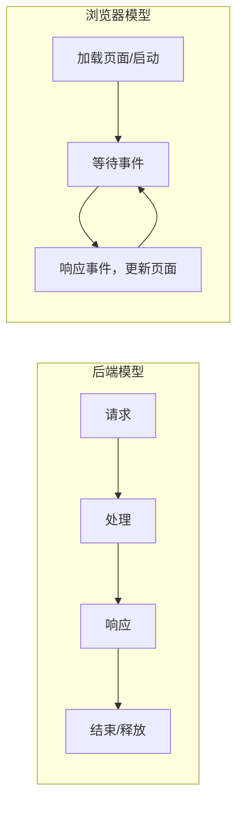
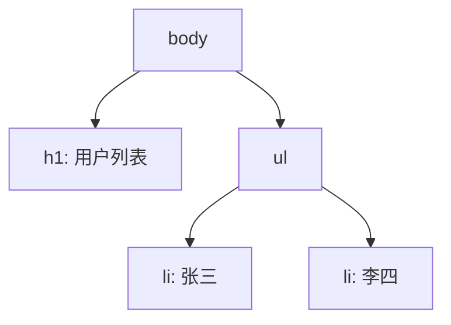
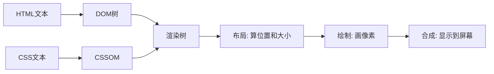
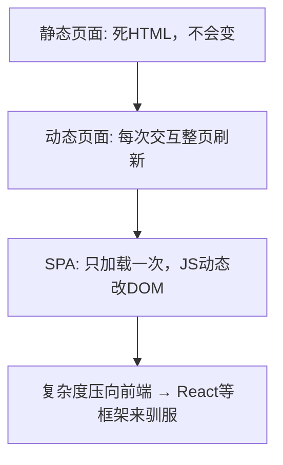
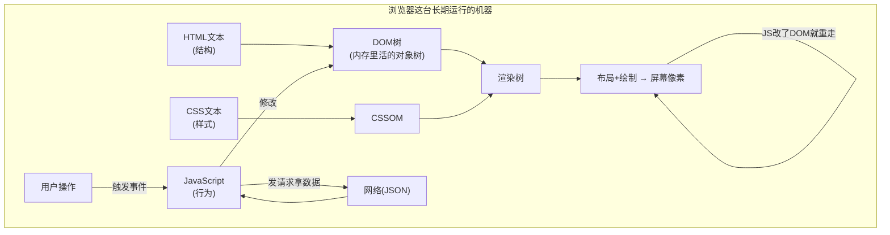

# 前端基础 - 第 1 课：浏览器到底在做什么，从一个网址到页面出现

## 学习目标（本节结束后你能做到什么）

- 说清楚浏览器和你熟悉的后端服务在“运行模型”上的根本区别。
- 讲出从输入网址到页面显示，浏览器大致经历了哪几个阶段。
- 分清 HTML、CSS、JavaScript 三者各自负责什么，以及它们怎么协作。
- 理解 DOM 是什么：它和你写的 HTML 是什么关系，又和 JavaScript 是什么关系。
- 建立“渲染管线”的直觉：DOM 树 → 渲染树 → 布局 → 绘制 → 合成。
- 明白页面为什么是“活的”，以及这跟后面学 React 有什么关系。

> 这一课不教任何具体语法。目的是先在你脑子里装一台“浏览器这台机器”的模型。后面学 HTML / CSS / JS / React，都是往这台机器的不同零件里填东西。模型对了，后面学得快；模型不对，后面全是死记。

## 内容讲解

### 1. 先用后端经验对齐：浏览器不是“请求-响应”，是一个长期运行的运行时

你写后端时，最熟悉的模型大概是这样：

```text
请求进来 → handler 执行 → 查数据库 → 返回响应 → 这次请求结束
```

一次请求有明确的开始和结束。处理完，这个请求的上下文（局部变量、内存）基本就可以释放了。下一次请求是另一段独立的生命周期。

浏览器**不是**这个模型。当你打开一个网页，浏览器更像是启动了一个**一直在运行的客户端程序**：

- 它把页面加载进来后，并不“结束”。
- 它持续等待用户操作：鼠标移动、点击、滚动、键盘输入。
- 它持续响应：用户点一下，页面可能就变一下。
- 它持续重绘：只要页面内容或样式变了，它就把变化画到屏幕上。

换句话说，后端的世界是“一问一答、答完即走”；浏览器的世界是“开机后一直待命，随时响应，随时重画”。这个差异是你理解一切前端行为的起点。

用一个类比：后端 handler 像一个**函数调用**，进去出来就完了；浏览器页面像一个**有状态的长期进程**，加载只是“启动”，真正的主体是它启动之后那段持续运行、持续响应事件的生命周期。



这就引出一个关键点：**前端的“状态”是活在这个长期运行的进程里的。** 用户输入了什么、当前选中哪一行、弹窗开没开——这些都是这个进程内存里的数据。后面 React 的 state，本质就是把这些“活在进程内存里的数据”管理起来。

### 2. 从输入网址到页面出现：中间发生了什么

你在地址栏敲下 `https://example.com` 回车，到屏幕上出现页面，中间这一连串过程，可以分成两大段。**前半段你作为后端比较熟，后半段才是前端的主场。**

**前半段（网络层，你已经熟悉）：**

1. **DNS 解析**：把域名 `example.com` 翻译成 IP 地址。类比你后端做服务发现，把服务名解析成实例地址。
2. **建立连接**：和服务器建立 TCP 连接（HTTPS 还要 TLS 握手）。
3. **发 HTTP 请求**：浏览器发出 `GET /` 请求。
4. **服务器返回响应**：响应体通常是一段 **HTML 文本**。

到这里为止，浏览器拿到的只是**一坨字符串**——一段 HTML 文本。它现在还不是页面，只是一份“描述页面长什么样”的文本。

**后半段（渲染层，前端的主场）：**

浏览器拿到这段 HTML 文本后，要把它变成你能看见、能交互的页面。这一步才是浏览器真正“干活”的地方，我们在第 4 节展开。


这里要破除一个常见误解：**服务器返回的不是“图片一样的页面”，而是一段文本指令。** 真正把文本变成像素的，是你电脑上的浏览器。同一段 HTML，在 Chrome、Safari、手机上画出来可能略有差异，因为“画”这一步是浏览器在本地做的。

### 3. 一个网页的三种原料：HTML、CSS、JavaScript

一个现代网页，几乎都是这三种东西组成的。它们分工非常清楚，理解这个分工，比记任何语法都重要。

| 原料 | 负责什么 | 后端类比 | 一句话 |
| --- | --- | --- | --- |
| HTML | **结构**：页面里有什么内容、怎么嵌套 | 数据结构 / Schema / DTO | 这是“有什么” |
| CSS | **样式**：这些内容长什么样、怎么排版 | 渲染配置 / 样式规则表 | 这是“长什么样” |
| JavaScript | **行为**：页面怎么响应交互、怎么变化 | 业务逻辑层 | 这是“怎么动” |

举个具体例子，一个“登录”按钮：

- **HTML** 说：这里有一个按钮，按钮上的文字是“登录”。
- **CSS** 说：这个按钮是蓝色背景、白色文字、圆角、鼠标移上去变深一点。
- **JavaScript** 说：用户点这个按钮时，去校验表单、发登录请求、根据结果改页面。

三者的边界感非常重要。前端代码乱，很多时候就是因为三者搅在一起：结构里写死了样式、逻辑里手动拼 HTML 字符串。理解了“结构 / 样式 / 行为”三层分工，你看任何前端代码（包括 React 的 JSX）都能问一句：这行是在描述结构、设置样式、还是定义行为？

> 注意：React 的 JSX 看起来把 HTML 和 JS“混”在一起了，这会在 React 第 1 课让很多人不舒服。但 JSX 不是打破了这个分工，而是把“结构”和“行为”在**组件粒度**上放到一起，因为对一个按钮来说，“显示什么文字”和“点击做什么”本来就强相关。这个我们到 React 部分再细说，现在先把三层分工记牢。

### 4. 浏览器的渲染管线：从 HTML 文本到屏幕像素

这是本课的核心。浏览器拿到 HTML 文本后，要经过一条“流水线”才能变成屏幕上的画面。这条流水线叫**渲染管线（rendering pipeline）**。

我们一步步拆：

**第 1 步：解析 HTML，构建 DOM 树**

浏览器从上到下读 HTML 文本，把每个标签变成内存里的一个“节点对象”，并按照嵌套关系组织成一棵**树**。这棵树就叫 **DOM 树**（Document Object Model，文档对象模型）。

比如这段 HTML：

```html
<body>
  <h1>用户列表</h1>
  <ul>
    <li>张三</li>
    <li>李四</li>
  </ul>
</body>
```

会变成这样一棵树：



**关键认知：DOM 是 HTML 在内存里的“活的”对象表示，不是 HTML 文本本身。** HTML 是写在文件里的死字符串；DOM 是浏览器把它读进来后，在内存里建好的一棵对象树。这棵树是“活的”——后面 JavaScript 可以增删改这棵树上的节点，页面就会跟着变。

**第 2 步：解析 CSS，构建 CSSOM**

浏览器同时把 CSS 也解析成一棵树状结构，叫 **CSSOM**（CSS Object Model）。它描述了每个元素最终应该应用哪些样式。

**第 3 步：合并成渲染树（Render Tree）**

浏览器把 DOM 树和 CSSOM 合起来，得到**渲染树**：它只包含“需要显示出来的节点”，并且每个节点都带上了它最终的样式。（比如设置了 `display: none` 的元素，在 DOM 树里有，但不会进渲染树，因为它不显示。）

**第 4 步：布局（Layout / Reflow）**

有了渲染树，浏览器开始算**每个元素具体放在哪里、多大**：这个按钮在屏幕的什么坐标、宽多少、高多少、和旁边元素隔多远。这一步叫布局。

**第 5 步：绘制（Paint）**

布局算好了位置和大小，浏览器开始**真正往屏幕上画像素**：填颜色、画文字、画边框、画背景。

**第 6 步：合成（Composite）**

把不同的图层按正确的层叠顺序合成到一起，最终显示在屏幕上。



你现在不需要记住每一步的细节。**真正要记住的是这条因果链**：内容（DOM）和样式（CSSOM）决定了渲染树，渲染树经过布局算出位置、经过绘制变成像素。任何时候页面看起来不对，问题一定出在这条链的某一环。

### 5. 为什么页面是“活的”：JavaScript 改 DOM，浏览器重新走管线

如果只有 HTML 和 CSS，页面画出来就是**静态**的——内容固定，不会动。它能滚动、能点链接跳转，但页面本身的内容不会因为你的操作而改变。

让页面“活起来”的，是 **JavaScript**。JavaScript 在浏览器里能做一件关键的事：**修改那棵 DOM 树**。

比如用户点了“加载更多”，JavaScript 可以往 `<ul>` 里再插入几个 `<li>` 节点。一旦 DOM 树变了，浏览器就会**重新走一遍渲染管线的后半段**：重新布局、重新绘制，于是屏幕上就多出了几行。


这就是前端交互的最底层真相：**所有页面变化，归根结底都是 DOM 被改了，然后浏览器重画。** 不管你用 jQuery、用原生 JS、还是用 React，最终落到屏幕上的那一步，都是“DOM 变了 → 浏览器重新布局绘制”。

理解这一点，你就能看穿很多框架的本质：

- **原生 JS / jQuery**：你**亲手**写代码去改 DOM。要改哪个节点、改成什么，全是你一句句命令出来的。这叫**命令式（imperative）**。
- **React**：你**不直接**碰 DOM。你只描述“当前状态下页面应该长什么样”，React 帮你算出 DOM 该怎么变、然后替你去改。这叫**声明式（declarative）**。

注意：React 并没有绕过浏览器的渲染管线，它最终还是要改 DOM、还是要让浏览器重画。它只是**把“手动改 DOM”这件又繁琐又容易出错的事，从你手里接管过去了**。所以你必须先懂浏览器这一层，才能真正理解 React 帮你省了什么、它的“快”和“慢”到底发生在哪。

### 6. JavaScript 在浏览器里的运行环境

JavaScript 这门语言本身，和“浏览器”是两回事。语言是语言，运行环境是运行环境。同一门 JavaScript，可以跑在浏览器里，也可以跑在服务器上（Node.js）。

在**浏览器**这个运行环境里，JavaScript 被给了一些特殊的“全局对象”，让它能操作页面：

- **`window`**：代表整个浏览器窗口，是浏览器里最顶层的全局对象。你定义的全局变量、能用的全局函数，基本都挂在它上面。
- **`document`**：代表当前这个页面，是你操作 DOM 树的入口。比如 `document.querySelector("button")` 就是“在这棵 DOM 树里找一个按钮节点”。

也就是说，JavaScript 语言负责“算逻辑”，而浏览器通过 `window`、`document` 这些对象，给了 JavaScript 一组“操作页面的工具”。这组工具统称 **Web API / DOM API**。

还有一个对你后端背景很重要的点：**浏览器里的 JavaScript 是单线程的。** 同一时刻只有一个线程在跑你的 JS 代码。这意味着如果你写了一段很耗时的同步计算，整个页面会**卡住**——用户点什么都没反应，因为那个唯一的线程正忙着算你的代码，腾不出手响应点击。

那网络请求那种“要等好几百毫秒”的操作怎么办？总不能让页面卡几百毫秒。答案是**异步**：JS 发起请求后不傻等，而是“挂一个回调，先去干别的，等响应回来了再回头处理”。这套机制叫**事件循环（event loop）**，是第 7 课的主题。现在你只要记住：**单线程 + 异步**是浏览器里 JavaScript 的基本性格，这也是为什么前端代码里到处是 `async`、`Promise`、回调。

### 7. 网页形态的演进：静态页 → 动态页 → SPA

把上面的东西串起来，你就能看懂网页这几十年是怎么演进的，也能看懂 React 站在哪个位置。

**阶段一：纯静态页面**

服务器返回一段写死的 HTML，浏览器画出来，没有 JavaScript，页面不会变。像一张电子海报。

**阶段二：服务端渲染的动态页面（传统多页应用）**

每次你点一个链接、提交一个表单，浏览器就**向服务器要一个新的 HTML 页面**，整页刷新重画。后端用模板引擎（类似你可能见过的 JSP、Thymeleaf、PHP）把数据填进 HTML 再吐给浏览器。

- 特点：**每次交互都重新加载整个页面**，页面会“白一下”再出来。
- 状态主要活在**服务端**，前端基本是“展示后端给的 HTML”。

**阶段三：单页应用（SPA，Single Page Application）**

浏览器**只加载一次** HTML 外壳，之后所有的页面变化都由 **JavaScript 在前端动态改 DOM** 完成，不再整页刷新。需要新数据时，JavaScript 在后台发请求拿 **数据（通常是 JSON）**，再自己把数据变成 DOM 更新上去。

- 特点：交互流畅，不整页刷新，体验接近桌面软件。
- 代价：前端复杂度暴涨——大量状态、大量 DOM 操作、大量异步请求，全压到前端这个长期运行的进程里。

**React 就是为了驯服“阶段三”的复杂度而生的。** 当页面状态多到一定程度，纯手工改 DOM 会失控（这个失控感你会在第 8 课亲手体验），React 用 `UI = f(state)` 的声明式模型把这个复杂度管理起来。



### 8. 把这一课收束成一张心智图



读这张图的顺序：HTML 进来变成 DOM 树，CSS 变成 CSSOM，合成渲染树，布局绘制成像素。然后 JavaScript 站在中间——它响应用户操作、发网络请求拿数据、修改 DOM 树，从而让页面持续变化。这台机器加载完不会停，它一直在“等事件 → 改 DOM → 重画”这个循环里转。

把这张图记牢。后面每一课，都是在给这张图的某个零件填细节：

- HTML 课 → 怎么写出那棵 DOM 树的来源。
- CSS 课 → 怎么影响渲染树的样式、布局。
- JavaScript 课 → 那个站在中间“算逻辑、改 DOM、发请求”的家伙怎么写。
- DOM 与事件课 → JavaScript 具体怎么改 DOM、怎么接住用户操作。
- React → 把“JavaScript 手动改 DOM”这件事自动化、声明式化。

## 小结（关键点）

- 浏览器不是“请求-响应即结束”，而是一个**加载后持续运行、持续响应事件、持续重绘**的客户端运行时；前端的状态活在这个长期进程里。
- 服务器返回的是 **HTML 文本**，不是画好的页面；把文本变成像素的渲染过程，是在你本地的浏览器里完成的。
- 一个网页由三种原料组成，分工明确：**HTML 管结构、CSS 管样式、JavaScript 管行为**。
- **DOM 是 HTML 在内存里的活的对象树**，是 JavaScript 操作页面的唯一入口；渲染管线是“DOM + CSSOM → 渲染树 → 布局 → 绘制”。
- 页面之所以“活”，是因为 **JavaScript 改 DOM，浏览器就重走渲染管线**；不管什么框架，最终都落到这一步。
- 浏览器里的 JavaScript 是**单线程 + 异步**的；React 解决的是 SPA 形态下“手动改 DOM 会失控”的复杂度问题，但它没有绕过浏览器渲染管线。

## 问题（检测理解）

1. 用你自己的话说清楚：浏览器的运行模型和后端的“请求-响应”模型，根本区别在哪里？这个区别为什么会影响“前端状态存在哪里”？
2. 你在地址栏输入一个网址回车，到页面出现，大致经历了哪几个阶段？哪一段是你后端熟悉的，哪一段是前端特有的？
3. HTML、CSS、JavaScript 分别负责什么？请各举一个“登录按钮”上的例子。
4. DOM 是什么？它和你写在文件里的 HTML 文本是什么关系？为什么说它是“活的”？
5. 页面上点“加载更多”后多出几行数据，从“DOM 和渲染管线”的角度解释这中间发生了什么。
6. 为什么说浏览器里的 JavaScript 是单线程会带来麻烦？它靠什么机制处理网络请求这种耗时操作而不卡死页面？
7. 静态页面、传统动态页面、SPA 三者的核心区别是什么？React 是在解决哪个阶段的什么问题？

把你的答案直接告诉我。我会根据你的回答判断第 1 课是否掌握，再决定进入第 2 课（HTML），还是先把浏览器模型这块再夯一夯。
