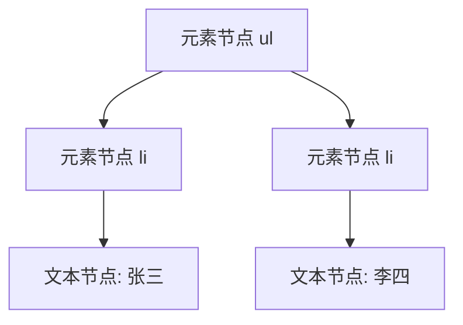
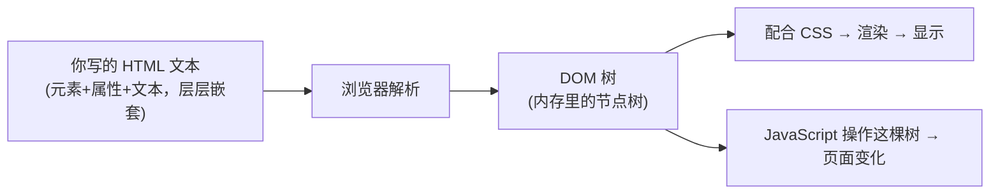

# 前端基础 - 第 2 课：HTML，网页的结构，也是 DOM 树的来源

## 学习目标（本节结束后你能做到什么）

- 说清楚 HTML 到底是什么：它不是排版工具，而是“结构 + 语义”的描述语言。
- 看懂一份 HTML 文档的骨架，知道 `head` 和 `body` 各放什么。
- 理解“元素 / 标签 / 属性 / 文本”这几个术语，以及它们怎么对应到第 1 课讲的 DOM 树。
- 认识最常用的一批元素，按“结构 / 文本 / 列表 / 链接图片 / 表格 / 表单”归类记忆。
- 分清块级元素和行内元素的直觉差异。
- 理解“语义化”为什么重要，以及为什么不该所有东西都用 `div`。
- 重点掌握表单元素——它们是后面 React“受控组件”的底子。

> 接着第 1 课的模型：HTML 是渲染管线的**第一步原料**，浏览器读它、建出 DOM 树。所以学 HTML 本质上就是在学“怎么写出一棵结构合理的 DOM 树”。

## 内容讲解

### 1. HTML 是什么：用标签给内容“贴标签”

HTML 全称 HyperText Markup Language，**超文本标记语言**。关键词是“标记（markup）”——它的工作是给一段内容**贴上结构标签**，告诉浏览器“这块是标题、这块是段落、这块是列表、这块是按钮”。

注意它**不是编程语言**：没有变量、没有循环、没有逻辑判断。它只是一种“结构描述”。用后端类比，HTML 更像是一份**数据结构定义 / Schema**，它描述“这份文档里有哪些部分、怎么嵌套”，但完全不管这些部分长什么样（那是 CSS 的事）、怎么响应交互（那是 JavaScript 的事）。

最小的例子：

```html
<h1>用户管理</h1>
<p>这里是用户列表页面。</p>
```

- `<h1>...</h1>` 标记“这是一级标题”。
- `<p>...</p>` 标记“这是一个段落”。

浏览器看到 `h1` 就知道“这是最重要的标题，画大一点、粗一点”；看到 `p` 就知道“这是正文段落”。**你没有写任何样式，浏览器却能画出有层次的页面**——因为标签本身就带了默认含义和默认样式。

### 2. 术语对齐：元素、标签、属性、文本节点

这几个词后面到处用，先一次性说清楚。看这一行：

```html
<a href="https://example.com">官网首页</a>
```

- **标签（tag）**：`<a>` 是开始标签，`</a>` 是结束标签。标签像一对括号，框住一段内容。
- **元素（element）**：开始标签 + 内容 + 结束标签，合起来这一整个 `<a ...>官网首页</a>` 叫一个元素。日常口语里“元素”和“标签”经常混着说，但严格讲，元素是整体，标签是那对尖括号。
- **属性（attribute）**：写在开始标签里的 `href="https://example.com"`。它给元素附加配置——这里是“这个链接指向哪”。属性都是 `名字="值"` 的形式。
- **文本节点（text node）**：`官网首页` 这段文字，它也是 DOM 树里的一个节点（叶子节点）。

有些元素没有内容，是**自闭合**的，比如图片和换行：

```html

<br>
```

`img` 不包文本，它靠属性 `src`（图片地址）就够了。

把这些对应回第 1 课的 DOM 树：**每个元素是树上的一个节点，属性是挂在节点上的配置，文本是叶子节点，嵌套关系就是父子关系。**

```html
<ul>
  <li>张三</li>
  <li>李四</li>
</ul>
```



**你写 HTML，就是在写这棵树的结构。** 浏览器把这段文本读进来，在内存里建出上面这棵 DOM 树，然后 JavaScript 才能去操作它。

### 3. 一份 HTML 文档的骨架

单独几个标签能跑，但一份完整网页有固定骨架：

```html
<!DOCTYPE html>
<html lang="zh-CN">
  <head>
    <meta charset="UTF-8">
    <meta name="viewport" content="width=device-width, initial-scale=1.0">
    <title>用户管理系统</title>
    <link rel="stylesheet" href="style.css">
  </head>
  <body>
    <h1>用户管理</h1>
    <p>欢迎使用。</p>
    <script src="app.js"></script>
  </body>
</html>
```

逐块解释：

- `<!DOCTYPE html>`：声明“这是一份 HTML5 文档”。固定写法，放第一行。
- `<html lang="zh-CN">`：整个文档的根元素，`lang` 告诉浏览器和搜索引擎这是中文页面。
- `<head>`：**头部信息区，里面的东西不直接显示在页面上**。它放的是“关于这个页面的元信息和资源引用”：
  - `<meta charset="UTF-8">`：字符编码，保证中文不乱码。
  - `<meta name="viewport" ...>`：移动端适配，告诉手机浏览器按设备宽度渲染。
  - `<title>`：浏览器标签页上显示的标题。
  - `<link rel="stylesheet" href="style.css">`：引入外部 CSS 文件。
- `<body>`：**页面主体，用户真正看到的内容都在这里。**
  - `<script src="app.js">`：引入 JavaScript 文件，通常放在 `body` 末尾（让页面内容先出来，再加载脚本）。

记住这个分工：**`head` 装“元信息和资源”，`body` 装“可见内容”。** 第 1 课说的“DOM 树”主要指 `body` 里这部分（虽然严格说 `head` 也在 DOM 里）。

### 4. 常用元素：按用途分六类记

元素有上百个，但日常 80% 的场景就用这几类。别死记，按用途归类。

**(1) 结构 / 容器类——把页面分块**

```html
<div>最通用的块级容器，没有特殊含义，纯粹用来分组</div>
<span>最通用的行内容器，用来包一小段文字</span>

<header>页头</header>
<nav>导航</nav>
<main>页面主内容</main>
<section>一个独立区块</section>
<article>一篇独立内容（如一条评论、一篇文章）</article>
<footer>页脚</footer>
```

`div` 和 `span` 是“无语义容器”，纯粹用来包裹和分组；`header`、`nav`、`main` 这些是“语义容器”，名字本身说明了这块是干嘛的（第 6 节展开为什么要用它们）。

**(2) 文本类——标记文字的角色**

```html
<h1>一级标题</h1>
<h2>二级标题</h2>
<!-- h1 到 h6，数字越大级别越低 -->

<p>一个段落。</p>
<strong>重要（默认加粗）</strong>
<em>强调（默认斜体）</em>
<br> <!-- 换行 -->
```

**(3) 列表类**

```html
<!-- 无序列表（圆点） -->
<ul>
  <li>苹果</li>
  <li>香蕉</li>
</ul>

<!-- 有序列表（数字） -->
<ol>
  <li>第一步</li>
  <li>第二步</li>
</ol>
```

`ul`/`ol` 是列表容器，`li` 是列表项。后面 React 用 `map` 渲染列表，渲染出来的就是一堆 `li`。

**(4) 链接与图片**

```html
<a href="/users">跳转到用户页</a>
<a href="https://example.com" target="_blank">新标签页打开外链</a>


```

- `a` 是链接（anchor），`href` 是目标地址，`target="_blank"` 表示新标签页打开。
- `img` 是图片，`src` 是图片地址，`alt` 是图片加载失败或读屏软件用的替代文字。

**(5) 表格类**

```html
<table>
  <thead>
    <tr>
      <th>姓名</th>
      <th>年龄</th>
    </tr>
  </thead>
  <tbody>
    <tr>
      <td>张三</td>
      <td>28</td>
    </tr>
    <tr>
      <td>李四</td>
      <td>32</td>
    </tr>
  </tbody>
</table>
```

- `table` 表格，`thead`/`tbody` 表头区/主体区。
- `tr` 是一行（table row），`th` 是表头单元格，`td` 是数据单元格。
- 后台管理系统的列表页大量用到表格，记住 `tr > td` 这个结构就够。

**(6) 表单类——这一类最重要，单独一节讲（第 7 节）。**

### 5. 块级元素 vs 行内元素

这是 HTML 里一个绕不开的直觉，先建立感觉，CSS 课（第 3 课）再深入。

- **块级元素（block）**：默认**独占一行**，从左到右尽量撑满，前后会换行。比如 `div`、`p`、`h1`、`ul`、`li`、`section`。它们像“一段一段的砖块”，垂直堆叠。
- **行内元素（inline）**：默认**不换行**，和相邻内容排在同一行，宽度由内容决定。比如 `span`、`a`、`strong`、`em`、`img`。它们像“一句话里的词”，水平排列。

```html
<p>这是一段话，里面有一个 <a href="#">链接</a> 和一个 <strong>加粗词</strong>。</p>
```

这里 `p` 是块级（独占一行），但 `a` 和 `strong` 是行内（嵌在句子里，不换行）。

为什么要分这两类？因为它们的**默认排版行为不同**——块级垂直堆叠、行内水平排列。理解了这个，你才能解释“为什么我两个 `div` 总是上下排，而两个 `span` 却挤在一行”。这背后是第 3 课要讲的“文档流”。

### 6. 语义化：为什么不全用 `div`

技术上，你确实可以用 `div` 包一切：

```html
<div class="header">...</div>
<div class="nav">...</div>
<div class="main">...</div>
```

浏览器照样画得出来。那为什么还要 `header`、`nav`、`main` 这些语义标签？三个理由：

1. **可访问性（accessibility）**：盲人用读屏软件浏览网页，读屏软件靠语义标签判断“这是导航、这是主内容、这是标题”。一堆没区别的 `div`，读屏软件无从下手。`<button>` 天生能用键盘聚焦和回车触发，而 `<div onclick>` 不行——你得自己补一堆无障碍属性。
2. **SEO（搜索引擎优化）**：搜索引擎爬虫靠语义标签理解页面结构，知道哪块是正文、哪块是导航，从而更好地收录排名。
3. **可维护性**：`<nav>` 一眼就知道是导航区，`<div class="nav">` 还要去看 class 名甚至 CSS 才能确认。代码自解释，后人接手更快。

一句话原则：**有合适的语义标签就用语义标签，实在只是“为了布局而分组”才用 `div`/`span`。** 这和后端“能用领域明确的类型就别用 `Map<String, Object>` 兜底”是一个道理——表达力越强，越不容易出错、越好维护。

### 7. 表单元素：React 受控组件的底子

表单是用户**向页面输入数据**的入口：输入框、下拉、勾选、按钮。后台系统里几乎每个页面都有表单。而且，**React 的“受控组件”就是建立在表单元素之上的**，所以这一节要重点理解。

**输入框 `input`**

`input` 是个万能元素，靠 `type` 属性决定它是哪种输入：

```html
<input type="text" placeholder="请输入用户名">
<input type="password" placeholder="请输入密码">
<input type="number" value="18">
<input type="checkbox"> 同意协议
<input type="radio" name="gender" value="male"> 男
<input type="radio" name="gender" value="female"> 女
```

几个关键属性：

- `type`：输入类型（text 文本、password 密码、number 数字、checkbox 复选、radio 单选……）。
- `placeholder`：占位提示文字（灰色提示，不是真实值）。
- `value`：输入框当前的值。**这个属性极其关键**——它代表“框里现在是什么内容”。
- `name`：表单字段名，提交时用来标识这个字段。同名的 radio 互斥（同组只能选一个）。

**下拉选择 `select`**

```html
<select>
  <option value="beijing">北京</option>
  <option value="shanghai">上海</option>
</select>
```

`select` 是下拉框，每个 `option` 是一个选项，`value` 是该选项的实际值。

**多行文本 `textarea`**

```html
<textarea placeholder="请输入备注"></textarea>
```

**标签 `label`：把说明文字和控件关联起来**

```html
<label for="username">用户名</label>
<input id="username" type="text">
```

`label` 的 `for` 指向 `input` 的 `id`，关联后点击文字也能聚焦到输入框，对无障碍也友好。

**按钮 `button`**

```html
<button type="button">普通按钮</button>
<button type="submit">提交表单</button>
```

注意 `type`：`submit` 会触发表单提交（默认行为是刷新页面），`button` 是普通按钮、不提交。React 里经常要阻止这个默认提交行为，这个我们到 React 部分会遇到。

**为什么这一节对 React 这么重要？** 因为原生表单有个特点：**输入框的值是它自己内部维护的**——你在框里打字，框自己记着内容，JavaScript 不一定知道。这在复杂表单里会带来“数据源不唯一”的问题。React 的“受控组件”就是把这个 `value` 收归到 React 的 state 来管：框里显示什么，由 state 说了算；用户打字时，先更新 state，再由 state 决定框里的值。现在你先把 `input` 的 `value`、`onchange`（值变化）这两个概念记住，到 React 第 3 课就会无缝衔接。

### 8. HTML 和 JSX 的几个差异（预告）

你后面写 React 的 JSX 时，会发现它“长得像 HTML 但不完全是”。这里先打个预防针，避免到时候困惑：

| HTML 写法 | JSX 写法 | 原因 |
| --- | --- | --- |
| `class="box"` | `className="box"` | `class` 在 JavaScript 里是保留字 |
| `for="username"` | `htmlFor="username"` | `for` 也是 JS 保留字 |
| `onclick="..."` | `onClick={...}` | JSX 用驼峰命名，且传的是函数 |
| 标签可以不闭合，如 `<br>` | 必须闭合，如 `<br />` | JSX 更严格 |
| 纯文本 | `{表达式}` 插值 | JSX 里能嵌 JavaScript 表达式 |

本质原因：**JSX 不是 HTML，它是“用类 HTML 语法写的 JavaScript”**，最终会被编译成 JavaScript 代码。所以它要遵守 JavaScript 的规则（保留字、严格闭合）。这个第 1 课提过，到 React 第 2 课会专门讲。现在你只要知道：**先学好真正的 HTML，JSX 的那些差异点是后面很小的增量。**

### 9. 收束：HTML 就是在描述那棵 DOM 树

把这一课收回到第 1 课的模型：



所以你写 HTML 时，脑子里要有这棵树：

- 标签的**嵌套**就是节点的**父子关系**——别乱套，比如 `li` 必须在 `ul`/`ol` 里、`td` 必须在 `tr` 里。
- 标签的**选择**决定了节点的**语义**——能用语义标签别全用 `div`。
- 属性是挂在节点上的**配置**——`id`、`class` 后面给 CSS 和 JS 用来定位元素。

学到这，你已经能写出一个静态页面的“骨架”了。但它现在还很丑、不会动——下一课（CSS）让它有样子，再后面（JavaScript）让它动起来。

## 小结（关键点）

- HTML 是**标记语言不是编程语言**，作用是给内容贴结构/语义标签；它是渲染管线的第一步原料，浏览器读它建出 DOM 树。
- 术语：标签是尖括号对，元素是“开始标签+内容+结束标签”的整体，属性是标签里的 `名字="值"` 配置，文本是叶子节点；**嵌套关系=DOM 树的父子关系**。
- 文档骨架：`head` 装元信息和资源引用（不显示），`body` 装可见内容。
- 常用元素按六类记：结构容器 / 文本 / 列表 / 链接图片 / 表格 / 表单。
- 块级元素默认独占一行垂直堆叠，行内元素默认同行水平排列。
- **语义化**（用 `header`/`nav`/`button` 而非清一色 `div`）对无障碍、SEO、可维护性都重要。
- 表单元素（尤其 `input` 的 `value`）是 React 受控组件的底子，要重点理解。

## 问题（检测理解）

1. HTML 是编程语言吗？它到底负责什么？用后端的什么概念类比最贴切？
2. 给你这段 HTML，画出它对应的 DOM 树：`<ul><li>A<strong>!</strong></li><li>B</li></ul>`。
3. `head` 和 `body` 分别放什么？`<title>`、`<meta charset>`、`<h1>` 各应该放哪个里面？
4. 块级元素和行内元素的默认排版行为有什么区别？`div`、`span`、`p`、`a` 各属于哪类？
5. 为什么不推荐用一堆 `div` 拼出整个页面？语义化能带来哪些好处？
6. 一个登录表单需要：用户名输入框、密码输入框、“记住我”勾选、提交按钮。请用 HTML 把它写出来，并给输入框配上 `label`。
7. `input` 的 `value` 属性代表什么？为什么说它是 React“受控组件”的关键？
8. JSX 和 HTML 至少有哪两处写法差异？背后的根本原因是什么？

把你的答案直接发我。我据此判断第 2 课是否掌握，再决定进第 3 课（CSS）还是先补 HTML。
