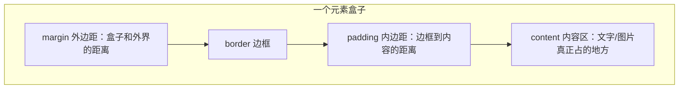
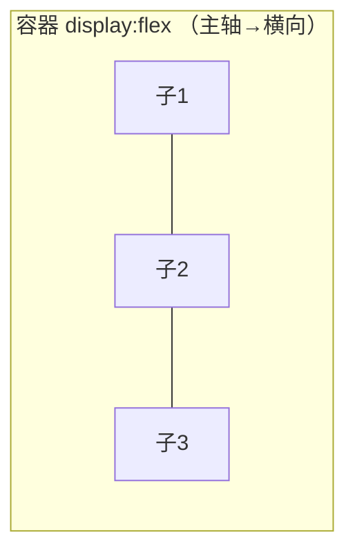
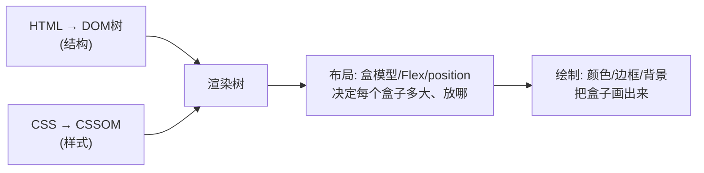

# 前端基础 - 第 3 课：CSS，盒模型、布局与样式怎么作用到元素上

## 学习目标（本节结束后你能做到什么）

- 说清楚 CSS 是什么、它在第 1 课的渲染管线里作用在哪一步。
- 知道把 CSS 关联到 HTML 的三种方式，以及为什么推荐外部样式表。
- 看懂一条 CSS 规则的结构：选择器 + 声明块，并掌握最常用的几类选择器。
- 真正理解**盒模型**——每个元素都是一个盒子，由 content / padding / border / margin 组成。
- 建立**文档流**直觉，分清 block / inline / inline-block，会用 `display`。
- 掌握现代布局主力 **Flexbox**，并对 **Grid** 有概念。
- 理解 `position` 定位、层叠 `z-index`、常用单位、优先级与继承。
- 知道 CSS 在 React 项目里大致怎么写（className、CSS Modules、Tailwind 等）。

> 接着模型走：HTML 给了浏览器 DOM 树，CSS 给浏览器的是 CSSOM。两者合成渲染树后，CSS 主要影响**布局（元素多大、放哪）和绘制（什么颜色、什么边框）**。所以学 CSS，就是学“怎么控制渲染管线里的样式和布局这两步”。

## 内容讲解

### 1. CSS 是什么，怎么和 HTML 关联

CSS 全称 Cascading Style Sheets，**层叠样式表**。它的唯一职责是：**描述元素长什么样、怎么排布**。颜色、字号、间距、宽高、对齐、布局，全是 CSS 管。

HTML 不写样式也能显示（靠浏览器默认样式），但那很丑、布局也不可控。CSS 就是来接管“样子”这件事的，让结构（HTML）和表现（CSS）彻底分离。

把 CSS 接到 HTML 上有三种方式：

```html
<!-- 方式1：行内样式（inline），直接写在元素的 style 属性里 -->
<p style="color: red; font-size: 16px;">这是红字</p>

<!-- 方式2：内部样式表，写在 head 的 <style> 里 -->
<head>
  <style>
    p { color: red; }
  </style>
</head>

<!-- 方式3：外部样式表（推荐），单独的 .css 文件，用 link 引入 -->
<head>
  <link rel="stylesheet" href="style.css">
</head>
```

**推荐外部样式表**，原因和后端“配置与代码分离”一个道理：结构和样式各管各的文件，多个页面能共用一套样式，改样式不用动 HTML。行内样式只在临时调试或动态设置时才用。

> React 里反而行内样式（`style={{}}`）和组件级样式方案更常见，因为组件本身就把结构和样式收在一起了。这个第 12 节再说。

### 2. 一条 CSS 规则的结构

```css
selector {
  property: value;
  property: value;
}
```

```css
/* 选中所有 p 元素，把文字设为蓝色、字号 14px */
p {
  color: blue;
  font-size: 14px;
}
```

- **选择器（selector）**：`p`，决定“这条规则作用在哪些元素上”。
- **声明块（declaration block）**：`{ ... }` 里的部分。
- **声明（declaration）**：`color: blue;`，由**属性（property）`color`** 和 **值（value）`blue`** 组成，用冒号连，分号结尾。

一条规则可以有多条声明。整个 CSS 文件就是一堆这样的规则。**理解 CSS 的关键就两件事：(1) 选择器怎么选中元素，(2) 有哪些属性能调样式。**

### 3. 选择器：怎么选中元素

选择器是 CSS 的“定位语言”，类比后端你用 SQL 的 WHERE 选行。最常用的几类：

```css
/* 标签选择器：所有该标签的元素 */
p { color: gray; }

/* class 选择器：用 . 前缀，选中 class="card" 的元素（最常用！） */
.card { border: 1px solid #ddd; }

/* id 选择器：用 # 前缀，选中 id="header" 的元素（id 全页唯一） */
#header { height: 60px; }

/* 后代选择器：空格表示“嵌套在里面的” */
.card .title { font-weight: bold; }   /* .card 内部的 .title */

/* 多个选择器共用一组样式：逗号分隔 */
h1, h2, h3 { margin: 0; }

/* 伪类：元素在某种状态下的样式，用 : */
button:hover { background: #0066ff; }  /* 鼠标悬停时 */
input:focus { border-color: blue; }    /* 输入框聚焦时 */
```

实践中 **`class` 选择器是绝对主力**。原因：`id` 全页唯一、不可复用，而 `class` 可以给任意多个元素打同一个标签，灵活复用。所以你会看到 HTML 里到处是 `class="..."`，CSS 里到处是 `.xxx { }`。

回忆第 2 课：`class`、`id` 是 HTML 元素的属性。它们的主要用途之一，就是给 CSS（和 JavaScript）一个“抓手”来定位元素。

### 4. 盒模型：每个元素都是一个盒子

这是 CSS 最核心的概念，没有之一。**页面上每个元素，浏览器都把它看成一个矩形盒子。** 这个盒子由内到外分四层：



- **content**：内容本身，由 `width`/`height` 控制（或由内容撑开）。
- **padding**：内边距，**边框和内容之间**的空白。
- **border**：边框，有粗细、样式、颜色。
- **margin**：外边距，**这个盒子和别的盒子之间**的空白。

```css
.box {
  width: 200px;
  padding: 16px;       /* 四周内边距 16px */
  border: 1px solid #ccc;
  margin: 24px;        /* 四周外边距 24px */
}
```

**一个经典坑：`width` 默认只算 content，不含 padding 和 border。** 上面这个盒子，你以为它宽 200px，实际占的横向空间是 `200(content) + 16×2(padding) + 1×2(border) = 234px`。这经常导致“算好的宽度却撑破了布局”。

解决办法是一行几乎所有项目都会加的“全局设置”：

```css
* {
  box-sizing: border-box;
}
```

`box-sizing: border-box` 改变了 `width` 的含义：让 `width` 包含 content + padding + border。这样你写 `width: 200px`，盒子总宽就是 200px，padding 和 border 往里挤，**所见即所得，心算负担小很多**。记住这个设置，几乎是标配。

### 5. 文档流：block、inline 与 display

第 2 课说过块级 vs 行内，现在补上它背后的机制——**文档流（normal flow）**。浏览器默认像“从上到下、从左到右排字”一样依次摆放元素，这个默认的摆放规则就是文档流。

`display` 属性控制一个元素以哪种方式参与文档流：

```css
.a { display: block; }         /* 块级：独占一行，可设宽高 */
.b { display: inline; }        /* 行内：同行排列，宽高无效 */
.c { display: inline-block; }  /* 行内块：同行排列，但可设宽高 */
.d { display: none; }          /* 不显示，且不占空间（从渲染树移除） */
```

四种的区别要点：

| display | 是否换行 | 能否设 width/height | 典型场景 |
| --- | --- | --- | --- |
| `block` | 独占一行 | 能 | 段落、容器、卡片 |
| `inline` | 同行 | 不能 | 行内文字片段、链接 |
| `inline-block` | 同行 | 能 | 并排的按钮/标签，又想控制大小 |
| `none` | 不显示 | — | 隐藏元素 |

关于 `display: none` 有个第 1 课埋的点：设了它的元素**进了 DOM 树，但不进渲染树**——所以它彻底不显示、也不占位置。这区别于 `visibility: hidden`（看不见但仍占位置）。

但要注意：**现代布局已经很少靠手动调 block/inline 来排版了**，因为太费劲（想让几个盒子横向均匀排列、垂直居中，用文档流非常痛苦）。现代做法是把容器设成 Flex 或 Grid——这才是下面的重点。

### 6. Flexbox：现代布局主力

Flexbox（弹性盒）是目前最常用的布局方式，专门解决“一排/一列元素怎么对齐、怎么分配空间”。它的模型很简单：**给一个容器设 `display: flex`，它的直接子元素就会沿一条轴排列，你再控制怎么对齐、怎么分配剩余空间。**

```css
.container {
  display: flex;                  /* 开启 flex，子元素横向排成一行 */
  justify-content: space-between; /* 主轴（横向）上的分布 */
  align-items: center;            /* 交叉轴（纵向）上的对齐 */
  gap: 12px;                      /* 子元素之间的间距 */
}
```

两根轴是理解 Flex 的钥匙：

- **主轴（main axis）**：子元素排列的方向。默认横向（从左到右）。
- **交叉轴（cross axis）**：和主轴垂直的方向。默认纵向。



最常用的几个属性：

- `flex-direction: row | column`：主轴方向，`row` 横排，`column` 竖排。
- `justify-content`：主轴上怎么分布。常用值 `flex-start`（靠左）、`center`（居中）、`space-between`（两端对齐、中间均分）、`space-around`。
- `align-items`：交叉轴上怎么对齐。常用 `center`（垂直居中）、`flex-start`、`stretch`。
- `gap`：子元素间距。

一个高频场景——“两端对齐 + 垂直居中”的导航栏：

```css
.navbar {
  display: flex;
  justify-content: space-between; /* 左边 logo，右边按钮，中间撑开 */
  align-items: center;            /* 整行垂直居中 */
  height: 60px;
}
```

**“用 Flex 实现垂直水平居中”** 是前端最常被问的基础题，记住这个组合：`display: flex; justify-content: center; align-items: center;`，子元素就在容器正中间。

### 7. Grid：二维布局（先有概念）

Flex 擅长**一维**（一行或一列）。当你要的是**二维网格**（既分行又分列，比如仪表盘的卡片网格、复杂的页面布局），用 **Grid** 更合适。

```css
.grid {
  display: grid;
  grid-template-columns: repeat(3, 1fr); /* 三列等宽 */
  gap: 16px;
}
```

`grid-template-columns: repeat(3, 1fr)` 表示“分成 3 列，每列占 1 份剩余空间（fr = fraction）”。子元素会自动按行填进这些格子。

现在你只要建立一个判断直觉：**一行/一列对齐用 Flex；规整的二维网格用 Grid。** 细节用到再查，不必死记。

### 8. position：定位与层叠

正常情况下元素都待在文档流里，乖乖按顺序排。`position` 让你把元素**从常规流里“拎出来”**，放到你指定的位置。

```css
.x { position: static; }   /* 默认值，老老实实待在文档流里 */
.x { position: relative; } /* 相对自己原来的位置偏移，原位置仍占着 */
.x { position: absolute; } /* 相对最近的定位祖先精确定位，脱离文档流 */
.x { position: fixed; }    /* 相对浏览器窗口固定，滚动也不动 */
.x { position: sticky; }   /* 滚动到某位置后“粘”住 */
```

配合 `top`/`right`/`bottom`/`left` 指定偏移：

```css
/* 一个固定在右下角的“回到顶部”按钮 */
.back-to-top {
  position: fixed;
  right: 24px;
  bottom: 24px;
}
```

当多个元素重叠时，用 **`z-index`** 决定谁盖在上面（值越大越靠前）。弹窗、下拉菜单、提示气泡这些“浮在内容之上”的东西，都靠 `position` + `z-index` 实现。

```css
.modal { position: fixed; z-index: 1000; } /* 弹窗盖在所有内容上面 */
```

### 9. 常用单位

CSS 的尺寸值有多种单位，分两类：

**绝对单位**

- `px`：像素，最常用、最直观。`font-size: 16px`。

**相对单位**（会随某个参照变化，做响应式更灵活）

- `%`：相对父元素。`width: 50%` 是父元素宽度的一半。
- `rem`：相对**根元素**（`html`）的字号。根默认 16px，则 `1rem = 16px`、`1.5rem = 24px`。改根字号能整体缩放，做响应式很方便。
- `em`：相对**当前元素**的字号，容易因嵌套层层放大，用得比 rem 少。
- `vw` / `vh`：视口宽 / 高的 1%。`100vh` 是整个屏幕高度，常用于做“占满一屏”的区块。

新手期：**字号和间距优先用 `rem`，要占满屏幕用 `vw/vh`，需要随父元素用 `%`，其余场合 `px` 也完全够用。**

### 10. 层叠、优先级与继承

CSS 叫“层叠样式表”，“层叠（cascading）”就是指：当多条规则同时作用到一个元素、又互相冲突时，浏览器怎么决定听谁的。

**优先级（specificity）** 大致规则，从高到低：

1. 行内样式 `style="..."`（最高）
2. id 选择器 `#header`
3. class 选择器 `.card`、伪类 `:hover`
4. 标签选择器 `p`、`div`（最低）

```css
p { color: black; }          /* 优先级低 */
.intro { color: blue; }      /* 优先级higher，赢 */
/* <p class="intro"> 最终显示蓝色 */
```

冲突时高优先级覆盖低优先级；优先级相同则“后写的覆盖先写的”。`!important` 能强行提到最高，但**应尽量少用**——它破坏了正常的层叠规则，会让后续维护很难再覆盖它，是常见的“技术债”。

**继承（inheritance）**：有些属性会从父元素自动传给子元素，主要是文字相关的（`color`、`font-size`、`font-family`）。所以你给 `body` 设个字体颜色，全页文字都跟着变。但布局相关的（`width`、`margin`、`border`）不继承。

### 11. 响应式：让页面适配不同屏幕

同一个页面要在宽屏电脑和窄屏手机上都好看，靠**媒体查询（media query）**：根据屏幕宽度应用不同样式。

```css
/* 默认（手机优先）：一列 */
.list { display: grid; grid-template-columns: 1fr; }

/* 屏幕宽度 ≥ 768px 时：改成三列 */
@media (min-width: 768px) {
  .list { grid-template-columns: repeat(3, 1fr); }
}
```

`@media (min-width: 768px) { ... }` 的意思是“当视口宽度至少 768px，才应用这组样式”。这样手机上是一列、平板/电脑上是三列。这就是“响应式设计”的基本手段。新手期了解原理即可，真实项目里组件库通常已经帮你处理了大部分响应式。

### 12. CSS 在 React 项目里怎么写（预告）

React 不改变 CSS 本身，但提供了几种**组织 CSS 的方式**，到 React 工程化部分会细讲，这里先混个脸熟：

- **className + 普通 CSS 文件**：最接近原生，HTML 的 `class` 在 JSX 里写成 `className`，照样引一个 `.css` 文件。
- **CSS Modules**：每个组件配一个 `.module.css`，类名自动局部化，避免全局类名冲突。
- **CSS-in-JS**（如 styled-components）：直接在 JS 里写样式，和组件绑在一起。
- **Tailwind CSS**：用一堆预定义的原子类（`flex`、`p-4`、`text-center`）直接拼样式，现在非常流行。
- **组件库**（Ant Design、MUI 等）：直接用现成的、已带好样式的组件，后台系统里极常见，能省掉大量手写 CSS。

这些都只是“CSS 怎么组织和复用”的不同流派，**底层的盒模型、Flex、选择器这些知识完全通用**。所以这一课的内容，无论你将来用哪种方案都用得上。

### 13. 收束：CSS 作用在渲染管线哪一步

回到第 1 课的渲染管线：



把这一课的知识点对号入座：

- **盒模型、display、Flex、Grid、position** → 主要影响**布局**这一步（元素多大、放哪、怎么排）。
- **颜色、字体、边框、背景** → 主要影响**绘制**这一步（盒子里填什么、画成什么样）。
- **选择器** → 决定哪条样式落到哪个 DOM 节点上。

所以 CSS 不是“随便调调好看”，它是在**精确控制渲染管线的布局和绘制**。理解了这层，你调样式时就不是瞎试，而是知道自己在动管线的哪一环。

## 小结（关键点）

- CSS 负责“样子和排布”，作用在渲染管线的**布局和绘制**两步；推荐用外部样式表把结构和样式分离。
- 一条规则 = 选择器 + 声明块；**class 选择器是主力**，靠它把样式落到指定元素。
- **盒模型**是核心：每个元素是 content/padding/border/margin 组成的盒子；几乎都要加 `box-sizing: border-box` 让 `width` 所见即所得。
- `display` 控制元素怎么参与**文档流**（block/inline/inline-block/none）；现代布局主要用 **Flex（一维）和 Grid（二维）**。
- `position` 把元素拎出常规流做精确/固定/粘性定位，`z-index` 决定层叠顺序（弹窗、下拉靠它）。
- 优先级：行内 > id > class > 标签；冲突时高优先级或后写的胜；文字类属性会继承。
- 响应式靠 `@media` 媒体查询按屏宽切样式；React 只是提供了多种**组织 CSS 的方式**，底层 CSS 知识通用。

## 问题（检测理解）

1. CSS 在第 1 课的渲染管线里，主要影响哪两步？举两个属性分别对应这两步。
2. 把 CSS 关联到 HTML 有哪三种方式？为什么推荐外部样式表？
3. 一个盒子 `width: 300px; padding: 20px; border: 2px solid;`，在默认 `box-sizing` 下它横向实际占多宽？加了 `box-sizing: border-box` 后又是多宽？
4. block、inline、inline-block、none 四种 display 有什么区别？`display:none` 和 `visibility:hidden` 区别在哪？
5. 用 Flexbox 让一个子元素在容器里水平垂直都居中，三行 CSS 怎么写？什么时候该用 Grid 而不是 Flex？
6. `position: absolute` 和 `position: fixed` 有什么区别？要做一个“滚动时固定在右下角的按钮”用哪个？
7. 这两条规则作用在 `<p class="intro">` 上：`p { color: black }` 和 `.intro { color: blue }`，最终什么颜色？为什么？
8. 响应式设计里，`@media (min-width: 768px)` 是什么意思？它怎么实现“手机一列、电脑三列”？

把你的答案发我即可。我据此判断第 3 课掌握情况，再进第 4 课（JavaScript 语言核心 上）。
