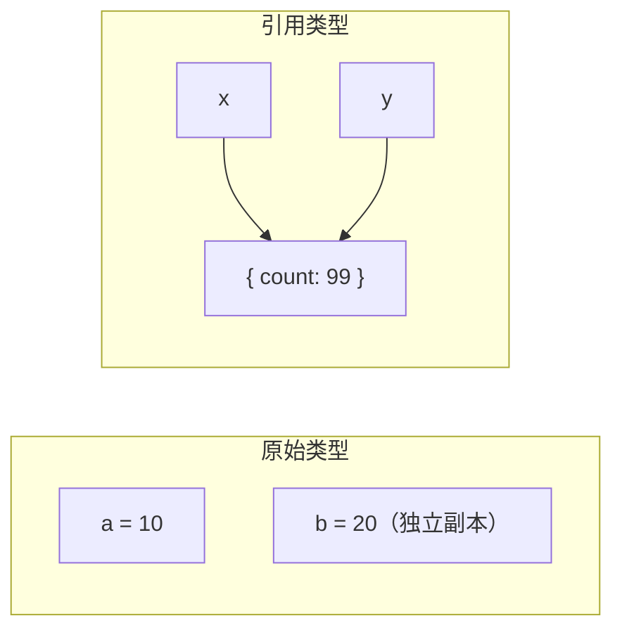
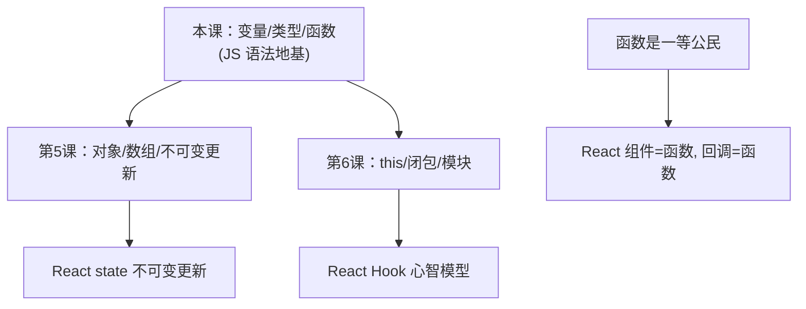

# 前端基础 - 第 4 课：JavaScript 语言核心（上），变量、类型、函数

## 学习目标（本节结束后你能做到什么）

- 说清楚 JavaScript 是什么、在哪运行、和 Java 是什么关系（基本没关系）。
- 知道怎么动手跑 JS 代码（浏览器 Console 是你最好的练习场）。
- 掌握变量声明 `let` / `const`，理解为什么默认用 `const`。
- 分清**原始类型**和**引用类型**——这是后面理解 React state 更新的根。
- 掌握字符串、模板字符串、常用运算符。
- 真正搞懂 `==` 和 `===` 的区别，以及**真值/假值（truthy/falsy）**。
- 会写控制流：`if`、三元、`switch`、循环。
- 掌握函数的三种写法（声明 / 表达式 / 箭头函数），理解“函数是一等公民”——这是 React 用函数当组件、当回调的基础。

> 前三课讲的是“浏览器这台机器 + 结构 + 样式”。从这一课开始进入**行为层**：JavaScript。React 就是一个 JavaScript 库，你 JS 的底子有多牢，React 学得就有多深。这一课先打语法地基。

## 内容讲解

### 1. JavaScript 是什么，和 Java 什么关系

先破除一个常见误会：**JavaScript 和 Java 基本没关系。** 名字像，纯属当年市场营销蹭热度。Java 是强类型、编译型、跑在 JVM 上的语言；JavaScript 是动态类型、解释执行、最初为浏览器而生的语言。语法上有点像（都用 `{}`、`;`），但设计哲学和运行模型完全不同。

JavaScript 的几个关键特性，先有个心理预期：

- **动态类型**：变量不用声明类型，类型在运行时决定，一个变量可以先存数字再存字符串。（这点和你写 Java 很不一样，后面 TypeScript 课就是来给它补上类型的。）
- **解释执行**：不像 Java 要先编译，JS 引擎直接读源码执行（现代引擎有 JIT 优化，但你不用操心）。
- **一切都很“宽松”**：类型自动转换、`==` 会做隐式转换、访问不存在的属性返回 `undefined` 而不报错……这些“宽松”有时方便、有时是坑，后面会逐个点出来。
- **运行环境可换**：同一门 JS，能跑在浏览器（操作页面），也能跑在服务器（Node.js）。第 1 课说过，语言和运行环境是两回事。

### 2. 怎么动手跑 JS：Console 是你的练习场

学 JS 最忌讳只看不练。最快的练习场就在你眼前：

**(1) 浏览器开发者工具的 Console（强烈推荐新手用）**

随便打开一个网页，按 `F12`（Mac 上 `Cmd+Option+I`），切到 **Console（控制台）** 标签。这里就是一个能直接敲 JS、立刻看结果的交互环境，类似你用过的 Python REPL 或 `jshell`。

```js
1 + 1            // 回车，立刻显示 2
"hello".length   // 显示 5
console.log("嗨") // 打印「嗨」
```

`console.log(...)` 是 JS 里最常用的打印语句，相当于后端的日志输出，调试全靠它。

**(2) 写在 HTML 的 `<script>` 里**

```html
<body>
  <h1 id="title">原标题</h1>
  <script>
    console.log("页面加载了");
  </script>
</body>
```

**(3) Node.js**：装了 Node 后 `node app.js` 直接跑文件，这是脱离浏览器跑 JS 的方式。

**建议：这一课每个例子，都复制到浏览器 Console 里敲一遍、看结果。** JS 的很多“感觉”（类型转换、真假值、闭包）光看记不住，敲一遍就懂了。

### 3. 变量：let 与 const

变量就是“给一个值起个名字”。JS 现在用两个关键字声明变量：

```js
let count = 0;        // 可以重新赋值
const name = "张三";   // 不能重新赋值（常量）

count = 1;            // ✅ 可以
name = "李四";         // ❌ 报错：Assignment to constant variable
```

- **`const`**：声明后**不能再重新赋值**。一旦绑定就固定。
- **`let`**：声明后**可以重新赋值**。

还有一个老关键字 **`var`**，是 JS 早期的变量声明方式。**现代代码里基本不用 `var` 了**，因为它有一些反直觉的作用域行为（函数作用域、变量提升、能重复声明）容易出 bug。你看老代码会遇到它，知道“这是历史遗留、新代码用 let/const 替代”即可。

**实践原则：默认用 `const`，只有确实需要重新赋值时才用 `let`。** 为什么？因为 `const` 表达了“这个名字绑定的值不会变”的意图，读代码的人一眼就知道它后面不会被改，心智负担更小、也更不容易误改。这和后端推崇 `final` / 不可变是一个思路。

> 注意一个细节：`const` 限制的是“不能重新赋值这个变量”，**不是“值本身不能改”**。如果 `const` 绑的是一个对象，你仍然可以改对象内部的属性。这个微妙点和原始 vs 引用类型有关，下一节就讲。

**作用域**：`let`/`const` 是**块级作用域**——用 `{}` 括起来的范围（`if`、`for`、函数体）就是一个块，变量只在它声明的块内有效。

```js
if (true) {
  let x = 10;
  console.log(x); // 10
}
console.log(x);   // ❌ 报错：x is not defined（出了块就没了）
```

这点和 Java 的块级作用域一致，符合直觉。

### 4. 数据类型：原始类型 vs 引用类型（重点）

JS 的值分成两大阵营，**这个区分极其重要，是后面理解 React state 更新的根**，务必搞清楚。

**原始类型（primitive）——共 7 种，常用 5 种：**

```js
let n = 42;             // number  数字（整数小数不分，统一是 number）
let s = "hello";        // string  字符串
let b = true;           // boolean 布尔
let u = undefined;      // undefined 「未定义」：声明了没赋值，默认就是它
let nl = null;          // null    「空」：人为表示「这里故意是空」
// 另两种 symbol、bigint 用得少，先不管
```

- `number`：JS 不分 int/float，整数小数都是 `number`。
- `string`：字符串，单引号双引号都行。
- `boolean`：`true` / `false`。
- `undefined`：变量声明了但没赋值时的默认值，表示“还没有值”。
- `null`：表示“故意为空”。`undefined` 是“系统默认的空”，`null` 是“你主动设的空”，语义上有别。

**引用类型（reference）——本质都是 object：**

```js
let obj = { name: "张三", age: 28 };  // 对象 object
let arr = [1, 2, 3];                  // 数组 array（本质也是对象）
let fn = function () {};              // 函数 function（本质也是对象）
```

对象、数组、函数都属于引用类型。它们的内容可能很大、很复杂，所以变量里存的不是值本身，而是一个“指向它的引用（地址）”。

**两者的关键区别：赋值/传递时，原始类型拷贝值，引用类型拷贝引用。**

```js
// 原始类型：拷贝的是值，互不影响
let a = 10;
let b = a;   // b 拿到 a 的值的副本
b = 20;
console.log(a); // 10（a 没变）

// 引用类型：拷贝的是引用，指向同一个对象
let x = { count: 1 };
let y = x;   // y 和 x 指向同一个对象
y.count = 99;
console.log(x.count); // 99（x 也变了！因为是同一个对象）
```



**为什么这对 React 至关重要？** 提前剧透：React 判断“state 变没变、要不要重新渲染”，对引用类型是**比较引用地址**，不是逐个比内部属性。如果你直接改对象内部（`y.count = 99`），引用没变，React 可能认为“没变”，于是不重新渲染。所以 React 要求你**不要原地改对象/数组，而是创建一个新的**（不可变更新）。这个机制的全部根源，就是上面这段“引用类型拷贝的是引用”。第 5 课会专门把“不可变更新”讲透，这里先把这个区别刻进脑子。

> 顺便解释上一节的疑问：`const obj = {...}` 后还能 `obj.count = 99`，因为 `const` 只锁住“obj 这个名字不能指向别的对象”，没锁住“对象内部不能改”。

**判断类型用 `typeof`：**

```js
typeof 42         // "number"
typeof "hi"       // "string"
typeof true       // "boolean"
typeof undefined  // "undefined"
typeof {}         // "object"
typeof []         // "object"（数组也是 object，想判断数组用 Array.isArray()）
typeof null       // "object"（这是 JS 一个著名的历史 bug，记住就行）
```

### 5. 字符串与模板字符串

字符串日常操作很多，重点掌握**模板字符串**（template literal），因为 React/JSX 里到处用：

```js
const name = "张三";
const age = 28;

// 老式拼接：用 + 号，繁琐易错
const s1 = "我叫" + name + "，今年" + age + "岁";

// 模板字符串：用反引号 ` `，里面用 ${} 嵌变量（推荐！）
const s2 = `我叫${name}，今年${age}岁`;

// 还能跨行
const s3 = `第一行
第二行`;
```

注意是**反引号** `` ` ``（键盘左上角，不是单引号），`${...}` 里可以放任何表达式：

```js
`总价：${price * count} 元`
`状态：${isOk ? "成功" : "失败"}`
```

常用字符串能力：

```js
"hello".length          // 5（长度）
"hello".toUpperCase()   // "HELLO"
"  hi  ".trim()         // "hi"（去首尾空格）
"a,b,c".split(",")      // ["a", "b", "c"]（按分隔符拆成数组）
"hello".includes("ell") // true（是否包含）
```

### 6. 运算符、类型转换、真值与假值

**算术、比较、逻辑运算符**和后端基本一致：`+ - * / %`、`> < >= <=`、`&& || !`。重点说几个 JS 特有的坑。

**`==` 和 `===` 的区别（必须搞清）：**

```js
1 == "1"    // true！== 会先把类型转成一样再比，"1" 被转成数字 1
1 === "1"   // false！=== 不做类型转换，类型不同直接判不等

0 == false  // true（== 把 false 转成 0）
0 === false // false
```

- `==`（宽松相等）：比较前会**自动转换类型**，规则复杂、容易踩坑。
- `===`（严格相等）：**类型和值都相同才相等**，不做转换，行为可预测。

**实践铁律：永远用 `===` 和 `!==`，别用 `==` 和 `!=`。** 这是社区公认的最佳实践，能避开一大堆隐式转换的诡异问题。

**真值与假值（truthy / falsy）——这个对 React 条件渲染极重要：**

在需要布尔判断的地方（`if`、`&&`、`||`），JS 会把任何值转成 `true` 或 `false`。规则是：**记住下面这几个是“假值（falsy）”，其余全是“真值（truthy）”：**

```js
// falsy（被当成 false 的值）：
false
0
""        // 空字符串
null
undefined
NaN       // Not a Number，非法数字运算的结果

// 其余都是 truthy，包括：
"0"       // 非空字符串是 truthy（注意！）
[]        // 空数组是 truthy（注意！）
{}        // 空对象是 truthy（注意！）
```

```js
if ("hello") { /* 会执行，非空字符串是真值 */ }
if (0)       { /* 不会执行，0 是假值 */ }
if ([])      { /* 会执行！空数组是真值，新手常错 */ }
```

为什么这对 React 重要？React 里大量用 `条件 && <组件/>` 来做“条件渲染”：

```jsx
{user && <p>欢迎，{user.name}</p>}     // user 有值（truthy）才显示
{list.length > 0 && <List />}          // 有数据才渲染列表
{count === 0 && <Empty />}             // 空态
```

`&&` 的行为是：左边是真值就返回右边，否则返回左边。所以 `user && <p>` 在 user 为 null（falsy）时返回 null（React 里 null 表示不渲染任何东西）。**你必须先懂 truthy/falsy，才能看懂、写对 React 的条件渲染。** 顺带一个常见坑：`{list.length && <List/>}` 当 length 为 0 时会渲染出一个 `0`，所以要写成 `list.length > 0 && ...`。

### 7. 控制流

和大多数语言一样，但有几个 JS 常用写法值得专门记。

```js
// if / else if / else
if (score >= 90) {
  grade = "A";
} else if (score >= 60) {
  grade = "B";
} else {
  grade = "C";
}

// 三元运算符（条件 ? 真值 : 假值）——React/JSX 里超高频
const label = isLoading ? "加载中..." : "提交";

// switch
switch (status) {
  case "loading": return <Spinner />;
  case "error":   return <Error />;
  default:        return <Content />;
}
```

**循环**：

```js
// 传统 for
for (let i = 0; i < 3; i++) {
  console.log(i); // 0 1 2
}

// for...of：遍历数组的每个元素（推荐，比 for 直观）
for (const item of [10, 20, 30]) {
  console.log(item); // 10 20 30
}

// while
let i = 0;
while (i < 3) { i++; }
```

不过说句实话：**在 React 里你会很少手写 `for` 循环遍历数据，更多是用数组的 `map` 方法**（下一课讲），因为 React 渲染列表是 `数组.map(item => <li>...</li>)` 这种写法。`for` 你会写、能读懂就够了。

### 8. 函数：JavaScript 的核心，也是 React 的核心

函数在 JS 里地位极高。这一节是本课最重要的部分，因为 **React 的组件就是函数，事件处理也是函数，React 把函数当数据一样传来传去。**

**三种写法：**

```js
// 1. 函数声明（function declaration）
function add(a, b) {
  return a + b;
}

// 2. 函数表达式（把函数赋值给变量）
const add2 = function (a, b) {
  return a + b;
};

// 3. 箭头函数（arrow function）—— 现代 JS 和 React 里最常用
const add3 = (a, b) => {
  return a + b;
};

// 箭头函数：若函数体只有一句 return，可省略 {} 和 return
const add4 = (a, b) => a + b;       // 等价于上面
const double = n => n * 2;          // 单个参数可省括号
const greet = () => "hi";           // 无参数要写空括号
```

调用方式都一样：`add(2, 3)` 得到 `5`。

**箭头函数你必须熟练**，因为 React 代码里全是它：

```jsx
<button onClick={() => setCount(count + 1)}>加一</button>
list.map(item => <li key={item.id}>{item.name}</li>)
```

箭头函数除了写法简洁，还有一个关于 `this` 的重要特性（它不绑定自己的 `this`），那个要等第 6 课讲 `this` 时才说清楚。现在先把它的**写法**练熟。

**参数：默认值与剩余参数**

```js
// 默认参数
function greet(name = "访客") {
  return `你好，${name}`;
}
greet();        // "你好，访客"
greet("张三");   // "你好，张三"

// 剩余参数：把多余的参数收集成数组
function sum(...nums) {
  return nums.reduce((a, b) => a + b, 0);
}
sum(1, 2, 3, 4); // 10
```

**函数是“一等公民”——这是理解 React 的关键认知**

在 JS 里，函数和数字、字符串一样，是**值**。这意味着函数可以：

```js
// (1) 赋值给变量（上面已经在做）
const f = () => {};

// (2) 作为参数传给另一个函数（回调函数）
function onClick(handler) {
  handler(); // 在合适时机调用传进来的函数
}
onClick(() => console.log("被点了"));

// (3) 作为另一个函数的返回值
function makeAdder(x) {
  return (y) => x + y;  // 返回一个函数
}
const add5 = makeAdder(5);
add5(3); // 8
```

“函数能当参数传、能被返回”这件事，是前端的命脉。回想第 1 课：浏览器是个一直在等事件的运行时。你怎么告诉它“用户点击时执行这段逻辑”？答案就是**把一个函数交给它，让它在事件发生时回头调用**——这就是“回调函数（callback）”。

```js
button.addEventListener("click", () => {
  console.log("用户点了按钮");
});
```

你把 `() => {...}` 这个函数**传给**浏览器，浏览器存着它，等点击发生时再调用它。React 的 `onClick={handleClick}` 是同样的道理——你把函数交给 React，它在点击时帮你调。

而且 **React 组件本身就是一个函数**：输入 props，返回 UI 描述。`makeAdder` 返回函数那种“函数造函数”的能力，正是第 6 课“闭包”的基础，也是 React Hook 能工作的底层机制。所以这一节请务必吃透：**在 JS 里，函数是可以被传递、被存储、被返回的值。**

### 9. 收束：这一课在整个 track 的位置



这一课你拿到的是 JS 的“原子能力”：怎么声明变量、有哪些类型、怎么写函数。其中两个点要带着走：

- **原始类型 vs 引用类型**（值拷贝 vs 引用拷贝）→ 直接通向 React 的不可变更新（下一课展开）。
- **函数是一等公民**（可传递、可返回）→ 直接通向 React 的组件即函数、回调、Hook（第 6 课展开）。

记住：你不是在为了写网页学语法，你是在为“看懂 React 为什么这样设计”攒底层认知。

## 小结（关键点）

- JavaScript 和 Java 基本无关；它是**动态类型、解释执行**的语言，浏览器 Console 是最好的练习场。
- 变量用 `let`（可重新赋值）和 `const`（不可重新赋值）；**默认用 `const`**，`var` 是历史遗留不再用。
- **原始类型**（number/string/boolean/null/undefined）赋值拷**值**；**引用类型**（object/array/function）赋值拷**引用**——这是 React 不可变更新的根源。
- 字符串优先用**模板字符串** `` `${}` ``；比较**永远用 `===`**，不用 `==`。
- **真值/假值**：`false/0/""/null/undefined/NaN` 是假值，其余（含 `[]`、`{}`）是真值——是 React 条件渲染 `cond && <X/>` 的基础。
- 控制流里**三元运算符**在 JSX 中高频；遍历数据在 React 里多用 `map` 而非 `for`。
- 函数三种写法（声明/表达式/**箭头函数**），箭头函数在 React 里最常用；**函数是一等公民**（可传参、可返回），这是 React 组件即函数、事件回调、Hook 的根基。

## 问题（检测理解）

1. `let`、`const`、`var` 有什么区别？为什么推荐默认用 `const`？`const obj = {a:1}` 之后 `obj.a = 2` 会报错吗？为什么？
2. 原始类型和引用类型在“赋值/传递”时有什么本质区别？跑一下这段并解释结果：`let x = {n:1}; let y = x; y.n = 9; console.log(x.n)`。
3. 这个区别（值拷贝 vs 引用拷贝）和 React“为什么不能直接改 state 对象、要创建新对象”有什么关系？（凭直觉答，下一课会细讲）
4. `1 == "1"` 和 `1 === "1"` 结果分别是什么？为什么？日常该用哪个？
5. 下面哪些是假值（falsy）：`0`、`""`、`"0"`、`[]`、`null`、`undefined`、`NaN`、`{}`？
6. React 里 `{list.length > 0 && <List/>}` 为什么要写 `> 0`，直接写 `{list.length && <List/>}` 会有什么问题？
7. 用三种写法（函数声明、函数表达式、箭头函数）各写一个“返回两数之和”的函数。
8. “函数是一等公民”是什么意思？举一个“把函数作为参数传给另一个函数”的例子。这和浏览器/React 处理点击事件有什么关系？

把答案发我即可。我据此判断第 4 课掌握情况，再进第 5 课（对象、数组与不可变更新）。
