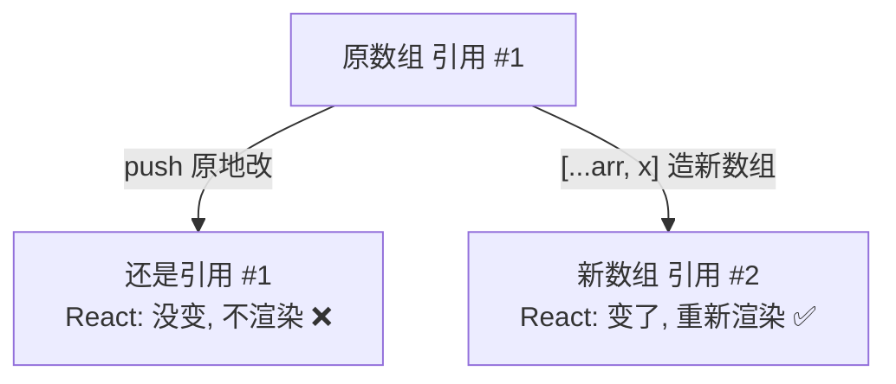
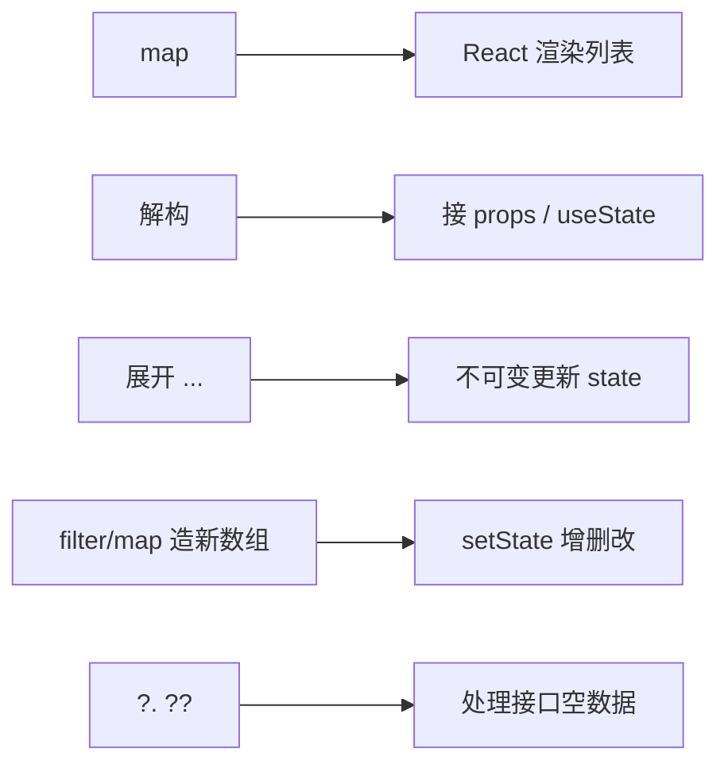

# 前端基础 - 第 5 课：JavaScript 语言核心（中），对象、数组与不可变更新

## 学习目标（本节结束后你能做到什么）

- 熟练创建、读写对象，理解对象就是“键值对的集合”。
- 掌握数组和它最重要的几个方法：`map`、`filter`、`find`、`reduce`，尤其 `map`（React 渲染列表的核心）。
- 掌握**解构赋值**和**展开运算符 `...`**——React 代码里到处是它们。
- 理解 `?.`（可选链）和 `??`（空值合并）解决了什么问题。
- **重点：彻底搞懂“不可变更新（immutable update）”**——为什么不能原地改对象/数组，以及增删改的不可变写法。这是 React `setState` 的命根子。
- 会用 `JSON.stringify` / `JSON.parse` 在对象和字符串间转换。

> 上一课的两个钩子在这里收：原始 vs 引用类型 → 引出“不可变更新”；函数是一等公民 → 引出 `map`/`filter` 这种“把函数传进去”的数组方法。学完这课，你再看 React 的 `setState(prev => ...)`、`list.map(...)` 会觉得理所当然。

## 内容讲解

### 1. 对象：键值对的集合

对象（object）是 JS 里组织数据的核心结构。它就是一组**键值对（key-value）**，类比后端的 `Map` 或一个 DTO/实体。

```js
const user = {
  name: "张三",
  age: 28,
  isAdmin: false,
};
```

- `name`、`age`、`isAdmin` 是**键（key / 属性名）**。
- `"张三"`、`28`、`false` 是对应的**值（value）**。

**读写属性**，两种语法：

```js
// 点号语法（最常用）
user.name          // "张三"
user.age = 29;     // 修改
user.email = "a@b.com"; // 新增属性（JS 对象可以随时加属性）

// 方括号语法（属性名是变量或含特殊字符时用）
const key = "name";
user[key]          // "张三"，方括号里放变量
user["is-admin"]   // 属性名带横线时只能用方括号
```

访问不存在的属性，**不报错，返回 `undefined`**（这是 JS 的“宽松”）：

```js
user.phone   // undefined（没这个属性，但不报错）
```

**对象里也能放函数，叫方法：**

```js
const calc = {
  base: 10,
  add(n) { return this.base + n; },  // 方法，this 指向 calc（第6课细讲）
};
calc.add(5);  // 15
```

**嵌套对象**很常见，接口返回的 JSON 基本都是嵌套的：

```js
const order = {
  id: 1001,
  customer: { name: "张三", address: { city: "北京" } },
  items: [{ name: "书", price: 30 }],
};
order.customer.address.city;  // "北京"
order.items[0].name;          // "书"
```

### 2. 数组：有序的值列表

数组（array）是有序的值列表，用方括号：

```js
const nums = [10, 20, 30];
nums[0];        // 10（下标从 0 开始）
nums[2];        // 30
nums.length;    // 3（长度）
nums[1] = 99;   // 修改：[10, 99, 30]
```

数组元素可以是任意类型，包括对象（这是最常见的——“一个列表，每项是一条记录”）：

```js
const users = [
  { id: 1, name: "张三" },
  { id: 2, name: "李四" },
];
```

后台系统的列表数据，几乎都长这样：一个数组，每个元素是一个对象。记住这个结构，因为 React 渲染表格/列表时处理的就是它。

### 3. 数组的核心方法：map / filter / find / reduce

这几个方法是前端的命脉，**它们都接收一个函数作为参数**（回忆上一课“函数是一等公民”），对数组每个元素调用这个函数。重点中的重点是 `map`。

**`map`：把每个元素「变换」成新元素，返回等长的新数组**

```js
const nums = [1, 2, 3];
const doubled = nums.map(n => n * 2);   // [2, 4, 6]

const users = [{ name: "张三" }, { name: "李四" }];
const names = users.map(u => u.name);   // ["张三", "李四"]
```

`map` 的工作方式：遍历数组，对每个元素执行你给的函数，把每次的返回值收集成一个**新数组**（原数组不变）。

**为什么 `map` 对 React 极其重要？** 因为 React 渲染列表就是用它把“数据数组”变成“UI 元素数组”：

```jsx
const users = [{ id: 1, name: "张三" }, { id: 2, name: "李四" }];

// 在 React 里：把每个 user 对象 map 成一个 <li>
<ul>
  {users.map(u => <li key={u.id}>{u.name}</li>)}
</ul>
```

这就是 React 列表渲染的标准写法。你 `map` 用得熟，React 列表就不在话下。

**`filter`：留下「符合条件」的元素，返回新数组（可能更短）**

```js
const nums = [1, 2, 3, 4, 5];
const evens = nums.filter(n => n % 2 === 0);   // [2, 4]

const users = [{ name: "张三", active: true }, { name: "李四", active: false }];
const activeUsers = users.filter(u => u.active);  // 只剩张三
```

你给的函数返回 `true` 的元素被留下，返回 `false` 的被过滤掉。常用于“按条件筛选列表”“删除某一项”。

**`find`：找「第一个符合条件」的元素（返回元素本身，不是数组）**

```js
const users = [{ id: 1, name: "张三" }, { id: 2, name: "李四" }];
const u = users.find(u => u.id === 2);   // { id: 2, name: "李四" }
const none = users.find(u => u.id === 9); // undefined（找不到返回 undefined）
```

**`reduce`：把整个数组「归约」成一个值**

```js
const nums = [10, 20, 30];
const total = nums.reduce((sum, n) => sum + n, 0);   // 60
// 第二个参数 0 是初始值；每次把「累计值 sum」和「当前元素 n」算出新的累计值
```

`reduce` 稍难，先会用“求和/求总数”这种最常见场景即可。

**几个布尔判断的小方法：**

```js
[1, 2, 3].includes(2);          // true（是否包含某值）
[1, 2, 3].some(n => n > 2);     // true（是否「存在」满足条件的）
[1, 2, 3].every(n => n > 0);    // true（是否「全部」满足条件）
```

**关键认知：`map`、`filter` 返回的是新数组，原数组不变。** 这个“不改原数据、返回新数据”的特性，正好契合下面要讲的“不可变更新”。

### 4. 解构赋值：从对象/数组里「拆」出值

解构（destructuring）让你用一行从对象或数组里提取值。React 代码里**极其高频**，必须熟。

**对象解构：**

```js
const user = { name: "张三", age: 28, city: "北京" };

// 不用解构：一个个取
const name = user.name;
const age = user.age;

// 用解构：一行搞定，变量名要和属性名对应
const { name, age } = user;
console.log(name, age);  // "张三" 28

// 可以重命名、给默认值
const { city: userCity, country = "中国" } = user;
```

React 里你会天天看到这种写法——组件接收 props 时直接解构：

```jsx
// props 是 { title, onClose }，直接在参数里解构出来
function Modal({ title, onClose }) {
  return <div>{title}</div>;
}
```

**数组解构：**

```js
const arr = [10, 20, 30];
const [first, second] = arr;   // first=10, second=20

// 跳过某个
const [, , third] = arr;       // third=30
```

数组解构对 React 尤其重要，因为 **`useState` 的返回值就是用数组解构接的**：

```jsx
const [count, setCount] = useState(0);
//     ↑当前值  ↑更新函数   ← useState 返回一个数组 [值, 更新函数]，用数组解构拆开
```

到 React 你会无数次写这行，现在先理解它就是数组解构。

### 5. 展开运算符 `...`：把对象/数组「摊开」

展开运算符（spread）是三个点 `...`，作用是把一个对象或数组的内容“摊开”到另一个里。**它是不可变更新的核心工具**，务必掌握。

**展开数组：**

```js
const a = [1, 2, 3];
const b = [...a, 4, 5];        // [1, 2, 3, 4, 5]，把 a 摊开再加新元素
const c = [...a];              // [1, 2, 3]，复制一份新数组（不是同一个引用！）
const merged = [...a, ...b];   // 合并两个数组
```

**展开对象：**

```js
const user = { name: "张三", age: 28 };
const copy = { ...user };                    // 复制一份新对象
const updated = { ...user, age: 29 };        // 复制后覆盖 age：{ name:"张三", age:29 }
const extended = { ...user, city: "北京" };   // 复制后新增 city
```

注意 `{ ...user, age: 29 }` 的语义：先把 `user` 的所有属性摊开，再写 `age: 29` 把 age 覆盖掉。后写的覆盖先写的。**结果是一个全新的对象，原 `user` 不变。** 这正是不可变更新要的效果——下一节就用它。

### 6. 可选链 `?.` 与空值合并 `??`

这两个语法解决“数据可能为空”的常见痛点，接口数据经常缺字段，很实用。

**可选链 `?.`：安全访问可能不存在的嵌套属性**

```js
const user = { profile: null };

user.profile.avatar;     // ❌ 报错：Cannot read properties of null
user.profile?.avatar;    // ✅ 返回 undefined，不报错

// 链式安全访问
order?.customer?.address?.city;   // 任何一环是 null/undefined 就返回 undefined，不报错
```

`?.` 的意思是“如果左边是 null/undefined，就直接返回 undefined，别往下访问了”。后端调用链里到处判空的 `if (a != null && a.b != null)`，在 JS 里一个 `?.` 就解决了。

**空值合并 `??`：只在「左边是 null/undefined」时取默认值**

```js
const name = user.name ?? "匿名";   // user.name 是 null/undefined 才用 "匿名"
```

它和 `||` 很像但更精确。`||` 对所有“假值”都取右边（包括 `0`、`""`），而 `??` 只对 `null`/`undefined` 取右边：

```js
const count = 0;
count || 10    // 10（因为 0 是假值，但这往往不是你想要的！）
count ?? 10    // 0（0 是有效值，?? 不会替换它）
```

当默认值场景里 `0` 或 `""` 是合法值时，用 `??` 而不是 `||`，能避开一类隐蔽 bug。

### 7. 不可变更新：本课的重头戏，也是 React 的命根子

现在把前面所有工具（展开运算符、map、filter）拧成一个核心思想：**不可变更新（immutable update）——不修改原来的对象/数组，而是创建一个包含改动的新对象/数组。**

**先说为什么。** 回忆第 4 课：引用类型赋值/传递拷贝的是**引用**。React 判断 state 有没有变，对对象/数组是**比较引用地址**（看是不是同一个对象），而不是逐个比较内部属性（那样太慢）。于是：

```js
// ❌ 原地修改（mutation）：引用没变，React 以为「没变」，不重新渲染
state.list.push(newItem);     // 还是同一个数组，引用相同
setState(state.list);         // React: 引用一样 → 不更新

// ✅ 不可变更新：创建新数组，引用变了，React 知道「变了」，重新渲染
setState([...state.list, newItem]);  // 新数组，新引用 → 更新
```



**所以在 React 里有条铁律：永远不要原地改 state，而要用新对象/新数组替换它。** 这一节就是教你怎么“不原地改地完成增删改”。

下面以一个数组 `list` 和对象 `user` 为例，把所有常见操作的不可变写法过一遍。

**(A) 数组——增**

```js
const list = [1, 2, 3];
const added = [...list, 4];        // 末尾加：[1,2,3,4]
const prepended = [0, ...list];    // 开头加：[0,1,2,3]
// ❌ 别用 list.push(4)，它原地改原数组
```

**(B) 数组——删**

```js
// 用 filter 把要删的排除掉，得到新数组
const removed = list.filter(n => n !== 2);   // 删掉值为 2 的：[1,3]
const removeById = users.filter(u => u.id !== targetId);  // 删某条记录
// ❌ 别用 list.splice()，它原地改
```

**(C) 数组——改某一项**

```js
// 用 map：命中的那项换成新值，其余原样返回
const updated = users.map(u =>
  u.id === targetId ? { ...u, name: "新名字" } : u
);
// 含义：遍历每个 u，如果是目标就返回一个「改了 name 的新对象」，否则原样返回
```

**(D) 数组——排序（sort 会原地改，要先复制）**

```js
const sorted = [...list].sort((a, b) => a - b);   // 先 [...] 复制再排
// ❌ list.sort() 会原地改原数组
```

**(E) 对象——改/增字段**

```js
const user = { name: "张三", age: 28 };
const renamed = { ...user, name: "李四" };   // 改 name：{name:"李四", age:28}
const withCity = { ...user, city: "北京" };  // 加 city
// ❌ 别用 user.name = "李四"，它原地改
```

**(F) 嵌套对象——逐层展开**

嵌套结构要“改哪层就重建哪层”，外层也要重建（因为外层引用也得变）：

```js
const state = {
  user: { name: "张三", address: { city: "北京" } },
};

// 只想改 city，但要逐层复制
const next = {
  ...state,
  user: {
    ...state.user,
    address: { ...state.user.address, city: "上海" },
  },
};
```

嵌套深了这样写很啰嗦，所以真实 React 项目常用 Immer 这类库帮你“写起来像原地改、实际生成新对象”。但**原理你必须先懂**，否则用库也会出错。

**一句话总结不可变更新：用 `...`、`map`、`filter` 这些“返回新值”的工具，造一个带着改动的新对象/新数组，而不是动原来的。** 这套写法你会在 React 里每天用。

### 8. JSON：对象和字符串的互转

接口传输的数据是文本，所以经常要在“JS 对象”和“JSON 字符串”之间转换。

```js
const user = { name: "张三", age: 28 };

// 对象 → JSON 字符串（发请求、存 localStorage 时用）
const text = JSON.stringify(user);   // '{"name":"张三","age":28}'

// JSON 字符串 → 对象（拿到接口响应文本后用）
const obj = JSON.parse(text);        // { name: "张三", age: 28 }
```

一个常被用到的小技巧——**用 JSON 做简单的深拷贝**（复制一个嵌套对象，彻底断开引用）：

```js
const deepCopy = JSON.parse(JSON.stringify(original));
```

它简单粗暴，但有局限（函数、undefined、Date 会丢失），所以只适合纯数据对象。现代环境也有 `structuredClone(original)` 更正规。了解即可。

### 9. 收束：这一课你拿到的是 React 的日常工具箱



回头看会发现，这一课的每个工具都对着 React 的一个日常动作。学到这里，你已经具备“看懂大部分 React 业务代码”的语言基础了。剩下两块 JS 硬骨头——`this` 和闭包（第 6 课）、异步（第 7 课）——啃完，JS 地基就齐了。

## 小结（关键点）

- 对象是键值对集合，用 `.` 或 `[]` 读写；访问不存在的属性返回 `undefined` 不报错；接口数据多是“数组套对象”。
- 数组核心方法都接收函数：**`map`**（变换，等长新数组，React 列表渲染靠它）、`filter`（筛选）、`find`（找一个）、`reduce`（归约成一个值）；它们**返回新数组，不改原数组**。
- **解构**（`const {a} = obj`、`const [x] = arr`）和**展开 `...`**（复制并改写对象/数组）是 React 高频语法；`useState` 返回值就用数组解构接。
- `?.` 安全访问可能为空的嵌套属性，`??` 只在 null/undefined 时取默认值（比 `||` 精确）。
- **不可变更新是 React 的命根子**：因为 React 比较引用判断是否更新，所以**绝不原地改 state**，而要用 `...`/`map`/`filter` 造新对象/新数组替换。
- 增用 `[...arr, x]`、删用 `filter`、改用 `map`、对象改字段用 `{...obj, k:v}`、嵌套逐层展开。
- `JSON.stringify`/`parse` 在对象与字符串间转换。

## 问题（检测理解）

1. 给定 `users = [{id:1,name:"张三",active:true},{id:2,name:"李四",active:false}]`，分别用一行写出：① 取出所有 name 组成的数组；② 筛出 active 为 true 的用户；③ 找到 id 为 2 的用户。
2. `map` 和 `filter` 返回的是新数组还是改原数组？这个特性和“不可变更新”有什么关系？
3. 用解构从 `const p = {name:"张三", age:28, city:"北京"}` 中一行取出 name 和 age。`const [count, setCount] = useState(0)` 这行用到了哪种解构？
4. `{ ...user, age: 29 }` 做了什么？结果是新对象还是原对象？原 `user` 变了吗？
5. **核心题**：React 里为什么不能用 `list.push(newItem)` 然后 `setList(list)`？正确的不可变写法是什么？背后和“引用类型”有什么关系？
6. 给一个用户数组，写出不可变的：① 在末尾添加一个用户；② 删除 id 为 3 的用户；③ 把 id 为 2 的用户的 name 改成“王五”。
7. `count || 10` 和 `count ?? 10` 在 `count = 0` 时分别返回什么？什么场景下必须用 `??`？
8. `user?.profile?.city` 这行在 `user.profile` 为 null 时会怎样？不用 `?.` 会怎样？

把答案发我即可。我据此判断第 5 课掌握情况，再进第 6 课（this、闭包、原型与模块）。
