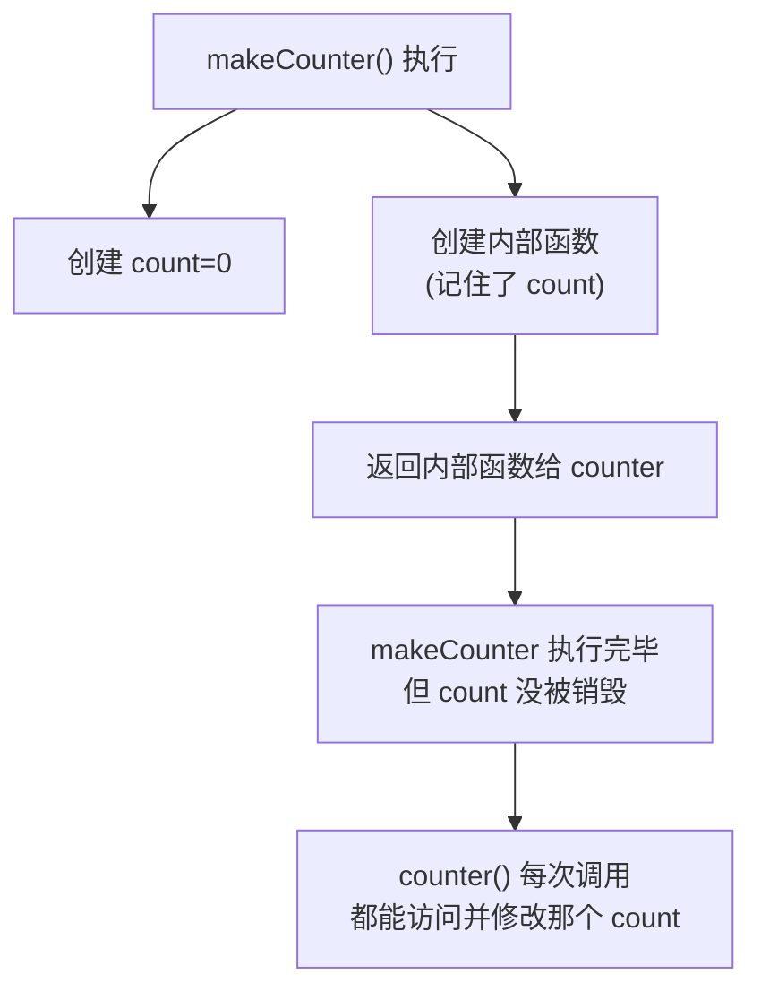
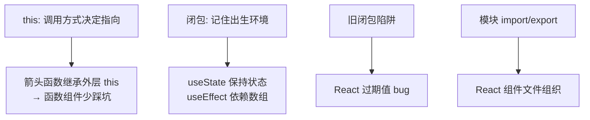

# 前端基础 - 第 6 课：JavaScript 语言核心（下），this、闭包、原型与模块

## 学习目标（本节结束后你能做到什么）

- 搞清楚 `this` 到底指向谁——理解“`this` 由调用方式决定”，而不是定义时决定。
- 知道箭头函数为什么不绑定自己的 `this`，以及这为什么让 React 函数组件少了一大堆坑。
- **彻底理解闭包**：函数“记住”它出生时的环境；并看懂闭包是 React Hook（`useState`）能工作的底层机制。
- 认识闭包陷阱“旧闭包（stale closure）”——这正是 React `useEffect` 依赖数组要解决的问题。
- 了解 JS 的 `class` 和原型（够用就行，不深挖）。
- 掌握模块 `import` / `export`——React 项目就是一堆模块拼起来的。
- 会用 `try/catch/throw` 做错误处理。

> 这是 JS 三课里最“烧脑”但最关键的一课。`this` 和闭包是 JS 公认的两个难点，也是面试常问点。更重要的是：**你在 React 第 8 课卡住的“闭包陷阱”，根在这里。** 把这一课啃下来，再回头看 Hook 会豁然开朗。

## 内容讲解

### 1. this：由“怎么调用”决定，不由“在哪定义”决定

`this` 是 JS 里最让人困惑的关键字。你写后端时，`this`（或 Java 的 `this`）永远指向当前实例，很稳定。但 **JS 的 `this` 是动态的——同一个函数，用不同方式调用，`this` 指向不同的东西。**

记住一句话：**`this` 指向“谁调用了这个函数”。** 看几种情况：

**(1) 作为对象的方法调用 → `this` 是那个对象**

```js
const user = {
  name: "张三",
  greet() {
    return `我是${this.name}`;   // this 指向 user
  },
};
user.greet();   // "我是张三"，因为是 user 在调用
```

**(2) 作为普通函数调用 → `this` 是 undefined（严格模式）或全局对象**

```js
function show() {
  console.log(this);   // 普通调用：严格模式下是 undefined
}
show();
```

**(3) 坑：把方法“拆下来”单独调用，`this` 就丢了**

```js
const user = {
  name: "张三",
  greet() { return `我是${this.name}`; },
};

const fn = user.greet;   // 把方法拿出来赋值给变量
fn();   // ❌ 报错或 "我是undefined"，因为调用时不再是 user.greet()，this 丢了
```

这个“`this` 丢失”的坑非常经典。**为什么对 React 重要？** 在老的 **class 组件**里，事件处理方法经常遇到这个问题：

```jsx
class Button extends React.Component {
  handleClick() {
    this.setState(...);   // 这里的 this 可能是 undefined！
  }
  render() {
    // onClick 把 handleClick 拆下来传给 React，调用时 this 丢了
    return <button onClick={this.handleClick}>点我</button>;
  }
}
```

为了解决它，老代码要写一堆 `this.handleClick = this.handleClick.bind(this)`，非常啰嗦。这也是后来大家**全面转向函数组件 + Hook** 的原因之一——函数组件里没有 `this`，直接消灭了这类问题。

**(4) 箭头函数：不绑定自己的 `this`，而是“继承”外层的 `this`**

这是箭头函数最重要的特性（第 4 课埋的钩子）。箭头函数没有自己的 `this`，它用的是**定义它时所在的外层作用域的 `this`**：

```js
const user = {
  name: "张三",
  hobbies: ["读书", "跑步"],
  printAll() {
    // 这里的 this 是 user
    this.hobbies.forEach((h) => {
      // 箭头函数继承外层 printAll 的 this，所以这里 this 还是 user ✅
      console.log(`${this.name}喜欢${h}`);
    });
  },
};
user.printAll();   // 张三喜欢读书 / 张三喜欢跑步
```

如果上面用普通 `function(h){}` 而不是箭头函数，里面的 `this` 就会丢失。**所以经验法则：回调函数优先用箭头函数，能自动“带着”外层的 `this`，省去一堆麻烦。** 在 React 函数组件时代，你其实很少直接和 `this` 打交道了，但理解这个机制能让你看懂老代码、也理解为什么大家爱用箭头函数。

### 2. 闭包：函数记住它“出生时”的环境

闭包（closure）是 JS 的灵魂，也是理解 React Hook 的钥匙。定义听起来抽象，但例子一看就懂。

**一句话定义：一个函数，加上它定义时所处的那个作用域（能访问的外部变量），合起来就是闭包。说白了——函数会“记住”它出生时身边的变量，哪怕它后来跑到别处执行。**

**经典例子：计数器**

```js
function makeCounter() {
  let count = 0;            // 这个变量在 makeCounter 内部

  return function () {       // 返回一个内部函数
    count++;                // 内部函数访问了外层的 count
    return count;
  };
}

const counter = makeCounter();  // 调用一次，拿到那个内部函数
counter();   // 1
counter();   // 2
counter();   // 3
```

仔细想这件事有多“反常”：`makeCounter()` 早就执行完返回了，按理说它内部的 `count` 应该被销毁了。但 `counter()` 每次调用，`count` 还在、还能累加。

**为什么？** 因为返回的那个内部函数“记住”了它出生时的环境——它和 `count` 这个变量绑在了一起。只要这个函数还活着，`count` 就不会被回收。这个“函数 + 它记住的变量环境”就是闭包。



用后端类比：闭包有点像一个**对象实例携带的私有字段**——`count` 就像私有成员变量，外部不能直接碰，只能通过返回的函数去访问。区别是 JS 用“函数+作用域”实现了这种封装，不需要 class。

**闭包有什么用？** 它无处不在：

- **数据私有化**：`count` 被藏在闭包里，外部改不了，只能通过函数操作。
- **回调记住上下文**：事件回调里用到的变量，靠闭包记住。
- **React Hook 的基础**（下一节专讲）。

### 3. 闭包就是 React useState 能工作的底层原理

这一节是把闭包和 React 接通的关键，理解了它，Hook 就不再神秘。

回忆 React 里这行：

```jsx
function Counter() {
  const [count, setCount] = useState(0);
  return <button onClick={() => setCount(count + 1)}>{count}</button>;
}
```

你有没有想过：`Counter` 这个函数每次渲染都重新执行，那 `count` 的值是怎么“保持”住的？函数都重新跑了，局部变量不是该重置吗？

答案就是闭包 + React 内部的机制。简化理解：**React 在自己内部存着每个组件的 state，`useState` 返回的 `count` 是“本次渲染那一刻”的值，而 `onClick` 里的箭头函数通过闭包“记住”了本次渲染的 `count`。**

更进一步看那个回调：`() => setCount(count + 1)` 是个箭头函数（闭包），它记住了**本次渲染时 `count` 的值**。下次状态变了、组件重新渲染，会生成一个**新的**箭头函数，记住**新的** `count`。

这也解释了一个 React 新手最困惑的现象，跟第 4 课“原始 vs 引用”和这里的闭包都有关：

```jsx
function Counter() {
  const [count, setCount] = useState(0);

  function handleClick() {
    setCount(count + 1);   // 基于「本次渲染记住的 count」
    setCount(count + 1);   // 还是「本次渲染记住的 count」，不是上一行的结果！
    // 点一次只 +1，不是 +2
  }
  // 因为这个函数闭包记住的 count 是固定的「本次渲染值」
}
```

**点一次只加 1 而不是 2**，就是因为两行 `setCount(count + 1)` 里的 `count` 是同一个被闭包“冻结”的本次渲染值。要想连加，得用函数式更新 `setCount(c => c + 1)`，让 React 拿最新值给你。这个细节你在 React 笔记里见过，现在你知道它的根是闭包了。

**你不需要现在完全消化 Hook 的实现细节。** 这一节只要你记住一个因果：**“React 组件里每次渲染的函数和回调，都通过闭包记住了那一次渲染的变量。”** 带着这个认知去看 React 第 8 课，会顺很多。

### 4. 闭包陷阱：旧闭包（stale closure）

闭包很强，但有个著名陷阱，**直接对应 React `useEffect` 依赖数组为什么难**。

“旧闭包”指：一个函数记住的是“旧的”变量值，但你以为它会拿到最新值。看个纯 JS 例子：

```js
let value = 1;

function makeLogger() {
  const captured = value;   // 出生时记住 value=1
  return () => console.log(captured);
}

const log = makeLogger();
value = 99;   // 外面把 value 改了
log();        // 还是打印 1！因为闭包记住的是出生时的 captured=1
```

`log` 记住的是它出生那一刻的值，后来外面怎么改都和它无关。这在异步场景特别坑——比如一个定时器/请求的回调记住了旧的变量，等它真正执行时，数据早就变了，于是用了过期的值。

**这正是 React `useEffect` 的核心难点。** Effect 里的函数是个闭包，它记住了“某次渲染时的 state/props”。如果你依赖数组写错，Effect 里就会用到**过期的**值：

```jsx
useEffect(() => {
  const timer = setInterval(() => {
    console.log(count);   // 闭包记住的可能是旧的 count！
  }, 1000);
  return () => clearInterval(timer);
}, []);   // 依赖数组空，effect 只跑一次，里面的 count 永远是第一次的旧值
```

React 的依赖数组本质就是在回答：“这个闭包记住的哪些值变了，需要丢掉旧闭包、用新值重建？”你 JS 闭包理解到位，React 依赖数组就不再是玄学，而是“管理闭包捕获的值”这件具体的事。

> 小结这条主线：第 4 课“函数是一等公民、可返回” → 本课“闭包记住出生环境” → “旧闭包陷阱” → React Hook 的 state 保持与 useEffect 依赖。一条线串到底。

### 5. class 与原型（够用就行）

JS 也有面向对象，但底层机制和 Java 不同（是“原型”而非“类”）。现代 JS 提供了 `class` 语法糖，写起来和你熟悉的类很像：

```js
class User {
  constructor(name, age) {
    this.name = name;     // 实例属性
    this.age = age;
  }
  greet() {               // 方法
    return `我是${this.name}`;
  }
}

const u = new User("张三", 28);
u.greet();   // "我是张三"

// 继承
class Admin extends User {
  constructor(name, age) {
    super(name, age);     // 调父类构造
    this.role = "admin";
  }
}
```

这套和 Java/Python 的类直觉基本一致，你上手没障碍。

**原型（prototype）** 是 JS 实现“共享方法、继承”的底层机制——`class` 只是它的语法糖。简单理解：每个对象都有一条“原型链”，访问属性时如果自己没有，就顺着链往上找。比如 `arr.map` 这个方法，不在你的数组对象本身，而在 `Array.prototype` 上，通过原型链被你的数组“借用”。

**对学 React 来说，原型你了解到这个程度就够了**，不必深挖。因为现代 React 是函数组件 + Hook，几乎不写 `class`。`class` 组件你能看懂老代码即可。

### 6. 模块：import / export

一个真实项目有成百上千个文件，靠**模块系统**把它们组织起来。每个 `.js`/`.ts` 文件就是一个模块，用 `export` 对外暴露东西，用 `import` 引入别的模块。这和后端的包/模块导入是一个概念。

**两种导出：命名导出 和 默认导出**

```js
// utils.js —— 命名导出（named export，可以导出多个）
export function add(a, b) { return a + b; }
export const PI = 3.14;

// 引入命名导出：用花括号，名字要对上
import { add, PI } from "./utils.js";
```

```js
// Button.js —— 默认导出（default export，一个文件只能有一个）
export default function Button() { /* ... */ }

// 引入默认导出：不用花括号，名字可以自己起
import Button from "./Button.js";
import MyBtn from "./Button.js";   // 名字随便起也行
```

区别记忆：

- **命名导出**：一个文件可导出多个，引入要用 `{ }` 且名字匹配。工具函数、常量常用它。
- **默认导出**：一个文件一个，引入不用 `{ }` 且可任意命名。React 里一个组件文件通常**默认导出那个组件**。

React 里你会天天写这种：

```jsx
// UserCard.jsx
export default function UserCard({ user }) {
  return <div>{user.name}</div>;
}

// 别处使用
import UserCard from "./UserCard";
import { useState } from "react";   // React 的 Hook 是命名导出
```

注意 `import { useState } from "react"` ——`useState` 是 React 包的命名导出，所以用花括号。你会反复见到这行。

### 7. 错误处理：try / catch / throw

和后端一致，用 `try/catch` 捕获异常、`throw` 抛出异常：

```js
function parseConfig(text) {
  if (!text) {
    throw new Error("配置不能为空");   // 主动抛错
  }
  return JSON.parse(text);   // 这行也可能抛错
}

try {
  const config = parseConfig(input);
} catch (error) {
  console.error("解析失败：", error.message);
} finally {
  // 无论成功失败都会执行（可选）
}
```

在前端，错误处理最常出现在**网络请求**里——请求失败要 catch 住，给用户一个友好的错误提示，而不是让页面崩掉。这个会在第 7 课（异步）和 React 的数据获取部分反复用到：

```js
try {
  const res = await fetch("/api/users");
  const data = await res.json();
} catch (error) {
  // 网络错误、解析错误都在这里兜住
  showError("加载失败，请重试");
}
```

### 8. 收束：JS 硬骨头啃完了大半



这一课是 JS 三课里最难的，但回报也最大：**`this` 让你看懂老 class 组件和箭头函数的价值，闭包让你看穿 Hook 的本质，模块让你看懂 React 项目的文件结构。** 只剩最后一块 JS 硬骨头——异步（第 7 课），那是处理网络请求绕不开的。啃完它，你的 JS 地基就基本齐全，可以去亲手操作 DOM（第 8 课）了。

## 小结（关键点）

- `this` **由调用方式决定**：作为对象方法调用时指向该对象，普通调用时是 undefined/全局；把方法拆下来单独调会“丢 this”（老 class 组件的经典坑）。
- **箭头函数不绑定自己的 `this`**，继承外层作用域的 `this`；回调优先用箭头函数；函数组件没有 `this`，从根上避开了这类问题。
- **闭包 = 函数 + 它记住的出生环境**；它让局部变量在函数返回后依然存活（计数器例子），是 React `useState` 能保持状态的底层原理。
- **旧闭包（stale closure）**：函数记住的是旧值；这正是 React `useEffect` 依赖数组要管理的问题。
- JS 的 `class` 是原型的语法糖，直觉同 Java；现代 React 用函数组件，原型/class 了解即可。
- 模块用 `export`/`import`：**命名导出**用 `{ }` 引入、名字要对（如 `import { useState } from "react"`）；**默认导出**不用 `{ }`、可任意命名（React 组件常用）。
- 错误处理用 `try/catch/throw`，前端最常用于兜住网络请求失败。

## 问题（检测理解）

1. JS 的 `this` 和 Java 的 `this` 最大区别是什么？“`this` 由调用方式决定”怎么理解？
2. 为什么 `const fn = user.greet; fn()` 会“丢 this”？这和老 React class 组件要写 `.bind(this)` 有什么关系？
3. 箭头函数的 `this` 有什么特别之处？为什么回调里推荐用箭头函数？
4. 用你自己的话解释闭包。`makeCounter` 那个例子里，`count` 为什么在 `makeCounter` 执行完后还能继续累加？
5. 把闭包和 React 接上：`useState` 返回的 `count` 为什么在组件反复重新执行时还能“保持”？（凭这一课的理解答，React 课会再深入）
6. 什么是“旧闭包（stale closure）”？它和 React `useEffect` 的依赖数组有什么关系？
7. 命名导出和默认导出有什么区别？`import React, { useState } from "react"` 这行里，哪个是默认导出、哪个是命名导出？
8. 写一段 `try/catch`，捕获 `JSON.parse("非法字符串")` 抛出的错误并打印友好提示。

把答案发我即可。我据此判断第 6 课掌握情况，再进第 7 课（异步 JavaScript）。
