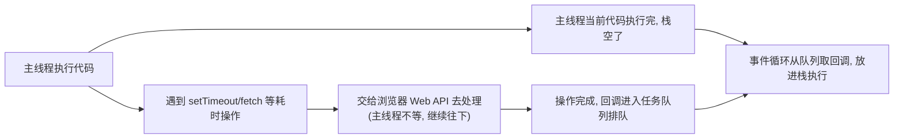
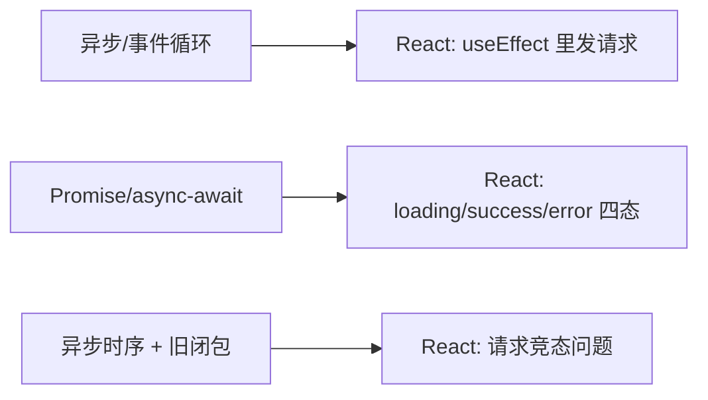
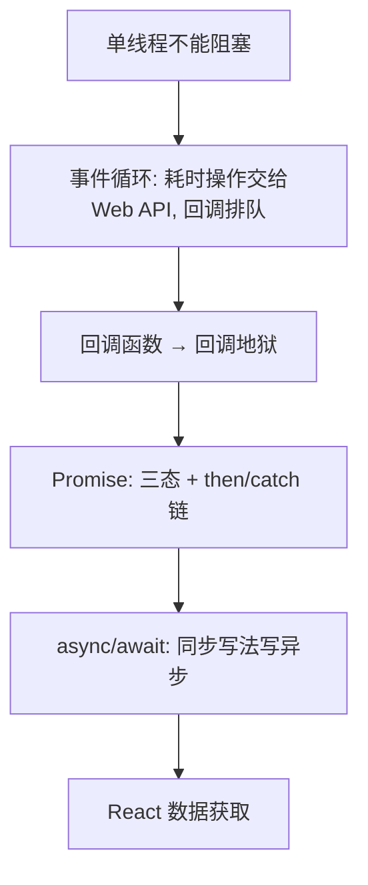

# 前端基础 - 第 7 课：异步 JavaScript，事件循环、Promise 与 async/await

## 学习目标（本节结束后你能做到什么）

- 说清楚为什么单线程的 JavaScript 必须靠异步，否则页面会卡死。
- 建立**事件循环（event loop）**的心智模型：JS 怎么“一边等耗时操作、一边不阻塞”。
- 理解回调函数，以及“回调地狱”为什么难维护。
- 掌握 **Promise**：三种状态、`then`/`catch`/`finally`。
- 掌握 **async/await**：用“看起来同步”的写法处理异步，这是现代前端的主流。
- 会用 `fetch` 发一个完整的网络请求，并用 `try/catch` 兜住错误。
- 了解 `Promise.all` 做并发，以及“宏任务/微任务”的执行顺序直觉。
- 看清这一切和 React 数据获取（loading/error/竞态）的关系。

> 第 1 课说过：浏览器里的 JS 是**单线程**的。这一课就是回答那个悬念——单线程怎么处理“要等几百毫秒”的网络请求而不卡死页面。答案是异步 + 事件循环。学完这课，React 里 `useEffect` 发请求、处理 loading/error 就有了根。

## 内容讲解

### 1. 为什么需要异步：单线程不能“干等”

回忆第 1 课的两个事实：浏览器里 JS 是**单线程**的（同一时刻只有一条线在跑你的代码），而且这条线还兼着响应用户操作、重绘页面。

现在设想一个网络请求要花 500 毫秒。如果 JS“同步”地等它——也就是站在原地死等返回——会发生什么？

```js
// 假想的「同步等待」（实际 JS 不这么干，这里演示问题）
const data = 同步请求("/api/users");   // 假设这里卡住 500ms
渲染(data);
```

这 500 毫秒里，**唯一的那条线程被占着干等**，腾不出手响应任何事：用户点按钮没反应、页面动不了、滚动卡住——整个页面**冻结** 500 毫秒。请求一多，页面就没法用了。

这就是异步要解决的问题：**遇到耗时操作（网络请求、定时器、读文件），JS 不干等，而是“交代一句‘好了之后回来找我’，然后立刻去干别的”。** 等结果好了，再回过头来处理。这样那条唯一的线程一直是空闲可用的，页面不卡。

用后端类比：你写过的同步阻塞 IO vs 异步非阻塞 IO，是同一个思想。只不过在前端，“不阻塞”不是为了吞吐量，而是为了**页面不冻结**——因为阻塞的那条线程同时还负责画界面。

### 2. 事件循环：单线程不阻塞的秘密

JS 怎么做到“单线程还不阻塞”？靠**事件循环（event loop）**。完整机制比较细，这里给你一个够用的心智模型。

关键角色：

- **调用栈（call stack）**：当前正在执行的代码。单线程，所以同一时刻只有一个栈在跑。
- **Web API**：浏览器提供的“外援”——定时器、网络请求这些**耗时操作不在 JS 主线程里跑**，而是交给浏览器的其他线程处理。
- **任务队列（task queue）**：耗时操作完成后，它的回调函数被放进这个队列排队。
- **事件循环**：一个不停转的循环，**当调用栈空了，就从队列里取一个回调，放进栈里执行**。

流程是这样的：



举个最直观的例子：

```js
console.log("1");

setTimeout(() => {
  console.log("3");   // 定时器回调，交给 Web API，0ms 后进队列
}, 0);

console.log("2");

// 输出顺序：1 → 2 → 3
```

明明 `setTimeout` 是 0 毫秒，为什么 `3` 最后才打印？因为：主线程先把同步代码 `1`、`2` 跑完（栈空），定时器的回调才从队列里被取出来执行。**“异步”不代表“立刻”，而代表“排到主线程空闲之后”。** 这个例子建议在 Console 里亲手敲一遍，体会顺序。

这个模型解释了前端很多“为什么顺序和我想的不一样”的现象，也是理解 Promise/await 执行时机的基础。

### 3. 回调函数与“回调地狱”

最原始的异步写法是**回调函数**：把“之后要做的事”作为函数传进去，等操作完成时被调用（第 4 课讲的“函数是一等公民”在这里发挥作用）。

```js
// 经典回调风格：操作完成后调用你传进去的函数
readFile("a.txt", (err, data) => {
  if (err) { /* 处理错误 */ return; }
  console.log(data);
});
```

回调本身没问题，但当多个异步操作**有先后依赖**时，回调要层层嵌套，代码就向右缩进成“金字塔”，史称**回调地狱（callback hell）**：

```js
// 先登录，再拿用户，再拿订单，再拿详情……层层嵌套
login(user, (err, token) => {
  getUser(token, (err, user) => {
    getOrders(user.id, (err, orders) => {
      getOrderDetail(orders[0].id, (err, detail) => {
        console.log(detail);   // 缩进已经到天边了
      });
    });
  });
});
```

问题：

- **难读**：逻辑顺序被嵌套结构淹没。
- **错误处理散乱**：每一层都要单独 `if (err)`。
- **难组合**：想加一步、调顺序，牵一发动全身。

为了解决回调地狱，JS 引入了 **Promise**，再后来有了 **async/await**。下面两节就是“异步写法的进化”。

### 4. Promise：把异步结果包装成一个“凭据”

Promise（承诺）是对“一个未来才会有的结果”的封装。你可以把它理解成一张**取餐凭据**：你下单后拿到一张凭据，饭还没好（pending），好了它会变成“可取餐”（成功）或“做不了了”（失败）。

**Promise 有三种状态：**

- **pending（进行中）**：还没有结果。
- **fulfilled（已成功）**：拿到了结果。
- **rejected（已失败）**：出错了。

状态一旦从 pending 变成成功或失败，就**固定下来不再变**。

**用 `.then` 拿成功结果，`.catch` 接错误，`.finally` 收尾：**

```js
fetch("/api/users")          // fetch 返回一个 Promise
  .then((res) => res.json()) // 成功后处理响应，又返回一个 Promise
  .then((data) => {
    console.log(data);       // 拿到最终数据
  })
  .catch((error) => {
    console.error("请求失败", error);   // 任何一环出错都到这
  })
  .finally(() => {
    console.log("无论成败都执行");
  });
```

Promise 最大的好处是**可以链式调用**，把回调地狱的“横向嵌套”拉成“纵向链条”：

```js
// 对比回调地狱，Promise 链是平的
login(user)
  .then((token) => getUser(token))
  .then((user) => getOrders(user.id))
  .then((orders) => getOrderDetail(orders[0].id))
  .then((detail) => console.log(detail))
  .catch((err) => console.error(err));   // 一个 catch 兜住整条链的错误
```

读起来顺多了，错误也集中处理。但还能更好——`then` 链长了也啰嗦，于是有了 async/await。

### 5. async/await：用“同步的样子”写异步

async/await 是 Promise 的语法糖，让异步代码**读起来像同步代码**，这是现代前端的主流写法，必须熟练。

两个关键字：

- **`async`**：放在函数前，表示这是个异步函数（它会返回一个 Promise）。
- **`await`**：放在一个 Promise 前，表示“等它完成，拿到结果再往下走”。`await` 只能用在 `async` 函数里。

把上面的 Promise 链改写成 async/await：

```js
async function loadOrderDetail(user) {
  const token = await login(user);            // 等登录完成，拿 token
  const userInfo = await getUser(token);      // 等拿用户
  const orders = await getOrders(userInfo.id);// 等拿订单
  const detail = await getOrderDetail(orders[0].id);
  console.log(detail);
}
```

看！没有嵌套、没有 `.then`，**从上到下一行行读，就像同步代码**，但每个 `await` 处实际上是“非阻塞地等待”——主线程在等的时候是空闲的，不会冻结页面。这就是 async/await 的魅力：**异步的性能，同步的可读性。**

**错误处理用 `try/catch`（第 6 课学的）：**

```js
async function loadUsers() {
  try {
    const res = await fetch("/api/users");
    if (!res.ok) throw new Error(`HTTP ${res.status}`);  // 手动判 HTTP 错误
    const data = await res.json();
    return data;
  } catch (error) {
    console.error("加载失败", error);
    // 给用户友好提示，而不是让页面崩
  }
}
```

注意一个 `fetch` 的坑：**`fetch` 只有在网络层失败（断网等）才会 reject；HTTP 404/500 这种“服务器有响应但是错误码”，`fetch` 不会自动抛错**，要你自己判断 `res.ok`。这是新手常踩的点。

### 6. 一个完整的请求例子

把这一课的东西拼成一个真实场景——发请求拿用户列表：

```js
async function fetchUsers() {
  try {
    const res = await fetch("https://api.example.com/users");
    if (!res.ok) {
      throw new Error(`请求失败：${res.status}`);
    }
    const users = await res.json();   // 解析 JSON（也是异步，要 await）
    return users;
  } catch (error) {
    console.error(error);
    return [];   // 失败时返回空数组兜底
  }
}

// 调用（注意 fetchUsers 是 async，返回 Promise，要 await 或 then）
async function main() {
  const users = await fetchUsers();
  console.log(users);
}
main();
```

这个结构——`await fetch` → 判 `res.ok` → `await res.json()` → `try/catch` 兜错——是前端请求的标准骨架，你会在 React 里反复写它。

### 7. Promise.all：并发执行多个异步

如果几个请求**互不依赖**，没必要一个个 `await`（那是串行，慢）。用 `Promise.all` 让它们**同时进行**，全部完成再继续：

```js
// 串行：总耗时 = 三个请求时间之和（慢）
const a = await fetchA();
const b = await fetchB();
const c = await fetchC();

// 并发：总耗时 ≈ 最慢的那个（快）
const [a, b, c] = await Promise.all([fetchA(), fetchB(), fetchC()]);
```

`Promise.all` 接收一个 Promise 数组，返回一个新 Promise，等数组里**全部成功**才成功（结果按顺序放进数组，用解构接）；**只要有一个失败，整体就失败**。当一个页面要同时拉多份数据（用户信息 + 配置 + 列表）时很常用。

### 8. 宏任务与微任务（执行顺序直觉）

进阶一点，但对解释“为什么这两段异步的顺序是这样”很有用。任务队列其实分两种优先级：

- **微任务（microtask）**：Promise 的 `.then` 回调属于这类。**优先级高**。
- **宏任务（macrotask）**：`setTimeout`、事件回调属于这类。优先级低。

规则：**每执行完一段同步代码，事件循环会先把所有微任务清空，再去取一个宏任务。**

```js
console.log("1");                          // 同步
setTimeout(() => console.log("4"), 0);     // 宏任务
Promise.resolve().then(() => console.log("3")); // 微任务
console.log("2");                          // 同步

// 输出：1 → 2 → 3 → 4
// 同步(1,2)先跑 → 微任务(3)优先 → 宏任务(4)最后
```

你不用背得多细，记住一个结论即可：**Promise 的回调（微任务）比 setTimeout（宏任务）先执行。** 真遇到顺序问题时知道往这个方向想就行。

### 9. 和 React 的关系：数据获取的全部铺垫

这一课是 React“数据获取”那一章（React 第 9 课）的地基。提前把连接点点出来：

**(1) 在 React 里发请求**——通常在 `useEffect` 里调一个 async 函数：

```jsx
useEffect(() => {
  async function load() {
    const data = await fetchUsers();   // 就是这一课的 fetch + await
    setUsers(data);
  }
  load();
}, []);
```

**(2) 四种状态**——因为请求是异步的、有时间差、可能失败，所以 UI 要表达：

- loading（请求中，对应 Promise pending）
- success（拿到数据，fulfilled）
- error（失败，rejected，用 try/catch 接）
- empty（成功但数据为空）

**(3) 竞态（race condition）**——这一课第 2 节的事件循环 + 第 6 课的旧闭包，合起来就是 React 数据获取最难的问题：用户快速切换，先发的请求后回来，把界面覆盖成旧数据。React 第 9 课会专门讲怎么用“清理函数 + 忽略过期响应”解决它。**你现在理解了异步的时序，到时候才能听懂“为什么会竞态”。**



### 10. 收束：JS 地基到此基本齐了



到这里，JS 四课（语法 / 对象数组 / this闭包模块 / 异步）全部学完，你的 JavaScript 地基已经能支撑读写真实业务代码了。下一课（第 8 课）把 JS 和页面正式连起来——亲手用 DOM API **命令式**地操作页面，并在这个过程中体会“手动同步 DOM 有多痛”，从而真正理解 React 声明式模型的价值。

## 小结（关键点）

- 单线程 JS 不能同步干等耗时操作，否则页面冻结；**异步**让它“交代回调后继续干别的，好了再回来处理”。
- **事件循环**：耗时操作交给浏览器 Web API，完成后回调进队列；主线程栈空时再取回调执行——所以“异步≠立刻，而是排到空闲后”。
- 回调函数是最原始的异步写法，多层依赖会形成难维护的**回调地狱**。
- **Promise** 是对“未来结果”的封装，三态（pending/fulfilled/rejected），用 `.then/.catch/.finally` 链式处理，把嵌套拉平。
- **async/await** 让异步代码读起来像同步（性能仍是异步、非阻塞），配 `try/catch` 处理错误；注意 `fetch` 对 HTTP 错误码不自动抛错，要判 `res.ok`。
- `Promise.all` 让互不依赖的请求并发，总耗时约等于最慢那个；Promise 回调（微任务）比 setTimeout（宏任务）先执行。
- 这一切直通 React 数据获取：`useEffect` 里发请求、loading/error/empty/success 四态、以及竞态问题。

## 问题（检测理解）

1. 为什么单线程的 JS 必须用异步？如果同步等一个 500ms 的请求，页面会发生什么？为什么？
2. 解释这段的输出顺序：`console.log("1"); setTimeout(()=>console.log("3"),0); console.log("2");`。为什么 0ms 的定时器回调最后才执行？
3. 什么是回调地狱？它有哪些维护上的问题？Promise 怎么改善它？
4. Promise 有哪三种状态？`.then`、`.catch`、`.finally` 各管什么？
5. 把这段 Promise 链改写成 async/await：`fetch(url).then(r => r.json()).then(d => console.log(d)).catch(e => ...)`。
6. `fetch` 在遇到 HTTP 404 时会进入 `.catch` 吗？为什么？正确做法是什么？
7. 三个互不依赖的请求，怎么写能让它们并发而不是串行？用了什么 API？
8. 结合这一课，说说 React 在 `useEffect` 里发请求时，为什么需要处理 loading 和 error 两个状态？

把答案发我即可。我据此判断第 7 课掌握情况，再进第 8 课（DOM 与事件：命令式前端，以及它为什么会失控）。
