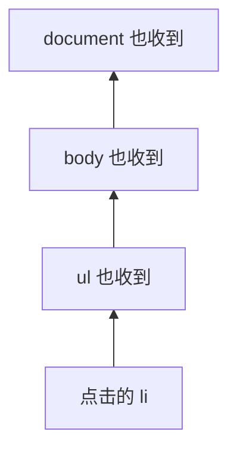
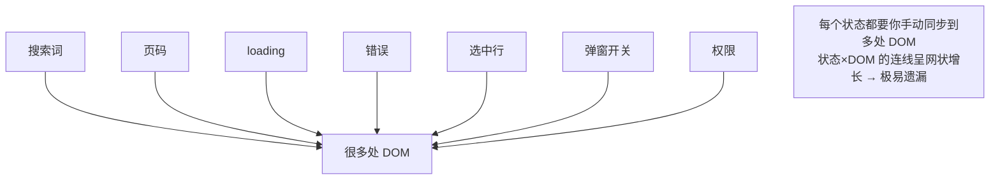
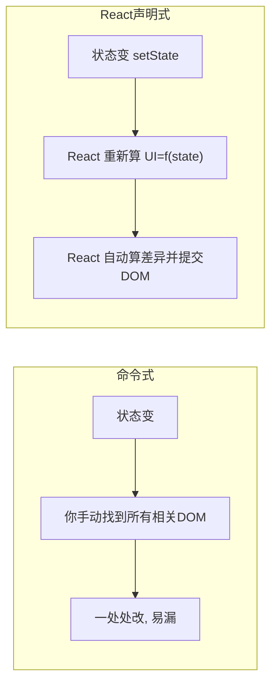
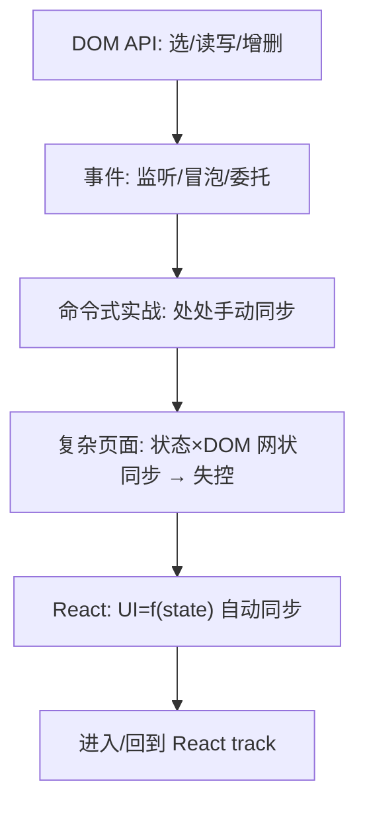

# 前端基础 - 第 8 课：DOM 与事件，命令式前端，以及它为什么会失控

## 学习目标（本节结束后你能做到什么）

- 把前面学的 JS 和页面正式连起来：用 DOM API 选中、读写、增删页面元素。
- 掌握事件监听 `addEventListener`、事件对象、`preventDefault`。
- 理解事件冒泡和**事件委托**这个重要技巧。
- 亲手用命令式写一个有交互的小功能（待办列表），体会原生 DOM 操作的真实手感。
- **看清“命令式操作 DOM”在复杂页面会怎样失控**——状态分散、手动同步、容易遗漏。
- 真正理解 React 声明式模型（`UI = f(state)`）到底把哪个痛点拿走了。

> 这是前端基础 track 的“桥梁课”。前 7 课你学了浏览器、结构、样式、JS 语言。这一课把它们拼起来，让你**亲手**操作页面——并在这个过程中亲身感受“手动维护 UISync 的痛”。带着这份痛感去读 React 第 1 课的“命令式 vs 声明式”，你会有完全不同的体感。这是刻意设计的：先疼，再理解解药。

## 内容讲解

### 1. DOM API：JavaScript 操作页面的入口

回忆第 1 课：DOM 是 HTML 在内存里的“活的对象树”，而 `document` 是这棵树的入口。JavaScript 通过 `document` 上的一组方法来操作页面，这组方法统称 **DOM API**。

整个命令式前端就围绕四件事：**选元素 → 读/写它 → 监听它的事件 → 增删节点**。下面逐个讲。

### 2. 选中元素

要操作哪个元素，先得“抓”到它。最常用：

```js
// querySelector：用 CSS 选择器选「第一个」匹配的元素（最常用！）
const btn = document.querySelector("#login-btn");   // 选 id=login-btn
const title = document.querySelector(".title");     // 选 class=title
const firstLi = document.querySelector("ul li");    // 选 ul 里第一个 li

// querySelectorAll：选「所有」匹配的，返回一个类数组
const allItems = document.querySelectorAll(".item"); // 所有 class=item

// 老式 API（也常见）
const el = document.getElementById("login-btn");     // 按 id
```

注意第 3 课说过：`class`、`id` 这些属性的主要用途，就是给 CSS 和 JS 一个“抓手”。这里 `querySelector` 用的就是和 CSS 一模一样的选择器语法——你第 3 课学的选择器，在这里直接复用。

`querySelectorAll` 返回的是类数组（NodeList），要遍历它常用 `forEach`：

```js
document.querySelectorAll(".item").forEach((el) => {
  el.style.color = "red";
});
```

### 3. 读写元素的内容、属性和样式

抓到元素后，就能读写它的各种东西。

**读写文本内容：**

```js
const el = document.querySelector("#title");
el.textContent = "新标题";        // 设置纯文本（推荐，安全）
el.textContent;                  // 读取文本

el.innerHTML = "<b>加粗</b>";     // 设置 HTML（会解析标签）
```

⚠️ `innerHTML` 会把字符串当 HTML 解析，**如果内容来自用户输入，直接塞进 innerHTML 会有 XSS 安全风险**（用户可注入 `<script>`）。能用 `textContent` 就别用 `innerHTML`。这也是 React 默认转义、要特意写 `dangerouslySetInnerHTML` 才插原始 HTML 的原因——名字里带“dangerously”就是提醒你危险。

**读写表单元素的值（第 2 课埋的 `value` 在这里用）：**

```js
const input = document.querySelector("#username");
input.value;                 // 读取输入框当前内容
input.value = "默认值";       // 设置输入框内容
```

**读写属性：**

```js
const link = document.querySelector("a");
link.getAttribute("href");           // 读属性
link.setAttribute("href", "/home");  // 写属性
link.disabled = true;                // 有些属性可直接当对象属性读写
```

**读写样式与 class：**

```js
const box = document.querySelector(".box");

// 直接改行内样式
box.style.color = "red";
box.style.display = "none";

// 操作 class（更推荐——样式写在 CSS 里，JS 只切 class）
box.classList.add("active");
box.classList.remove("active");
box.classList.toggle("active");      // 有则去、无则加
box.classList.contains("active");    // 是否包含
```

**经验：优先用 `classList` 切换 class，而不是直接写 `style`。** 因为这样样式仍集中在 CSS 文件里（第 3 课的“结构/样式分离”），JS 只负责“切状态”，职责更清晰。

### 4. 创建、插入与删除节点

页面不光是改现有元素，还经常要动态加/删元素（比如“加载更多”往列表里插新行）。

```js
// 创建一个新元素
const li = document.createElement("li");
li.textContent = "新的一项";
li.classList.add("item");

// 插入到某个父元素里
const ul = document.querySelector("ul");
ul.appendChild(li);           // 加到末尾
ul.prepend(li);               // 加到开头

// 删除
li.remove();                  // 删除自己
ul.removeChild(li);           // 从父元素删除某子节点
```

回忆第 1 课的因果链：**你这样改了 DOM 树，浏览器就会重新走渲染管线（布局、绘制），页面上就真的多/少了元素。** 所有“页面动态变化”，本质都是这套增删改 DOM。

### 5. 事件：让页面响应用户

页面要“活”，就得响应用户操作（点击、输入、提交）。靠 `addEventListener` 给元素挂事件监听器——把一个函数交给浏览器，让它在事件发生时回调（第 4 课“函数是一等公民”+ 回调）。

```js
const btn = document.querySelector("#submit");

btn.addEventListener("click", (event) => {
  console.log("按钮被点了");
  console.log(event);   // 事件对象，带着这次事件的信息
});
```

第一个参数是**事件类型**（`"click"`、`"input"`、`"submit"`、`"keydown"`……），第二个是**回调函数**。

**事件对象 `event`** 携带这次事件的信息，常用：

```js
input.addEventListener("input", (event) => {
  console.log(event.target.value);   // event.target 是触发事件的元素，.value 是当前输入
});

form.addEventListener("submit", (event) => {
  event.preventDefault();   // 阻止默认行为（表单默认提交会刷新页面）
  // 自己处理提交逻辑
});
```

`event.preventDefault()` 很重要：表单提交、链接跳转都有“默认行为”（刷新/跳转），前端经常要阻止它、改成自己用 JS 处理。这个你在 React 里也会反复写 `e.preventDefault()`。

监听输入框的 `input` 事件 + 读 `event.target.value`，就是**手动版的“受控”**——这正是 React 受控组件要自动化的事，留个印象。

### 6. 事件冒泡与事件委托

**事件冒泡（bubbling）**：当你点击一个元素，事件不只在它身上触发，还会**向上传播**给它的父元素、祖父元素，一直到顶。比如点 `li`，事件会依次冒泡到 `ul`、`body`……



利用冒泡，可以做**事件委托（event delegation）**：不给每个子元素单独绑监听，而是**给父元素绑一个**，靠 `event.target` 判断具体点的是谁。

```js
// ❌ 不用委托：给每个 li 都绑（列表很长时浪费，新增的 li 还得重新绑）
document.querySelectorAll("li").forEach((li) => {
  li.addEventListener("click", handle);
});

// ✅ 用委托：只给 ul 绑一个，靠 target 判断
document.querySelector("ul").addEventListener("click", (event) => {
  if (event.target.tagName === "LI") {
    console.log("点了", event.target.textContent);
  }
});
```

委托的好处：① 只绑一个监听，省内存；② **动态新增的子元素自动“享受”这个监听**，不用重新绑。后台列表里“每行一个删除按钮”的场景，用委托很省事。这是命令式前端的一个重要技巧，了解它，也能体会到“管理大量元素的事件”本身就有复杂度。

### 7. 实战：用命令式写一个待办列表

把以上拼起来，写一个能加待办、能删待办的小功能。**请重点感受这个过程有多“手动”。**

HTML：

```html
<input id="todo-input" placeholder="输入待办">
<button id="add-btn">添加</button>
<ul id="todo-list"></ul>
<p id="count"></p>
```

JS（命令式）：

```js
const input = document.querySelector("#todo-input");
const addBtn = document.querySelector("#add-btn");
const list = document.querySelector("#todo-list");
const count = document.querySelector("#count");

let todos = [];   // 数据

// 把数据「同步」到页面——注意：每次都要手动重画
function render() {
  list.innerHTML = "";                 // 先清空
  todos.forEach((todo, index) => {
    const li = document.createElement("li");
    li.textContent = todo;
    const del = document.createElement("button");
    del.textContent = "删除";
    del.addEventListener("click", () => {
      todos.splice(index, 1);          // 改数据
      render();                        // 又得手动重画
    });
    li.appendChild(del);
    list.appendChild(li);
  });
  count.textContent = `共 ${todos.length} 项`;   // 别忘了同步计数！
}

addBtn.addEventListener("click", () => {
  if (!input.value) return;
  todos.push(input.value);   // 改数据
  input.value = "";          // 手动清空输入框
  render();                  // 又得手动重画
});

render();
```

它能跑。但请你盯着这段代码，注意几件事：

- 数据 `todos` 变了，**你必须手动调 `render()`** 把它“刷”到页面，漏掉一处页面就和数据不一致。
- `render()` 里你**手动**拼每个 `li`、手动绑删除事件、手动更新计数文案。
- 加了个“共 N 项”的计数后，你得**记得**在每个改数据的地方都触发重画，否则计数会过期。

这只是 2 个交互、1 个派生显示。**现在把它放大到真实后台页面**，痛点就要爆发了。

### 8. 为什么命令式会失控

设想第 1 课提过的那个后台列表页，它同时有这些状态：搜索词、页码、loading、错误、选中行、弹窗开关、表单是否被改、保存按钮是否禁用、当前用户权限……

用命令式维护它，你要手动处理的“同步关系”是**爆炸式增长**的：

- 请求开始 → 显示 loading、禁用按钮、清空旧错误。
- 请求成功 → 隐藏 loading、渲染表格、更新分页、启用按钮。
- 请求失败 → 隐藏 loading、显示错误、恢复按钮。
- 改搜索词 → 重置页码、重新请求、（又回到上面那一串）。
- 选中某行 → 改某些按钮状态。
- 打开弹窗 → 填充表单。关闭弹窗 → 重置表单、清错误。
- 权限不足 → 隐藏/禁用某些按钮。



命令式的根本问题在于：**“状态”和“界面”之间的同步，全靠你一行行手写，而且这种同步关系是 M 个状态 × N 处 DOM 的网状结构。** 随便加一个新状态或新显示，你就要回到所有相关的地方补一笔“记得也更新这里”。**漏掉任何一处，页面显示的东西就不再代表真实状态——这就是第 1 课说的“数据和界面不同步”，是复杂前端最常见、最折磨人的 bug 来源。**

还有别的麻烦：

- **状态散落在 DOM 里**：有时候真实状态没存在 JS 变量里，而是“看输入框的值”“看某个 class 在不在”，DOM 既是显示又被当存储，越来越乱。
- **重画与事件绑定纠缠**：像第 7 节那样 `innerHTML=""` 重建，之前绑的事件全没了得重绑；不重建又得精细地找差异改，两头不讨好。

### 9. React 把哪个痛拿走了

现在你带着痛感看 React 的解法。React 的核心主张（第 1 课 `UI = f(state)`）就是：**你别再手动同步 DOM 了。你只声明“给定当前状态，页面应该长什么样”，状态一变，React 自动帮你算出 DOM 该怎么变并提交。**

同样的待办列表，React 写法：

```jsx
function TodoApp() {
  const [todos, setTodos] = useState([]);
  const [text, setText] = useState("");

  return (
    <div>
      <input value={text} onChange={(e) => setText(e.target.value)} />
      <button onClick={() => { setTodos([...todos, text]); setText(""); }}>
        添加
      </button>
      <ul>
        {todos.map((todo, i) => (
          <li key={i}>
            {todo}
            <button onClick={() => setTodos(todos.filter((_, idx) => idx !== i))}>
              删除
            </button>
          </li>
        ))}
      </ul>
      <p>共 {todos.length} 项</p>
    </div>
  );
}
```

对比命令式版本，关键差异：

- **没有 `render()`、没有手动 `appendChild`、没有手动同步计数。** 你只描述了“`todos` 长这样时，页面就长这样”。
- 改数据只用 `setTodos(...)`（注意是不可变更新，第 5 课学的 `[...todos]`、`filter`），**剩下的 DOM 更新 React 全包了**。
- “共 N 项”这种派生显示，自动跟着 `todos` 走，绝不会忘记同步——因为它本来就是从 `todos.length` 算出来的。



**这就是 React 拿走的痛：它把“状态→DOM 的手动同步”这件又繁琐又易错的事自动化了。** 而第 1 课说过，React 并没有绕过浏览器渲染管线——它最后还是改 DOM、还是让浏览器重画，只是“怎么改、改哪里”由它替你算（这就是后面 React 课讲的虚拟 DOM / diff）。

所以你现在能真正读懂 React 第 1 课那句话了：

> React 的核心问题：不要让开发者到处手动同步 DOM，而是让开发者描述“当前状态下页面应该长什么样”。

你刚刚在第 7、8 节亲手体验了“到处手动同步 DOM”的痛，这句话就不再是口号，而是你切身需要的解药。

### 10. 收束：前端基础 track 的转折点



这一课你既学会了**原生 DOM 操作**（这是真功夫，调试、写小工具、看懂任何前端代码都用得上），又通过亲手的痛感，理解了**React 存在的根本理由**。这正是前端基础 track 通往 React track 的桥。

后面还剩两课收尾：第 9 课 TypeScript（给 JS 加类型护栏），第 10 课工程化（模块/npm/打包怎么把这些组织成真实项目）。学完它们，你再回到 React track（第 9 课起）时，地基就完全齐了。

## 小结（关键点）

- DOM API 是 JS 操作页面的入口，围绕四件事：**选元素**（`querySelector`，语法同 CSS 选择器）、**读写**（`textContent`/`value`/`classList`/`style`）、**事件**、**增删节点**（`createElement`/`appendChild`/`remove`）。
- `innerHTML` 插字符串会解析 HTML，有 **XSS 风险**，能用 `textContent` 就别用；这也是 React 默认转义、`dangerouslySetInnerHTML` 才插原始 HTML 的原因。
- 用 `addEventListener` 监听事件；`event.target` 是触发元素，`event.preventDefault()` 阻止默认行为（表单提交/链接跳转）。
- **事件冒泡**让事件向上传播，据此可做**事件委托**（父元素绑一个，靠 `target` 判断），省内存且对动态元素友好。
- **命令式操作 DOM 在复杂页面会失控**：状态与界面的同步全靠手写，是 M 状态 × N 处 DOM 的网状关系，极易遗漏，导致“数据和界面不一致”。
- **React 用 `UI = f(state)` 拿走了这个痛**：你只声明状态对应的 UI，状态一变 React 自动算差异、改 DOM；它没绕过渲染管线，只是替你算“改哪里”。

## 问题（检测理解）

1. 用 DOM API 写：选中 id 为 `name` 的输入框，把它的值设为“张三”，再给 class 为 `box` 的元素加上 `active` 这个 class。
2. `textContent` 和 `innerHTML` 有什么区别？为什么说 `innerHTML` 有安全风险？这和 React 的 `dangerouslySetInnerHTML` 有什么联系？
3. `event.preventDefault()` 是干什么的？给一个“必须用它”的场景。
4. 什么是事件冒泡？事件委托是怎么利用冒泡的？它有哪两个好处？
5. 看第 7 节的命令式待办列表：如果我再加一个“已完成数量”的显示，命令式写法我需要在哪些地方动手？容易漏在哪？
6. 为什么说“命令式操作 DOM 在复杂页面会失控”？用“状态 × DOM”的角度解释。
7. React 的 `UI = f(state)` 到底把命令式的哪个痛点拿走了？它有没有绕过浏览器的渲染管线？
8. 对照命令式和 React 版的待办列表，React 版里“共 N 项”这个显示为什么不可能忘记同步？

把答案发我即可。我据此判断第 8 课掌握情况，再进第 9 课（TypeScript）。
