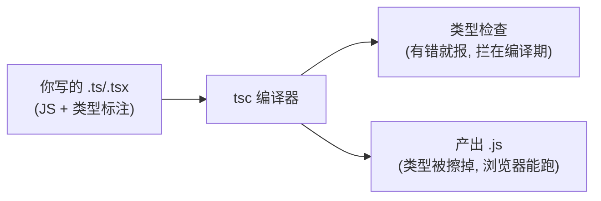
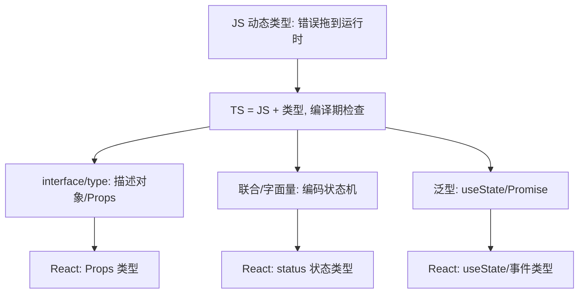

# 前端基础 - 第 9 课：TypeScript，给 JavaScript 加上类型护栏

## 学习目标（本节结束后你能做到什么）

- 说清楚 TypeScript 是什么、和 JavaScript 是什么关系（JS 超集 + 静态类型）。
- 理解动态类型的 JS 有哪些痛点，类型护栏怎么把它们挡在编译期。
- 掌握基础类型标注、类型推断、`any` 与 `unknown` 的区别。
- 会用 `interface` / `type` 描述对象结构，会用联合类型、字面量类型、可选属性。
- 会标注函数的参数和返回值，初步理解泛型。
- 看懂 TypeScript 在 React 里最常见的用法：Props 类型、`useState` 泛型、事件类型。

> 你有后端背景，这一课会是整个 track 里最“亲切”的一课——静态类型、接口、泛型这些，本来就是你熟悉的东西。TS 做的事，就是把你后端习以为常的“类型安全”带回 JavaScript。所以这一课重点不在“类型是什么”，而在“TS 怎么把类型加到 JS 上，以及它在 React 里怎么用”。

## 内容讲解

### 1. 为什么要给 JavaScript 加类型

第 4 课说过，JS 是**动态类型**：变量不声明类型，类型运行时才定，一个变量能先存数字再存字符串。这带来灵活，也带来一类后端工程师特别难忍的问题——**很多错误要到运行时、甚至上线后才暴露**。

看几个典型的“JS 不报错但会出 bug”的场景：

```js
function getTotal(order) {
  return order.price * order.count;   // 万一传进来的对象没有 price 呢？
}

getTotal({ price: 10, count: 2 });    // 20，正常
getTotal({ amount: 10, count: 2 });   // NaN！拼错字段名了，但 JS 不报错
getTotal(null);                        // 运行时崩溃：Cannot read properties of null
```

- 拼错属性名 `amount` 当 `price` → 得到 `NaN`，悄无声息地错。
- 传了 `null` → 运行时直接崩。
- 函数到底该收什么形状的参数？光看代码不知道，得去翻调用方或文档。

在后端，这些大多数会被编译器在**编译期**拦下。JS 没有这层保护，于是项目一大、协作一多，这种“低级但隐蔽”的错误就成了 bug 的重灾区。**TypeScript 就是来补这层护栏的**：把类型错误从“运行时才发现”提前到“写代码时编辑器就标红、编译时就报错”。

### 2. TypeScript 是什么：JS 超集 + 编译期类型检查

两个关键认知：

**(1) TS 是 JS 的“超集”**：所有合法的 JS 都是合法的 TS。TS = JS + 类型系统。你已经学的 JS 语法（变量、函数、对象、数组、异步、闭包）在 TS 里**原样有效**，TS 只是额外让你**给值标注类型**。所以你不是在学一门新语言，而是在给已经会的 JS“加注解”。

**(2) 类型只活在编译期，运行时会被擦掉**：浏览器不认识 TS，TS 代码要先**编译**成普通 JS 才能跑。编译时，TS 编译器（`tsc`）做两件事：① 检查类型有没有错（有错就报）；② 把类型标注**抹掉**，产出干净的 JS。



**重要推论：类型只在开发时保护你，运行时不存在。** 所以 TS 不能替你做“运行时校验”——比如接口返回的数据是否真的符合类型，TS 管不了（那是运行时的事，需要额外校验）。这点别误解。用后端类比：TS 像编译期的类型检查，不像运行时的参数校验框架。

### 3. 基础类型标注

给变量标类型，语法是 `变量: 类型`：

```ts
let name: string = "张三";
let age: number = 28;
let isAdmin: boolean = false;
let nothing: null = null;

let ids: number[] = [1, 2, 3];          // 数字数组
let names: string[] = ["a", "b"];        // 字符串数组
let pair: [string, number] = ["张三", 28]; // 元组：定长、每位类型固定
```

类型不匹配，编辑器立刻标红、编译报错：

```ts
let age: number = 28;
age = "old";   // ❌ 报错：不能把 string 赋给 number
```

**两个特殊类型要分清：`any` 和 `unknown`**

```ts
let x: any;       // 「放弃类型检查」——什么都能赋、什么都能调，等于关掉护栏
x = 1; x = "s"; x.foo.bar();   // 全都不报错（但运行时可能崩）

let y: unknown;   // 「类型未知」——能赋任何值，但用之前必须先收窄类型
y = 1;
y.toFixed();      // ❌ 报错：y 类型未知，不让你直接用
```

`any` 是“逃生舱”——它让 TS 闭嘴，但也丢掉了所有保护，**应尽量少用**（滥用 `any` 等于又退回了没类型的 JS）。`unknown` 更安全：它逼你先判断类型再使用。新手期记住：**少用 `any`**。

### 4. 类型推断：很多时候不用手写类型

TS 很聪明，能**自动推断**类型，所以你不用到处手写：

```ts
let name = "张三";    // TS 自动推断为 string，等价于 let name: string
name = 28;            // ❌ 照样报错，因为已推断成 string

const nums = [1, 2, 3];        // 推断为 number[]
const doubled = nums.map(n => n * 2);  // n 自动推断为 number，doubled 是 number[]
```

实践原则：**能让 TS 推断的就别手写类型**，代码更干净。主要在这些地方需要显式标注：函数参数、对象/接口结构、以及推断不出来的地方。这和你后端用 `var`/类型推断的取舍类似。

### 5. 描述对象结构：interface 与 type

前端数据大多是对象（接口返回的 JSON），所以“描述对象的形状”是 TS 最常用的能力。两种方式：

```ts
// 方式一：interface（接口）
interface User {
  id: number;
  name: string;
  age: number;
}

// 方式二：type（类型别名）
type User2 = {
  id: number;
  name: string;
  age: number;
};

const u: User = { id: 1, name: "张三", age: 28 };

const bad: User = { id: 1, name: "张三" };   // ❌ 报错：缺少 age
const bad2: User = { id: 1, name: "张三", age: 28, foo: 1 };  // ❌ 多了 foo 也报错
```

这就像你后端定义一个 DTO/实体类——明确规定“这个对象必须有哪些字段、各是什么类型”。一旦定义好，拼错字段名、漏字段、类型不对，全在编辑器里标红。

**`interface` 和 `type` 怎么选？** 90% 的场景两者可互换。经验法则：**描述对象/组件 Props 时习惯用 `interface`**（可继承、可扩展），**需要联合类型、交叉、别名时用 `type`**（更灵活）。新手期不必纠结，挑一个用顺手即可。

**可选属性 `?` 和只读 `readonly`：**

```ts
interface User {
  id: number;
  name: string;
  email?: string;        // 可选：可以没有这个字段
  readonly createdAt: string;  // 只读：初始化后不能改
}

const u: User = { id: 1, name: "张三" };   // ✅ 没 email 也行
u.createdAt = "...";   // ❌ 报错：readonly 不能改
```

`email?: string` 表示这个字段“有就是 string，没有就是 undefined”。接口数据里常有可选字段，这个很常用。

### 6. 联合类型与字面量类型：用类型表达“状态机”

这是 TS 一个很强、对 React 特别有用的能力。

**联合类型 `|`：一个值可以是“这个或那个”**

```ts
let id: number | string;   // 可以是数字，也可以是字符串
id = 1;      // ✅
id = "abc";  // ✅
id = true;   // ❌ 报错

function format(value: string | number) { /* ... */ }
```

**字面量类型：把类型限定成“几个具体的值之一”**

```ts
type Status = "idle" | "loading" | "success" | "error";

let status: Status = "loading";   // ✅
status = "done";   // ❌ 报错：只能是那四个之一
```

`Status` 把一个状态字段约束成“只能是这四个字符串”。这对 React 太有用了——回忆 React 第 1 课的登录例子，`status` 就是 `"idle" | "loading" | "success" | "error"`。用字面量联合类型一标，**写错状态名、漏处理某个状态，编译器都能提醒你**，相当于把“状态机的合法状态”编码进了类型里：

```tsx
const [status, setStatus] = useState<Status>("idle");
setStatus("loadnig");   // ❌ 拼错了，编译器立刻报错（不用等运行时）
```

这是 TS 在前端最“香”的用法之一。

### 7. 函数类型：标注参数与返回值

给函数的参数和返回值标类型，是 TS 用得最多的地方：

```ts
// 参数 : 类型，返回值在括号后用 : 类型
function add(a: number, b: number): number {
  return a + b;
}

// 箭头函数同理
const greet = (name: string): string => `你好，${name}`;

// 可选参数、默认参数
function log(msg: string, level?: string): void {  // void 表示没有返回值
  console.log(level ?? "info", msg);
}

add(1, 2);        // ✅
add(1, "2");      // ❌ 报错：第二个参数要 number
```

`void` 表示“不返回有意义的值”。有了参数和返回值类型，**调用方传错参数、用错返回值，都在编译期就被挡下**——这正是你后端写强类型函数时享受的保护。

**函数本身也能作为类型**（回忆“函数是一等公民”），这在 React 传回调时常见：

```ts
// 描述「一个接收 string、无返回的函数」类型
type Handler = (value: string) => void;

interface InputProps {
  value: string;
  onChange: (newValue: string) => void;   // onChange 是个函数类型
}
```

### 8. 泛型：类型也能“传参数”

泛型（generics）你在后端见过（`List<T>`、`Map<K,V>`）。TS 的泛型是一回事：**让类型像参数一样可传入，写出“对任意类型都通用”的代码，同时不丢类型安全。**

```ts
// 不用泛型：要么写死类型，要么用 any 丢掉安全
function firstAny(arr: any[]): any { return arr[0]; }

// 用泛型：T 是占位类型，调用时自动确定
function first<T>(arr: T[]): T {
  return arr[0];
}

const n = first([1, 2, 3]);        // T 推断为 number，n 是 number
const s = first(["a", "b"]);       // T 推断为 string，s 是 string
```

`<T>` 是类型参数，`first` 不关心具体是什么类型，但能保证“传进去什么类型的数组，返回就是什么类型的元素”。这就是泛型的价值：**通用 + 类型安全，两者兼得**。

泛型在前端最常见的露脸场景，就是 `useState`、`Promise` 这些：

```ts
const [count, setCount] = useState<number>(0);     // 状态是 number
const [user, setUser] = useState<User | null>(null); // 状态是 User 或 null

async function fetchUser(): Promise<User> { /* ... */ }  // 返回 User 的 Promise
```

`useState<User | null>(null)` 明确告诉 React“这个状态要么是 User、要么是 null”，之后 `user.name` 在 user 可能为 null 时编译器会提醒你判空。新手期能**看懂并会用**现成的泛型（`useState<T>`、`Array<T>`、`Promise<T>`）就够，自己写泛型函数是进阶。

### 9. 类型收窄：把“可能是多种”缩小到“确定是一种”

当一个值是联合类型时，TS 不让你直接当某一种用，得先“收窄（narrowing）”——通过判断把类型缩小：

```ts
function printId(id: number | string) {
  // id.toFixed();   // ❌ 报错：string 没有 toFixed
  if (typeof id === "number") {
    id.toFixed(2);   // ✅ 这个分支里 TS 知道 id 一定是 number
  } else {
    id.toUpperCase(); // ✅ 这个分支里 id 一定是 string
  }
}
```

TS 能跟着你的 `if`/`typeof`/`?.` 判断**自动收窄**类型。这和第 5 课的 `?.`、第 6 课的 `try/catch` 配合得很好。处理“可能为 null 的接口数据”时天天用：

```ts
function show(user: User | null) {
  if (!user) return;     // 收窄掉 null
  console.log(user.name); // 这里 user 一定是 User，可以安全访问
}
```

### 10. TypeScript 在 React 里的样子（预告）

把这一课的点拼到 React 上，你会看到 TS 在 React 里最常见的三处用法。现在混个脸熟，React 工程化那课（第 14 课）会落到实处：

**(1) 给组件 Props 标类型（最常用）：**

```tsx
interface ButtonProps {
  text: string;
  disabled?: boolean;              // 可选
  onClick: () => void;             // 函数类型
}

function Button({ text, disabled, onClick }: ButtonProps) {
  return <button disabled={disabled} onClick={onClick}>{text}</button>;
}

// 用的时候，传错/漏传 props 编译器立刻报错
<Button text="提交" onClick={handleSubmit} />        // ✅
<Button onClick={handleSubmit} />                     // ❌ 少了 text
```

**(2) 给 `useState` 标类型（用泛型）：**

```tsx
const [users, setUsers] = useState<User[]>([]);       // 用户数组
const [status, setStatus] = useState<Status>("idle"); // 字面量联合
```

**(3) 给事件标类型：**

```tsx
function handleChange(e: React.ChangeEvent<HTMLInputElement>) {
  setText(e.target.value);   // e.target 类型明确，.value 有提示
}
```

事件类型名字长（`React.ChangeEvent<HTMLInputElement>`），但好处是 `e.target.value` 有完整的自动补全和检查，不会瞎拼。这些类型名你不用背，编辑器会提示，用多了自然记住。

### 11. 怎么跑 TS：编译与 tsconfig（了解）

- TS 文件后缀是 `.ts`，含 JSX 的 React 文件是 `.tsx`。
- 用 `tsc` 编译成 JS，或者更常见——现代脚手架（Vite、Next.js）**内置了 TS 支持**，你直接写 `.tsx`，开发服务器自动编译，不用手动管。
- 项目根目录有个 `tsconfig.json` 配置编译选项（目标版本、严格程度等），脚手架会帮你生成好默认配置，新手期基本不用改。其中 `strict: true` 开启严格模式（推荐），让护栏更牢。

这一层（编译、配置）属于工程化，下一课（第 10 课）会把它和 npm、打包工具一起讲清楚。这里知道“写 `.tsx`、工具自动编译”即可。

### 12. 收束：把后端的类型安全带回前端



这一课对你这种后端背景的人来说，更多是“认门”而非“学新东西”——TS 把你熟悉的类型安全还给了 JS。真实的现代 React 项目几乎都用 TS 写，所以这一课不是可选项。学到这，你已经能看懂带类型的 React 代码了。最后一课（第 10 课）讲工程化：模块、npm、打包、开发服务器怎么把前面所有零件组装成一个能跑的真实项目。

## 小结（关键点）

- TS 是 **JS 的超集 + 静态类型**；你会的 JS 全部有效，TS 只是加类型标注。
- 类型**只在编译期存在**，`tsc` 检查完会把类型擦掉产出普通 JS；所以 TS 不做运行时校验，接口数据合法性仍需另行校验。
- 基础标注 `: 类型`；**`any` 是关掉护栏应少用，`unknown` 更安全**；能推断的就别手写。
- 用 `interface`/`type` 描述对象结构（像 DTO），`?` 可选、`readonly` 只读；联合 `|` 和**字面量类型**能把“状态机”编码进类型（如 `"idle"|"loading"|...`）。
- 函数标注参数与返回值（`void` 表示无返回）；**泛型**让类型可传参（`useState<T>`、`Promise<T>`），通用又安全。
- **类型收窄**：用 `typeof`/`if`/判空把联合类型缩小到确定类型再使用。
- TS 在 React 三大高频用法：**Props 类型**、**`useState<T>`**、**事件类型**；现代 React 项目基本都用 TS。

## 问题（检测理解）

1. TypeScript 和 JavaScript 是什么关系？“TS 的类型只在编译期存在”是什么意思？它能帮你做运行时的接口数据校验吗？
2. 动态类型的 JS 有哪些痛点？举一个“JS 不报错但有 bug、而 TS 能拦下”的例子。
3. `any` 和 `unknown` 有什么区别？为什么说应尽量少用 `any`？
4. 用 `interface` 定义一个 `Product` 类型：必有 `id: number`、`name: string`，可选 `description: string`。
5. 字面量联合类型 `type Status = "idle" | "loading" | "success" | "error"` 对 React 有什么好处？写错状态名会怎样？
6. 泛型解决了什么问题？`useState<User | null>(null)` 这个写法表达了什么？之后访问 `user.name` 时编译器会提醒你什么？
7. 什么是类型收窄？给一个 `user: User | null` 的参数，怎么安全地访问 `user.name`？
8. 在 React 里给一个组件的 Props 标类型，通常用 `interface` 还是 `type`？给 `useState` 标类型用到了什么特性？

把答案发我即可。我据此判断第 9 课掌握情况，再进第 10 课（现代前端工程化基础）。
