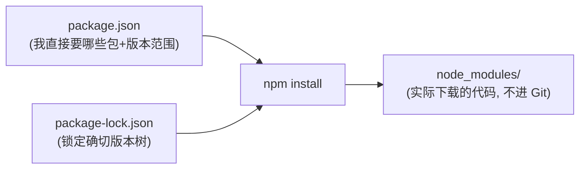
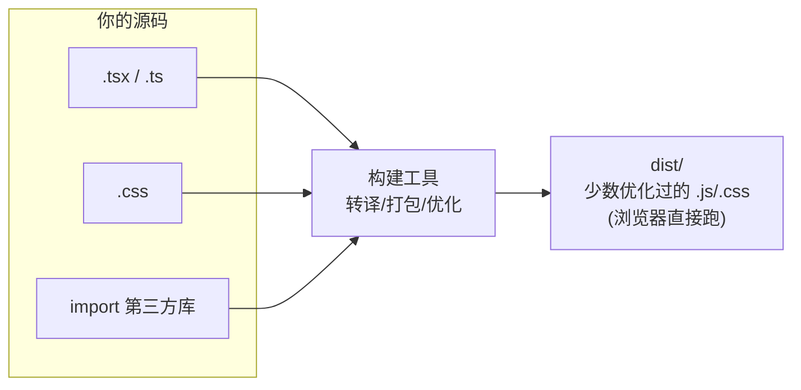
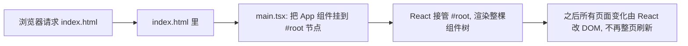
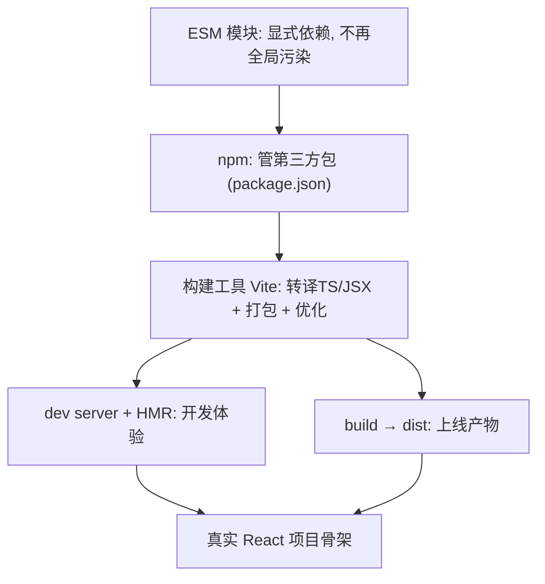

# 前端基础 - 第 10 课：现代前端工程化基础，模块、npm、打包与开发服务器

## 学习目标（本节结束后你能做到什么）

- 说清楚“前端工程化”要解决什么问题：从一个 `<script>` 到一个能协作、能维护的真实项目。
- 理解 ES Modules 在浏览器里怎么工作，以及它和第 6 课 `import/export` 的关系。
- 掌握 npm 与 `package.json`：依赖管理、`node_modules`、锁文件、npm scripts（类比 Maven/Gradle）。
- 理解为什么需要**打包/构建工具**，它到底替你做了哪些事。
- 认识 **Vite**：开发服务器、热更新（HMR）、生产构建。
- 看懂一个真实 React 项目的目录结构和启动流程。

> 这是前端基础 track 的最后一课。前面你学的是“一个个零件”——HTML、CSS、JS、TS、DOM。这一课讲的是“怎么把这些零件组装成一台能跑的机器”，也就是真实项目的骨架。学完它，你就具备了把 React 项目跑起来、看懂它结构的全部前置知识。

## 内容讲解

### 1. 为什么需要工程化：从一个 script 说起

回忆第 1 课，最朴素的网页是这样引入 JS 的：

```html
<script src="app.js"></script>
<script src="utils.js"></script>
<script src="page.js"></script>
```

页面小的时候这没问题。但真实项目有成百上千个文件、几十个第三方库、还要用 TypeScript 和 JSX（浏览器不认识），这种“手动一个个 script 引入”的方式立刻崩溃：

- **依赖顺序地狱**：`page.js` 用到 `utils.js` 的函数，你必须保证 `utils.js` 先加载。文件一多，顺序根本理不清。
- **全局变量污染**：早期 script 之间靠全局变量通信，谁都能改谁，命名冲突频发。
- **第三方库怎么管**：手动下载 jQuery、lodash 的文件放进项目？版本升级怎么办？依赖的依赖怎么办？
- **浏览器不认识 TS/JSX**：你写的 `.tsx` 浏览器根本跑不了，得先转译成普通 JS。
- **性能**：几百个小文件意味着几百个网络请求，慢。

**前端工程化就是用一套工具链系统性地解决这些问题**：用**模块系统**管依赖关系，用 **npm** 管第三方包，用**打包/构建工具**把 TS/JSX 转译、把成百上千个模块打成少数几个优化过的文件。下面逐个讲。

### 2. ES Modules：浏览器原生的模块系统

第 6 课学过 `import`/`export`，那套语法的正式名字叫 **ES Modules（ESM）**，是 JavaScript 语言级的模块标准。它解决了上面的“依赖顺序”和“全局污染”：每个文件是独立模块，**显式声明自己依赖谁、暴露什么**，不再靠全局变量和加载顺序。

```js
// math.js
export function add(a, b) { return a + b; }

// app.js
import { add } from "./math.js";   // 显式声明依赖
console.log(add(1, 2));
```

现代浏览器其实原生支持 ESM，用 `<script type="module">` 就能跑：

```html
<script type="module" src="app.js"></script>
```

但光靠浏览器原生 ESM 还不够（不能直接 import 第三方包名、不能跑 TS/JSX、几百个模块仍是几百个请求），所以真实项目还要 npm + 构建工具。ESM 是地基，npm 和打包工具是盖在上面的楼。

### 3. npm 与 package.json：前端的依赖管理

**npm（Node Package Manager）** 是前端的包管理器，作用相当于后端的 **Maven / Gradle / pip**：从中央仓库下载第三方库、管理版本和依赖关系。

一个项目的“身份证 + 依赖清单”是根目录的 **`package.json`**：

```json
{
  "name": "my-react-app",
  "version": "1.0.0",
  "scripts": {
    "dev": "vite",
    "build": "vite build",
    "preview": "vite preview"
  },
  "dependencies": {
    "react": "^18.2.0",
    "react-dom": "^18.2.0"
  },
  "devDependencies": {
    "typescript": "^5.0.0",
    "vite": "^5.0.0"
  }
}
```

逐块看（都能对上你后端的 `pom.xml` / `build.gradle`）：

- **`dependencies`**：运行时依赖（项目跑起来要用的库，比如 react）。
- **`devDependencies`**：只在开发/构建时用的依赖（比如 TS 编译器、构建工具，上线产物里不需要）。
- **`scripts`**：自定义命令（下一节讲）。
- 版本号里的 `^18.2.0`：`^` 表示“允许小版本和补丁升级，但不跨大版本”——这是语义化版本（semver）的约定，和你后端的版本范围类似。

**常用 npm 命令：**

```bash
npm install            # 按 package.json 安装所有依赖（到 node_modules）
npm install axios      # 安装某个包，并写进 dependencies
npm install -D vitest  # 安装到 devDependencies（-D = --save-dev）
npm uninstall axios    # 卸载
```

**`node_modules` 与锁文件：**

- **`node_modules/`**：所有依赖被下载到这个目录（可能成千上万个文件）。它**不提交到 Git**（放进 `.gitignore`），因为可以用 `npm install` 随时重建——就像后端不会把 Maven 下载的 jar 提交进仓库。
- **`package-lock.json`**：锁定每个依赖（包括依赖的依赖）的**确切版本**，保证你和同事、和服务器装出来的依赖树完全一致。这个**要提交** Git。它解决“在我机器上好好的”那类版本漂移问题，类似 Gradle 的 lockfile。



### 4. npm scripts：项目的命令入口

`package.json` 里的 `scripts` 是一组**自定义命令别名**，用 `npm run <名字>` 执行（类似 Makefile 或 Gradle task）：

```json
"scripts": {
  "dev": "vite",            // 启动开发服务器
  "build": "vite build",    // 打生产包
  "preview": "vite preview", // 本地预览生产包
  "lint": "eslint ."        // 代码检查
}
```

```bash
npm run dev      # 开发时天天用：启动本地服务器
npm run build    # 上线前：构建生产产物
```

（`npm run dev` 有时简写成 `npm dev`，少数命令如 `start`/`test` 可省略 `run`。）**你拿到任何一个前端项目，第一件事就是看 `package.json` 的 scripts，它告诉你这个项目怎么启动、怎么构建。** 这是读懂一个前端项目的入口。

### 5. 为什么需要打包/构建工具

这是工程化的核心。**打包工具（bundler）/ 构建工具**替你做了一堆浏览器不会做的事。它的输入是你写的源码（一堆 `.tsx`、`.ts`、`.css` 模块 + node_modules 里的库），输出是浏览器能直接跑的、优化过的少数文件。它主要做这些：

1. **转译（transpile）**：把浏览器不认识的 **TS、JSX** 转成普通 JS。（你写 `<div>`，最终变成 `React.createElement(...)`；你写类型标注，被擦掉。）
2. **模块打包（bundle）**：把成百上千个模块按依赖关系合并、整理，减少网络请求数。
3. **解析依赖**：让你能 `import React from "react"` 直接用包名（浏览器原生 ESM 不认包名，要工具帮忙定位到 node_modules）。
4. **处理资源**：让你能 `import "./style.css"`、import 图片，把它们也纳入构建。
5. **优化**：压缩代码（去空格/缩短变量名）、Tree-shaking（删掉没用到的代码）、按需分割（code splitting），让上线产物尽量小、尽量快。



没有构建工具，你写的现代 React 代码（TSX + import 包名 + import css）浏览器一行都跑不了。**所以构建工具不是“锦上添花”，而是现代前端的必需品。**

### 6. Vite：现代构建工具的代表

历史上主流的打包工具是 **Webpack**（你可能听过），功能强但配置复杂、大项目启动慢。现在新项目大多用 **Vite**（法语“快”），它更快、配置更简单，是当前的主流推荐。Vite 给你两样东西：

**(1) 开发服务器（dev server）+ 热更新（HMR）**

开发时跑 `npm run dev`，Vite 启动一个本地服务器（比如 `http://localhost:5173`）。它的杀手锏是**热更新（Hot Module Replacement）**：你改了某个组件的代码、一保存，浏览器里**只有那个组件局部刷新**，页面状态都还在，几乎瞬时。不用手动刷新、不丢当前填的表单。这个体验对开发效率提升巨大——你改一行 CSS 立刻看到效果。

> 为什么 Vite 快？开发时它利用浏览器原生 ESM，按需编译你当前访问的模块，而不是一上来把整个项目打包一遍。这就是它比老 Webpack 启动快的原因。原理了解即可。

**(2) 生产构建（build）**

上线前跑 `npm run build`，Vite 把整个项目转译、打包、压缩、优化，产出到 **`dist/`** 目录——里面是少数几个优化过的静态文件（HTML/JS/CSS）。把 `dist/` 部署到任意静态服务器（Nginx、CDN、对象存储）就能上线。

```bash
npm run dev      # 开发：启本地服务器 + 热更新
npm run build    # 构建：产出 dist/ 静态文件
npm run preview  # 本地预览构建产物
```

### 7. 一个真实 React 项目长什么样

把前面所有东西拼起来，一个用 Vite + React + TS 的项目，目录大致是：

```text
my-react-app/
├── package.json          # 依赖清单 + scripts（项目入口信息）
├── package-lock.json     # 锁定版本（提交 Git）
├── tsconfig.json         # TS 编译配置（第 9 课）
├── vite.config.ts        # Vite 配置
├── index.html            # 唯一的 HTML 外壳（SPA 的壳）
├── node_modules/         # 依赖（不提交 Git）
├── dist/                 # 构建产物（不提交 Git）
└── src/                  # 你写的源码都在这
    ├── main.tsx          # 入口：把 React 挂到 index.html 的某个节点
    ├── App.tsx           # 根组件
    ├── components/       # 可复用组件
    ├── pages/            # 页面组件
    ├── hooks/            # 自定义 Hook
    ├── api/              # 接口请求封装
    └── styles/           # 样式
```

启动链路（把第 1 课的 SPA 模型落到实处）：



`index.html` 通常就一个空壳：

```html
<body>
  <div id="root"></div>            <!-- React 要挂载的节点 -->
  <script type="module" src="/src/main.tsx"></script>
</body>
```

`main.tsx` 把 React 接到这个 `#root` 上：

```tsx
import { createRoot } from "react-dom/client";
import App from "./App";

createRoot(document.getElementById("root")!).render(<App />);
```

这就把第 1 课的“SPA：只加载一次 HTML 外壳，之后 JS 接管”从概念变成了具体代码——`#root` 是那个外壳，`createRoot(...).render(<App/>)` 是 JS 接管的那一刻。

### 8. 怎么从零起一个 React 项目（了解流程）

你不用手搭这些配置，一条命令就能用脚手架生成好（含 Vite + React + TS 的全套配置）：

```bash
npm create vite@latest my-app -- --template react-ts
cd my-app
npm install     # 装依赖
npm run dev      # 启动，浏览器打开 localhost:5173
```

跑完你就有了第 7 节那个完整结构、能热更新的 React 项目。**这套流程到 React 工程化那课（第 14 课）还会再讲一遍并实操**，这里先让你知道“一个 React 项目是这么来的”，把工程化的拼图补全。

### 9. 收束：前端基础 track 到此完成



到这里，前端基础 track 的十节全部完成。你已经走完了一条完整的路：

- **第 1 课** 浏览器这台机器 → **2-3 课** HTML/CSS 结构与样式 → **4-7 课** JavaScript 语言核心 → **8 课** DOM 与命令式的失控 → **9 课** TypeScript 类型护栏 → **10 课** 工程化把一切组装成项目。

现在你具备了 React track 默认你“已经会”的全部地基。**接下来回到 React track**：你已经写到第 8 课（Hook 心智模型），带着现在补全的 JS/闭包/DOM/TS 知识回头看前 8 课会顺很多，然后继续 React 第 9 课（数据获取）起的后半程——那里的 `useEffect` 发请求、loading/error、竞态，正好接上你这边第 7 课的异步和第 8 课的 DOM 模型。

## 小结（关键点）

- 前端工程化解决“一堆 `<script>` 撑不起真实项目”的问题：依赖顺序、全局污染、第三方包管理、TS/JSX 转译、性能。
- **ES Modules** 是语言级模块标准（第 6 课的 import/export），靠显式依赖取代全局变量和加载顺序；浏览器原生支持但不够，还需 npm + 构建工具。
- **npm + `package.json`** 是前端的依赖管理（类比 Maven/Gradle）：`dependencies`/`devDependencies`、`node_modules`（不进 Git）、`package-lock.json`（锁版本、进 Git）、`scripts`（命令入口）。
- **构建工具**替你做：转译 TS/JSX、打包模块、解析包名导入、处理 CSS/资源、压缩与 Tree-shaking——是现代前端的必需品。
- **Vite** 提供开发服务器 + **热更新（HMR）**（改代码局部刷新、状态不丢）和生产构建（产出 `dist/` 静态文件）。
- 真实 React 项目：`index.html` 是 SPA 外壳，`main.tsx` 用 `createRoot().render(<App/>)` 让 React 接管 `#root`；源码在 `src/`，一条 `npm create vite` 即可起项目。

## 问题（检测理解）

1. 为什么“一堆 `<script>` 标签”撑不起真实前端项目？工程化主要解决哪几类问题？
2. `package.json` 里 `dependencies` 和 `devDependencies` 有什么区别？举例各放什么。
3. `node_modules/` 和 `package-lock.json` 哪个该提交 Git、哪个不该？为什么？锁文件解决了什么问题？
4. 构建工具（如 Vite）替你做了哪些浏览器不会做的事？为什么说没有它现代 React 代码跑不了？
5. 什么是热更新（HMR）？它对开发体验有什么帮助？
6. `npm run dev` 和 `npm run build` 分别在做什么？构建产物在哪个目录、能怎么部署？
7. 结合第 1 课的 SPA 模型，解释 `index.html` 的 `<div id="root">` 和 `main.tsx` 里 `createRoot(...).render(<App/>)` 各是什么角色。
8. 拿到一个陌生的前端项目，你会先看哪个文件来搞清楚它怎么启动、怎么构建？

这一题答完，前端基础 track 就全部学完了。接下来我们回到 React track，从第 9 课（数据获取与异步 UI）继续——那里会用到你刚学的异步和 DOM 知识。
