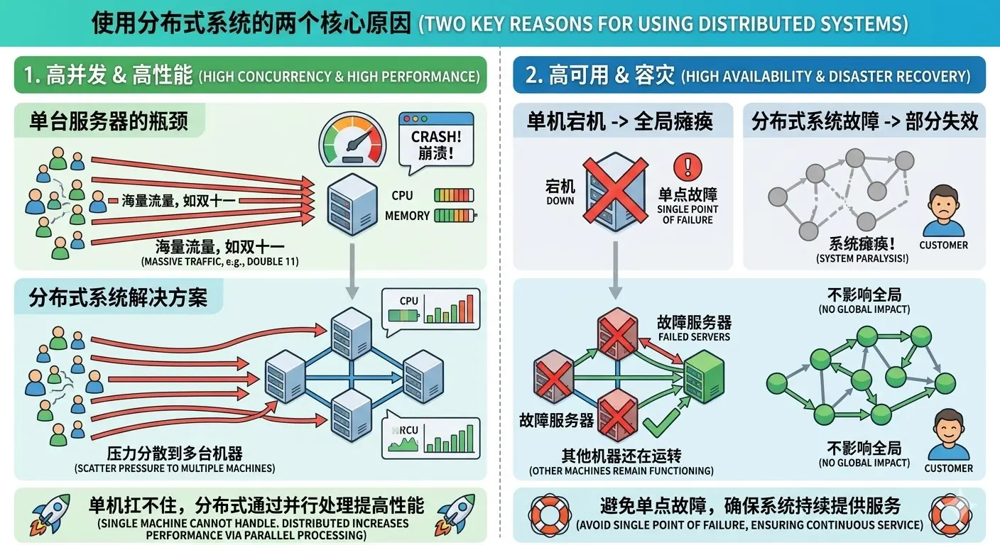
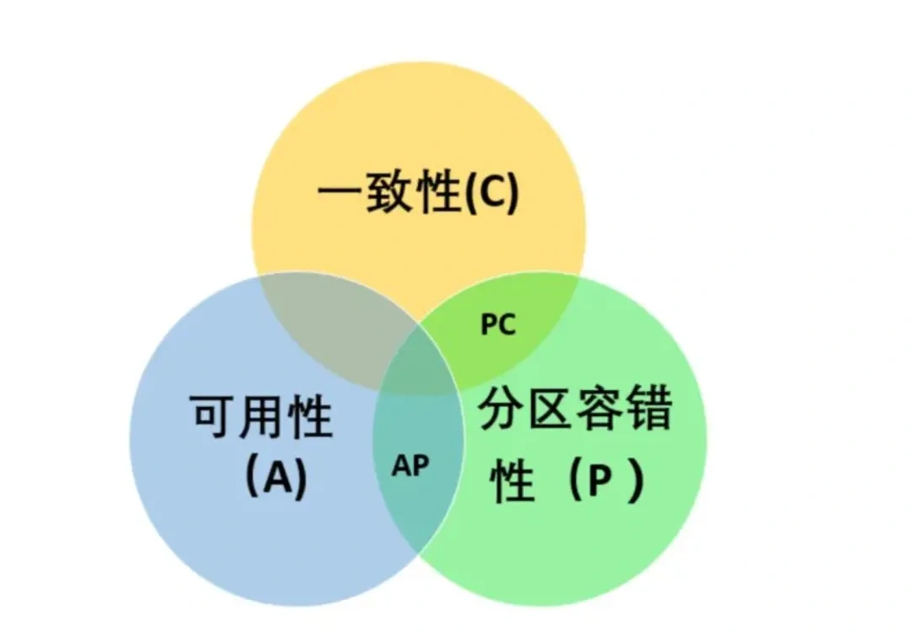
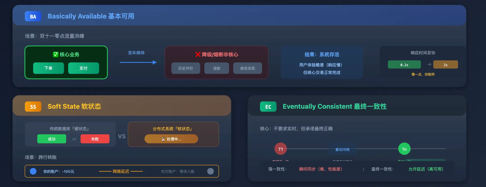
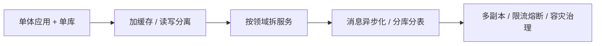
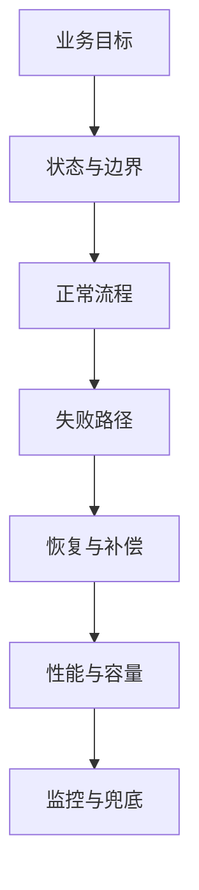

# 后端分布式系统面试 - 第 1 课：分布式系统全景与面试视角

## 学习目标（本节结束后你能做到什么）

- 用业务语言解释什么是后端场景下的分布式系统
- 说清一个系统为什么会从单体逐步走向分布式
- 区分“组件增加”和“系统复杂度增加”之间的关系
- 理解 3-5 年社招面试里，面试官真正想考的不是名词量，而是工程判断力

## 内容讲解（核心概念，用类比、例子、图示说清楚）

### 1. 什么叫分布式系统，不要一上来就被名词带偏

很多人一听到分布式系统，脑子里立刻冒出来的是这些词：

- 微服务
- Redis
- Kafka
- 分库分表
- 分布式锁
- Seata

这些东西当然和分布式有关，但它们不是定义。  
更准确地说，**分布式系统是把原本一个进程、一台机器、一个数据库能完成的事情，拆到多台机器、多份服务、多套存储上协同完成。**

只要发生了“跨节点协作”，问题就会变复杂。复杂并不只来自性能，还来自：

- 网络会抖动，会超时，会重试
- 多个服务之间没有共享内存，状态不再天然一致
- 一部分成功、一部分失败会变成常态
- 排查问题时，你不再只看一个进程日志，而要跨服务串调用链

所以分布式系统的核心不是“机器多”，而是**协作成本和失败处理成本急剧上升**。

### 2. 为什么业务会自然走向分布式

一个后端系统最早往往不是分布式起步，而是这样的路径：

1. 单体应用 + 单库
2. 流量上涨后，先加缓存、读写分离
3. 业务变复杂后，按领域拆服务
4. 数据量再涨，开始分库分表、异步化、任务化
5. 对可用性要求更高，再做多机房、容灾、隔离治理

这条路径非常重要，因为它说明一件事：  
**分布式不是目标，分布式是业务规模、团队规模、稳定性要求共同推出来的结果。**

举个简单例子。  
如果你做一个内部报表系统，每天几千请求，单体应用可能非常合适。  
但如果你做电商订单系统，促销时瞬间几十万请求打进来，还牵扯库存、支付、履约、优惠券、账户，那你就很难继续靠单机单库扛住。

面试官其实很喜欢听到候选人明确表达这一点：  
**我不是为了用某个组件而用它，而是因为原有架构已经在吞吐、耦合、可用性、交付效率上出现瓶颈。**

### 3. 分布式系统到底在解决什么问题

把问题拆开看，会更清楚。

#### 3.1 吞吐问题

单机 CPU、内存、连接数、磁盘 IO 都有上限。  
当请求量上来后，要么横向扩容，要么异步削峰，要么分摊到不同节点。

#### 3.2 耦合问题

一个大系统里，订单、库存、支付、营销、用户这几个模块如果全塞进一个工程，改一个地方容易牵一发而动全身。  
拆服务本质上是在做边界管理。

#### 3.3 数据规模问题

订单量、流水量、日志量上去以后，单表几亿行不是神话，是日常。  
这时就要考虑冷热分层、分库分表、归档、索引治理。

#### 3.4 可用性问题

业务一旦重要，不能接受“某一台机器挂了，整站不可用”。  
这时就需要多实例、故障转移、限流熔断、降级隔离。

#### 3.5 组织协作问题

当团队规模上来后，不同团队需要独立发布、独立负责、独立演进。  
系统拆分有时不只是技术问题，也是组织协同问题。

#### 3.6 CAP 和 BASE：理论要落到业务选择上

CAP 讨论的是发生网络分区时，一个分布式数据系统对单次读写语义的取舍：

- C，Consistency：这里通常指客户端看到单一最新值的强一致语义，不等于业务里泛指的“最终数据正确”
- A，Availability：每个到达非故障节点的请求都能在有限时间内得到非错误响应
- P，Partition tolerance：节点之间发生网络隔离时，系统仍然必须面对请求

常说“CAP 三选二”容易误导。工程上网络分区无法假装不存在；**真正发生 P 时，某一类操作需要在坚持 C 或坚持 A 之间选择**。例如库存扣减宁愿拒绝少数派写入，也不要超卖；商品评价列表可以接受短时间读旧数据，以维持可用性。

BASE 则把这种工程妥协说得更具体：

- Basically Available：发生压力或局部故障时，保住核心流程，非核心功能可降级
- Soft State：允许“处理中”“同步中”这类中间状态存在
- Eventually Consistent：依靠重试、补偿和对账，在承诺窗口内收敛到正确结果

因此 CAP 帮你识别分区时的约束，BASE 帮你设计允许短暂不一致的业务链路。它们都不是一句“上某个组件”的答案。

### 图示：单体走向分布式的典型演进

### 4. 分布式系统最难的，从来不是“把服务拆开”

很多人学分布式，会误以为难点是：

- 怎么上 Dubbo、gRPC、Spring Cloud
- 怎么配 Nacos、Redis、Kafka

这些只是入门。真正有区分度的问题是：

- 两个服务都成功了，但第三个失败了，怎么办
- 消息发出去了，但消费者重复消费，怎么办
- 缓存删了，数据库没更新完，怎么办
- 库存扣减成功了，订单创建失败了，怎么办
- 一次网络超时，到底是没成功，还是成功了但你没收到结果

也就是说，后端分布式系统的核心不是“正常路径怎么跑通”，而是**异常路径怎么收敛**。  
面试官往往不会被“流程图很完整”打动，但会被你对失败路径的控制能力打动。

### 5. 3-5 年社招面试到底在考什么

这个阶段和校招很不一样。  
面试官通常不期待你发明协议，也不期待你徒手实现一个消息队列。  
他更关心你是否具备以下能力：

#### 5.1 能不能识别问题类型

一个问题到底是：

- 高并发问题
- 一致性问题
- 可用性问题
- 数据规模问题
- 组织拆分问题

如果问题类型判断错了，方案大概率就会歪。

#### 5.2 能不能说清方案边界

比如你说“用缓存”。  
面试官接下来就会追问：

- 为什么适合放缓存
- 一致性要求多高
- 热点 key 怎么办
- 缓存失效怎么办
- 数据错了怎么修

也就是说，组件名永远不是答案，边界和代价才是答案。

#### 5.3 能不能讲清取舍

比如你说“保证强一致”。  
面试官会问：

- 性能代价是什么
- 可用性会不会下降
- 是否真的有必要
- 如果不能强一致，业务上怎么接受最终一致

能把这类取舍讲清楚，才是成熟后端工程师的表现。

#### 5.4 能不能体现线上经验

你不一定真的做过超级大规模系统，但你至少要能体现：

- 你知道线上问题往往从哪里来
- 你知道监控、告警、对账、降级不是锦上添花，而是必需品
- 你知道系统不是“设计完就结束”，还要可观测、可维护、可恢复

### 6. 一个面试里很常见的误区：把“分布式理论”和“后端工程实践”混为一谈

很多人准备面试时会花很多时间背：

- CAP
- BASE
- Paxos
- Raft
- 两阶段提交
- 三阶段提交

这些不该完全不会，但如果你只有这些，面试会显得很飘。  
因为大多数后端业务面试，更常问的是：

- 订单超卖怎么防
- 支付回调重复怎么办
- 账户余额更新怎么保证正确
- 缓存和数据库双写不一致怎么办
- MQ 消息丢了或重复了怎么办
- 服务雪崩怎么防

换句话说，**理论是地基，但工程题真正考的是你怎么在脏现实里把系统做稳。**

### 7. 你应该建立的核心思维框架

后面每一课你都可以套这个框架去理解：

1. 这件事的业务目标是什么
2. 数据状态在哪里保存
3. 哪些步骤可能失败
4. 失败后如何恢复
5. 是否允许最终一致
6. 性能瓶颈在哪里
7. 如何观测问题、如何兜底

如果你能习惯性这样思考，很多分布式题就不会再变成“背八股”，而会变成结构化分析题。

### 图示：后端分布式系统面试的核心思维

## 小结（3-5 条关键点）

- 分布式系统不是组件名集合，而是多节点协作带来的状态管理和失败处理问题。
- 业务之所以走向分布式，通常是因为吞吐、耦合、数据规模、可用性和组织协作出现瓶颈。
- CAP 要在网络分区和具体操作语义下理解；BASE 则描述以短暂不一致换取可用性的工程路径。
- 3-5 年社招面试更看重问题识别、方案边界、技术取舍和线上稳定性意识。
- 真正拉开差距的不是正向流程，而是异常路径、一致性和恢复机制。
- 学分布式系统要始终站在业务场景里理解，而不是脱离场景背理论名词。

---

## 检查站：请回答以下问题

1. 你怎么用自己的话解释“后端场景下的分布式系统”？不要只列组件，尽量说出它本质上在解决什么问题。
2. 为什么一个业务系统通常不会一开始就做成复杂分布式架构？请从业务规模和工程代价两个角度回答。
3. 你认为 3-5 年社招面试中，面试官考分布式系统最想看候选人的哪几种能力？为什么？
4. 如果一个候选人只会背 CAP、BASE、Paxos，但讲不清库存扣减失败后怎么恢复，你会认为他缺了什么能力？

请把你的答案直接告诉我，我会根据你的回答决定下一步。
