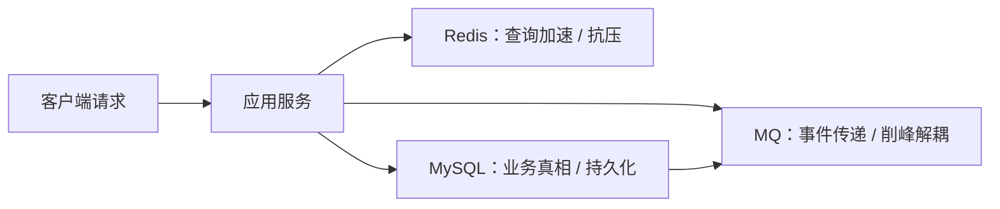

# 后端分布式系统面试 - 第 2 课：缓存、消息队列与数据库的职责边界

## 学习目标（本节结束后你能做到什么）

- 说清 Redis、MQ、MySQL 在后端系统中的本质职责
- 理解为什么这三个组件经常一起出现，但绝不能互相混用
- 掌握缓存一致性、异步解耦、削峰填谷这些高频面试点
- 能从业务目标出发，判断该不该上缓存、该不该上 MQ、数据最终应该落在哪

## 内容讲解（核心概念，用类比、例子、图示说清楚）

### 1. 先给三个组件定性：不要把它们当万能药

很多候选人回答系统设计题时，最常见的套路是：

- 先上 Redis
- 再上 Kafka
- 最后落 MySQL

这听起来很熟，但经常是没想清楚边界。  
更好的理解方式是：

- **数据库**负责保存相对可靠、可查询、可回溯的业务真相
- **缓存**负责用空间换时间，缓解读压力，降低访问延迟
- **消息队列**负责在时间上解耦，在流量上削峰，在系统边界上异步传递事件

注意这里的关键词分别是：

- 数据库：真相
- 缓存：加速
- MQ：传递

你只要把这三个词记牢，很多方案就不容易歪。

### 2. 为什么数据库才是真正的“最终落点”

后端系统里，真正需要长期保存、支持回溯、支持对账、支持复杂查询的数据，通常都要进数据库。  
原因很简单：

- 数据库更适合持久化
- 支持事务和约束
- 支持索引查询
- 更适合作为业务状态源

比如订单状态、支付记录、账户流水、库存明细，这些都不能只放 Redis。  
Redis 速度快，但它不是为了替代核心业务账本设计的。

很多面试官会故意追问：  
“既然 Redis 很快，为什么不把库存、订单状态都直接放在 Redis 里？”

正确思路不是死记答案，而是看业务诉求：

- 需不需要持久回溯
- 需不需要复杂查询
- 需不需要强业务约束
- 需不需要审计和对账

如果这些需求很强，数据库通常必须是核心状态源。

### 3. 缓存到底解决什么问题

缓存最典型解决的是两个问题：

#### 3.1 读多写少场景下的查询加速

比如商品详情、用户画像、配置项、热点排行榜，这类数据读很多、更新相对少，非常适合缓存。

#### 3.2 保护下游数据库

如果所有请求都直接打数据库，数据库容易被打穿。  
缓存本质上是数据库前面的缓冲层。

但缓存带来的副作用同样明显：  
**一旦你有两份数据，就一定会面对一致性问题。**

### 4. 缓存最常见的三个坑

#### 4.1 缓存穿透

请求的 key 在缓存和数据库里都不存在，导致流量直接穿到数据库。  
典型处理：

- 空值缓存
- 布隆过滤器
- 非法参数拦截

#### 4.2 缓存击穿

某个热点 key 恰好过期，大量请求同时回源数据库。  
典型处理：

- 热点永不过期 + 异步刷新
- 互斥锁重建
- 提前续期

#### 4.3 缓存雪崩

大批 key 同时过期，数据库瞬间承压。  
典型处理：

- 过期时间打散
- 多级缓存
- 限流降级

### 5. 缓存和数据库双写一致性，为什么总是考

因为这是后端分布式系统里最典型的“看上去简单，实际上有坑”的问题。

常见流程是：

1. 先更新数据库
2. 再删除缓存

这叫“更新 DB，删除缓存”，通常比“同时更新缓存和数据库”更稳。  
但它也不是绝对无敌。  
比如：

- 删除缓存失败
- 刚删完缓存，又有旧值读请求回源并写回缓存
- 多线程并发更新顺序错乱

所以面试里如果你只说一句“先更新数据库再删缓存”，一般不够。  
更完整的回答应该继续补：

- 删除失败如何重试
- 是否通过消息或延迟双删兜底
- 一致性要求到底有多高
- 是否可以接受短暂脏读

这就是 3-5 年面试和背模板的区别。

### 图示：缓存、数据库、MQ 的职责关系

### 6. MQ 到底在解决什么问题

消息队列最常见解决的是三类问题：

#### 6.1 异步解耦

比如用户下单成功后，需要做：

- 发优惠券
- 发短信
- 记积分
- 推送履约

如果全同步串起来，主链路会很长，还容易互相拖死。  
用 MQ 后，主链路只做核心动作，其他动作异步处理。

#### 6.2 削峰填谷

秒杀、促销、批量任务等高峰流量，如果直接压到数据库，很容易打挂下游。  
MQ 可以把瞬时尖峰摊平，让消费者按能力逐步处理。

#### 6.3 事件驱动

服务之间不是直接互调，而是围绕事件协作。  
比如“订单已支付”就是一个事件，库存、履约、营销、结算都可以订阅它。

### 7. MQ 不是事务保险箱

很多人误以为“只要发了 MQ，一致性问题就解决了”。  
这很危险。  
真正的问题恰恰从这里开始：

- 业务库更新成功了，但消息没发出去
- 消息发出去了，但消费者处理失败
- 消费者处理成功了，但 ACK 丢了，导致重复消费
- 多个事件先后顺序错了，状态被覆盖

所以 MQ 的关键配套不是“用了哪种中间件”，而是：

- Outbox 或本地消息表
- 幂等消费
- 重试机制
- 死信队列
- 状态机校验

### 8. 三者怎么组合才合理

你可以记住一个很实用的工程直觉：

- **数据库**放核心状态
- **缓存**扛高频读取
- **MQ**传播状态变化

举个订单系统例子：

1. 订单创建后，核心订单记录写 MySQL
2. 热门订单查询或详情聚合结果放 Redis
3. “订单已创建”“订单已支付”这些事件通过 MQ 发给库存、营销、履约系统

这个组合的本质，不是为了显得架构复杂，而是让：

- 数据有真相源
- 读取有加速层
- 跨服务协作有缓冲层

### 9. 面试里该怎么回答“为什么不用 X 替代 Y”

这是很高频的追问。

比如：

- 为什么不用 Redis 直接代替数据库
- 为什么不用数据库轮询代替 MQ
- 为什么不用 MQ 直接做查询结果存储

你的回答应该围绕：

1. 数据是否需要长期可靠保存
2. 是否需要复杂查询和事务
3. 是否需要低延迟读
4. 是否需要削峰解耦
5. 是否需要承受重复、乱序、失败重试

只要按这个框架讲，答案通常不会乱。

## 小结（3-5 条关键点）

- 数据库负责业务真相，缓存负责加速，消息队列负责异步传递和削峰，它们的职责不能混淆。
- 缓存一旦引入，就一定伴随一致性问题，答案永远不止“上 Redis”这么简单。
- MQ 不是一致性终点，消息发送、消费、重试、去重、乱序才是真正难点。
- 面试里讲组件，一定要把边界、代价和兜底方案一起讲出来。
- 组件组合的目标是服务业务，而不是为了堆技术栈。

---

## 检查站：请回答以下问题

1. 你如何分别定义数据库、缓存、消息队列在后端系统中的核心职责？
2. 为什么很多核心业务状态不能只存在 Redis 里？请从持久化、查询、审计几个角度回答。
3. “更新数据库后删除缓存”为什么比“双写数据库和缓存”更常见？它仍然有哪些风险？
4. 为什么说 MQ 只能帮助你解耦和异步，但不能自动帮你解决一致性问题？

请把你的答案直接告诉我，我会根据你的回答决定下一步。
