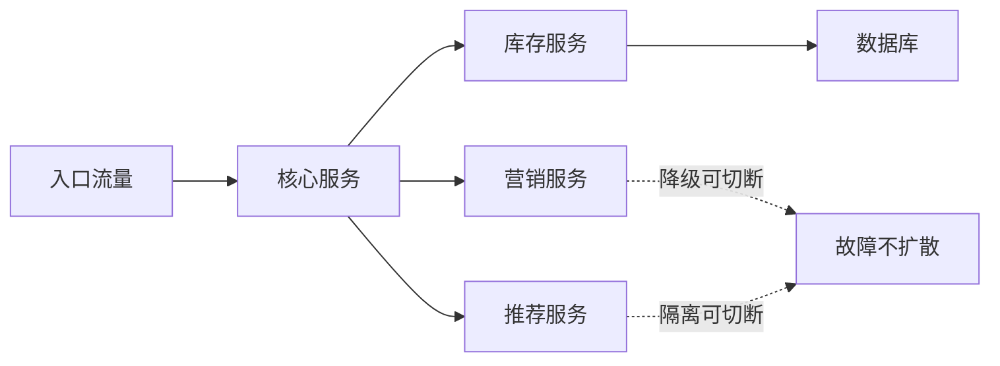
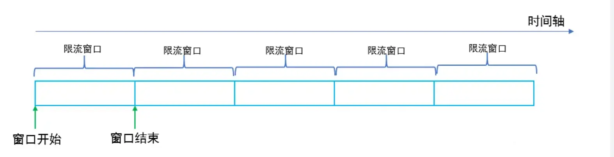
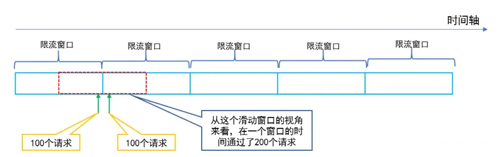
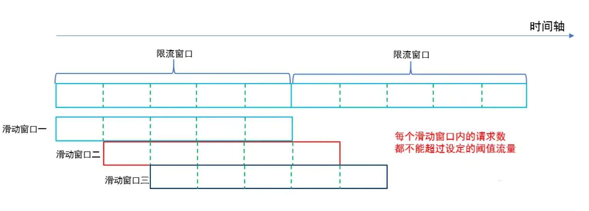
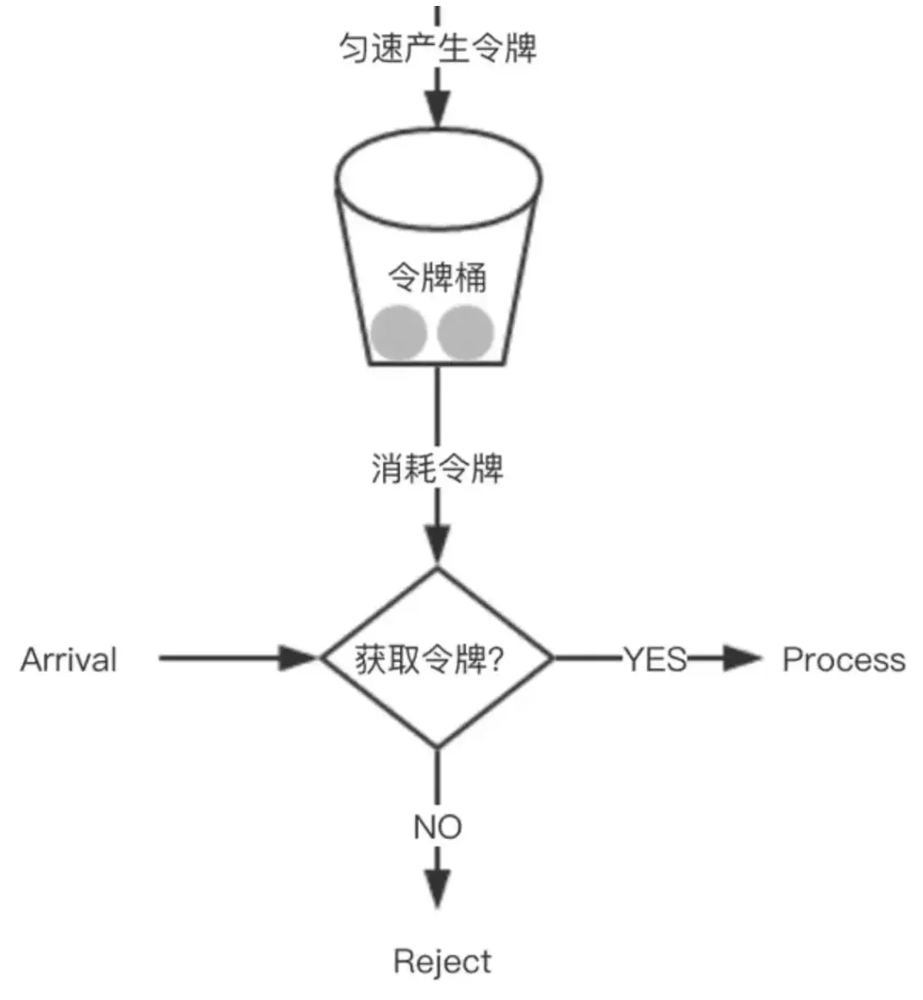

# 后端分布式系统面试 - 第 4 课：高并发、高可用与稳定性治理

## 学习目标（本节结束后你能做到什么）

- 理解高并发问题和一致性问题的差异与联系
- 掌握限流、熔断、降级、隔离、削峰这些稳定性核心手段
- 能分析热点流量、雪崩传播、依赖级联失败等常见线上风险
- 知道系统设计题里如何体现容量规划、监控告警和故障恢复能力

## 内容讲解（核心概念，用类比、例子、图示说清楚）

### 1. 高并发的本质不是“请求多”，而是“系统局部承压失衡”

很多人把高并发理解成 QPS 大。  
这当然没错，但不完整。  
真正危险的是：**流量在时间上、空间上、数据分布上往往不均匀。**

比如：

- 秒杀在 1 秒内涌入大量请求
- 一个明星商品形成热点 key
- 某个下游接口突然变慢，导致线程池堆满
- 某个数据库分片比其他分片热很多

所以高并发治理，核心不是一句“多加机器”，而是找到最脆弱的瓶颈点。

### 2. 为什么系统不是扩容就完了

扩容能解决一部分问题，但不能解决全部问题。  
因为瓶颈可能在：

- 数据库连接池
- 单个热点 key
- 某个串行锁
- 第三方依赖接口
- 线程池排队
- GC 或磁盘 IO

举例来说，你把应用实例从 10 台扩到 50 台，如果数据库仍然只有一个主库，流量最终还是会压到数据库。  
所以你必须区分：

- 应用层扩容
- 数据层扩容
- 依赖层保护
- 流量入口治理

### 3. 高并发治理常见的五个动作

#### 3.1 缓存

把高频读请求拦在前面，减少数据库压力。  
但要注意缓存一致性和热点治理。

#### 3.2 异步化

把非核心链路放到 MQ、任务队列里处理，缩短主链路耗时。  
但异步化会引入最终一致和失败恢复问题。

#### 3.3 削峰

把短时间爆发流量平摊到更长时间处理。  
常见手段：

- MQ 排队
- 令牌桶
- 漏桶
- 队列缓冲

#### 3.4 水平扩容

让更多实例一起承接流量。  
前提是服务尽可能无状态，或者状态能被外部化。

#### 3.5 热点治理

热点 key、热点商品、热点用户会让局部资源先崩。  
这时需要：

- 热点数据本地缓存
- 请求合并
- 多级缓存
- 分片打散
- 热点探测

### 4. 高可用的核心，不是“永不失败”，而是“失败不扩散”

线上系统一定会失败。  
服务器会挂、网络会抖、数据库会慢、第三方会超时。  
高可用的目标不是幻想零故障，而是：

- 局部失败不要拖垮整体
- 可选功能失败不要拖垮核心链路
- 下游失败不要让上游线程全部阻塞

这就引出了稳定性治理的几大关键词：

- 限流
- 熔断
- 降级
- 隔离
- 超时

### 图示：故障扩散与隔离思路

### 5. 限流、熔断、降级、隔离分别是什么

#### 5.1 限流

限制进入系统的请求量，防止系统被压死。  
常见粒度：

- 用户维度
- 接口维度
- 服务维度
- 租户维度

#### 5.2 熔断

当检测到某个依赖错误率高、响应慢时，暂时不再继续调用，避免无意义堆积。  
它像电路保险丝。

#### 5.3 降级

在资源紧张或依赖异常时，临时关闭非核心能力，保住主流程。  
比如：

- 先不展示推荐
- 暂停积分发放
- 关闭非关键统计

#### 5.4 隔离

把不同流量、不同依赖、不同线程池隔开，防止相互拖死。  
这是很多系统从“偶尔故障”走向“稳定运行”的关键。

#### 5.5 四类限流算法怎么选

**固定窗口**在一个固定时间片内计数，超过阈值就拒绝。它实现最简单，适合粗粒度保护或低风险管理接口。

它的问题是窗口边界突刺：前一个窗口末尾通过 100 个请求，下一个窗口开头又通过 100 个请求，极短时间内下游实际会承受接近两倍阈值的压力。

**滑动窗口**把时间分成更小格子，统计最近一个完整窗口内的请求量。格子越细，限流越准确，代价是计数存储和计算开销增加。它适合 API 网关、接口级 QPS 保护。

**漏桶**以固定速率向下游放行请求，适合必须平滑写入速率的场景，例如保护慢速第三方接口或落盘通道。代价是即使后端空闲，也不能快速消化已排队的突发流量。

**令牌桶**以固定速度补充令牌，桶内可积累一定容量；请求拿到令牌就立即通过。它既限制长期平均速率，又允许业务可承受的短时突发，通常更适合作为在线接口的默认入口限流方案。

面试里不要只报算法名，要先说清系统是需要“严格平滑下游写入”，还是“允许可控突发以充分利用容量”。这决定了漏桶还是令牌桶更合适。

### 6. 容量规划为什么经常被忽视

很多人设计系统时喜欢画组件图，却不估流量。  
但面试官很可能会问：

- 峰值 QPS 多少
- 每秒订单量多少
- 每条消息多大
- 每天写入多少数据
- 缓存命中率预期多少

如果你完全不估算，设计会显得很虚。  
你不需要算得像财务报表一样精确，但至少要有量级感。

比如一个支付回调系统，你至少应该有这些思路：

- 平均流量和峰值流量分别是多少
- 峰值是否集中在某些分钟
- 回调重试会不会放大流量
- 下游账户系统能承受多少写入

### 7. 可观测性是稳定性的前提

没有监控，就谈不上稳定性。  
后端系统至少要有三层观测：

#### 7.1 技术指标

- QPS
- RT
- 错误率
- CPU
- 内存
- 线程池

#### 7.2 组件指标

- Redis 命中率
- MQ 积压
- 数据库慢查询
- 连接池耗尽

#### 7.3 业务指标

- 下单成功率
- 支付成功率
- 库存扣减失败数
- 账户入账差异数

很多系统技术指标看起来正常，但业务已经错了。  
所以社招面试里如果你能主动说出“技术监控 + 业务监控 + 对账告警”的组合，会很加分。

### 8. 稳定性设计的成熟回答长什么样

如果面试官问：

“大促时订单系统怎么扛流量？”

比较初级的回答是：

- 加机器
- 上 Redis
- 上 MQ

更成熟的回答会是：

- 先识别读写路径和核心链路
- 通过缓存顶住读流量
- 通过队列削峰和异步化缩短主链路
- 对下游库存、营销、履约做超时、熔断、降级、隔离
- 对热点商品、热点 key 做专项治理
- 建立流量预估、压测、扩容预案和业务监控

这类回答能体现你真的理解线上系统不是靠单点技巧，而是靠体系化治理。

## 小结（3-5 条关键点）

- 高并发治理的核心是找到局部瓶颈和不均匀流量，而不是机械扩容。
- 高可用的目标不是零故障，而是控制故障影响范围，避免级联雪崩。
- 限流、熔断、降级、隔离、超时要组合使用，不能只背定义。
- 固定/滑动窗口适合计数保护，漏桶强调平滑，令牌桶强调平均速率约束下的有限突发。
- 容量规划和可观测性是系统设计不可缺的部分，否则方案会显得悬空。
- 面试里能主动讲到业务监控、压测、预案和故障恢复，说明你有线上视角。

---

## 检查站：请回答以下问题

1. 为什么说高并发的难点不是单纯“请求多”，而是“局部资源承压失衡”？
2. 限流、熔断、降级、隔离分别在什么场景下最有价值？请各举一个例子。
3. 如果数据库本身已经是瓶颈，只扩应用机器为什么往往无效？
4. 你认为一个成熟的后端系统，至少应该监控哪些技术指标和业务指标？为什么？

请把你的答案直接告诉我，我会根据你的回答决定下一步。
