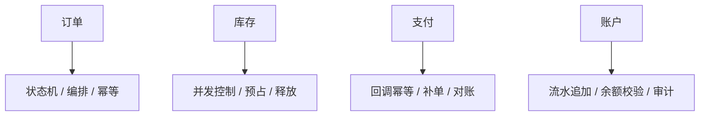

# 后端分布式系统面试 - 第 5 课：订单、库存、支付、账户四大场景

## 学习目标（本节结束后你能做到什么）

- 把分布式系统的抽象能力迁移到真实业务场景
- 理解订单、库存、支付、账户为什么是面试最高频的四类题
- 能说清这些系统各自最关键的设计难点
- 能比较不同场景在一致性、吞吐、审计、恢复上的侧重点

## 内容讲解（核心概念，用类比、例子、图示说清楚）

### 1. 为什么面试总爱问这四类系统

因为它们几乎覆盖了后端工程师最核心的能力面：

- 订单：状态管理、流程编排、跨系统协作
- 库存：并发控制、超卖防护、预占与回补
- 支付：状态回调、幂等、防重、防错账
- 账户：账务正确性、流水追加、审计与对账

如果你把这四类场景讲透，很多系统设计题其实只是它们的变体。

### 2. 订单系统的核心难点：不是建表，而是状态机

很多人把订单系统理解成一张订单表。  
这太浅了。  
订单系统本质上是在管理“一个业务对象在长链路中的状态变化”。

典型状态包括：

- 待支付
- 已支付
- 已取消
- 已发货
- 已完成
- 已退款

难点在于：

- 状态变更顺序是否可逆
- 多个上游事件是否会乱序到达
- 超时关单和支付回调谁先到
- 订单主状态和子状态如何设计

所以订单系统最重要的是：

- 明确状态机
- 明确每个状态允许的迁移
- 明确事件驱动和幂等处理

### 3. 库存系统的核心难点：并发和超卖

库存是后端面试里的经典难题。  
因为它天然面对两个压力：

- 并发极高
- 错一次就很明显

库存常见有三种量：

- 可售库存
- 锁定库存
- 已售库存

为什么要拆？  
因为下单不一定立即支付，支付不一定立即成功，取消也可能回滚。  
如果你只维护一个库存字段，链路一复杂就很难解释。

库存系统常见策略包括：

- 下单先预占
- 支付成功再确认扣减
- 超时未支付自动释放

面试官会追问的关键点通常是：

- 如何防超卖
- 如何防重复扣减
- Redis 预扣和数据库落账怎么配合
- 热点商品怎么办

### 4. 支付系统的核心难点：外部不可靠，内部必须稳

支付很特别，因为它往往要和第三方渠道打交道。  
这意味着你会面对：

- 回调延迟
- 回调重复
- 状态不一致
- 通道超时
- 用户已扣款但系统未更新

因此支付系统非常强调：

- 支付单而不是只看订单
- 渠道流水和业务流水都要留痕
- 回调处理必须幂等
- 最终状态需要主动查询和补偿

一个成熟回答通常会提到：

- 先创建支付单
- 渠道回调只负责推进状态，不直接执行一堆副作用
- 用支付单号做幂等
- 对异常订单做补单和对账

### 5. 账户系统的核心难点：不能只看余额，必须看流水

账户系统最怕的错误是：  
余额看起来对，但你说不清它为什么对。

这就是为什么成熟账户系统通常强调：

- 余额只是结果
- 流水才是真相
- 历史记录尽量追加，不直接覆盖

比如用户钱包加 100 元、扣 30 元、退款 30 元，这几次动作都应该留下可追溯流水。  
这样你才能：

- 对账
- 审计
- 回放
- 排查问题

很多候选人面试时喜欢说“update balance = balance + x”。  
这在简单系统里可能够用，但在资金类场景里通常不够成熟。

### 图示：四大场景能力映射

### 6. 四类系统之间如何协作

你可以用一个典型电商链路来串起来：

1. 用户提交订单
2. 订单系统创建订单
3. 库存系统预占库存
4. 支付系统创建支付单并等待支付
5. 支付成功后，订单状态推进为已支付
6. 库存确认扣减
7. 账户或结算系统做后续账务处理

这里每一步都不是简单调用，而是要回答：

- 是否同步
- 是否异步
- 谁是主状态源
- 失败后谁来补偿
- 哪些操作必须幂等

这就是分布式系统面试的精华部分。

### 7. 不同场景的重点差异

这四类系统不是一锅煮。

#### 7.1 订单系统

更强调流程完整性和状态可解释性。

#### 7.2 库存系统

更强调高并发控制和热点治理。

#### 7.3 支付系统

更强调外部交互的不确定性和状态确认。

#### 7.4 账户系统

更强调数据正确性、可追溯性和审计能力。

面试里如果你能主动讲出这种差异，而不是把所有系统都回答成“Redis + MQ + MySQL”，成熟度会高很多。

### 8. 如何把自己的项目经验往这四类题上迁移

你未必真的做过支付或账户系统，但你仍然可以迁移已有经验。  
比如你做过：

- 优惠券系统，可以迁移到库存预占和状态机
- 物流履约系统，可以迁移到订单状态推进和异步补偿
- 内容审核系统，可以迁移到任务异步化和结果回写
- 广告投放系统，可以迁移到高并发、幂等、对账思路

关键不是项目名字，而是你是否能抽象出：

- 状态
- 并发
- 一致性
- 补偿
- 监控

## 小结（3-5 条关键点）

- 订单、库存、支付、账户是后端分布式面试的四大高频场景，分别代表不同能力重点。
- 订单重状态机，库存重并发控制，支付重回调与状态确认，账户重流水与审计。
- 四类系统常常协同工作，所以系统设计题一定要讲清边界、主状态源和失败恢复。
- 不能把所有场景都回答成统一组件模板，必须体现具体业务差异。
- 即使没有完全对应经历，也可以从已有项目中抽象出状态机、幂等、补偿等共性能力。

---

## 检查站：请回答以下问题

1. 为什么说订单系统的核心难点不是建表，而是状态机设计？
2. 库存系统为什么常常要区分可售库存、锁定库存、已售库存？这样设计解决了什么问题？
3. 支付系统为什么必须特别重视回调幂等和主动补单？
4. 为什么账户系统通常强调“流水是事实，余额是结果”？这对排错和审计有什么帮助？

请把你的答案直接告诉我，我会根据你的回答决定下一步。
