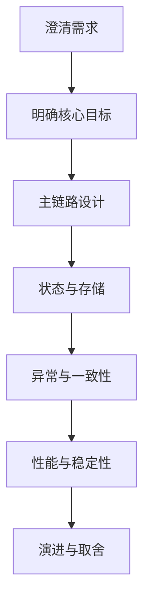

# 后端分布式系统面试 - 第 6 课：系统设计题拆解与面试表达

## 学习目标（本节结束后你能做到什么）

- 掌握后端分布式系统设计题的标准拆解顺序
- 能把一个模糊业务题目快速转成结构化回答
- 学会在回答中体现边界、取舍、风险和演进路径
- 知道如何把自己的项目经验组织成更像中高级工程师的表达

## 内容讲解（核心概念，用类比、例子、图示说清楚）

### 1. 为什么很多人“懂一点”，但面试还是讲不好

最常见的问题不是不会，而是回答没结构。  
典型表现是：

- 一上来就堆组件
- 不澄清需求
- 不分核心链路和非核心链路
- 不说数据规模和一致性要求
- 不说失败路径和兜底

于是面试官听到最后，只会感觉你知道一些技术名词，但看不出你是否真的能做系统。

### 2. 一个好用的回答顺序

你可以把系统设计题稳定拆成 7 步。

#### 2.1 先澄清需求边界

比如题目是“设计一个秒杀系统”，你应该先确认：

- 是抢购资格还是实际下单
- 商品量级多少
- 用户量级多少
- 是否要求绝对公平
- 是否允许最终一致

不澄清需求，后面的设计会飘。

#### 2.2 识别核心目标

这个系统最重要的目标是什么？

- 高并发
- 强一致
- 低延迟
- 高可用
- 可审计

目标不同，方案一定不同。  
比如聊天系统和账户系统，容忍度完全不一样。

#### 2.3 画核心链路

只保留主流程，把最关键的 3 到 6 步说清楚。  
比如订单系统：

1. 创建订单
2. 预占库存
3. 创建支付单
4. 支付回调推进状态
5. 异步触发履约

面试官首先看你能不能抓住主干。

#### 2.4 明确状态和存储

哪些状态放哪里，谁是真相源。  
这是很多人最容易忽略的地方。

你要明确回答：

- 订单状态存在订单库
- 支付状态存在支付单
- 缓存只做加速，不做最终真相
- MQ 传递事件，不保存业务最终态

#### 2.5 讲异常路径

这一段往往最拉开差距。  
你至少要覆盖：

- 接口重试
- 消息重复
- 下游失败
- 超时不确定
- 补偿与对账

如果你只讲正常链路，面试官通常会默认你经验偏浅。

如果题目本身是订单履约、商户入驻、审批流、数据 pipeline 这类长链流程，可以进一步套用 `10_长链系统设计：状态机、异步推进、幂等、补偿与人工兜底.md` 里的八个词框架：状态、异步、幂等、重试、补偿、超时、一致性、可观测。

#### 2.6 讲性能和稳定性

包括：

- 缓存怎么用
- 队列怎么削峰
- 热点怎么处理
- 限流熔断怎么做
- 压测和容量怎么估

如果题目本身是商品详情、登录鉴权、库存查询、价格查询这类同步短链接口，可以套用 `11_短链系统设计：同步请求、低延迟、超时、降级与缓存.md` 里的八个词框架：目标、主链、缓存、超时、重试、降级、隔离、观测。

#### 2.7 最后讲演进和取舍

比如：

- 初期单库够不够
- 什么时候需要拆服务
- 什么时候需要分库分表
- 为什么不用更重的事务方案

这一段能体现你不是只会画“最终架构图”，而是懂系统演进。

### 图示：系统设计题回答框架

### 3. 面试官真正喜欢什么样的表达

不是词多，而是清楚。  
一个成熟回答通常有这些特征：

- 先讲问题，再讲方案
- 先讲核心，再讲扩展
- 先讲边界，再讲组件
- 先讲为什么，再讲怎么做

比如你可以这样说：

“这个场景我先把目标收敛一下。核心是高并发下防超卖，同时订单最终要可恢复、可对账。所以我会先把库存作为关键约束点设计，再讨论支付和履约的异步推进。”

这种表达会让人感觉你在做工程判断，而不是背诵模板。

### 4. 如何讲取舍，而不是只讲最强方案

很多候选人有一个误区：  
一旦被问系统设计，就想给一个最复杂、最全能的方案。  
这反而不一定好。

因为面试官会想：

- 真的有必要吗
- 成本谁承担
- 团队能维护吗
- 业务是否配得上这套复杂度

所以你要学会讲：

- 如果量级不大，先单体 + 单库
- 如果读压力上来，先缓存
- 如果下游耦合严重，再引入 MQ
- 如果数据规模继续上涨，再考虑分库分表

这种“按问题驱动演进”的表达，比直接端出一套豪华架构更可信。

### 5. 如何把项目经历讲得更像 3-5 年工程师

很多人的项目描述停留在：

- 我负责某某模块开发
- 用了 Redis 和 Kafka
- 性能提升了多少

这不够。  
更好的讲法是：

- 业务背景是什么
- 原来痛点是什么
- 我如何识别关键瓶颈
- 为什么选这个方案，不选另一个
- 线上出现过什么问题，怎么修
- 最后如何度量效果

比如你可以说：

“我们原来把发券、积分、通知都串在下单主链路里，峰值时 RT 很高，而且任何一个下游波动都会拖慢下单。我做的核心改动不是简单上 MQ，而是先梳理主次链路，把核心订单落库留在同步路径，把弱依赖动作异步化，并补齐消费幂等和失败重试，最后把高峰期下单 RT 压下来了。”

这种说法会明显更有工程感。

### 6. 回答时最容易踩的坑

#### 6.1 只讲名词，不讲原因

比如“这里用 Redis”。  
面试官会继续问“为什么”。如果答不出来，就说明只是套路。

#### 6.2 只讲正向，不讲失败

这是最常见的问题。  
真正成熟的系统设计，必须把失败路径设计进去。

#### 6.3 只讲架构，不讲数据

所有系统最终都要落到状态和数据上。  
如果说不清“谁是真相源”，设计会很空。

#### 6.4 只讲最终形态，不讲演进

很多业务在不同阶段的最佳方案不同。  
不讲演进，就会显得脱离现实。

### 7. 一个通用答题模板

你以后拿到题目，可以先按下面顺序组织语言：

1. 我先确认一下目标和约束
2. 这个题的核心矛盾是什么
3. 我先给出主链路
4. 再说状态存储和关键组件边界
5. 然后补充异常路径、一致性和补偿
6. 最后说性能优化、稳定性和演进取舍

这不是死模板，而是帮助你稳定输出结构。

## 小结（3-5 条关键点）

- 系统设计题讲不好，通常不是不会，而是没有结构和层次。
- 一个成熟回答应包含需求澄清、核心目标、主链路、状态存储、异常路径、性能稳定性、演进取舍。
- 面试官更看重你是否能解释“为什么这样设计”，而不是是否能堆出很多组件名。
- 3-5 年候选人必须能体现工程判断、失败意识、数据边界和系统演进思维。
- 项目经历要从“做了什么”升级到“为什么做、怎么取舍、出了问题怎么兜底”。

---

## 检查站：请回答以下问题

1. 你认为系统设计题为什么要先澄清需求，而不是直接开始画架构？
2. 如果面试题是“设计一个秒杀系统”，你会先确认哪些关键约束？
3. 为什么说“异常路径设计”往往比“正常流程设计”更能体现候选人的成熟度？
4. 你如何把自己做过的一个项目，重新组织成“业务背景 -> 核心矛盾 -> 方案取舍 -> 效果验证”的表达？

请把你的答案直接告诉我，我会根据你的回答决定下一步。
