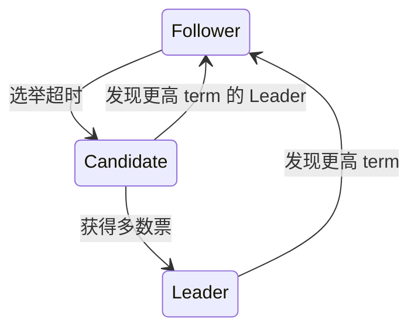
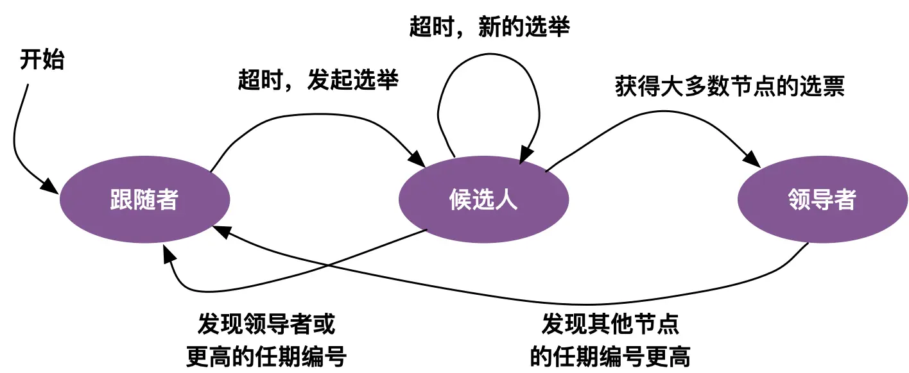
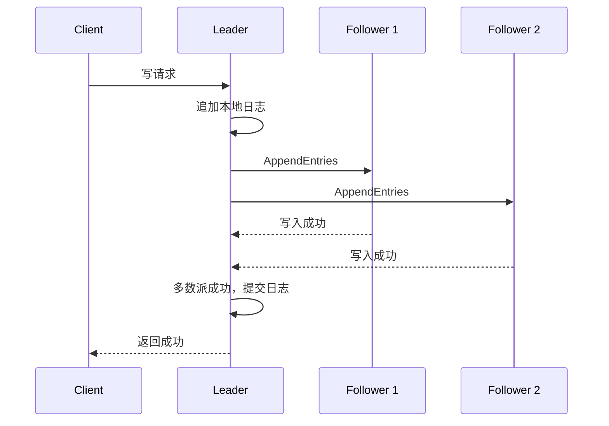
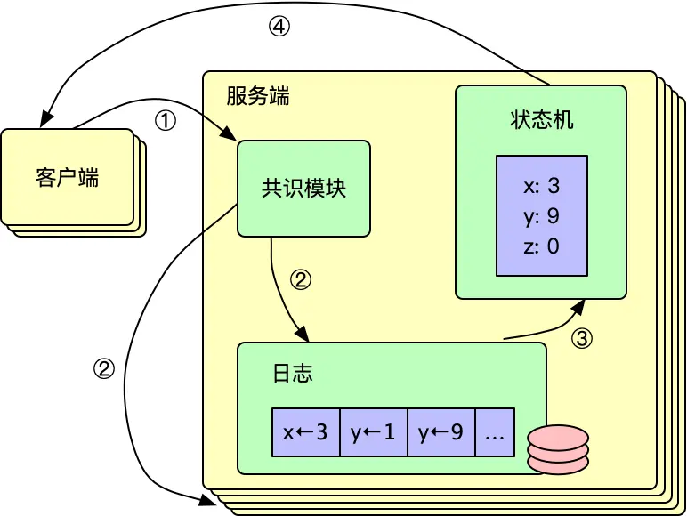
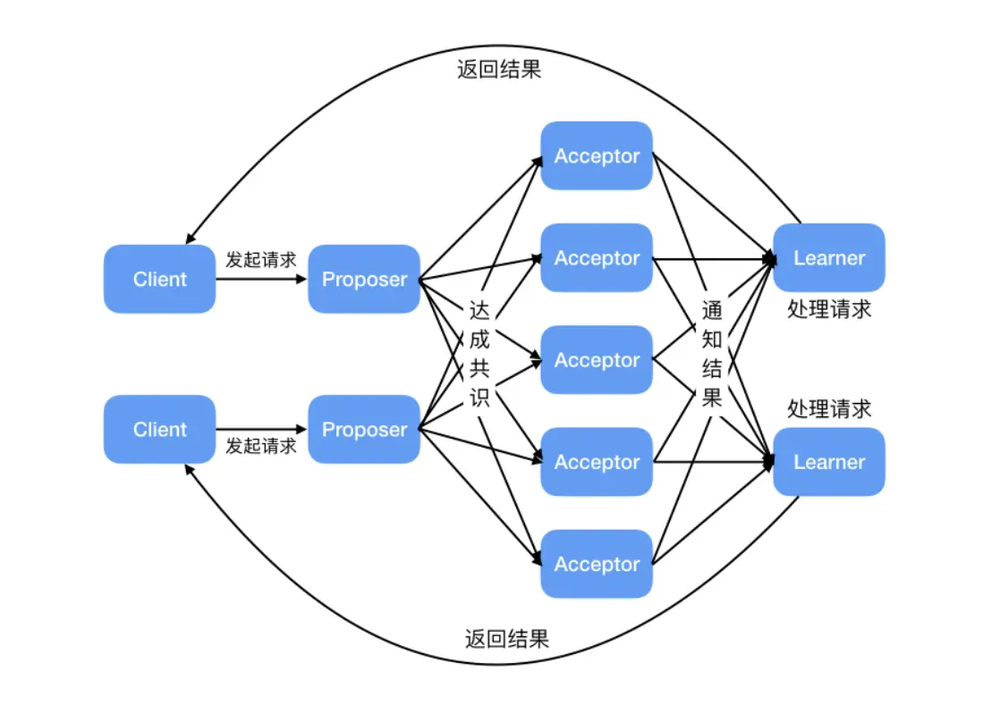
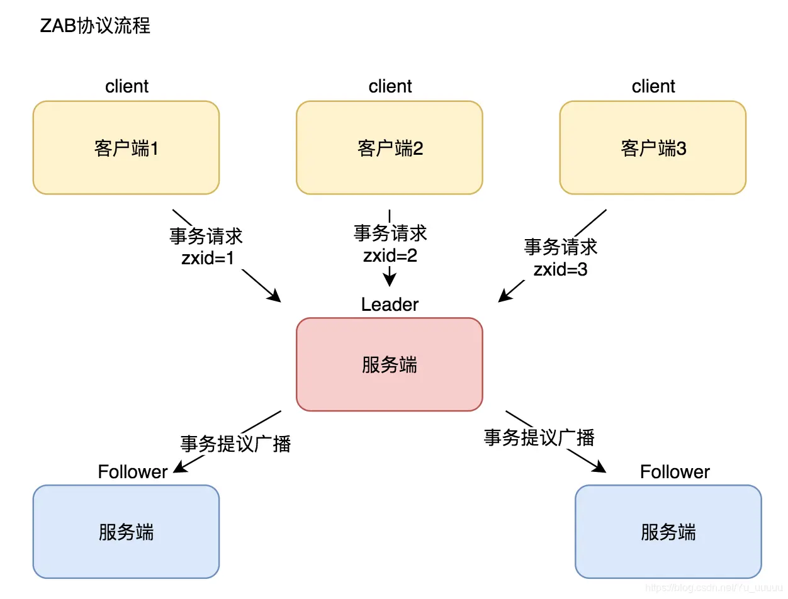

# 后端分布式系统面试 - 专题 1：Raft 从 Leader 选举到日志复制

## 学习目标（本节结束后你能做到什么）

- 用面试语言解释 Raft 解决的核心问题
- 说清 Leader、Follower、Candidate 三种角色之间如何切换
- 理解日志复制、提交、应用到状态机之间的关系
- 能回答“为什么 Raft 能保证多数派一致”“脑裂怎么办”“Leader 挂了怎么办”
- 知道 Raft 在 etcd、Consul、TiKV、MQ 元数据管理这类系统里的常见落点

## 内容讲解（核心概念，用类比、例子、图示说清楚）

### 1. Raft 到底在解决什么问题

Raft 是一个共识算法。  
但面试里不要一上来就说“它解决分布式一致性”，这句话太大，也太容易空。

更落地的说法是：

**Raft 让一组机器在有宕机、网络超时、消息重复的情况下，对同一串操作日志达成相同顺序，并最终把这些操作应用到同一个状态机上。**

比如有 3 个节点维护一个配置中心：

- 写入配置 A
- 更新配置 B
- 删除配置 C

Raft 要保证的是，大多数存活节点最终看到的日志顺序都是：

1. 写入配置 A
2. 更新配置 B
3. 删除配置 C

只要操作顺序一致，每个节点按同样顺序执行，就能得到同样的状态。

这就是 Raft 的核心直觉：  
**先让日志顺序达成共识，再让状态机按日志推进。**

### 2. Raft 为什么适合面试讲

Paxos 更偏理论，Raft 更偏工程可理解性。  
Raft 把共识问题拆成几个更容易讲清楚的子问题：

- Leader 选举
- 日志复制
- 安全性约束
- 成员变更
- 日志压缩

3-5 年后端面试里，通常不会要求你证明 Raft 正确性，但会看你能不能说清：

- 多副本系统为什么不能随便让每个节点都接写请求
- 为什么需要 Leader
- 为什么多数派确认后才算提交
- 为什么旧 Leader 不能继续写
- 为什么日志不能随便覆盖

### 3. 三种角色：Follower、Candidate、Leader

Raft 集群里每个节点同一时刻只处在一种角色：

- Follower：普通跟随者，只响应 Leader 或 Candidate 的请求
- Candidate：候选人，发起投票，希望成为 Leader
- Leader：领导者，接收客户端写请求，负责复制日志

正常情况下，一个任期 term 内只有一个 Leader。  
所有写请求都由 Leader 处理，Follower 不主动接写。

这里有一个非常重要的概念：**term，任期**。

你可以把 term 理解成“选举轮次”。  
每次发起新选举，term 都会递增。节点看到更大的 term，就承认自己过时，退回 Follower。

term 的作用是给分布式系统里的“谁更新”提供一个逻辑时间线。  
否则旧 Leader 恢复后还以为自己是 Leader，就容易出现两个节点都对外写的危险情况。

### 4. Leader 选举怎么发生

Follower 会等待 Leader 的心跳。  
如果一段时间没有收到心跳，它会认为 Leader 可能挂了，然后变成 Candidate，开始新一轮选举。

选举过程大致是：

1. Candidate 增加自己的 term
2. 给自己投一票
3. 向其他节点发送 RequestVote 请求
4. 如果获得多数票，就成为 Leader
5. 成为 Leader 后，立刻向其他节点发送心跳

这里的关键是“多数票”。

假设 3 节点集群，至少 2 票才能当选。  
5 节点集群，至少 3 票才能当选。

为什么要多数派？因为任意两个多数派一定有交集。  
这个交集能防止两个互相隔离的小团体同时都认为自己是合法 Leader。

### 5. 脑裂时 Raft 怎么处理

脑裂不是指真的出现两个脑袋，而是网络分区后，不同节点看到的世界不一样。

比如 5 节点集群被切成两边：

- A 边：3 个节点
- B 边：2 个节点

A 边可以凑够多数派，能选出 Leader 并继续处理写。  
B 边凑不够多数派，即使某个旧 Leader 在 B 边，它也无法把新日志提交，因为拿不到多数确认。

这就是 Raft 抗脑裂的核心：  
**不是靠“永远不出现多个自以为是 Leader 的节点”，而是靠多数派提交规则保证只有多数派一侧能推进有效日志。**

面试里可以这样说：

“Raft 用 term 识别新旧 Leader，用多数派投票选出 Leader，用多数派日志复制决定提交。少数派即使短时间内有旧 Leader，也提交不了新日志，恢复后会被更高 term 和更新日志纠正。”

### 6. 日志复制：Leader 接写后发生什么

Raft 的写入不是 Leader 自己写完就算成功。  
它的流程是：

1. 客户端把写请求发给 Leader
2. Leader 把操作追加到自己的日志
3. Leader 通过 AppendEntries 发送给 Follower
4. Follower 校验日志前缀是否匹配
5. 多数节点写入成功后，Leader 标记该日志为 committed
6. Leader 把 committed 日志应用到状态机
7. Leader 通知 Follower 提交并应用

这里要分清三个词：

- appended：日志写入某个节点本地
- committed：日志已经被多数派确认，可以认为不会丢
- applied：日志被应用到状态机，真正改变业务状态

面试里很多人会把这三个混在一起。  
成熟回答要说明：Raft 先复制日志，日志被多数派确认后才提交，提交后再按顺序应用到状态机。

### 7. 为什么 Follower 不能随便接受不连续日志

Raft 的日志每条都有 index 和 term。  
Leader 发 AppendEntries 时，会带上前一条日志的 index 和 term。

Follower 会检查：

- 我本地是否有这条前置日志
- 这条前置日志的 term 是否一致

如果不一致，Follower 拒绝追加。  
Leader 会往前回退，直到找到双方日志一致的位置，再覆盖后面的冲突日志。

这个机制保证了一个关键性质：

**如果两个节点在某个 index 上日志 term 一样，那么它们之前的日志也一样。**

不用在面试里把证明讲得很数学，但你要能说清它的工程意义：

- 避免日志中间断裂
- 避免不同节点同一位置代表不同操作
- 让落后节点能从 Leader 那里逐步追齐

### 8. Leader 挂了，已经返回成功的数据会不会丢

这是高频追问。

答案要分情况：

如果 Leader 只是自己写了日志，还没复制到多数派，也没返回客户端成功，那么这条日志未来可能被新 Leader 覆盖。

如果 Leader 已经把日志复制到多数派，并返回客户端成功，那么这条日志不会被丢。  
因为新 Leader 也必须从多数派中选出来，而两个多数派有交集。只要 Raft 的投票规则要求“日志足够新”的节点才能当选，新 Leader 就不会缺少已提交日志。

这句话很关键：

**Raft 的安全性不仅靠多数派，还靠 Leader 选举时的日志新旧检查。**

Candidate 请求投票时，会带上自己的最后一条日志 index 和 term。  
投票节点会拒绝日志比自己旧的 Candidate。  
这样可以避免一个缺少已提交日志的节点当上 Leader。

### 9. Raft 和主从复制有什么区别

很多业务系统也有主从复制，比如 MySQL 主从。  
但 Raft 和普通主从复制不是一回事。

普通主从复制常见重点是：

- 主库接写
- 从库异步复制
- 读写分离
- 主库挂了后通过外部机制切主

Raft 的重点是：

- 多节点共同维护一份强一致日志
- Leader 由协议内部选举产生
- 日志提交依赖多数派确认
- 新 Leader 必须具备足够新的日志

所以你可以这样区分：

**主从复制更像数据复制机制，Raft 是带选主、复制、提交、安全约束的一整套共识协议。**

### 10. Raft 常见工程落点

Raft 通常不是用来承载高 QPS 业务数据写入的第一选择。  
它更常出现在“元数据、配置、控制面状态”这类场景：

- etcd：Kubernetes 的集群元数据存储
- Consul：服务发现和配置
- TiKV：分布式 KV 的 Region 副本复制
- MQ 或调度系统：分区归属、消费位点、节点元数据
- 分布式锁服务：锁状态需要一致复制

为什么不是什么都用 Raft？

因为 Raft 为一致性付出了代价：

- 写入要走 Leader
- 提交需要多数派确认
- 跨机房延迟会放大写延迟
- Leader 是写入瓶颈之一

所以面试里不要把 Raft 说成“解决所有分布式一致性问题的银弹”。  
它擅长的是多副本状态复制和故障切换，不是替代所有业务层事务设计。

### 10.1 Paxos 与 ZAB 的定位

Paxos 解决的是提议者、接受者在故障和并发提案下如何对一个值达成共识。Multi-Paxos 会引入稳定 Leader 来连续提交日志；Raft 则从设计上把 Leader 选举和日志复制表达得更便于工程实现和解释。

ZAB 是 ZooKeeper 用于原子广播和崩溃恢复的协议。正常运行时 Leader 为写请求分配事务顺序并广播给 Follower，收到法定数量确认后提交；Leader 故障时先完成恢复和重新选主，再继续广播新事务。

它们都依赖法定多数避免互相冲突的决定，但面试中应区分定位：Raft/Paxos 是通用共识讨论主线，ZAB 是理解 ZooKeeper 写入顺序与协调能力的背景。

### 11. 面试里怎么讲 Raft

如果面试官问：“你了解 Raft 吗？”

可以按这个顺序答：

1. 先说它解决什么问题：多节点对同一串日志顺序达成共识
2. 再说角色：Follower、Candidate、Leader
3. 再说选举：心跳超时、term 递增、多数派投票
4. 再说写入：Leader 接写、AppendEntries 复制、多数派提交
5. 再说安全性：term、防旧 Leader、多数派交集、日志新旧检查
6. 最后说落地场景和代价：etcd、配置、元数据、控制面，写性能和跨地域延迟要权衡

一段比较自然的回答是：

“Raft 我会把它理解成复制状态机的共识协议。它不是直接让状态一致，而是先让多节点对操作日志的顺序一致。集群里通过 term 区分任期，通过 Follower、Candidate、Leader 三种角色完成选举。写请求由 Leader 接收，先追加到 Leader 日志，再通过 AppendEntries 复制到 Follower，超过半数节点确认后才算 committed，然后按顺序应用到状态机。它用多数派交集和投票时的日志新旧检查保证已提交日志不会被新 Leader 丢掉。工程上常见于 etcd、Consul、元数据管理和控制面状态复制，但它不是所有业务事务问题的替代品。”

## 小结（3-5 条关键点）

- Raft 的核心是让多节点对同一串日志顺序达成共识，再按日志驱动状态机。
- Leader 负责接写和复制，Follower 响应请求，Candidate 在选举超时后发起投票。
- term 用来识别任期新旧，多数派投票和多数派提交用来防止少数派推进有效日志。
- 已提交日志不会丢，依赖多数派交集和 Leader 选举时的日志新旧检查。
- Raft 常用于元数据、配置、控制面状态复制，不适合被泛化成所有业务一致性问题的答案。

---

## 检查站：请回答以下问题

1. Raft 为什么要先复制日志，而不是直接让多个节点各自更新状态？
2. 为什么 Raft 选 Leader 和提交日志都要依赖多数派？多数派交集解决了什么问题？
3. 如果旧 Leader 和多数派隔离了，它还能不能继续提交写请求？为什么？
4. Leader 已经返回客户端成功后马上宕机，这条数据为什么不会丢？
5. 在面试里，Raft 适合用来解释哪些系统？又不适合替代哪些业务层设计？

请把你的答案直接告诉我，我会根据你的回答决定下一篇是否继续讲分布式事务，或者先补一篇 Raft 高频追问。
