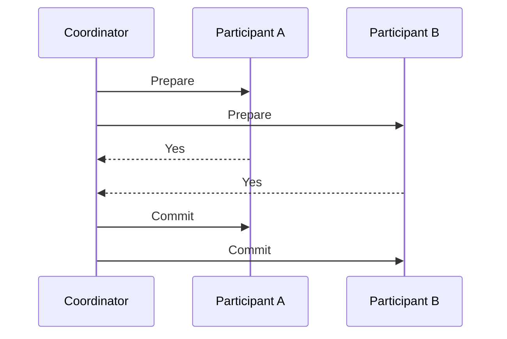
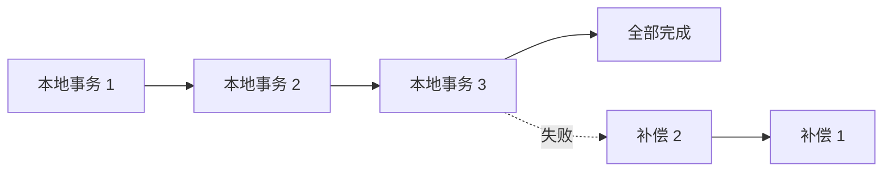
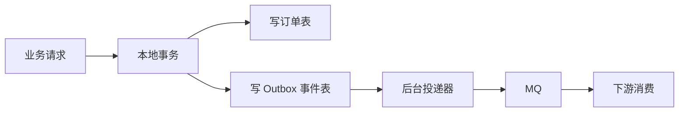

# 后端分布式系统面试 - 专题 2：分布式事务的工程选型

## 学习目标（本节结束后你能做到什么）

- 说清分布式事务为什么比本地事务难
- 能区分 2PC、TCC、Saga、事务消息、Outbox 的适用场景
- 理解强一致、最终一致、补偿、对账之间的关系
- 能在订单、库存、支付、账户场景里讲出可落地的事务方案
- 避免面试里“一听一致性就上 Seata / 分布式事务框架”的套路化回答

## 内容讲解（核心概念，用类比、例子、图示说清楚）

### 1. 分布式事务到底难在哪里

本地事务好理解：一个数据库里，多条 SQL 要么一起成功，要么一起失败。  
数据库通过 WAL、锁、MVCC、回滚日志等机制帮你兜住 ACID。

分布式事务的难点是：一次业务操作跨了多个系统或多个资源。

比如下单：

1. 订单服务创建订单
2. 库存服务扣库存
3. 支付服务创建支付单
4. 营销服务锁定优惠券

只要这些步骤跨服务、跨库、跨消息系统，就会出现：

- 订单成功，库存失败
- 库存成功，支付单失败
- 本地事务提交了，消息没发出去
- 下游执行成功了，但上游超时以为失败
- 补偿任务重复执行，导致重复退款或重复加库存

所以分布式事务不是单纯追求“全部同时成功”。  
它真正要解决的是：

**跨多个边界的业务操作，在失败、超时、重复、乱序后，能不能收敛到业务可解释的正确状态。**

### 2. 面试里先不要急着选方案

分布式事务题最怕上来就背方案：

- 2PC
- 3PC
- TCC
- Saga
- Seata
- RocketMQ 事务消息

更成熟的第一步是先问业务约束：

- 是否必须强一致？
- 是否可以短暂不一致？
- 失败后能不能补偿？
- 补偿动作是否一定成功？
- 这条链路是否在核心同步路径？
- 吞吐和延迟要求是什么？
- 有没有资金、库存、账户这类不可错场景？

只有先回答这些问题，才能知道该选重方案还是轻方案。

### 3. 2PC：强一致直觉最强，但工程代价也重

2PC 是 Two Phase Commit，两阶段提交。  
它有一个协调者 Coordinator，多个参与者 Participant。

第一阶段：Prepare  
协调者问所有参与者：“你们能不能提交？”  
参与者预留资源、写入事务日志，然后回答 yes 或 no。

第二阶段：Commit / Rollback  
如果所有参与者都 yes，协调者通知大家提交。  
只要有一个 no，协调者通知大家回滚。

2PC 的优点是语义清晰：  
要么大家提交，要么大家回滚。

但它的代价也明显：

- 同步阻塞，参与者在 prepare 后要锁住资源
- 协调者是关键点，协调者异常会让参与者悬挂
- 跨服务链路越长，整体可用性越差
- 高并发场景下锁等待和长事务风险很高

所以面试里要谨慎说 2PC。  
它适合强一致要求高、参与者数量少、链路可控、吞吐不是极端高的场景。  
它不适合拿来解决所有互联网业务流程。

### 4. TCC：业务侵入强，但适合资源预留

TCC 是 Try、Confirm、Cancel。

- Try：检查并预留资源
- Confirm：确认执行
- Cancel：取消预留，释放资源

库存预占是最容易理解的例子：

- Try：冻结 1 件库存
- Confirm：真正扣减冻结库存
- Cancel：释放冻结库存

TCC 的好处是业务语义明确。  
它特别适合“资源可以先冻结，再确认或释放”的场景，比如：

- 库存预占
- 账户冻结余额
- 优惠券锁定
- 名额预约

但 TCC 的代价也不小：

- 每个参与方都要实现 Try、Confirm、Cancel
- Confirm 和 Cancel 都必须幂等
- Try 成功后如果后续失败，必须能可靠 Cancel
- 空回滚、悬挂、重复 Confirm 都要处理

几个关键词要记住：

- 空回滚：Cancel 到了，但 Try 根本没执行成功
- 幂等：Confirm 或 Cancel 被调用多次，结果只能生效一次
- 悬挂：Cancel 先到，Try 后到，不能让 Try 再成功冻结资源

面试里如果你讲 TCC，一定要补这三个异常点。  
否则听起来像只背了定义。

### 5. Saga：长事务拆成本地事务和补偿

Saga 的思路是把一个长链路事务拆成多个本地事务。  
每一步成功后继续下一步；如果某一步失败，就按反方向执行补偿动作。

比如旅行预订：

1. 预订机票
2. 预订酒店
3. 预订租车

如果租车失败，可以取消酒店，再取消机票。

Saga 适合：

- 链路长
- 每一步都能独立提交
- 允许最终一致
- 有明确补偿动作

但 Saga 最大的问题是：不是所有事情都能补偿。

比如：

- 用户已经收到短信，无法真正撤回
- 钱已经打到外部渠道，不能简单回滚
- 商品已经出库，补偿成本很高

所以 Saga 的核心不是“失败就反向操作”这么简单，而是要评估每个步骤的补偿语义是否成立。

### 6. 事务消息：解决本地事务和消息发送的一致性

很多业务流程是这样的：

1. 本地数据库更新成功
2. 发消息通知下游

危险点在于：数据库提交成功后，消息可能发送失败。  
这样下游永远不知道发生了这件事。

事务消息就是为了解决“本地事务和消息发送一致性”的一类方案。

以常见半消息思路理解：

1. 生产者先发送半消息，消费者暂时不可见
2. 生产者执行本地事务
3. 本地事务成功，提交消息
4. 本地事务失败，回滚消息
5. 如果生产者断掉，消息系统回查本地事务状态

事务消息适合事件驱动链路，比如：

- 订单创建成功后通知库存
- 支付成功后通知履约
- 退款成功后通知账户流水

但它只能解决“本地事务 + 消息投递”这个边界。  
它不能保证消费者一定成功处理业务。消费者那边仍然要做：

- 幂等
- 重试
- 死信
- 补偿
- 对账

### 7. Outbox：工程里非常实用的可靠事件表

Outbox 模式的思想很朴素：

**在同一个本地事务里，同时写业务数据和待发送事件。**

比如订单服务创建订单时，同一个数据库事务里写两张表：

- orders：订单表
- outbox_events：待发送事件表

事务提交后，由后台投递器扫描 outbox_events，把事件发送到 MQ。  
发送成功后标记事件已发送。

Outbox 的优点是：

- 不依赖特殊 MQ 能力
- 本地事务语义清晰
- 能显著降低“业务成功但消息丢失”的风险
- 方便做重试、审计、补偿和排障

它的代价是：

- 多一张事件表和投递任务
- 消息可能重复投递，下游必须幂等
- 事件积压要监控
- 投递延迟要评估

在面试里，Outbox 是非常好讲的工程方案。  
它没有 TCC 那么重，也比“直接发 MQ”成熟很多。

### 8. 分布式事务方案怎么选

可以用这张表快速判断：

| 方案 | 一致性倾向 | 适合场景 | 主要代价 |
| --- | --- | --- | --- |
| 2PC | 强一致 | 少量参与者、链路短、强一致要求高 | 阻塞、锁资源、协调者异常、性能较差 |
| TCC | 准强一致 / 最终一致 | 库存、余额、名额这类可预留资源 | 业务侵入强，异常处理复杂 |
| Saga | 最终一致 | 长链路流程，每步可补偿 | 补偿语义难，无法撤回外部副作用 |
| 事务消息 | 最终一致 | 本地事务成功后通知下游 | 依赖 MQ 能力，消费端仍要兜底 |
| Outbox | 最终一致 | 可靠事件发布、审计、异步解耦 | 需要事件表、投递器、监控和幂等 |

一个简单原则：

**能本地事务解决，优先本地事务；能最终一致解决，不要轻易上强一致；必须跨资源强约束时，再考虑 TCC 或 2PC。**

### 9. 订单、库存、支付场景怎么讲

假设面试官问：

“用户下单时要创建订单、扣库存、创建支付单，怎么保证一致性？”

一个成熟回答可以这样组织：

第一步，先识别一致性要求。

订单创建和订单状态必须由订单库保证。  
库存不能超卖，是关键约束。  
支付单可以和订单建立关联，但支付成功以支付回调为准。

第二步，拆主链路和异步链路。

下单主链路可以同步做库存预占，订单创建走本地事务。  
如果库存预占要求强，可以用库存服务自己的本地事务和唯一业务键保证幂等。  
订单创建成功后，通过 Outbox 或事务消息发布订单已创建事件。

第三步，设计失败路径。

- 库存预占成功，订单创建失败：释放预占库存
- 订单创建成功，消息投递失败：Outbox 重试投递
- 下游重复消费：用订单号、事件 ID 做幂等
- 支付超时：订单保持待支付，超时关单释放库存
- 支付成功但订单状态没推进：支付回调重试 + 对账补偿

第四步，设计最终兜底。

- 定时扫描超时订单
- 对账订单、支付单、库存预占记录
- 补偿失败进入人工处理
- 关键状态变更留流水

这种回答比“用分布式事务”更像真实后端系统。

### 10. 分布式事务和 Raft 的关系

这两个词经常一起出现在分布式系统里，但解决的问题不一样。

Raft 主要解决的是：

- 多个副本之间如何选 Leader
- 如何复制同一串日志
- 如何保证已提交日志不丢
- 如何让一组节点维护一致状态

分布式事务主要解决的是：

- 一个业务操作跨多个服务、数据库或资源时
- 如何处理部分成功、部分失败
- 如何通过提交、回滚、补偿、重试、对账让业务收敛

你可以这样理解：

**Raft 是副本之间的一致日志协议；分布式事务是业务流程跨资源的一致性治理。**

比如 etcd 内部可以用 Raft 保证多副本元数据一致。  
但一个电商系统里“订单、库存、支付、优惠券”之间的一致性，不会因为你知道 Raft 就自动解决，它仍然需要 TCC、Saga、Outbox、幂等、补偿和对账。

### 11. 面试里怎么讲出成熟度

如果面试官问：“你们怎么做分布式事务？”

不要直接说：

“我们用 Seata。”

更好的表达是：

“我会先看业务是否真的需要强一致。如果是单服务单库，优先用本地事务。如果是订单创建后通知下游这种场景，我更倾向用 Outbox 或事务消息保证本地事务和事件发布一致，下游通过幂等、重试、死信、补偿和对账保证最终一致。如果是库存预占、余额冻结这类资源预留场景，可以考虑 TCC，但要处理空回滚、幂等和悬挂。如果是很少量参与者且强一致要求非常高，可以考虑 2PC，但会谨慎评估阻塞、锁资源和可用性代价。”

这段回答的重点不是术语多，而是你体现了：

- 先判断业务约束
- 再选择一致性级别
- 再落到失败路径
- 最后补齐工程兜底

## 小结（3-5 条关键点）

- 分布式事务本质是跨资源业务操作在失败、重复、超时、乱序后能否收敛到正确状态。
- 2PC 语义清晰但阻塞和可用性代价高，不能作为所有业务场景的默认答案。
- TCC 适合库存、余额、名额这类可预留资源，但要处理空回滚、幂等和悬挂。
- Saga 适合长链路最终一致，但前提是每一步补偿语义成立。
- Outbox 和事务消息是业务系统里非常常见的可靠事件发布方案，下游仍必须做幂等、补偿和对账。

---

## 检查站：请回答以下问题

1. 为什么分布式事务不只是“多个库一起提交”这么简单？
2. 2PC 最大的工程代价是什么？为什么高并发业务里要谨慎使用？
3. TCC 的 Try、Confirm、Cancel 分别适合表达什么业务语义？空回滚、幂等、悬挂分别是什么问题？
4. Outbox 解决了哪一个关键一致性边界？为什么它不能替代消费端幂等？
5. 如果订单创建成功、支付也成功，但订单状态没有变成已支付，你会怎么设计补偿和对账？

请把你的答案直接告诉我，我会根据你的回答决定是否继续补“分布式锁、Lease 和 fencing token”这类高频追问。
