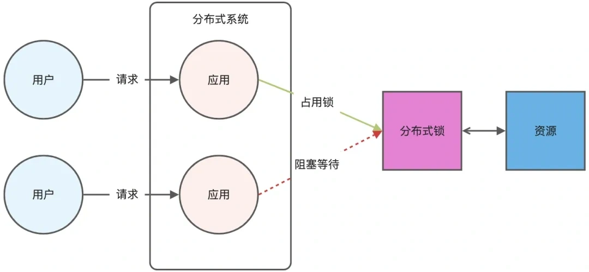
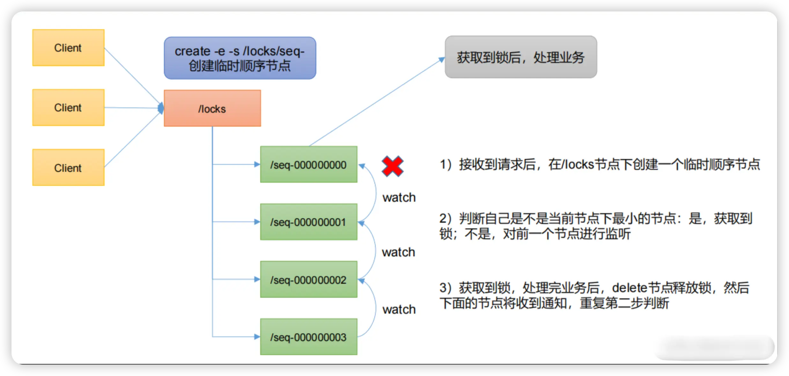
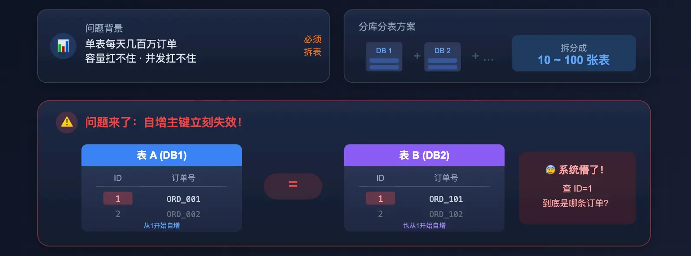
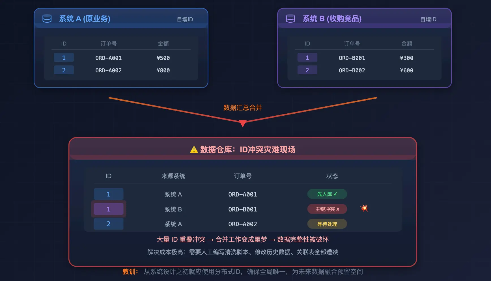
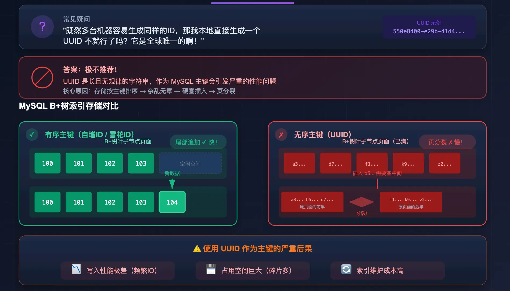
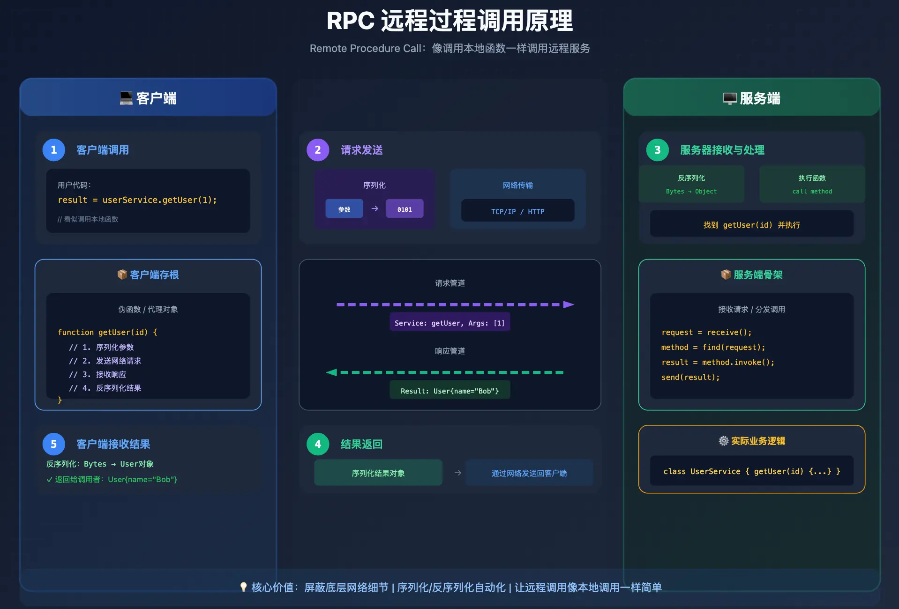
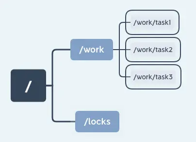
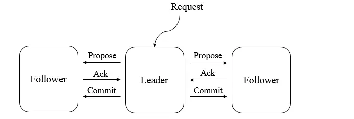

# 后端分布式系统面试 - 专题 3：分布式锁、全局 ID、RPC 与 ZooKeeper 协调

## 学习目标（本节结束后你能做到什么）

- 说清分布式锁保护的到底是什么，以及它为什么不能替代事务、幂等和补偿
- 能比较 Redis 锁与 ZooKeeper 锁的实现机制、风险和选型边界
- 理解分库分表后为什么需要全局 ID，以及 UUID、号段和 Snowflake 如何取舍
- 用一次调用链解释 RPC 的代理、序列化、网络失败与治理责任
- 知道 ZooKeeper 的数据模型、临时顺序节点和 ZAB 协议分别支撑什么能力

## 1. 这几个机制为什么经常一起被问

当系统从单机走向多节点，原本由单进程或单数据库免费提供的能力会被拆开：

| 原本单机里很自然的事 | 分布式后遇到的问题 | 常见机制 |
| --- | --- | --- |
| 一个线程先后修改资源 | 多个服务实例同时抢同一资源 | 分布式锁 |
| 一张表自增主键不重复 | 多库多表各自从 1 开始增长 | 分布式 ID |
| 本地函数直接调用 | 调用跨进程、跨网络且会超时 | RPC |
| 单进程内共享状态 | 配置、选主、锁状态要被集群共同观察 | ZooKeeper / etcd |

它们解决的是不同层的问题。一个很重要的面试原则是：

**锁解决互斥，ID 解决标识，RPC 解决远程交互，协调服务解决小规模共享状态；业务正确性仍然要依赖事务、幂等、状态机、补偿和对账。**

## 2. 分布式锁：先判断是不是真的需要串行化

分布式锁适用于多个节点必须竞争同一个临界资源的情况，例如：

- 同一个订单的关单任务不能被两台调度节点同时执行
- 同一个商户的批量结算任务同一时刻只能跑一份
- 无法用单条原子 SQL 表达的短时资源协调

它不应该是所有并发问题的默认答案。库存扣减如果能通过数据库条件更新 `stock > 0` 和受影响行数完成，就常常比“先抢锁再扣库存”更简单可靠；消费去重通常更应该用唯一键和状态机，而不是用一把全局锁把吞吐压低。



### 2.1 Redis 锁的最小正确做法

Redis 常用一条原子命令完成加锁：

```text
SET order:close:123 owner-token NX PX 10000
```

- `NX` 保证只有锁不存在时才能成功写入
- `PX` 给锁设置租约时间，避免持锁进程宕机后永远不释放
- `owner-token` 是本次持锁者的唯一标识，避免一个请求误删另一个请求的新锁

释放锁必须将“判断自己持有”和“删除”合成原子操作，通常使用 Lua：

```lua
if redis.call("get", KEYS[1]) == ARGV[1] then
  return redis.call("del", KEYS[1])
end
return 0
```

仅做到这些还不代表业务已经绝对安全，仍要解释三个风险：

| 风险 | 发生方式 | 工程处理 |
| --- | --- | --- |
| 执行超过租约 | 业务仍在运行，锁已过期，被新请求获取 | 缩短临界区；必要时续租；下游写操作采用 fencing token |
| 主从切换丢锁 | 锁尚未复制到副本，主节点故障，提升后的副本看不到锁 | 评估是否能接受极低概率并发；强协调场景不要只靠异步复制 Redis 锁 |
| 重试造成重复效果 | 请求超时后重入，虽然锁串行但业务执行两次 | 业务唯一键、幂等状态推进和对账仍不可少 |

`fencing token` 是递增的持锁版本号。真正写资源的一方只接受比已处理版本更新的操作，即便旧持锁者停顿后恢复，也无法覆盖新持锁者的结果。这比仅依赖“我认为锁还有效”更稳。

### 2.2 ZooKeeper 锁：用临时顺序节点排队

ZooKeeper 实现锁时，客户端通常在 `/locks` 下创建临时顺序节点。节点序号最小者获得锁；其余客户端只监听自己的前一个节点，而不是都监听头节点，从而减少释放锁时的唤醒风暴。



基本流程是：

1. 客户端创建 `/locks/seq-` 临时顺序节点。
2. 如果自己是序号最小的节点，就进入临界区。
3. 如果不是，只 watch 前驱节点的删除事件。
4. 持锁者完成业务后删除自己的节点；若会话失效，临时节点也会被清除。
5. 后继节点被通知后重新判断自己是否排在最前面。

Redis 锁和 ZooKeeper 锁不是简单的“快”和“安全”二选一：

| 维度 | Redis 锁 | ZooKeeper 锁 |
| --- | --- | --- |
| 常见实现 | `SET NX PX` + Lua 解锁 | 临时顺序节点 + watch |
| 延迟与吞吐 | 通常更低延迟、更高吞吐 | 写入和通知经过协调协议，代价更高 |
| 等待公平性 | 需业务另外实现队列 | 顺序节点天然容易表达排队顺序 |
| 失效感知 | 依赖租约过期或续租 | 会话失效会删除临时节点 |
| 选型提示 | 短临界区、已有 Redis、可做幂等兜底 | 已使用 ZooKeeper、需要排队/会话语义的协调任务 |

## 3. 分布式 ID：唯一只是第一关

单库单表里，自增主键既唯一又趋势递增。但订单等核心数据一旦拆到多个库表，每个分片独立自增会生成同样的 ID，查询、聚合和后续迁移都会遇到冲突。



此外，多套原本独立的系统汇总入仓或合并业务时，本地自增 ID 同样没有全局意义：



### 3.1 为什么随机 UUID 很少直接做 MySQL 核心聚簇主键

UUID 很容易本地生成，也能把碰撞概率降到极低。但随机 UUID 较长且没有插入顺序，对以主键组织数据页的 InnoDB 来说，新行会分散插入到不同叶子页，可能放大页分裂、缓存局部性差和索引空间开销。



这里的结论要说准确：**不是 UUID 不能使用，而是随机、宽字符串 UUID 通常不适合作为高写入核心表的聚簇主键。** 时间有序 UUID、二进制存储或独立数值主键都能改善一部分问题。

### 3.2 常见生成方案怎么选

| 方案 | 优点 | 风险或代价 | 常见落点 |
| --- | --- | --- | --- |
| UUID / 时间有序 UUID | 无中心依赖，跨系统方便 | 随机版本作为主键写入局部性差；值较宽 | trace ID、外部标识，或经过优化的业务 ID |
| 数据库号段 | 趋势递增；实现清晰；一次取一段后性能好 | 发号表和缓存段需要高可用；可能存在未用完号段 | 普通业务核心 ID、Leaf-segment 类方案 |
| Redis `INCR` | 全局递增、实现直观 | 依赖 Redis 可用性和持久化；每次获取有网络调用 | 中等规模、已有可靠 Redis 的场景 |
| Snowflake 类算法 | 本地生成、低延迟、趋势递增 | 机器号分配、时钟回拨、跨机房规划要处理 | 高吞吐订单、消息、流水 ID |

Snowflake 面试回答中至少应提到三部分：时间戳、节点标识、同毫秒序列号。还要主动补一句：时间回拨时要拒绝生成、等待时钟追上，或使用逻辑时钟/备用节点段策略，否则可能破坏唯一性。

## 4. RPC：像本地调用，只是编程体验，不是故障语义

微服务拆开后，服务之间最基本的交互往往是 RPC。客户端代码看上去像调用本地接口，但调用过程实际跨越了序列化、网络传输、服务端派发和返回反序列化。



一次典型调用包含：

1. 客户端调用生成的代理或存根，例如 `userService.getUser(1)`。
2. 存根将方法、参数和元数据序列化为请求。
3. 请求经过 TCP/HTTP/HTTP2 等传输到服务端。
4. 服务端骨架反序列化请求，定位并执行真正的方法。
5. 结果或异常被序列化返回，客户端再还原成调用结果。

面试的分水岭不在于会不会背这五步，而在于是否意识到远程调用会额外出现：

- 超时后不能确定对方是没执行，还是执行成功但响应丢了
- 重试可能触发重复扣款、重复下单，因此写接口需要请求号和幂等处理
- 下游变慢会拖住上游线程池，需要超时、熔断、隔离、限流和链路追踪
- 协议变更要考虑字段兼容、灰度升级和错误码语义

完整的 RPC 框架学习可继续看 [`../RPC/00_学习路径.md`](../RPC/00_学习路径.md)，在本专题里要记住的是：RPC 让调用写起来像本地函数，但网络失败必须按分布式失败来设计。

## 5. ZooKeeper：协调小状态，不是承载业务大流量

ZooKeeper 的数据模型是一棵 znode 树。常见节点语义包括：

- 持久节点：主动删除前持续存在，适合保存配置路径等长期结构
- 临时节点：绑定客户端会话，会话失效后删除，适合服务存活和锁持有状态
- 顺序节点：创建时追加单调递增序号，适合选举、排队和锁竞争
- Watch：客户端观察节点变化的通知机制；通知后通常需要重新读取并重新注册关注



这些语义使它常用于：

- 服务注册与存活感知
- 少量动态配置的发布通知
- 分布式锁、Leader 选举和任务归属协调

它不适合存储大块业务数据，也不适合被当成高吞吐消息队列。

### 5.1 ZAB 帮 ZooKeeper 保证写入顺序

ZooKeeper 的写入由 Leader 排序。Leader 生成事务提案并广播，Follower 持久化后应答；达到法定确认后，Leader 发出提交，再将结果应用到状态。Leader 故障时，系统先进行崩溃恢复和重新选主，确保新的写序列不会越过已经确认的事务。



面试表达要保留边界：ZAB 支撑 ZooKeeper 的有序广播和恢复能力，但不要把“用了 ZooKeeper”扩写成“所有业务操作天然强一致”。锁保护的业务资源通常仍然在数据库或外部服务里，那里仍要使用幂等、防旧持锁者写入和补偿机制。

## 6. 把这些题串成一段成熟回答

如果面试官问：“分库分表后的订单系统如何保证并发安全和服务协作？”

可以按下面的顺序回答：

1. 订单表拆分后，订单号不能继续依赖各分片自增；会选号段或 Snowflake 类方案生成全局唯一、趋势递增的 ID，并处理时钟或号段服务可用性。
2. 服务间通过 RPC 调用时，所有写操作带业务请求号，超时重试必须可幂等，链路要设置超时、熔断和监控。
3. 对库存扣减优先使用数据库条件更新和幂等记录；只有确实需要跨实例串行操作的任务，才引入分布式锁。
4. 锁若用 Redis，需要原子加锁、唯一 owner、租约和原子释放，关键资源还要防租约过期后的旧请求写入；需要有序排队或已有协调集群时可评估 ZooKeeper 临时顺序节点。
5. 订单、库存、支付的跨服务一致性不能靠锁解决，应转到事务消息/Outbox、状态机、补偿和对账设计，这部分可继续衔接 [`08_分布式事务：2PC、TCC、Saga、Outbox与最终一致.md`](08_分布式事务：2PC、TCC、Saga、Outbox与最终一致.md)。

## 小结（3-5 条关键点）

- 分布式锁只提供临界区互斥，不能替代幂等、事务、补偿和对账。
- Redis 锁至少要有原子获取、租约、持锁者标识和原子释放；关键写入还要考虑 fencing token。
- 分布式 ID 不只要唯一，还要兼顾索引写入局部性、服务可用性和故障场景。
- RPC 屏蔽的是调用形式，不会屏蔽网络的不确定性，写请求必须设计超时重试与幂等。
- ZooKeeper 适合小状态协调；临时顺序节点与 ZAB 是理解它做锁、注册发现和选主能力的关键。

---

## 检查站：请回答以下问题

1. 为什么说“抢到 Redis 锁”仍不能证明一次库存或账户更新绝对正确？至少说明两个失败窗口。
2. Redis 锁和 ZooKeeper 临时顺序节点锁各适合什么任务？你会根据哪些业务约束选型？
3. 分库分表后为什么不能继续让每张订单表自己生成自增 ID？随机 UUID 作为 MySQL 聚簇主键又有什么代价？
4. 一次 RPC 写请求超时后，客户端为什么不能直接判断为失败？接口应如何支持安全重试？
5. ZooKeeper 为什么适合协调锁和服务存活状态，却不适合承担大量订单数据存储？
